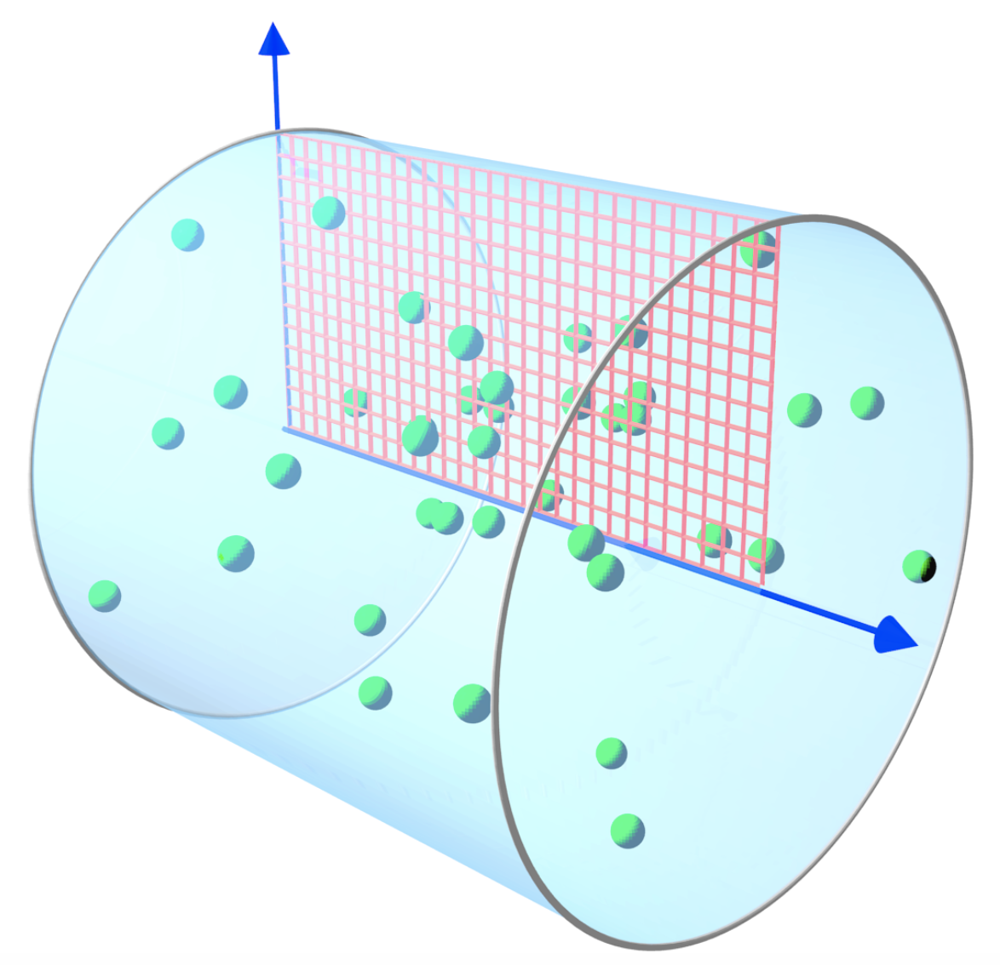

Azimuthal modes decomposition
------------------------------------------

:program:`Smilei` can run in **cyclindrical geometry** with
a decomposition in azimuthal modes (*AM*), as described in
`this article <doi.org/10.1016/j.jcp.2008.11.017>`_.
This requires a system with cylindrical symmetry or close to cylindrical symmetry
(around the `x` axis in :program:`Smilei`).

----

Mathematical definition
^^^^^^^^^^^^^^^^^^^^^^^

.. figure:: _static/Coordinate_Reference_AMcylindrical.png
  :width: 13cm

Any scalar field :math:`F(x,r,\theta)` can be decomposed into a basis of
azimuthal modes, or harmonics, defined as :math:`\exp(-im\theta)`,
where :math:`m` is the number of the mode. Writing each Fourier coefficient
as :math:`\tilde{F}^{m}` leads to:

.. math::
  :label: AzimuthalDecomposition1

  F\left(x,r,\theta\right) = \textrm{Re}\left[
    \sum_{m=0}^{+\infty}\tilde{F}^{m}\left(x,r\right)\exp{\left(-im\theta\right)}
  \right],

The mode :math:`m=0` has cylindrical symmetry (no dependence
on :math:`\theta`). The following figure shows the real part
of some azimuthal modes.

.. figure:: _static/AM_modes.png
  :width: 15cm

  Real part of the first four pure azimuthal modes :math:`exp(-im\theta)`
  on the `yz` plane.

Eq. :eq:`AzimuthalDecomposition1` can be expanded as:

.. math::
  :label: AzimuthalDecomposition2

  F\left(x,r,\theta\right) =
    \tilde{F}^{0}_{real}
    + \tilde{F}^{1}_{real}\cos(\theta)
    + \tilde{F}^{1}_{imag}\sin(\theta)
    + \tilde{F}^{2}_{real}\cos(2\theta)
    + \tilde{F}^{2}_{imag}\sin(2\theta) + ...

The complex coefficients :math:`\tilde{F}^{m}` can be calculated from :math:`F`
according to:

.. math::

    \tilde{F}^{m} &=& \frac{1}{\pi}\int_0^{2\pi} F\left(x,r,\theta\right)\exp{\left(-im\theta\right)}d\theta
    & \quad\textrm{ for } m>0 \\
    \tilde{F}^{0} &=& \frac{1}{2\pi}\int_0^{2\pi}F\left(x,r,\theta\right)d\theta.
    & \textrm{ for } m=0

----

Decomposition of vector fields
^^^^^^^^^^^^^^^^^^^^^^^^^^^^^^^^^^^^^^^^^^^^^^

Vector fields can also be decomposed in azimuthal modes through a
decomposition of each of their components along the cylindrical
coordinates :math:`(\mathbf{e_x},\mathbf{e_r},\mathbf{e_\theta})`.
For example, the transverse field :math:`\mathbf{E}_\perp` of a laser pulse
polarized in the :math:`y` direction with cylindrically symmetric envelope
can be written as

.. math::

    \mathbf{E}_\perp(x,r,\theta, t) &= E_y(x,r,\theta, t) \mathbf{e_y} \\
      &= E_r (x,r,\theta, t) \mathbf{e_r} + E_{\theta}(x,r,\theta, t) \mathbf{e_{\theta}}\\
      &= E_y(x,r,t) [\cos(\theta) \mathbf{e_r} - \sin(\theta) \mathbf{e_{\theta}}].

Thus, comparing to Eq :eq:`AzimuthalDecomposition2`, we recognize
a pure azimuthal mode of order :math:`m=1` for both :math:`E_r`
and :math:`E_\theta`, with the Fourier coefficients:

.. math::

    \tilde{E}^1_r (x,r,t) = E_y(x,r,t),\\

    \tilde{E}^1_{\theta} (x,r,t) = -iE_y(x,r,t).

Similarly, an elliptically (or cylindrically) polarized laser
is described by a pure mode :math:`m=1`, as it can be seen as the linear
superposition of two linearly polarized lasers. A difference in phase
corresponds to a complex exponential in the Fourier coefficients.

The AM decomposition is most suited for
physical phenomena close to cylindrical symmetry as a low number
of modes is sufficient.
For example, in a basic Laser Wakefield Acceleration setup,
a linearly-polarized laser pulse with cylindrically symmetric envelope may be
described only by the mode :math:`m=1`.
As the wakefield wave is mainly determined by the cylindrically symmetric
ponderomotive force, it can be described by the mode :math:`m=0`.
Thus, such a simulation only needs, in principle, two azimuthal modes.

----

Maxwell's equations in cylindrical geometry
^^^^^^^^^^^^^^^^^^^^^^^^^^^^^^^^^^^^^^^^^^^^^^

In an AM simulation, the :math:`\tilde{F}^{m}(x,r)` are stored and computed
for each scalar field and for each component of the vector fields.
Each of them is a :math:`(x,r)` grid of complex values.

From the linearity of Maxwell's Equations, and assuming that the densities
and currents can also be decomposed in modes, we obtain the following
evolution of the mode :math:`m`:

.. math::
    :label: MaxwellEqsAzimuthalModes

    \partial_t \tilde{B}^m_{x} &=-\frac{1}{r}\partial_r(r\tilde{E}^m_{\theta})-\frac{im}{r}\tilde{E}^m_r,\\
    \partial_t \tilde{B}^m_r &= \frac{im}{r}\tilde{E}^m_x+\partial_x \tilde{E}^m_{\theta},\\
    \partial_t \tilde{B}^m_{\theta} &=-\partial_x \tilde{E}^m_{r} + \partial_r \tilde{E}^m_{x},\\
    \partial_t \tilde{E}^m_{x} &=\frac{1}{r}\partial_r(r\tilde{B}^m_{\theta})+\frac{im}{r}\tilde{B}^m_r-\tilde{J}^m_{x},\\
    \partial_t \tilde{E}^m_r &= -\frac{im}{r}\tilde{B}^m_x-\partial_x \tilde{B}^m_{\theta}-\tilde{J}^m_{r},\\
    \partial_t \tilde{E}^m_{\theta} &=\partial_x \tilde{B}^m_{r} - \partial_r \tilde{B}^m_{x}-\tilde{J}^m_{\theta}.

Thus, even in presence of a plasma, at each timestep,
these equations are solved independently.
The coupling between the modes occurs when the total electromagnetic fields
push the particles, creating, in turn, the currents :math:`\tilde{J}^m`
of their current density.

----

Interaction with particles
^^^^^^^^^^^^^^^^^^^^^^^^^^^^^^^^^^^^^^^^^^^^^^

The azimuthal decomposition concerns only the grid quantities
(EM fields and current densities), which are thus defined on a 2D grid,
but macro-particles evolve in a full three-dimensional
space with cartesian coordinates.

  Blue arrows: the `x` and `r` axes of the 2D grid (red)
  where the electromagnetic fields are defined.
  Particle positions and momenta are defined in 3D.

During each iteration, the particles are pushed in phase space
using reconstructed 3D cartesian electromagnetic fields
at their position :math:`(x,r,\theta)` (see Eq. :eq:`AzimuthalDecomposition1`).
Then, their contribution to the current densities :math:`(J_x,J_r,J_{\theta})`
is computed to update the electromagnetic fields at the next iteration
(see Eqs :eq:`MaxwellEqsAzimuthalModes`).

----

Tips
^^^^

Note that each mode :math:`\tilde{F}^{m}` is a function of :math:`x`,
the longitudinal coordinate and :math:`r`, the radial coordinate.
Therefore, each of them is only two dimensional. Thus, the computational cost
of AM simulations scales approximately as 2D simulations multiplied by the
number of modes. However, a higher number of particles might be necessary
to obtain convergence of the results (always check the convergence of your
results by increasing the number of macro-particles and modes).
A rule of thumb is to use at least 4 times the number of modes as
macro-particles along :math:`\theta`.

----

Defining diagnostics and initializing Profiles with a cylindrical geometry
^^^^^^^^^^^^^^^^^^^^^^^^^^^^^^^^^^^^^^^^^^^^^^^^^^^^^^^^^^^^^^^^^^^^^^^^^^^

If in doubt on how to initialize particles or a `Profile`, bear in mind how the quantities are defined in this geometry and the reference axes of the simulation (first Figure of this page).

Note also in the following figure the difference in the origin of the reference axes between a simulation with azimuthal modes decomposition and a 3D Cartesian simulation.
In the figure, the red ellipsoid can represent a laser pulse or a relativistic particle beam, whose propagation axis is the red dashed arrow. In the case of the simulation with azimuthal modes, this propagation axis is the `x` axis. In a 3D simulation for the same physical case,
this axis would be parallel to the `x` axis. If this is not the case, probably the azimuthal modes decomposition technique is not suited for the simulation, since too many azimuthal modes
would be necessary for an accurate representation.

.. figure:: _static/AMcylindrical_vs_cartesian.pdf
  :width: 22cm
   
  Comparison between a simulation with azimuthal modes decomposition and a 3D Cartesian simulation for the same physical case. The blue point is the origin of the reference axes. 
  The radial grid size (`grid_length[1]`) of the former is half the size of the `y-z` grid sizes (`grid_length[1]=grid_length[2]`) of the latter.

Particles are defined in the 3D space, so if you want to initialize a `Species` with a numpy array you will still need to provide their coordinates
in the 3D cartesian space.
`Probes` diagnostics with azimuthal modes are like particles interpolating the reconstructed grid fields (including all the retained modes), so the same axes convention of the previous figure must be followed in defining their `origin` and `corners`.

Grid quantities instead are defined on the :math:`(x,r)` grid. Thus, `ExternalFields` and density/charge `Profiles` must be defined with functions of the :math:`(x,r)` coordinates.
Remember that `ExternalFields` are defined by mode. 

----

Poisson's equation and relativistic Poisson's equation with azimuthal modes decomposition
^^^^^^^^^^^^^^^^^^^^^^^^^^^^^^^^^^^^^^^^^^^^^^^^^^^^^^^^^^^^^^^^^^^^^^^^^^^^^^^^^^^^^^^^^^^

In a simulation with azimuthal modes decomposition, given the linearity of the relativistic Poisson's equation described in :doc:`relativistic_fields_initialization`, the full equation
can be decomposed in azimuthal modes, with the correspondent mode component of the charge density :math:`-\tilde{\rho}^m` as source term.

The relativistic Poisson equation for the potential component :math:`\tilde{\Phi}^m` of the mode :math:`m` in this  geometry is thus:

.. math::
  :label: RelPoissonModes

  \left[ \frac{1}{\gamma^2_0}\partial^2_x\tilde{\Phi}^m+\frac{1}{r}\partial_r\left(r\partial_r\tilde{\Phi}^m\right)-\frac{m^2}{r^2}\tilde{\Phi}^m \right] = -\tilde{\rho}^m.

Solving each of these relativistic Poisson's equations allows to initialize the azimuthal components of the electromagnetic fields:

.. math::
  \begin{eqnarray} 
  \tilde{E}^m_x &=& -\frac{1}{\gamma_0^2}\partial_x \tilde{\Phi}^m,\\ 
  \tilde{E}^m_r &=& -\partial_r \tilde{\Phi}^m, \\ 
  \tilde{E}^m_{\theta} &=& \frac{im}{r} \tilde{\Phi}^m,\newline\\
  \tilde{\mathbf{B}}^m &=& \beta_0\mathbf{\hat{x}}\times\tilde{\mathbf{E}}^m.
  \end{eqnarray} 

The initialization of the electric field with the non relativistic Poisson's equation is performed similarly, and the underlying equations reduce simply
to the previous equations, but with :math:`\gamma_0 = 1` and :math:`\beta_0 = 0` (i.e. an immobile Species).

----

The envelope model in cylindrical coordinates
^^^^^^^^^^^^^^^^^^^^^^^^^^^^^^^^^^^^^^^^^^^^^^^^^^^^^^

In :program:`Smilei` the :doc:`laser_envelope` described in [Terzani]_, [MassimoPPCF2019]_ for cartesian geometries has been implemented also in cylindrical geometry,
as described in [Massimo2020]_.

The azimuthal decomposition technique is used in this case, but only the mode :math:`m=0` can be retained in the present implementation, 
i.e. the electromagnetic fields and the envelope fields will have perfect cylindrical symmetry with respect to the envelope propagation axis :math:`x`.

The main difference compared to the cartesian geometry lies in the envelope equation, Eq. :eq:`envelope_equation` of the page :doc:`laser_envelope`. 
While the Laplacian operator :math:`\nabla^2` is defined as
:math:`\partial_x^2`, :math:`\partial_x^2+\partial_y^2` and :math:`\partial_x^2+\partial_y^2+\partial_z^2` 
in 1D, 2D and 3D cartesian coordinates respectively, the envelope equation in `AMcylindrical` geometry of course uses the Laplacian in 
cylindrical coordinates. Additionally, due to the assumption of cylindrical symmetry, the derivatives with respect to the azimuthal angle are all zero by definition.
Thus, in this geometry the envelope equation solved in :program:`Smilei` is:

.. math::
  :label: envelope_equation

  \partial^2_x\tilde{A}+\frac{1}{r}\partial_r(r\partial_r\tilde{A})+2i\left(\partial_x \tilde{A} + \partial_t \tilde{A}\right)-\partial^2_t\tilde{A}=\chi \tilde{A}.

The electromagnetic fields evolve as described in :doc:`azimuthal_modes_decomposition` with only the mode :math:`m=0`, 
or equivalently neglecting all the derivatives along the azimuthal angle in Maxwell's Equations written in cylindrical coordinates.

As in a typical :program:`Smilei` simulation in cylindrical coordinates, the particles evolve in the 3D space, 
with their positions and momenta described in cartesian coordinates.

The envelope approximation coupled to the cylindrical symmetry assumption can greatly speed-up a simulation of a physical set-up where these assumptions are suited.
The following considerations about the speed-up assume comparisons between simulations where the size of the simulated physical domain is the same.

Compared to a standard simulation of the same physical case, 
an envelope simulation in cartesian geometry has a speed-up that increases with the laser pulse duration, 
since the envelope characteristic scales need to be sampled, and not the high frequency oscillations of the laser.
:program:`Smilei` envelope simulations with laser pulses of 30 fs have shown speed-ups of the order of 20 compared 
to standard simulations in 3D cartesian geometry.

Compared to a 3D simulation without envelope, the azimuthal modes decomposition without envelope can theoretically yield a speedup 
that scales with the number of cells in the transverse direction. However, normally this speed-up is a little lower,
since the high frequency oscillations of the laser generate noise that, to be reduced, demands a higher number of particles per cell
than in a 3D simulation. Similar comparisons yield speed-ups of the order of 50 for lasers with waist sizes of the order of tens of microns.

Finally, the use of both techniques, i.e. the envelope approximation and the 
azimuthal modes decomposition, can yield speed-ups that are higher than the product of the two speed-ups, 
compared to 3D simulations without envelope. This because the absence of the high frequency laser oscillations reduces the noise
and the necessary number of particles for convergence is normally lower than in a usual simulation with azimuthal modes decomposition.
With laser pulses of durations of 30 fs and waist size 40 microns a speed-up of 1200 of magnitude has been observed [Massimo2020]_ .

 

