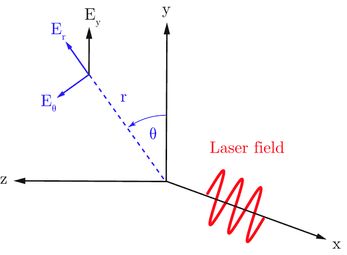

Azimuthal modes decomposition
------------------------------------------

:program:`Smilei` can run in **cyclindrical geometry** with
a decomposition in azimuthal modes (*AM*), as described in
`this article <doi.org/10.1016/j.jcp.2008.11.017>`_.
This requires a system with cylindrical symmetry or close to cylindrical symmetry
(around the `x` axis in :program:`Smilei`).

----

Mathematical definition
^^^^^^^^^^^^^^^^^^^^^^^

Any scalar field :math:`F(x,r,\theta)` can be decomposed into a basis of
azimuthal modes, or harmonics, defined as :math:`\exp(-im\theta)`,
where :math:`m` is the number of the mode. Writing each Fourier coefficient
as :math:`\tilde{F}^{m}` leads to:

.. math::
  :label: AzimuthalDecomposition1

  F\left(x,r,\theta\right) = \textrm{Re}\left[
    \sum_{m=0}^{+\infty}\tilde{F}^{m}\left(x,r\right)\exp{\left(-im\theta\right)}
  \right],

The mode :math:`m=0` has cylindrical symmetry (no dependence
on :math:`\theta`). The following figure shows the real part
of the first four azimuthal modes.

.. figure:: _static/AM_modes.png
  :width: 15cm

  Real part of the first four pure azimuthal modes :math:`exp(-im\theta)`
  on the `yz` plane.

Eq. :eq:`AzimuthalDecomposition1` can be expanded as:

.. math::
  :label: AzimuthalDecomposition2

  F\left(x,r,\theta\right) =
    \tilde{F}^{0}_{real}
    + \tilde{F}^{1}_{real}\cos(\theta)
    + \tilde{F}^{1}_{imag}\sin(\theta)
    + \tilde{F}^{2}_{real}\cos(2\theta)
    + \tilde{F}^{2}_{imag}\sin(2\theta) + ...

The complex coefficients :math:`\tilde{F}^{m}` can be calculated from :math:`F`
according to:

.. math::

    \tilde{F}^{m} &=& \frac{1}{\pi}\int_0^{2\pi} F\left(x,r,\theta\right)\exp{\left(-im\theta\right)}d\theta
    & \quad\textrm{ for } m>0 \\
    \tilde{F}^{0} &=& \frac{1}{2\pi}\int_0^{2\pi}F\left(x,r,\theta\right)d\theta.
    & \textrm{ for } m=0

----

Decomposition of vector fields
^^^^^^^^^^^^^^^^^^^^^^^^^^^^^^^^^^^^^^^^^^^^^^

Vector fields can also be decomposed in azimuthal modes through a
decomposition of each of their components along the cylindrical
coordinates :math:`(\mathbf{e_x},\mathbf{e_r},\mathbf{e_\theta})`.
For example, the transverse field :math:`\mathbf{E}_\perp` of a laser pulse
polarized in the :math:`y` direction with cylindrically symmetric envelope
can be written as

.. math::

    \mathbf{E}_\perp(x,r,\theta, t) &= E_y(x,r,\theta, t) \mathbf{e_y} \\
      &= E_r (x,r,\theta, t) \mathbf{e_r} + E_{\theta}(x,r,\theta, t) \mathbf{e_{\theta}}\\
      &= E_y(x,r,t) [\cos(\theta) \mathbf{e_r} - \sin(\theta) \mathbf{e_{\theta}}].

Thus, comparing to Eq :eq:`AzimuthalDecomposition2`, we recognize
a pure azimuthal mode of order :math:`m=1` for both :math:`E_r`
and :math:`E_\theta`, with the Fourier coefficients:

.. math::

    \tilde{E}^1_r (x,r,t) = E_y(x,r,t),\\

    \tilde{E}^1_{\theta} (x,r,t) = -iE_y(x,r,t).

Similarly, an elliptically (or cylindrically) polarized laser
is described by a pure mode :math:`m=1`, as it can be seen as the linear
superposition of two linearly polarized lasers. A difference in phase or in the polarization direction simply
corresponds to a multiplication of the Fourier coefficients by a complex exponential.

The AM decomposition is most suited for
physical phenomena close to cylindrical symmetry as a low number
of modes is sufficient.
For example, in a basic Laser Wakefield Acceleration setup,
a linearly-polarized laser pulse with cylindrically symmetric envelope may be
described only by the mode :math:`m=1`.
As the wakefield wave is mainly determined by the cylindrically symmetric
ponderomotive force, it can be described by the mode :math:`m=0`.
Thus, such a simulation only needs, in principle, two azimuthal modes.

----

Maxwell's equations in cylindrical geometry
^^^^^^^^^^^^^^^^^^^^^^^^^^^^^^^^^^^^^^^^^^^^^^

In an AM simulation, the :math:`\tilde{F}^{m}(x,r)` are stored and computed
for each scalar field and for each component of the vector fields.
Each of them is a :math:`(x,r)` grid of complex values.

From the linearity of Maxwell's Equations, and assuming that the densities
and currents can also be decomposed in modes, we obtain the following
evolution of the mode :math:`m`:

.. math::
    :label: MaxwellEqsAzimuthalModes

    \partial_t \tilde{B}^m_{x} &=-\frac{1}{r}\partial_r(r\tilde{E}^m_{\theta})-\frac{im}{r}\tilde{E}^m_r,\\
    \partial_t \tilde{B}^m_r &= \frac{im}{r}\tilde{E}^m_x+\partial_x \tilde{E}^m_{\theta},\\
    \partial_t \tilde{B}^m_{\theta} &=-\partial_x \tilde{E}^m_{r} + \partial_r \tilde{E}^m_{x},\\
    \partial_t \tilde{E}^m_{x} &=\frac{1}{r}\partial_r(r\tilde{B}^m_{\theta})+\frac{im}{r}\tilde{B}^m_r-\tilde{J}^m_{x},\\
    \partial_t \tilde{E}^m_r &= -\frac{im}{r}\tilde{B}^m_x-\partial_x \tilde{B}^m_{\theta}-\tilde{J}^m_{r},\\
    \partial_t \tilde{E}^m_{\theta} &=\partial_x \tilde{B}^m_{r} - \partial_r \tilde{B}^m_{x}-\tilde{J}^m_{\theta}.

Thus, even in presence of a plasma, at each timestep,
these equations are solved independently.
The coupling between the modes occurs when the total electromagnetic fields
push the macro-particles, creating, in turn, the currents :math:`\tilde{J}^m`
of their current density.

----

Interaction with the macro-particles
^^^^^^^^^^^^^^^^^^^^^^^^^^^^^^^^^^^^^^^^^^^^^^

The azimuthal decomposition concerns only the grid quantities
(EM fields and current densities), which are thus defined on a 2D grid,
but macro-particles evolve in a full three-dimensional
space with cartesian coordinates.

.. figure:: _static/AM_grid_particles.jpg
  :width: 10cm

  Blue arrows: the `x` and `r` axes of the 2D grid (red)
  where the electromagnetic fields are defined.
  Macro-particle positions and momenta are defined in 3D.

During each iteration, the macro-particles are pushed in phase space
using reconstructed 3D cartesian electromagnetic fields
at their position :math:`(x,r,\theta)` (see Eq. :eq:`AzimuthalDecomposition1`).
Then, their contribution to the current densities :math:`(J_x,J_r,J_{\theta})`
is computed to update the electromagnetic fields at the next iteration
(see Eqs :eq:`MaxwellEqsAzimuthalModes`).

----

Tips
^^^^

Note that each mode :math:`\tilde{F}^{m}` is a function of :math:`x`,
the longitudinal coordinate and :math:`r`, the radial coordinate.
Therefore, each of them is only two dimensional. Thus, the computational cost
of AM simulations scales approximately as 2D simulations multiplied by the
number of modes. However, a higher number of macro-particles might be necessary
to obtain convergence of the results (always check the convergence of your
results by increasing the number of macro-particles and modes).
A rule of thumb is to use at least 4 times the number of modes as
macro-particles along :math:`\theta`.

----

Conventions for the namelist
^^^^^^^^^^^^^^^^^^^^^^^^^^^^^^^^^^^^

Several differences appear in the notations and definitions between
the AM and 3D geometries:

* The origin of the coordinates is on the axis of the cylinder
  (see figure below).

.. figure:: _static/AMcylindrical_vs_cartesian.png

  Origin of coordinates in AM cylindrical and 3D cartesian.

* The AM radial grid size (``grid_length[1]``) represents the radius
  of the cylinder; not its diameter. Thus, it is half the size of
  the 3D transverse grid.

* Particles are defined 3D space, so their coordinates should be
  provided in terms of *x*, *y*, *z* if needed (e.g. a `Species`
  initialized with a numpy array).
  However, the density profiles of particles are assimilated to
  scalar fields defined on the :math:`(x,r)` grid.

* ``Field`` diagnostics really correspond to the complex fields
  of each mode on :math:`(x,r)` grids. However, ``Probes``
  diagnostics are defined in 3D space just like the particles:
  all fields are interpolated at their 3D positions, and reconstructed
  by summing over the modes.

* ``ExternalFields`` are grid quantities in :math:`(x,r)` coordinates.
  One must be defined for each mode.

----

Classical and relativistic Poisson's equation
^^^^^^^^^^^^^^^^^^^^^^^^^^^^^^^^^^^^^^^^^^^^^^^^^^^^^^^

Given the linearity of the relativistic Poisson's equation
described in :doc:`relativistic_fields_initialization`,
it can be decomposed in azimuthal modes
with the corresponding mode of the charge density
:math:`-\tilde{\rho}^m` as source term.
For the mode *m* of the potential :math:`\Phi`,
it writes:

.. math::
  :label: RelPoissonModes

  \left[
    \frac{1}{\gamma^2_0}\partial^2_x\tilde{\Phi}^m
    +\frac{1}{r}\partial_r\left(r\partial_r\tilde{\Phi}^m\right)
    -\frac{m^2}{r^2}\tilde{\Phi}^m
  \right] = -\tilde{\rho}^m.

By solving each of these relativistic Poisson's equations
we initialize the azimuthal components of the electromagnetic fields:

.. math::
  \begin{eqnarray}
  \tilde{E}^m_x &=& -\frac{1}{\gamma_0^2}\partial_x \tilde{\Phi}^m,\\
  \tilde{E}^m_r &=& -\partial_r \tilde{\Phi}^m, \\
  \tilde{E}^m_{\theta} &=& \frac{im}{r} \tilde{\Phi}^m, \\
  \tilde{\mathbf{B}}^m &=& \beta_0\mathbf{\hat{x}}\times\tilde{\mathbf{E}}^m.
  \end{eqnarray}

The initialization of the electric field with the non-relativistic
Poisson's equation is performed similarly, and the underlying equations simply
reduce to the previous equations, with :math:`\gamma_0 = 1` and
:math:`\beta_0 = 0` (i.e. an immobile Species).

----

The envelope model in cylindrical coordinates
^^^^^^^^^^^^^^^^^^^^^^^^^^^^^^^^^^^^^^^^^^^^^^^^^^^^^^

The :doc:`laser_envelope` for cartesian geometries has been
implemented also in cylindrical geometry, as described in [Massimo2020]_.

Only the mode :math:`m=0` is available for the envelope
in the present implementation, i.e. the electromagnetic and
envelope fields have perfect cylindrical symmetry with respect
to the envelope propagation axis :math:`x`.

The main difference compared to the cartesian geometry lies in the envelope
equation (see Eq. :eq:`envelope_equation`). The assumption of cylindrical
symmetry removes derivatives with respect :math:`\theta`, leading to:

.. math::
  :label: envelope_equation_AM

  \partial^2_x\tilde{A}
  +\frac{1}{r}\partial_r(r\partial_r\tilde{A})
  +2i\left(\partial_x \tilde{A} + \partial_t \tilde{A}\right)
  -\partial^2_t\tilde{A}
  =   \chi \tilde{A}.

The envelope approximation coupled to the cylindrical symmetry
can greatly speed-up the simulation: compared to a 3D envelope simulation
with the same number of particles, it has a speed-up which scales linearly
as twice the transverse number of cells.
This speed-up can reach 100 for lasers with transverse sizes of the order
of tens of microns. Compared to a standard 3D laser simulation with the
same number of particles, the speed-up of a cylindrical envelope simulation
can reach 1000 for lasers of durations of the order of tens of femtoseconds.
These comparisons assume the same longitudinal window size and the same
transverse size for the simulated physical space.

