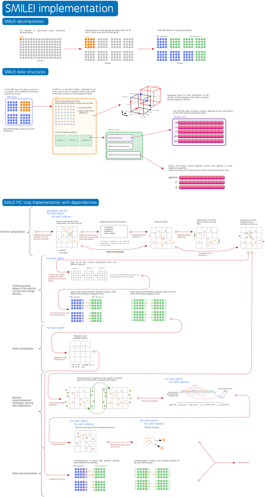

Developer Zone
-----------------------------

Introduction
^^^^^^^^^^^^^^^^^^^^^^^^^^^

Smilei is a C++ code that uses relatively simple C++ features for modularity
and conveniency for non-advanced C++ users.

The repository is composed of the following directories:

- ``Licence``: contains code licence information
- ``doc``: conatins the Sphinx doc files
- ``src``: contains all source files
- ``happi``: contains the sources of the happi Python tool for visualization
- ``benchmarks``: contains the benchmarks used by the validation process. these becnhamrks are also examples for users.
- ``scripts``: contains multiple tool scripts for compilation and more
  - ``compile_tools``: contains scripts and machine files used by the makefile for compilation
- ``tools``: contains some additional programs for Smilei
- ``validation``: contains the python scripts used by the validation process

The general implementation is summarized in :numref:`general_implementation`

.. _general_implementation:

  smilei general implementation.

General concept and vocabulary
^^^^^^^^^^^^^^^^^^^^^^^^^^^^^^

This section presents some implicit notions to understand the philosophy of the code.

Notion of data container
""""""""""""""""""""""""""""""

Data containers are classes (or sometime just structures) used to store a specific type of data, often considered as raw data such as particles or fields.
Some methods can be implemented in a data container for managing or accessing the data.

.. _dataContainer:

.. figure:: _static/figures/data_container.png
  :width: 5cm

  Data container.

Notion of operators
""""""""""""""""""""""""""""""

An operator is a class that operates on input data to provide a processed information.
Input data can be parameters and data containers.
Output data can be processed data from data containers or updated data containers.
An operator is a class functor (overloadind of the ``()`` ).
Sometime, operator provides additional methods called wrappers to provide differents simplified or adapted interfaces.
An operator do not store data or temporarely.
for instance, the particle interpolation, push and proection are operators.

.. _operator:

.. figure:: _static/figures/operator.png
  :width: 10cm

  Operator.

Notion of domain parts
""""""""""""""""""""""""""""""

Domain parts are classes that represents some specific levels of the domain decomposition.
They can be seen as high-level data container or container of data container.
They contain some methods to handle, manange and access the local data.
For instance, patches and ``species`` are domain parts:

- ``species`` contains the particles.
- ``patches`` contains ``species`` and fields.

Notion of factory
""""""""""""""""""""""""""""""

Some objects such as operators or data containers have sereral variations.
For this we use inheritance.
A base class is used for common parameters and methods and derived classes are used for all variations.
The factory uses user-defined input parameters to determine the right derive class to choose and initiate them.
For instance, there are several ``push`` operators implemented all derived from a base ``push`` class.
The ``push`` factory will determine the right one to use.

Other
""""""""""""""""""""""""""""""

Some classes are used for specific actions in the code such as the initilization process.

Domain decomposition and parallelism
^^^^^^^^^^^^^^^^^^^^^^^^^^^^^^^^^^^^^^

The simulation domain is divided multiple times following a succession of decomposition levels.
The whole domain is the superimposition of different grids for each electromagnetic field component
and macro-particules.
Let us represent schematically the domain as an array of cells as in Fig. :numref:`full_domain`.
Each cell contains a certain population of particles (that can differ from cell to cell).

.. _full_domain:

.. figure:: _static/figures/domain.png
  :width: 15cm

  Example of a full domain with 960 cells.

In :program:`smilei`, the cells are first reorganized into small group so-called patches.
The domain becomes a collection of patches as shown in :numref:`patch_domain_decomposition`.

.. _patch_domain_decomposition:

.. figure:: _static/figures/patch_domain_decomposition.png
  :width: 15cm

  The domain in :program:`Smilei` is a collection of patches.

A patch is an independant piece of the whole simulation domain.
It therefore owns local electrmognatic grids and list of macro-particles.
Electromagnetic grids have ghost cells that represent the information located in the neighboring patches (not shown in :numref:`patch_domain_decomposition`).
All patches have the same spatial size .i.e. the same number of cells.
The size of a patch is calculated so that all local field grids (ghost cells included) can fit in L2 cache.

Patches are then distributed among MPI processes in so-called MPI patch collections.
The distribution can be ensured in an equal cartesian way or using a load balancing strategy based on the Hilbert curve.

.. _mpi_patch_collection:

.. figure:: _static/figures/mpi_patch_collection.png
  :width: 15cm

  Patches are then distributed among MPI processes in so-called MPI patch collections.

Inside MPI patch collection, OpenMP loop directives are used to distribute the computation of the patches among the available threads.
Since each patch have a different number of particles, this approach enables a dynamic scheduling depending on the specified OpenMP scheduler.
As shown in :numref:`general_implementation`, a synchronization step is required to exchange grid ghost cells and particles traveling from patch to patch.

The patch granularity is used for:

- creating more parallelism for OpenMP
- enabling a load balancing capability through OpenMP scheduling
- ensuring a good cache memory efficiency at L3 and L2 levels.

The patch is not the smaller decomposition grain-size.
The patch can be decomposed into bins as shown in :numref:`bin_decomposition`.

.. _bin_decomposition:

.. figure:: _static/figures/bin_decomposition.png
  :width: 10cm

  Bin decomposition.

Contrary to patch, a bin is not an independant data structure with its own arrays.
It represents a smaller portion of the patch grids through specific start and end indexes.
For the macro-particles, a sorting algorithm is used to ensure that in the macro-particles
located in the same bin are grouped and contiguous in memory.

Finally, the decomposition levels are summarized in :numref:`decomposition_summary`.

.. _decomposition_summary:

.. figure:: _static/figures/decomposition_summary.png
  :width: 10cm

  Domain decomposition summary.

Data structures
^^^^^^^^^^^^^^^^^^^^^^^^^^^^^^

VectorPatches
""""""""""""""""""""""""""""""

Patches
""""""""""""""""""""""""""""""

Species
""""""""""""""""""""""""""""""

Particles
""""""""""""""""""""""""""""""

Fields
""""""""""""""""""""""""""""""

The basic PIC loop implementation
^^^^^^^^^^^^^^^^^^^^^^^^^^^^^^^^^^
