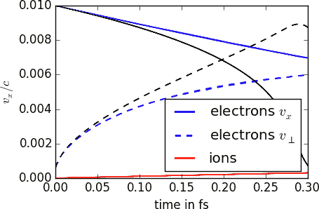
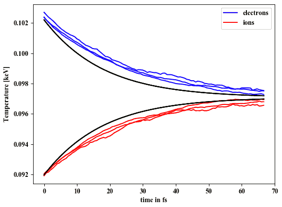
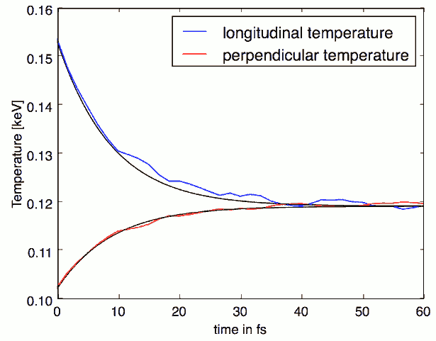
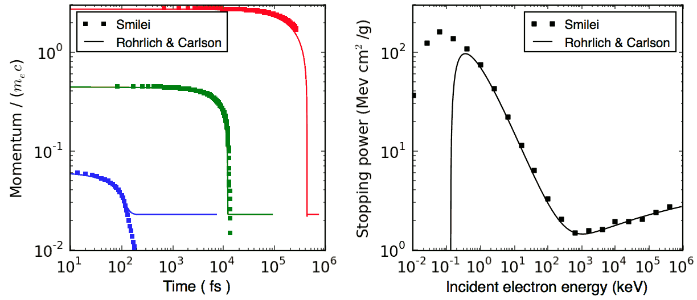

Binary collisions
-----------------

Relativistic binary collisions between particles have been implemented in
:program:`Smilei` with the same scheme as the one developed for the
code :program:`Calder`. The following references describe the physics
and numerics of this implementation.

| [Perez2012]_ gives an overview of the technique.
| [Nanbu1997]_ and [Nanbu1998]_ give the original technique from which [Perez2012]_ was developed.
| [Sentoku2008]_, [Lee1984]_ and [Frankel1979]_ provide additional information.

Please refer to :ref:`that doc <Collisions>` for an explanation of how to add collisions in the namelist file.

----

The binary collision scheme
^^^^^^^^^^^^^^^^^^^^^^^^^^^

Collisions are calculated at each timestep and for each collision block
given in the input file.

If *intra-collisions*:
  
  | Create one array of indices pointing to all particles of the species group.
  | Shuffle the array.
  | Split the array in two halves.

If *inter-collisions*:
  
  | Create two arrays of indices pointing to all particles of each species group.
  | Shuffle the largest array. The other array is not shuffled.
  | => The two resulting arrays represent pairs of particles (see algorithm in [Nanbu1998]_).

Calculate a few intermediate quantities:
  
  | Particle density :math:`n_1` of group 1.
  | Particle density :math:`n_2`  of group 2.
  | *Crossed* particle density :math:`n_{12}` (see [Perez2012]_).
  | Other constants.

For each pair of particles:

  | Calculate the momenta in the center-of-mass (COM) frame.
  | Calculate the coulomb log if requested (see [Perez2012]_).
  | Calculate the parameter :math:`s` and its correction at low temperature (see [Perez2012]_).
  | Pick the deflection angle (see [Nanbu1997]_).
  | Deflect particles in the COM frame and go back to the laboratory frame.

----

Test cases for collisions
^^^^^^^^^^^^^^^^^^^^^^^^^

.. rubric:: 1. Beam relaxation

An electron beam with narrow energy spread enters an ion background with :math:`T_i=10` eV.
The ions are of very small mass :math:`m_i=10 m_e` to speed-up the calculation.
Only e-i collisions are calculated.
The beam gets strong isotropization => the average velocity relaxes to zero.

Three figures show the time-evolution of the longitudinal :math:`\left<v_\|\right>`
and transverse velocity :math:`\sqrt{\left<v_\perp^2\right>}`

* :numref:`beam1` : initial velocity = 0.05, ion charge = 1
* :numref:`beam2` : initial velocity = 0.01, ion charge = 1
* :numref:`beam3` : initial velocity = 0.01, ion charge = 3

Each of these figures show 3 different blue and red curves which correspond to different
ratios of particle weights: 0.1, 1, and 10.

.. _beam1:

.. figure:: _static/beam_relaxation123.png
  :width: 10cm
  
  Relaxation of an electron beam. Initial velocity = 0.05, ion charge = 1.
  
.. _beam2:

  
  Relaxation of an electron beam. Initial velocity = 0.01, ion charge = 1.

.. _beam3:

.. figure:: _static/beam_relaxation789.png
  :width: 10cm
  
  Relaxation of an electron beam. Initial velocity = 0.01, ion charge = 3.

The black lines correspond to the theoretical rates taken from the NRL formulary:

.. math::
  
  \nu_\| = -\left(1+\frac{m_e}{m_i}\right)\nu_0
  \quad\textrm{and}\quad
  \nu_\perp = 2\;\nu_0
  \quad\textrm{where}\quad
  \nu_0=\frac{e^4\,Z^{\star 2}\,n_i\,\ln\Lambda } { 4 \pi \epsilon_0^2 \,m_e^2\,v_e^3 }

The distribution is quickly non-Maxwellian so that theory is valid only at the beginning.

.. rubric:: 2. Thermalization

A population of electrons has a different temperature from that of the ion population.
Through e-i collisions, the two temperatures become equal.
The ions are of very small mass :math:`m_i=10 m_e` to speed-up the calculation.
Three cases are simulated, corresponding to different ratios of weights: 0.2, 1 and 5.
They are plotted in :numref:`thermalization`.

.. _thermalization:

  
  Thermalization between two species.

The black lines correspond to the theoretical rates taken from the NRL formulary:

.. math::
  
  \nu_\epsilon=\frac{e^4\,Z^{\star 2} \sqrt{m_em_i}\,n_i\,\ln\Lambda }
  { 8 \epsilon_0^2 \,\left(m_eT_e+m_iT_i\right)^{3/2} }

.. rubric:: 3. Temperature isotropization

Electrons have a longitudinal temperature different from their transverse temperature.
They collide only with themselves (intra-collisions) and the anisotropy disappears
as shown in :numref:`temperature_isotropization`.

.. _temperature_isotropization:

  
  Temperature isotropization of an electron population.

The black lines correspond to the theoretical rates taken from the NRL formulary:

.. math::
  
  \nu_T=\frac{e^4 \,n_e\,\ln\Lambda } { 8\pi^{3/2} \epsilon_0^2 \,m_e^{1/2}T_\|^{3/2} }
  A^{-2} \left[-3+(3-A)\frac{\rm{arctanh}(\sqrt{A})}{\sqrt{A}}\right]
  \quad \rm{where}\quad A=1-\frac{T_\perp}{T_\|}

.. rubric:: 4. Maxwellianization

Electrons start with zero temperature along :math:`y` and :math:`z`.
Their velocity distribution along :math:`x` is rectangular.
They collide only with themselves and the rectangle becomes a maxwellian 
as shown in :numref:`maxwellianization`.

.. _maxwellianization:

.. figure:: _static/Maxwellianization1.png
  :width: 10cm
  
  Maxwellianization of an electron population.
  Each blue curve is the distribution at a given time.
  The red curve is an example of a gaussian function.

.. rubric:: 5. Stopping power

Test electrons (very low density) collide with background electrons of density
:math:`10\,n_c` and :math:`T_e=5` keV.
Depending on their initial velocity, they are slowed down at different rates,
as shown in :numref:`stoppingpower`.

.. _stoppingpower:

.. figure:: _static/Stopping_power123.png
  :width: 10cm
  
  Stopping power of test electrons into a background electron population.
  Each point is one simulation. The black line is Frankel's theory [Frankel1979]_.

.. rubric:: 6. Conductivity

Solid-density Cu is simulated at different temperatures (e-i equilibrium) with only
e-i collisions. An electric field of :math:`E=3.2` GV/m (0.001 in code units) is
applied using two charged layers on each side of the solid Cu.
The electron velocity increases until a limit value :math:`v_f`.
The resulting conductivity :math:`\sigma=en_ev_f/E` is compared in
:numref:`conductivity` to the models in [Lee1984]_ and [Perez2012]_.

.. _conductivity:

.. figure:: _static/conductivity.png
  :width: 10cm
  
  Conductivity of colid-density copper. Each point is one simulation.

----

.. _CollIonization:

Collisional ionization
^^^^^^^^^^^^^^^^^^^^^^

The binary collisions can also be ionizing if they are **electron-ion** collisions.
The approach is almost the same as that provided in [Perez2012]_.

When ionization is requested by setting ``ionizing=True``, a few additional operations
are executed:

* At the beginning of the run, cross-sections are calculated from tabulated binding
  energies (available for ions up to atomic number 100). These cross-sections are then
  tabulated for each requested ion species.
* Each timestep, the particle density :math:`n = n_e n_i/n_{ei}`
  (similar to the densities above for collisions) is calculated.
* During each collision, a probability for ionization is computed. If successful, 
  the ion charge is increased, the incident electron is slowed down, and a new electron
  is created.

This scheme does not account for recombination, which would balance ionization
over long time scales.

.. rubric:: Modifications

A modification has been added to the theory of [Perez2012]_ in order to account for the
laboratory frame being different from the ion frame. Considering :math:`\overrightarrow{p_e}`
and :math:`\overrightarrow{p_i}` the electron and ion momenta in the laboratory frame, 
and their associated Lorentz factors :math:`\gamma_1` and :math:`\gamma_2`, we can derive
the Lorentz factor of the electron in the ion frame with
:math:`\gamma_e^\star=\gamma_e\gamma_i-\overrightarrow{p_e}\cdot\overrightarrow{p_i}`.
The probability for ionization reads:

.. math::
  
  P = 1-\exp\left( - v_e \sigma n \Delta t \right) = 1-\exp\left( -V^\star \sigma^\star n \Delta t \right)

where :math:`\sigma` is the cross-section in the laboratory frame, :math:`\sigma^\star`
is the cross-section in the ion frame, and 
:math:`V^\star=\sqrt{\gamma_e^{\star\,2}-1}/(\gamma_e\gamma_i)`.

The loss of energy :math:`E_e` of the incident electron translates into a change in momentum
:math:`{p_e^\star}' = \alpha_e p_e^\star` in the ion frame, with
:math:`\alpha_e=\sqrt{(\gamma_e^\star-E_e)^2-1}/\sqrt{\gamma_e^{\star2}-1}`.
In the laboratory frame, it becomes
:math:`\overrightarrow{p_e'}=\alpha_e\overrightarrow{p_e}+((1-\alpha_e)\gamma_e^\star-E_e)\overrightarrow{p_i}`.

A similar operation is done for defining the momentum of the new electron in the lab frame.
It is created with energy :math:`E_w` and its momentum is
:math:`p_w^\star = \alpha_w p_e^\star` in the ion frame, with
:math:`\alpha_w=\sqrt{E_w(E_w+2)}/\sqrt{\gamma_e^{\star2}-1}`.
In the laboratory frame, it becomes
:math:`\overrightarrow{p_w}=\alpha_w\overrightarrow{p_e}+(E_w+1-\alpha_w\gamma_e^\star)\overrightarrow{p_i}`.

----

Test cases for ionization
^^^^^^^^^^^^^^^^^^^^^^^^^

.. rubric:: 1. Ionization rate

A cold plasma of :math:`\mathrm{Al}^{3+}` is set with density :math:`n_e=10^{21} \mathrm{cm}^{-3}`
and with all electrons drifting at a velocity :math:`v_e=0.03\,c`. The charge state of ions
versus time is shown in :numref:`IonizationRate` where the three dotted curves correspond
to three different weight ratios between electrons and ions.

.. _IonizationRate:

.. figure:: _static/ionization_rate.png
  :width: 10cm
  
  Ionization of an aluminium plasma by drifting electrons.
  
The theoretical curve (in black) corresponds to :math:`1-\exp\left(v_en_e\sigma t\right)`
where :math:`\sigma` is the ionization cross section of :math:`\mathrm{Al}^{3+}` at the
right electron energy. The discrepancy at late time is due to the changing velocity
distributions and to the next level starting to ionize.

.. rubric:: 2. Inelastic stopping power

A cold, non-ionized Al plasma is set with density :math:`n_e=10^{21} \mathrm{cm}^{-3}`.
Electrons of various initial velocities are slowed down by ionizing collisions and their
energy loss is recorded as a function of time.

A few examples are given in the left graph of :numref:`IonizationStoppinPower`.
The theoretical curve is obtained from [Rohrlich1954]_. Note that this theory does not
work below a certain average ionization energy, in our case :math:`\sim 200` eV.

.. _IonizationStoppinPower:

  
  Left: ionization slowing down versus time, for electrons injected at various
  initial energies into cold Al. Right: corresponding stopping power versus initial
  electron energy.
  
In the same figure, the graph on the right-hand-side provides the stopping power value
in the same context, at different electron energies. It is compared to the same theory.

----

Collisions debugging
^^^^^^^^^^^^^^^^^^^^

Using the parameter ``debug_every`` in a ``Collisions()`` group (see :ref:`Collisions`)
will create a file with info about these collisions.
These information are stored in the files "Collisions0.h5", "Collisions1.h5", etc.

The *hdf5* files are structured as follows:
  One HDF5 file contains several groups called ``"t********"`` where ``"********"``
  is the timestep. Each of these groups contains several arrays, which represent
  quantities *vs.* space.

The available arrays are:

  * ``s``: defined in [Perez2012]_: :math:`s=N\left<\theta^2\right>`, where :math:`N` is
    the typical number of real collisions during a timestep, and
    :math:`\left<\theta^2\right>` is the average square deviation of individual 
    real collisions. This quantity somewhat represents the typical amount of angular
    deflection accumulated during one timestep.
    **It is recommended that** :math:`s<1` **in order to have realistic collisions.**
  * ``coulomb_log``: average Coulomb logarithm.
  * ``debyelength``: Debye length (not provided if all Coulomb logs are manually defined).

The arrays are all one-dimensional: they are in the same order as the *clusters* or *patches*.
You have to figure out by yourself how to convert that to (x, y, z) !

----

References
^^^^^^^^^^

.. [Perez2012] `F. Pérez et al., Phys. Plasmas 19, 083104 (2012) <http://dx.doi.org/10.1063/1.4742167>`_

.. [Nanbu1997] `K. Nanbu, Phys. Rev. E 55, 4642 (1997) <http://dx.doi.org/10.1103/PhysRevE.55.4642>`_

.. [Nanbu1998] `K. Nanbu and S. Yonemura, J. Comput. Phys. 145, 639 (1998) <http://dx.doi.org/10.1006/jcph.1998.6049>`_

.. [Sentoku2008] `Y. Sentoku and A. J. Kemp, J. Comput. Phys. 227, 6846 (2008) <http://dx.doi.org/10.1016/j.jcp.2008.03.043>`_

.. [Lee1984] `Y. T. Lee and R. M. More, Phys. Fluids 27, 1273 (1984) <http://dx.doi.org/10.1063/1.864744>`_

.. [Frankel1979] `N. E. Frankel, K. C. Hines, and R. L. Dewar, Phys. Rev. A 20, 2120 (1979) <http://dx.doi.org/10.1143/JPSJ.67.4084>`_

.. [Rohrlich1954] `F. Rohrlich and B. C. Carlson, Phys. Rev. 93, 38 (1954) <http://journals.aps.org/pr/abstract/10.1103/PhysRev.93.38>`_

