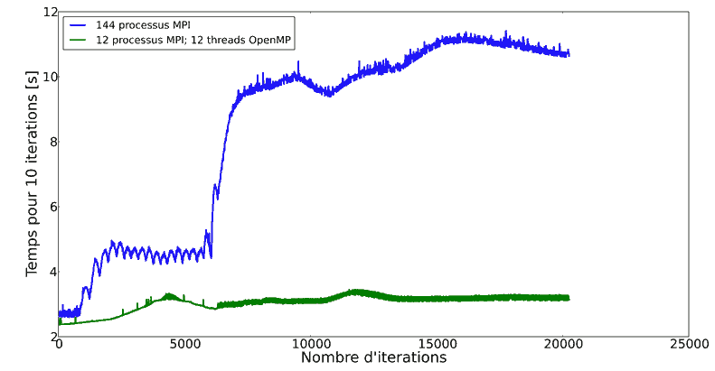
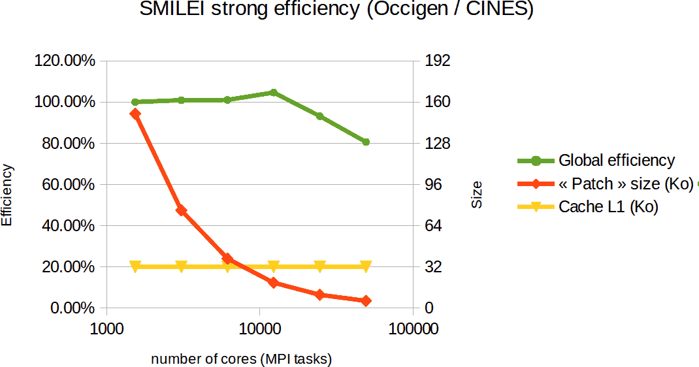

Highlights
----------

Electron Acceleration
^^^^^^^^^^^^^^^^^^^^^

Below, an example of electron acceleration by laser wakefield.
The figure represents the evolution of the electronic density in time. 
A hotspot of electron is created behind the bubble.

.. raw:: html

    <video controls="controls">
    <source src="_static/Rho_electron1long.ogg" type="video/ogg" />
    </video>

----

Scalability
^^^^^^^^^^^

.. rst-class:: inprogress
  
  In progress ...

.. rubric :: 1. OpenMP: Electron Acceleration

The hotspot of electrons produces an important imbalance between the
compute load of the different MPI processes involved in the simulation.

OpenMP permits to smooth this phenomenon by balancing macro-particles between threads.

.. rubric :: 2. MPI: SBS Amplification

In the completely opposite context of a very homogeneous plasma, we oberve during a
"Grand challenge" on `Occigen <https://www.cines.fr/calcul/materiels/occigen>`_,
a good scaling at very large scale.

