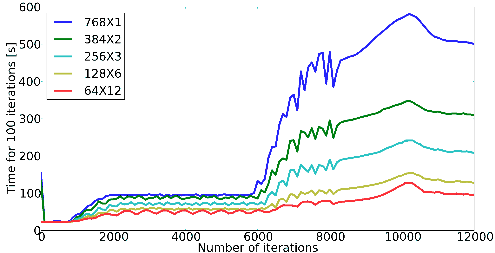
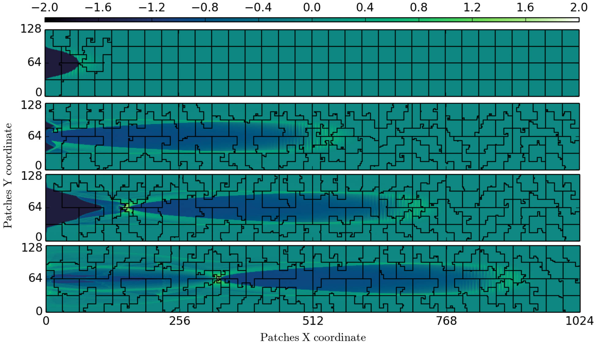
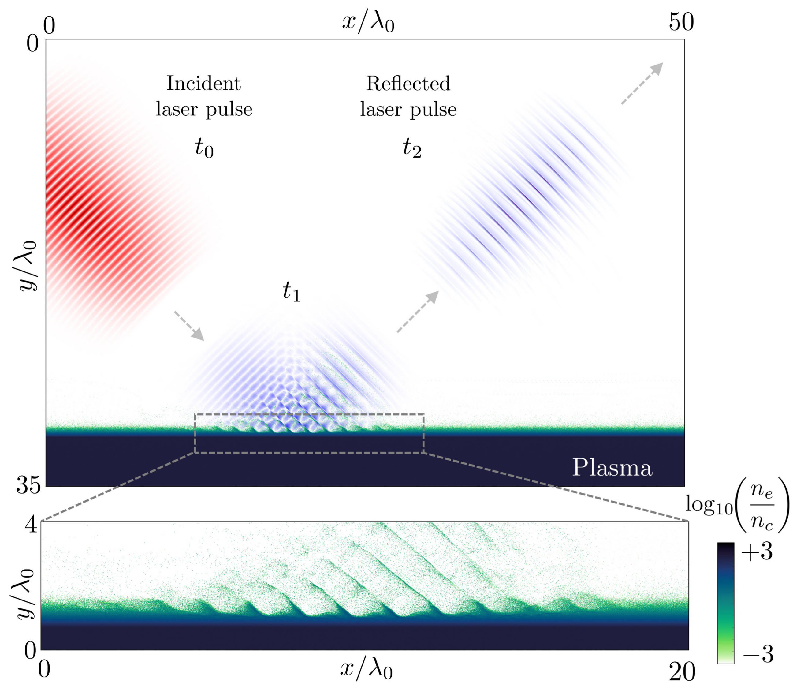
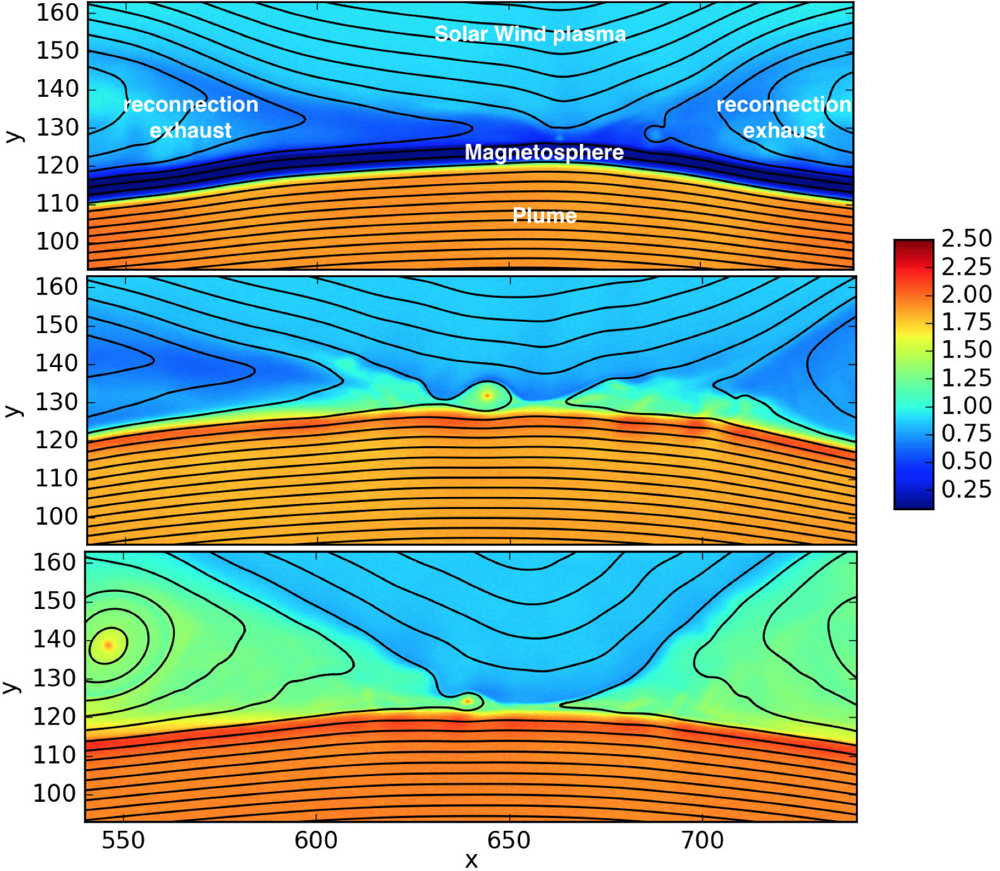
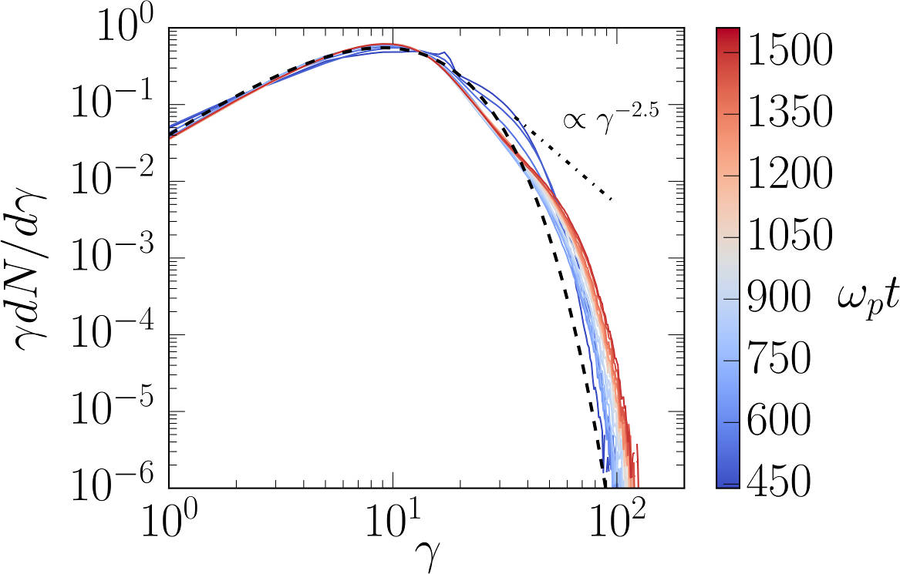

Highlights
----------

Improved performance using vectorization
^^^^^^^^^^^^^^^^^^^^^^^^^^^^^^^^^^^^^^^^^^^^^^^^^^^^^^^^^^^^^^^^

:program:`Smilei` computational performance has been recently enhanced with
:doc:`vectorized operations<vectorization>`,
in particular the projection of currents and the interpolation of fields.
Typically, the new algorithms are more efficient than the old ones above
10 particles per cell, up to 3 times faster. An *adaptive* switching technique
ensures that the best version is used, dynamically and locally.

This has been validated on large-scale simulations.
An example of a mildly-relativistic collisionless shock simulation is provided
in :numref:`weibel_3d_ne_vecto_it510_fig1` (watch the `video <https://youtu.be/-ENUekyE_A4>`_).

.. _weibel_3d_ne_vecto_it510_fig1:

.. figure:: _static/Weibel_3d_ne_vecto_it510.jpg
    :width: 90%
    :align: center
    :name: weibel_3d_ne_vecto_it510

    Mildly-relativistic collisionless shock simulation, with two drifting
    plasmas colliding in the middle of the box.
    Top panel: electron density.
    Bottom panel: regions switched to vectorized operators are highlighted.

High-density regions are switched to vectorized operators while low-density
regions remain scalar (they have only 8 particles per cell).
In this particular case, the treatment of particles can be sped-up by 2.

For more details, checkout the :doc:`doc<vectorization>` and this
`ArXiV paper <https://arxiv.org/abs/1810.03949>`_.

----

Scalability in a wakefield acceleration simulation
^^^^^^^^^^^^^^^^^^^^^^^^^^^^^^^^^^^^^^^^^^^^^^^^^^

Wakefield-acceleration of electrons in an underdense plasma creates a
hotspot of electrons, which makes the simulation strongly imbalanced.
This spot represent a large part of the total calculations, so that
more computing power should be allocated on it.

Please refer to the doc :doc:`parallelization` to learn the basics of the
parallelization techniques employed in this section.

.. rubric :: 1. OpenMP

In a local area around this hotspot, OpenMP is able to manage the computing
resources to make the overall simulation faster. The following figure shows
the evolution of the time to calculate 100 iterations, as a function of time.
Each line corresponds to a different partition of the box in terms of
MPI processes and OpenMP threads: :math:`N\times M`, where :math:`N` is
the total number of MPI processes, and :math:`M` is the number of threads
in each MPI process.

Using more OpenMP threads per MPI process (while keeping the total number
of threads constant) clearly reduces the simulation time, because the
computing power is balanced within each MPI region.

.. rubric :: 2. Dynamic load balancing between MPI processes

At the global simulation scale, OpenMP cannot be used to smoothen the balance.
Instead, a dynamic load balancing (DLB) algorithm periodically exchanges pieces of
the simulation box (*patches*) between MPI processes, so that each MPI
process owns a fair amount of the simulation load. The following figure
shows how this balancing reduces the time of the simulation.

.. image:: _static/DLB_balancing.png
    :width: 500px
    :align: center

The red curve is the best situation obtained in the previous section, while
the black curve corresponds to the DLB algorithm enabled.

The portion of the box belonging to each MPI process varies when the load balancing
occurs. The following figure shows how each of these portions evolve with time.

The four panels correspond to four timesteps during the simulation.
The colorscale represents the log-scaled load of each patch.
The black lines show the borders of each MPI process' portion of the box.
The MPI processes that are close to the hotspot tend to handle a smaller portion
of the box.

----

High-harmonic generation
^^^^^^^^^^^^^^^^^^^^^^^^

The interaction between an ultra-intense (:math:`I>10^{18}~{\rm W/cm^2}`) femtosecond laser pulse
with a solid target generates a dense "plasma mirror" at its surface that reflects the laser
in a strongly non-linear manner. The temporal distortion of the reflected wave creates
a train of ultra-short attosecond pulses, associated, in the frequency domain,
to a comb of high-order harmonics.

We present a 2-dimensional :program:`Smilei` simulation of laser-solid interaction
with wavelength :math:`\lambda_0 = 0.8` µm, peak intensity
:math:`2\times10^{19}~{\rm W/cm^2}`, at 45° incidence with p-polarization on an overdense plasma slab
of constant electron density :math:`n_0=200\,n_c` (:math:`n_c` being the critical density),
:math:`5\lambda_0`-thick, with an exponential pre-plasma of gradient length :math:`0.1\,\lambda_0`
down to a cut-off density :math:`0.05\,n_c`. The full box size is
:math:`80\,\lambda_0 \times 60\lambda_0` and the simulation time :math:`150\,\lambda_0/c`
with a total of :math:`\sim 1.4` billion quasi-particles in the box.

The following figure (top panel) shows half of the simulation box in the
y-direction, and the laser field is reported at three different times.
The reflected laser pulse (at time :math:`t_2`) shows a different spectral content than
the incident pulse (at time :math:`t_0`). The plasma electron density is shown in black.
A close-up view of the interaction region is given in the bottom panel, illustrating
the electron bunches being pulled out from the plasma surface.

Fourier analysis of the reflected laser field, in space and time, provides the
angular distribution of the frequency spectrum of the reflected light, shown in the
following figure (top panel). High harmonics appear up to order 16.

.. image:: _static/hhg2.jpg
    :width: 13cm
    :align: center

The bottom panel shows trajectories of accelerated electrons ejected from the target.
The angular histogram shows that the momenta of the escaping energetic electrons
(1 to 10 MeV) are mostly directed along two directions which are close to the reflected
laser direction.

This simulation was run on the CINES/Occigen (Bullx) machine using 256 MPI x 14 OpenMP
threads for about 10700 CPU-hours. The characteristic computing time per particle
(average PIC iteration divided by the number of particles) is of the order of
0.7 µs, including 25% for diagnostics.

----

Brillouin amplification
^^^^^^^^^^^^^^^^^^^^^^^

Coupling, in a plasma, a long energetic "pump" pulse of moderate intensity to
a short counter-propagating "seed" pulse of initially low intensity can transfer energy
from the pump to the seed thanks to the excitation of a plasma or ion-acoustic wave.

Here, we look specifically at
the `stimulated Brillouin scattering <http://aip.scitation.org/doi/abs/10.1063/1.861248>`_
(SBS) amplification, where the excited waves are ion-acoustic waves.

A pump with intensity :math:`10^{15}` W/cm² (wavelength 1 µm)
correspond to the "strong-coupling" regime, particularly robust with respect to
plasma inhomogeneities and seed frequency [Chiaramello2016]_.

A 2-dimensional simulation, in conditions close to actual experiments, ran
on a box size of 1024 µm x 512 µm for  10 ps
with 25 billion quasi-particles. The following figure shows the evolution
of the pump and seed intensities in the head-on collision at three different times.
The blue-yellow maps correspond to the plasma density while the white-red maps
correspond to the lasers intensity.

.. image:: _static/pump_seed.jpg
    :align: center

The final seed intensity is nearly 5 times its initial intensity
while the spot size and phase front are well conserved,
suggesting that such a beam could be further focused using plasma mirrors.

This simulation used the IDRIS/Turing (BlueGene/Q) super-computer using 1.8 million
CPU-hours on 32768 MPI processes, and 4 OpenMP threads per core.
The average time to push a particle was 1.9 µs, including 5%
for diagnostics. On the CINES/Occigen (Bullx) machine, we obtained an average time
of 0.43 µs to push one particle (without diagnostics).

----

Magnetic reconnection at the Earth magnetopause
^^^^^^^^^^^^^^^^^^^^^^^^^^^^^^^^^^^^^^^^^^^^^^^

Magnetic reconnection at the Earth magnetopause regulates the transport of matter,
momentum and energy from the solar wind to the internal magnetosphere.
The solar wind plasma temperature is typically one tenth that of the magnetospheric plasma,
but its density is about ten times larger, and its magnetic field 2-3 times smaller.
This asymmetry makes the reconnection dynamics vastly more complex than in symmetric
environments, and has only been studied for a decade
via `numerical simulations <http://dx.doi.org/10.1063/1.4811467>`_
and spacecraft observations.

Studying the impact of a plasmaspheric plume on magnetopause reconnection
via kinetic numerical simulation is difficult. The simulation first needs
to reach a quasi-steady state reconnection with a typical magnetopause asymmetry,
see the arrival of the plume and then last longer for a quasi-steady state plume
reconnection regime to settle. Due to the large particle density of plumes,
the transition and last phases have substantially longer time scales than the early phase,
which makes the simulation heavy. The domain must be long enough in the downstream direction
for the plasma, expelled during the early and transition phases, to be evacuated from
the reconnection region. Otherwise, upstream plasma would not inflow,
thereby stopping reconnection.

Three ion populations are present.
The solar wind and magnetospheric populations have densities equal to :math:`n_0` and :math:`n_0/10`,
respectively, on their side of the current sheet, and fall to zero on the other side.
The plume population increases from 0 to :math:`2\,n_0` at :math:`20\,c/\omega_{pi}` from the initial
current sheet on the magnetospheric side. The magnetic field amplitude goes from :math:`2\,B_0`
in the magnetosphere to :math:`B_0=m_e\omega_{pe}/e` in the solar wind and is totally in the
simulation plane. The temperature is initially isotropic and its profile is calculated
to balance the total pressure.

The domain size is 1280 :math:`c/\omega_{pi} \times` 256 :math:`c/\omega_{pi}`.
The total simulation time is :math:`800\times` the ion gyration time.
We used a reduced ion to electron mass ratio :math:`m_i/m_e = 25`, and a ratio
50 of the speed of light by the Alfvén velocity.
There are initially 8.6 billion quasi-protons for the three populations, and 13 billion electrons.

This figure presents some of the simulation results:
the electron density at three different times.
In the top panel, reconnection is in steady state between the solar wind plasma of
density :math:`\simeq n_0` and the magnetosphere plasma of density :math:`\simeq 0.1~n_0`.
At this time, the exhaust is filled with mixed solar wind/hot magnetospheric plasma as
the plume (of density :math:`\simeq 2~n_0`) is still located at :math:`\simeq 10~c/\omega_{pi}`
from the magnetospheric separatrix. The reconnection rate during this period has a
typical value around :math:`0.1~\Omega_{ci}^{-1}`, with important fluctuations caused
by plasmoid formation. The plume, originally at :math:`20~c/\omega_{pi}` from the magnetopause,
is slowly advected towards the magnetosphere separatrix and finally touches the
reconnection site at about :math:`t=300~\Omega_{ci}^{-1}`. The second panel at
:math:`t=370~\Omega_{ci}^{-1}` shows the plume starting to fill the exhaust after
reaching the reconnection site and mixing with solar wind plasma.
At this time, the reconnection rate collapses to about half its previous value.
The transition phase lasts for about :math:`100~\Omega_{ci}^{-1}` before a plume
reconnection regime reaches a quasi-steady state.
The third panel shows the electron density at the end of the simulation,
where the exhaust is filled with plume and solar wind plasma.

This large-scale simulation has run for a total of 14 million CPU-hours on 16384 cores
of the CINES/Occigen (Bullx) supercomputer within a GENCI-CINES special call.
Overall, the characteristic (full) push-time for a single particle was of the order
of 1.6 µs (including 31% for diagnostics).
No dynamic load balancing was used for this simulation.

----

Collisionless shock in pair plasmas
^^^^^^^^^^^^^^^^^^^^^^^^^^^^^^^^^^^

Relativistic collisionless shocks play a fundamental role in various astrophysical scenarios
(active galactic nuclei, micro-quasars, pulsar wind nebulae and gamma-ray bursts)
where they cause high-energy radiation and particle acceleration related to the
cosmic-ray spectrum. In the absence of particle collisions, the shock is mediated
by collective plasma processes, produced by electromagnetic plasma instabilities
at the shock front.

Specifically, the Weibel (or current filamentation) instability
is observed in most of the astrophysical relativistic outflows interacting with
the interstellar medium. It can be excited by counter-streaming unmagnetized relativistic
flows, and dominates the instability spectrum for a wide range of parameters.
The resulting strong magnetic turbulence can isotropize the incoming flow,
hence stopping it and leading to compression of the downstream (shocked plasma) and shock formation.

We present a 2-dimensional PIC simulation of such shock,
driven in an initially unmagnetized electron-positron plasma.
The simulation relies on the "piston" method that consists in initializing the
simulation with a single cold electron-positron plasma drifting
at a relativistic velocity :math:`v_0 \simeq 0.995\,c`.
Reflecting boundary conditions at the right border creates a counter-penetrating flow.

The simulation box size is 2048 :math:`\delta_e \times` 128 :math:`\delta_e`
(:math:`\delta_e = c/\omega_p` being the electron skin-depth of the initial flow),
with a total of 2.15 billion quasi-particles.
The following figure show an unstable overlapping region of incoming and
reflected flows, resulting in the creation, before the shock
of filamentary structures in both the magnetic field (panel a) and
the total plasma density (panel b).

.. image:: _static/shock1.jpg
    :width: 15cm
    :align: center

The magnetic field at the shock front becomes turbulent and it is strong
enough to stop the incoming particles leading to a pile-up of the plasma
density (panel c).

The following figure demonstrates the build-up, at late times, of a supra-thermal tail
in the downstream particle energy distribution.
It is characteristic of first-order Fermi acceleration at the shock front,
and appears to follow a :math:`\gamma^{-2.5}` power law.

This simulation run on the TGCC/Curie machine using 128 MPI x 8 OpenMP threads
for a total of 18800 CPU-hours for 49780 timesteps.
The average push time for one quasi-particle was of 0.63 µs (including 20% for diagnostics).
