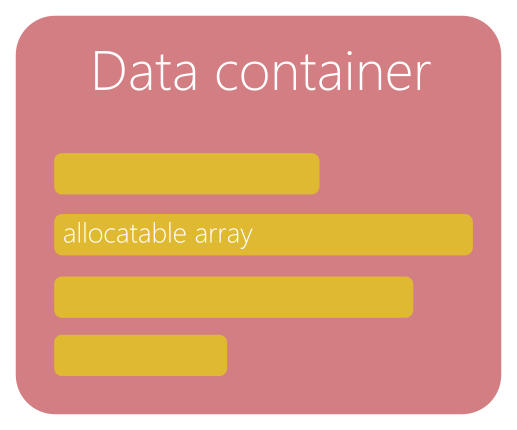
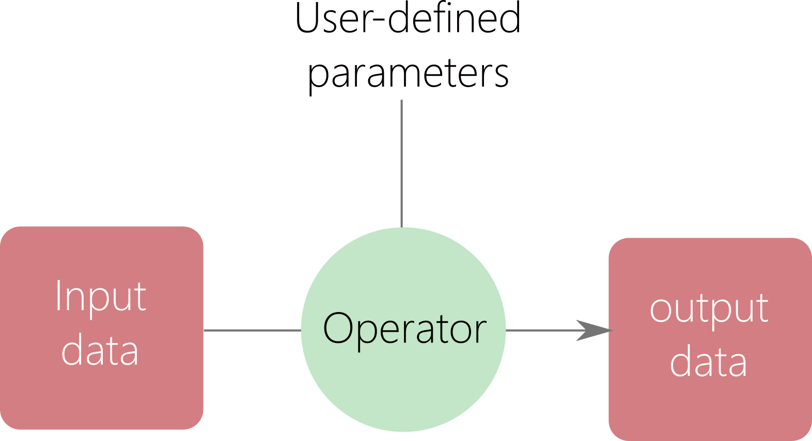
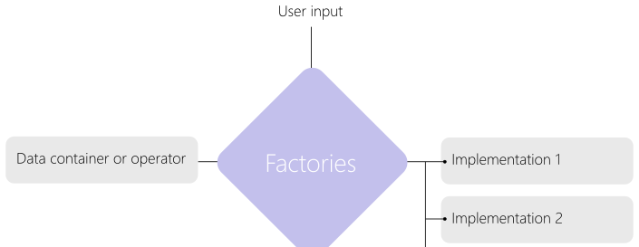
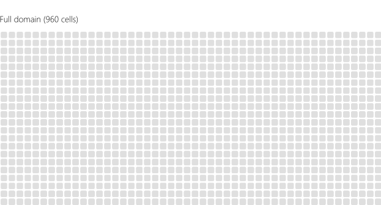
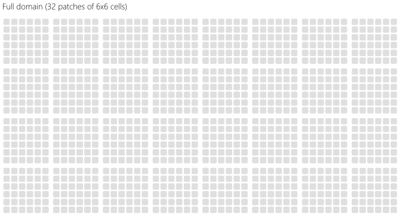
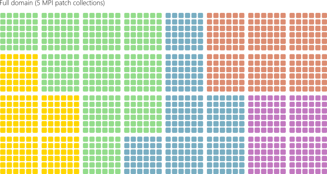
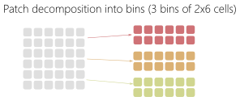
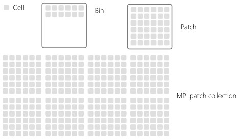
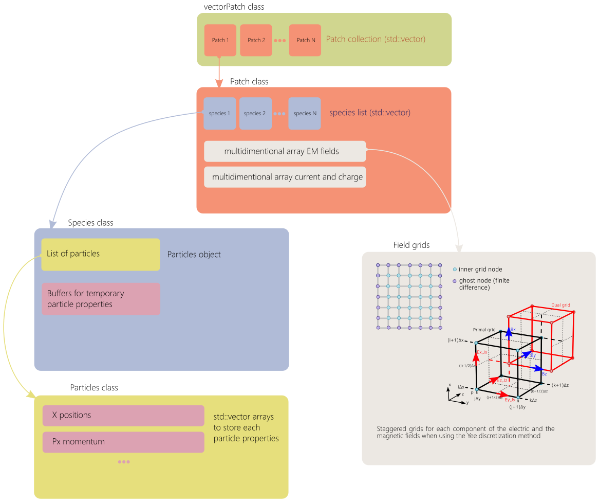
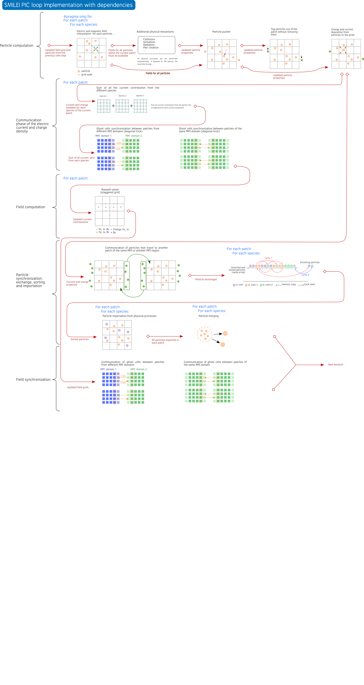

Implementation
******************************************

Introduction
===============================================

Smilei is a C++ code that uses relatively simple C++ features for modularity
and conveniency for non-advanced C++ users.

The repository is composed of the following directories:

- ``Licence``: contains code licence information
- ``doc``: conatins the Sphinx doc files
- ``src``: contains all source files
- ``happi``: contains the sources of the happi Python tool for visualization
- ``benchmarks``: contains the benchmarks used by the validation process. these becnhamrks are also examples for users.
- ``scripts``: contains multiple tool scripts for compilation and more

  - ``compile_tools``: contains scripts and machine files used by the makefile for compilation

- ``tools``: contains some additional programs for Smilei
- ``validation``: contains the python scripts used by the validation process

The source files directory is as well composed of several sub-directories to organise the `.cpp` and `.h` files by related thematics.
The main is the file `Smilei.cpp`.
There is always only one class definition per file and the file name correcponds to the class name.

The general implementation is later summarized in :numref:`smilei_main_loop`

General concept and vocabulary
===================================================

This section presents some implicit notions to understand the philosophy of the code.

Notion of data container
------------------------------------

Data containers are classes (or sometime just structures) used to store a specific type of data,
often considered as raw data such as particles or fields.
Some methods can be implemented in a data container for managing or accessing the data.

.. _dataContainer:

  Data container.

Notion of operators
------------------------------------

An operator is a class that operates on input data to provide a processed information.
Input data can be parameters and data containers.
Output data can be processed data from data containers or updated data containers.
An operator is a class functor (overloadind of the ``()`` ).
Sometime, operator provides additional methods called wrappers to provide differents simplified or adapted interfaces.
An operator do not store data or temporarely.
for instance, the particle interpolation, push and proection are operators.

.. _operator:

  Operator.

Notion of domain parts
------------------------------------

Domain parts are classes that represents some specific levels of the domain decomposition.
They can be seen as high-level data container or container of data container.
They contain some methods to handle, manange and access the local data.
For instance, patches and ``Species`` are domain parts:

- ``Species`` contains the particles.
- ``Patch`` contains ``Species`` and ``Fields``.

Notion of factory
------------------------------------

Some objects such as operators or data containers have sereral variations.
For this we use inheritance.
A base class is used for common parameters and methods and derived classes are used for all variations.
The factory uses user-defined input parameters to determine the right derive class to choose and initiate them as shown in :numref:`factory`.
For instance, there are several ``push`` operators implemented all derived from a base ``push`` class.
The ``push`` factory will determine the right one to use.

.. _factory:

  Description of the factory concept.

Other
------------------------------------

Some classes are used for specific actions in the code such as the initilization process.

Domain decomposition and parallelism
===========================================

The simulation domain is divided multiple times following a succession of decomposition levels.
The whole domain is the superimposition of different grids for each electromagnetic field component
and macro-particules.
Let us represent schematically the domain as an array of cells as in Fig. :numref:`full_domain`.
Each cell contains a certain population of particles (that can differ from cell to cell).

.. _full_domain:

  Example of a full domain with 960 cells.

In :program:`smilei`, the cells are first reorganized into small group so-called patches.
The domain becomes a collection of patches as shown in :numref:`patch_domain_decomposition`.

.. _patch_domain_decomposition:

  The domain in :program:`Smilei` is a collection of patches.

A patch is an independant piece of the whole simulation domain.
It therefore owns local electrmognatic grids and list of macro-particles.
Electromagnetic grids have ghost cells that represent the information located in the neighboring patches (not shown in :numref:`patch_domain_decomposition`).
All patches have the same spatial size .i.e. the same number of cells.
The size of a patch is calculated so that all local field grids (ghost cells included) can fit in L2 cache.

Patches are then distributed among MPI processes in so-called MPI patch collections.
The distribution can be ensured in an equal cartesian way or using a load balancing strategy based on the Hilbert curve.

.. _mpi_patch_collection:

  Patches are then distributed among MPI processes in so-called MPI patch collections.

Inside MPI patch collection, OpenMP loop directives are used to distribute the computation of the patches among the available threads.
Since each patch have a different number of particles, this approach enables a dynamic scheduling depending on the specified OpenMP scheduler.
As shown in :numref:`smilei_main_loop`, a synchronization step is required to exchange grid ghost cells and particles traveling from patch to patch.

The patch granularity is used for:

- creating more parallelism for OpenMP
- enabling a load balancing capability through OpenMP scheduling
- ensuring a good cache memory efficiency at L3 and L2 levels.

The patch is not the smaller decomposition grain-size.
The patch can be decomposed into bins as shown in :numref:`bin_decomposition`.

.. _bin_decomposition:

  Bin decomposition.

Contrary to patch, a bin is not an independant data structure with its own arrays.
It represents a smaller portion of the patch grids through specific start and end indexes.
For the macro-particles, a sorting algorithm is used to ensure that in the macro-particles
located in the same bin are grouped and contiguous in memory.

Finally, the decomposition levels are summarized in :numref:`decomposition_summary`.

.. _decomposition_summary:

  Domain decomposition summary.

--------------------------------------------------------------------------------

Data structures and main classes
=======================================

This section describes the main classes and the tree-like smilei data structure.
The whole picture is shown in :numref:`data_structure`.

.. _data_structure:

  General of the main tree-like data structure of Smilei.

Class ``VectorPatch``
------------------------------------

The class ``VectorPatch`` represents the MPI Patch collection described above and is the highest structure level.
The class description (``vectorPatch.h`` and ``vectorPatch.cpp``) is located in the directory  `src/Patch <https://github.com/SmileiPIC/Smilei/tree/master/src/Patch>`_.
Among the data components stored in this class, one of the most important is the list of patches.
By definition, each MPI process has therefore only one declared ``vectorPatch`` object.

.. cpp:class:: VectorPatch

  .. cpp:member:: std::vector<Patch*> patches_

  *List of patches located in this MPI patch collection.*

The class ``VectorPatch`` contains the methods directly called in the PIC time loop in ``smilei.cpp``.

Class ``Patch``
------------------------------------

The class ``Patch`` is an advanced data container that represents a single patch.
The base class description (``Patch.h`` and ``Patch.cpp``) is located in the directory  `src/Patch <https://github.com/SmileiPIC/Smilei/tree/master/src/Patch>`_.
From this base class can be derived several versions (marked as ``final``) depending on the geometry dimension:

- ``Patch1D``
- ``Patch2D``
- ``Patch3D``
- ``PatchAM`` for the AM geometry

The class ``Patch`` has a list of object ``Species`` called ``vecSpecies``.

.. cpp:class:: Patch

  .. cpp:member:: std::vector<Species*> vecSpecies

  *List of species in the patch*

  .. cpp:member:: ElectroMagn * EMfields

  *Electromagnetic fields and densities (E, B, J, rho) of the current Patch*

class ``Species``
------------------------------------

The class ``Species`` is an advanced data container that represents a single species.
The base class description (``Species.h`` and ``Species.cpp``) is located in the directory  `src/Species <https://github.com/SmileiPIC/Smilei/tree/master/src/Species>`_.
From this base class can be derived several versions (marked as ``final``):

- ``SpeciesNorm``
- ``SpeciesNormV``
- ``SpeciesV``
- ``SpeciesVAdaptive``
- ``SpeciesVAdaptiveMixedSort``

The correct species object is initialized using the species factory implemented in the file ``speciesFactory.h``.

The class ``Species`` owns the particles through the object ``particles`` of class ``Particles*``.

.. cpp:class:: Species

  .. cpp:member:: Particles * particles

  *Vector containing all Particles of the considered Speciesh*

class ``Particles``
------------------------------------

The class ``Particles`` is a data container that contains the particle properties.
The base class description (``Particles.h`` and ``Particles.cpp``) is located in the directory  `src/Particles <https://github.com/SmileiPIC/Smilei/tree/master/src/Particles>`_.
It contains several arrays storing the particles properties such as the positions, momenta, weight and others.

.. cpp:class:: Particles

  .. cpp:member:: std::vector< std::vector<double> > Position

  *Array containing the particle position*

  .. cpp:member:: std::vector< std::vector<double> > Momentum

  *Array containing the particle moments*

  .. cpp:member:: std::vector< double > Weight

  *Containing the particle weight: equivalent to a charge density*

  .. cpp:member:: std::vector< double > Chi

  *containing the particle quantum parameter*

  .. cpp:member:: std::vector< double > Tau

  *Incremental optical depth for the Monte-Carlo process*

  .. cpp:member:: std::vector< short > Charge

  *Charge state of the particle (multiples of e>0)*

  .. cpp:member:: std::vector< uint64_t > Id

  *Id of the particle*

  .. cpp:member:: std::vector< int > cell_keys

  *cell_keys of the particle*

Many of the methods implemented in ``Particles`` are used to access or manage the data.

class ``ElectroMagn``
------------------------------------

The class ``ElectroMagn`` is a high-level data container that contains the electromagnetic fields and currents.
The base class description (``ElectroMagn.h`` and ``ElectroMagn.cpp``) is located in the directory  `src/ElectroMagn <https://github.com/SmileiPIC/Smilei/tree/master/src/ElectroMagn>`_.
From this base class can be derived several versions (marked as ``final``) based on the dimension:

- ``ElectroMagn1D``
- ``ElectroMagn2D``
- ``ElectroMagn3D``
- ``ElectroMagnAM``

The correct final class is determined using the factory ``ElectroMagnFactory.h``.

.. cpp:class:: ElectroMagn

  .. cpp:member:: Field * Ex_

  *x-component of the electric field*

class ``Field``
------------------------------------

The class ``Field`` is a data-container that represent a field grid for a given component.
The base class description (``Field.h`` and ``Field.cpp``) is located in the directory  `src/Field <https://github.com/SmileiPIC/Smilei/tree/master/src/Field>`_.
It contains a linearized allocatable array to store all grid nodes whatever the dimension.

.. cpp:class:: Field

  .. cpp:member:: double *data_

  *pointer to the linearized field array*

  From this base class can be derived several versions (marked as ``final``) based on the dimension:

  - ``Field1D``
  - ``Field2D``
  - ``Field3D``

The correct final class is determined using the factory ``FieldFactory.h``.

Smilei MPI
------------------------------------

The class ``SmileiMPI`` is a specific class that contains interfaces and advanced methods for the custom and adapted use of MPI within Smilei.
The base class description (``SmileiMPI.h`` and ``SmileiMPI.cpp``) is located in the directory  `src/SmileiMPI <https://github.com/SmileiPIC/Smilei/tree/master/src/SmileiMPI>`_.

.. cpp:class:: SmileiMPI

-----------------------------------------------------------------

The :program:`Smilei` PIC loop implementation
==============================================================

The initialization and the main loop are explicitely done in the main file ``Smilei.cpp``.
The time loop is schematically described in :numref:`smilei_main_loop`.

.. _smilei_main_loop:

  Smilei main loop implementation (click on the figure for more details).

The time loop is explicitely written step by step in the main
file ``Smilei.cpp`` thought calls to different ``vecPatches`` methods.

* **Patch reconfiguration**: if adaptive vectorization is activated, then the patch may be
  reconfigured for scalar or vectorized mode.

.. highlight:: c++
   :linenothreshold: 5

.. code-block:: c++

    vecPatches.reconfiguration( params, timers, itime );

* **Collision**: particle collisions are performed before the particle dynamics part

.. code-block:: c++

    vecPatches.applyCollisions( params, itime, timers );

* **Relativistic poisson solver**: ...

.. code-block:: c++

    vecPatches.runRelativisticModule( time_prim, params, &smpi,  timers );

* **Charge**: reset global charge and currents densities to zero and computes rho old before moving particles

.. code-block:: c++

    vecPatches.computeCharge(true);

* **Particle dynamics**: this step processes the full particle dynamics
  including field interpolation, advanced physical operators (radiation, ionization...),
  boundary condition pre-processing and projection

.. code-block:: c++

    vecPatches.dynamics( params, &smpi, simWindow, radiation_tables_,
                                     MultiphotonBreitWheelerTables,
                                     time_dual, timers, itime );

* **Envelop module**: ...

.. code-block:: c++

    vecPatches.runEnvelopeModule( params, &smpi, simWindow, time_dual, timers, itime );

* **Sum of currents and densities**: current et charge reduction from different species
  and perform the synchronization step with communication

.. code-block:: c++

    vecPatches.sumDensities( params, time_dual, timers, itime, simWindow, &smpi );

* **Maganement of the antenna**: apply currents from antennas

.. code-block:: c++

    vecPatches.applyAntennas( time_dual );

* **Maxwell solvers**: solve Maxwell

.. code-block:: c++

    vecPatches.solveMaxwell( params, simWindow, itime, time_dual, timers, &smpi );

* **Particle communication**: finalize particle exchanges and sort particles

.. code-block:: c++

    vecPatches.finalizeAndSortParticles( params, &smpi, simWindow,
                                                 time_dual, timers, itime );

* **Particle merging**: merging process for particles (still experimental)

.. code-block:: c++

    vecPatches.mergeParticles(params, &smpi, time_dual,timers, itime );

* **Particle injection**: injection of particles from the boundaries

.. code-block:: c++

    vecPatches.injectParticlesFromBoundaries(params, timers, itime );

* **Cleaning**:  Clean buffers and resize arrays

.. code-block:: c++

    vecPatches.cleanParticlesOverhead(params, timers, itime );

* **Field synchronization**: Finalize field synchronization and exchanges

.. code-block:: c++

    vecPatches.finalizeSyncAndBCFields( params, &smpi, simWindow, time_dual, timers, itime );

* **Diagnostics**: call the various diagnostics

.. code-block:: c++

    vecPatches.runAllDiags( params, &smpi, itime, timers, simWindow );

* **Moving window**: manage the shift of the moving window

.. code-block:: c++

    timers.movWindow.restart();
    simWindow->shift( vecPatches, &smpi, params, itime, time_dual, region );

    if (itime == simWindow->getAdditionalShiftsIteration() ) {
        int adjust = simWindow->isMoving(time_dual)?0:1;
        for (unsigned int n=0;n < simWindow->getNumberOfAdditionalShifts()-adjust; n++)
            simWindow->shift( vecPatches, &smpi, params, itime, time_dual, region );
    }
    timers.movWindow.update();

* **Checkpointing**: manage the checkoints

.. code-block:: c++

    checkpoint.dump( vecPatches, region, itime, &smpi, simWindow, params );

Particle Dynamics
---------------------------------------

The particle dynamics is the large step in the time loop that performs the particle movement computation:

* Field interpolation
* Radiation loss
* Ionization
* Pair creation
* Push
* Detection of leaving particles at patch boundaries
* Charge and current projection

This step is performed in the method ``vecPatches::dynamics``.
We first loop on the patches and then the species of
each patch ``ipatch``: ``(*this )( ipatch )->vecSpecies.size()``.
For each species, the method ``Species::dynamics`` is called to perform the
dynamic step of the respective particles.
The OpenMP parallelism is explicitely applied in ``vecPatches::dynamics`` on the patch loop as shown
in the following pieces of code.

.. code-block:: c++

    #pragma omp for schedule(runtime)
    for( unsigned int ipatch=0 ; ipatch<this->size() ; ipatch++ ) {

        // ...

        for( unsigned int ispec=0 ; ispec<( *this )( ipatch )->vecSpecies.size() ; ispec++ ) {
            Species *spec = species( ipatch, ispec );

            // ....

            spec->Species::dynamics( time_dual, ispec,
                                     emfields( ipatch ),
                                     params, diag_flag, partwalls( ipatch ),
                                     ( *this )( ipatch ), smpi,
                                     RadiationTables,
                                     MultiphotonBreitWheelerTables,
                                     localDiags );

            // ...

        }
    }

Pusher
---------------------------------------

The pusher is the operator that moves the macro-particles using the equations of movement.
The operator implementation is
located in the directory  `src/Pusher <https://github.com/SmileiPIC/Smilei/tree/master/src/Pusher>`_.
The base class is ``Pusher`` implemented in ``Pusher.h`` and ``Pusher.cpp``.
From this base class can be derived several versions (marked as ``final``):

* ``PusherBoris``: pusher of Boris
* ``PusherBorisNR``: non-relativistic Boris pusher
* ``PusherBorisV``: vectorized Boris pusher
* ``PusherVay``: pusher of J. L. Vay
* ``PusherHigueraCary``: pusher of Higuera and Cary
* ``PusherPhoton``: pusher of photons (ballistic movement)

A factory called ``PusherFactory`` is used to select the requested pusher for each patch and each species.

.. _radiationReactionImplementation:

Nonlinear Inverse Compton radiation operator
---------------------------------------------------------------------------------

The physical details of this module are given in the page :ref:`radiationReactionPage`.
The implementation for this operator and the related files are located in the directory
`src/Radiation <https://github.com/SmileiPIC/Smilei/tree/master/src/Radiation>`_.
The base class used to derive the different versions of this operator is called ``Radiation``
and is implemented in the files ``Radiation.h`` and ``Radiation.cpp``.

A factory called ``RadiationFactory`` is used to select the requested radiation model for each patch and species.

The different radiation model implementation details are given in the following sections.

.. _LandauLifshitzImplementation:

Landau-Lifshift
^^^^^^^^^^^^^^^^^^^

The derived class that correspponds to the Landau-Lifshift model is called ``RadiationLandauLifshitz`` and
is implemented in the corresponding files.
The implementation is relatively simple and is similar to what is done in the ``Pusher``
since this radiation model is an extension of the classical particle push.

.. literalinclude:: ../../src/Radiation/RadiationLandauLifshitz.cpp
    :lines: 108-147
    :linenos:

It is composed of a vectorized loop on a group of particles using the ``istart`` and ``iend`` indexes
given as argument parameters to perform the following steps:

* Commputation of the particle Lorentz factor
* Commputation of the particle quantum parameter (``particle_chi``)
* Update of the momentum: we use the function ``getClassicalRadiatedEnergy`` implemented in the class ``RadiationTables`` to
  get the classical radiated energy for the given particle.
* Computation of the radiated energy: this energy is first stored
  per particle in the local array ``rad_norm_energy``

The second loop performs a vectorized reduction of the radiated energy for the current thread.

.. literalinclude:: ../../src/Radiation/RadiationLandauLifshitz.cpp
    :lines: 151-157
    :linenos:

The third vectorized loop compute again the quantum parameters based on the new momentum
and this time the result is stored in the dedicated array ``chi[ipart]`` to be used in
the following part of the time step.

.. literalinclude:: ../../src/Radiation/RadiationLandauLifshitz.cpp
    :lines: 162-178
    :linenos:

Corrected Landau-Lifshift
^^^^^^^^^^^^^^^^^^^^^^^^^^^^

The derived class that correspponds to the corrected Landau-Lifshift model is called ``RadiationCorrLandauLifshitz`` and
is implemented in the corresponding files.

Niel
^^^^^^^^^^^^^^^^^^^^^^^^^^^^

The derived class that correspponds to the Nield model is called ``RadiationNiel`` and
is implemented in the corresponding files.

Monte-Carlo
^^^^^^^^^^^^^^^^^^^^^^^^^^^^

The derived class that correspponds to the Monte-Carlo model is called ``RadiationMonteCarlo`` and
is implemented in the corresponding files.

Radiation Tables
^^^^^^^^^^^^^^^^^^^^^^^^^^^

The class ``RadiationTables`` is used to store and manage the different tabulated functions
used by some of the radiation models.

Radiation Tools
^^^^^^^^^^^^^^^^^^^^^^^^^^^

The class ``RadiationTools`` contains some function tools for the radiation.
Some methods provide function fit from tabulated values obtained numerically.
