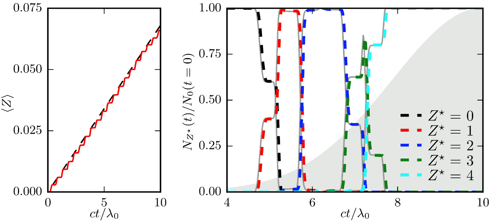
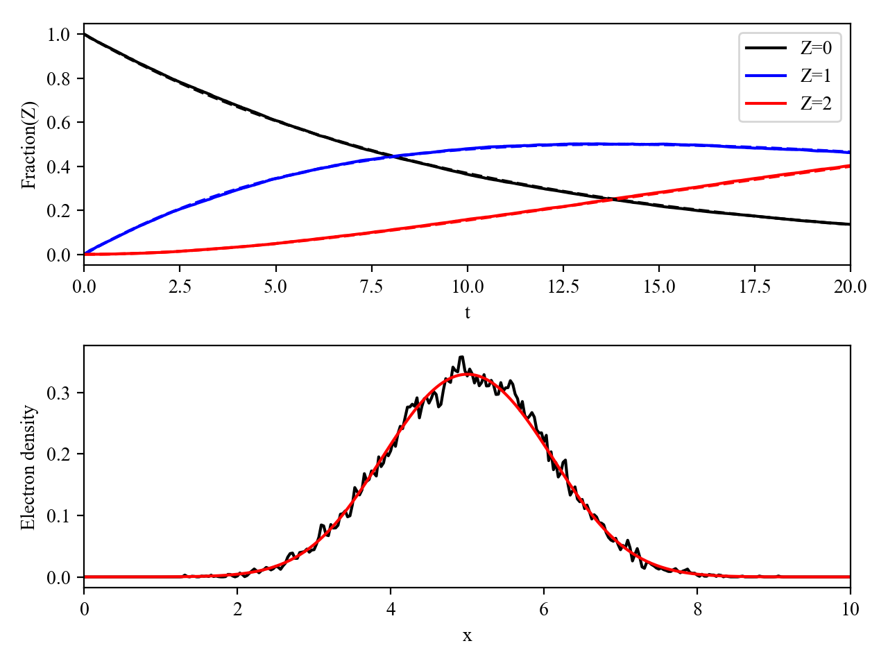

Ionization
----------------------------------

Three types of ionization have been introduced in Smilei (4 if you count field ionization with a laser envelope as a separate type).

----

Collisional ionization
^^^^^^^^^^^^^^^^^^^^^^^^^

Ionization may occur during collisions.
A detailed description is given on the :ref:`corresponding page<CollIonization>`.

----

.. _field_ionization:

Field ionization
^^^^^^^^^^^^^^^^^

Field ionization is a process of particular importance for laser-plasma interaction
in the ultra-high intensity regime.
It can affect ion acceleration driven by irradiating a solid target with
an ultra-intense laser, or can be used to inject electrons through
the accelerating field in laser wakefield acceleration.
This process is not described in the standard PIC (Vlasov-Maxwell) formulation,
and an *ad hoc* description needs to be implemented.
A Monte-Carlo module for field ionization has thus been developed in :program:`Smilei`,
closely following the method proposed in [Nuter2011]_.

Physical model for field ionization
""""""""""""""""""""""""""""""""""""""

This scheme relies on the quasi-static rate for tunnel ionization derived in
[Perelomov1966]_, [Perelomov1967]_ and [Ammosov1986]_.
Considering an ion with atomic number :math:`Z` being ionized from charge state
:math:`Z^\star-1` to :math:`Z^\star \le Z` in a constant electric field :math:`\mathbf{E}`
of magnitude :math:`\vert E\vert`, the ionization rate reads:

.. math::
  :label: ionizationRate

  \Gamma_{\rm ADK, DC} = A_{n^\star,l^\star}\,B_{l,\vert m\vert}\,
  I_p\,\left( \frac{2 (2 I_p)^{3/2}}{\vert E\vert} \right)^{2n^\star-\vert m \vert -1}\,
  \exp\!\left( -\frac{2 (2 I_p)^{3/2}}{3 \vert E\vert}  \right)\,,

where :math:`I_p` is the :math:`Z^{\star}-1` ionization potential of the ion,
:math:`n^\star=Z^\star/\sqrt{2 I_p}` and :math:`l^\star=n^\star-1` denote
the effective principal quantum number and angular momentum,
and :math:`l` and :math:`m` denote the angular momentum and its projection on
the laser polarization direction, respectively.
:math:`\Gamma_{\rm ADK, DC}`, :math:`I_p` and :math:`E` are here expressed in atomic units
The coefficients :math:`A_{n^\star,l^\star}` and :math:`B_{l,\vert m\vert}` are given by:

.. math::

  \begin{array}{lll}
  A_{n^\star,l^\star}&=& \frac{2^{2n^\star}}{n^\star\,\Gamma(n^\star+l^\star+1)\,\Gamma(n^\star-l^\star)},\\
  B_{l,\vert m\vert} &=& \frac{(2l+1)(l+\vert m\vert)!}{2^{\vert m\vert} \vert m\vert! (l-\vert m\vert)!}\,,
  \end{array}

where :math:`\Gamma(x)` is the gamma function.
Note that considering an electric field :math:`E=\vert E\vert\,\cos(\omega t)`
oscillating in time at the frequency :math:`\omega`, averaging Eq. :eq:`ionizationRate`
over a period :math:`2\pi/\omega` leads to the well-known cycle-averaged ionization rate:

.. math::
  :label: ADKrate

  \Gamma_{\rm ADK, AC} = \sqrt{\frac{3}{\pi}}A_{n^\star,l^\star}\,B_{l,\vert m\vert}
  \,I_p\,\left( \frac{2 (2 I_p)^{3/2}}{\vert E\vert} \right)^{2n^\star-\vert m \vert -3/2}\,
  \exp\!\left( -\frac{2 (2 I_p)^{3/2}}{3 \vert E\vert}  \right)\,.

In :program:`Smilei`, following [Nuter2011]_, the ionization rate of :eq:`ionizationRate`
is computed for :math:`\vert m \vert=0` only.
Indeed, as shown in [Ammosov1986]_, the ratio :math:`R` of the ionization rate
computed for :math:`\vert m\vert=0` by the rate computed for :math:`\vert m\vert=1` is:

.. math::

  R = \frac{\Gamma_{{\rm qs},\vert m \vert = 0}}{\Gamma_{{\rm qs},\vert m \vert = 1}}
  =  2\frac{(2\,I_p)^{3/2}}{\vert E\vert}
  \simeq 7.91\,10^{-3} \,\,\frac{(I_p[\rm eV])^{3/2}}{a_0\,\hbar\omega_0[\rm eV]}\,,

where, in the practical units formulation, we have considered ionization
by a laser with normalized vector potential :math:`a_0=e\vert E\vert /(m_e c \omega_0)`,
and photon energy :math:`\hbar\omega_0` in eV.
Typically, ionization by a laser with wavelength :math:`1~{\rm \mu m}`
(correspondingly :math:`\hbar \omega_0 \sim 1~{\rm eV}`) occurs for values
of :math:`a_0\ll 1` (even for large laser intensities for which ionization
would occur during the rising time of the pulse) while the ionization potential
ranges from a couple of eV (for electrons on the most external shells)
up to a few tens of thousands of eV (for electrons on the internal shell
of high-Z atoms). As a consequence, :math:`R\gg1`, and the probability
of ionization of an electron with magnetic quantum number :math:`\vert m \vert=0`
greatly exceeds that of an electron with :math:`\vert m \vert = 1`.

The initial velocity of the electrons newly created by ionization is chosen as equal to the ion velocity.
This constitutes a minor violation of momentum conservation, as the ion mass is not decreased after ionization.

Monte-Carlo scheme
""""""""""""""""""""""""""""""""""""""

In :program:`Smilei`, tunnel ionization is treated for each species
(defined by the user as subject to field ionization) right after field interpolation
and before applying the pusher.
For all quasi-particles (henceforth referred to as quasi-ion) of the considered species,
a Monte-Carlo procedure has been implemented that allows to treat multiple ionization
events in a single timestep. It relies on the cumulative probability derived
in Ref. [Nuter2011]_:

.. math::

  F_k^{Z^{\star}-1} = \sum_{j=0}^k p_j^{Z^{\star}-1}\,,

to ionize from 0 to :math:`k` times a quasi-ion with initial charge state
:math:`Z^{\star}-1` during a simulation timestep :math:`\Delta t`,
:math:`p_j^{Z^{\star}-1}` being the probability to ionize exactly :math:`j` times this ion.

The Monte-Carlo procedure proceeds as follows.
A random number :math:`r` with uniform distribution between 0 and 1 is picked.
If :math:`r` is smaller than the probability :math:`p_0^{Z^{\star}-1}`
to not ionize the quasi-ion, then the quasi-ion is not ionized during this time step.
Otherwise, we loop over the number of ionization events :math:`k`,
from :math:`k=1` to :math:`k_{\rm max}=Z-Z^{\star}+1`
(for which :math:`F_{k_{\rm max}}^{Z^{\star}-1}=1` by construction),
until :math:`r<F_k^{Z^{\star}-1}`. At that point, :math:`k` is the number of
ionization events for the quasi-ion. A quasi-electron is created with
the numerical weight equal to :math:`k` times that of the quasi-ion,
and with the same velocity as this quasi-ion.
The quasi-ion charge is also increased by :math:`k`.

Finally, to ensure energy conservation, an ionization current
:math:`{\bf J}_{\rm ion}` is projected onto the simulation grid such that

.. math::
  :label: EnergyConservation

  {\bf J}_{\rm ion} \cdot {\bf E} = \Delta t^{-1}\,\sum_{j=1}^k I_p(Z^{\star}-1+k)\,.

Benchmarks
""""""""""""""""""""""""""""""""""""""

In what follows, we present two benchmarks of the field ionization model.
Both benchmarks consist in irradiating a thin (one cell long) neutral material (hydrogen or carbon)
with a short (few optical-cycle long) laser with wavelength :math:`\lambda_0 = 0.8~{\mu m}`.

.. _FigFieldIonization:

  Results of two benchmarks for the field ionization Model.
  Top: Average charge state of hydrogen ions as a function of time when irradiated by a laser.
  The red solid line corresponds to PIC results, the dashed line corresponds to
  theoretical predictions using the cycle-averaged ADK growth rate of :eq:`ADKrate`.
  Bottom: Relative distribution of carbon ions for different charge states as a function
  of time. Dashed lines correspond to PIC results, thin gray lines correspond to
  theoretical predictions obtained from :eq:`rateEqs`. The Gaussian gray shape
  indicates the laser electric field envelope.

In the first benchmark, featuring hydrogen, the laser intensity is kept constant
at :math:`I_L = 10^{14}~{\rm W/cm^2}`, corresponding to a normalized vector
potential :math:`a_0 \simeq 6.81 \times 10^{-3}`, over 10 optical cycles.
The resulting averaged ion charge in the simulation is presented as a function of
time in :numref:`FigFieldIonization` (left). It is found to be in excellent agreement
with the theoretical prediction considering the cycle averaged ionization rate
:math:`\Gamma_{\rm ADK} \simeq 2.55\times10^{12}~{\rm s^{-1}}` computed
from :eq:`ADKrate`.

The second benchmark features carbon ions. The laser has a peak intensity
:math:`I_L = 5 \times 10^{16}~{\rm W/cm^2}`, corresponding to a normalized
vector potential :math:`a_0 \simeq 1.52 \times 10^{-1}`, and a gaussian time profile
with FWHM :math:`\tau_L=5~\lambda_0/c` (in terms of
electric field). :numref:`FigFieldIonization` (right) shows, as function of time,
the relative distribution of carbon ions for different charge states
(from 0 to :math:`+4`). These numerical results are shown to be in excellent
agreement with theoretical predictions obtained by numerically solving the coupled
rate equations on the population :math:`N_i` of each level :math:`i`:

.. math::
  :label: rateEqs

  \frac{d}{dt}N_i =
  (1-\delta_{i,0}) \, \Gamma_{i-1}\,N_{i-1}  -  (1-\delta_{i,Z})\, \Gamma_{i}\,N_{i}\,,

with :math:`\delta_{i,j}` the Kroenecker delta, and :math:`\Gamma_i` the ionization
rate of level :math:`i`. Note also that, for this configuration,
:math:`\Delta t \simeq 0.04~{\rm fs}` is about ten times larger than
the characteristic time :math:`\Gamma_{\rm ADK}^{-1} \simeq 0.006~{\rm fs}`
to ionize :math:`{\rm C}^{2+}` and :math:`{\rm C}^{3+}`
so that multiple ionization from :math:`{\rm C}^{2+}` to :math:`{\rm C}^{4+}`
during a single timestep does occur and is found to be correctly accounted for
in our simulations.

----

.. _field_ionization_envelope:

Field ionization with a laser envelope
^^^^^^^^^^^^^^^^^^^^^^^^^^^^^^^^^^^^^^^^

In a typical PIC simulation, the laser oscillation is sampled frequently in time, 
thus the electric field can be considered static within a single timestep where ionization takes place,
and the ionization rate in 
DC, i.e. :math:`\Gamma_{\rm ADK, DC}` from Eq. :eq:`ionizationRate` can be used at 
each timestep. 

Instead, in presence of a laser envelope (see :doc:`laser_envelope`) an ad hoc treatment of the 
ionization process averaged over the scales of the optical cycle is necessary, since the
integration timestep is much greater than the one used in those typical PIC simulations [Chen2013]_.
Thus, in this case a ionization rate :math:`\Gamma_{\rm ADK, AC}` obtained averaging :math:`\Gamma_{\rm ADK, DC}` over the laser oscillations 
should be used at each timestep to have a better agreement with a correspondent standard laser simulation.
Afterwards, the momentum of the newly created electrons must be properly initialized taking into account of the 
averaging process in the definition of the particle-envelope interaction.

For circular polarization, i.e. `ellipticity = 1`, 
:math:`\Gamma_{\rm ADK, AC}=\Gamma_{\rm ADK, DC}`, since the field does not change 
its magnitude over the laser oscillations.
For linear polarization, i.e. `ellipticity = 0` :

.. math::
  :label: ionizationRate

  \Gamma_{\rm ADK, AC} = \left(\frac{3}{\pi}\frac{\vert E\vert}{(2I_p)^{3/2}}\right)^{1/2}\Gamma_{\rm ADK, DC} .

Normally the laser is intense enough to be the main cause of ionization, 
but to take into account possible high total fields :math:`E` not described only by an envelope, 
in :program:`Smilei` a combination :math:`E=\sqrt{\vert E_{plasma}\vert^{2}+\vert\tilde{E}_{envelope}\vert^{2}}` 
is used instead of :math:`E` in the above formulas. The field :math:`\tilde{E}_{plasma}` represents
the (low frequency) electric field of the plasma, while :math:`\vert\tilde{E}_{envelope} \vert=\sqrt{\vert\tilde{E}\vert^2+\vert\tilde{E}_x\vert^2}` 
takes into account the envelopes of both the transverse and longitudinal components of the laser electric field
(see :doc:`laser_envelope` for details on their calculation).

After an electron is created by ionization, its initial transverse momentum :math:`p_{\perp}` is assigned as described in [Tomassini2017]_.
For circular polarization, in the case of an electron subject to a laser transverse envelope vector potential :math:`\tilde{A}`, the magnitude of its transverse momentum is set as 
:math:`\vert p_{\perp}\vert = \vert\tilde{A}\vert` and its transverse direction is chosen randomly between :math:`0` and :math:`2\pi`. 
For linear polarization, the transverse momentum along the polarization direction is drawn from a gaussian distribution with
rms width :math:`\sigma_{p_{\perp}} = \Delta\vert\tilde{A}\vert`, to reproduce the residual rms transverse momentum spread of electrons stripped from 
atoms by a linearly polarized laser [Schroeder2014]_. The parameter :math:`\Delta` is defined as [Schroeder2014_]:

.. math::
  :label: ionizationRate

  \Delta = \left(\frac{3}{2} \vert E \vert \right)^{1/2}\left(2I_p\right)^{-3/4}.

Additionally, in :program:`Smilei` the initial longitudinal momentum of the new electrons is initialized. An electron initially at rest in a plane wave 
with vector potential of amplitude :math:`\vert\tilde{A}\vert` propagating along the positive :math:`x` direction is subject to a drift, 
with an average longitudinal momentum :math:`<p_x> = \vert\tilde{A}\vert^2/4` and its longitudinal momentum is equal to :math:`p_x = |p_{\perp}|^2/2` [Gibbon]_.
Each electron, newly created from ionization, is thus initalized with :math:`p_x = \vert\tilde{A}\vert^2/4+\vert p_{\perp}\vert^2/2`, 
where :math:`p_{\perp}` is drawn as described above and in [Tomassini2017]_. 
This technique allows to take into account longitudinal effects on the initial momentum that are more visible when :math:`\vert\tilde{A}\vert>1`, 
which manifest mainly as an initial average longitudinal momentum [MassimoIonization2020]_.

If the envelope approximation hypotheses are satisfied, the charge created with ionization and the momentum distribution 
of the newly created electrons computed with this procedure should agree with those obtained with a standard laser simulation,
provided that the comparison is made after the end of the interaction with the laser. Examples of these comparisons can be found in [MassimoIonization2020]_.
A comparison made in a timestep where the interaction with the laser is still taking place would show the effects of the quiver motion in the electron momenta
in the standard laser simulation (e.g. peaks in the transverse momentum spectrum). These effects would be absent in the envelope simulation. 

Apart from the different ionization rate and the ad hoc momentum initialization of the new electrons, 
the implementation of the field ionization with a laser envelope follows the same procedure 
described in the above section treating the usual field ionization.

In presence of a laser envelope, an energy conservation equation analogous to :eq:`EnergyConservation` 
cannot be written, since the information about the direction of the ionizing field is lost with the envelope
description. However, in many situations where the envelope approximation is valid the ion current can be 
neglected and the error on energy conservation is negligible.

----
 
.. _rate_ionization:

User-defined ionization rate
^^^^^^^^^^^^^^^^^^^^^^^^^^^^^^

:program:`Smilei` can treat ionization considering a fixed rate prescribed by the user.
The ionization rates are defined, for a given ``Species``, as described :ref:`here <Species>`.
The Monte-Carlo procedure behind the treatment of ionization in this case closely follows
that developed for field ionization.

.. warning::
  Note that, in the case of a user-defined ionization rate, only single ionization event per timestep are possible.

Let us introduce two benchmarks for which the rate of ionization is defined by the user.
The first benchmark considers an initially neutral species that can be potentially ionized twice.
To run this case, a constant and uniform ionization rate is considered that depends only on the particle current charge
state. For this particular case, we have considered a rate :math:`r_0 = 0.1` (in code units) for ionization from
charge state 0 to 1, and a rate :math:`r_1 = 0.05` (in code units) for ionization from charge state 1 to 2.
The simulation results presented in Fig. :numref:`FigFromRateIonization` (top panel) shows the time evolution of the
fraction in each possible charge states (:math:`Z=0`, :math:`Z=1` and :math:`Z=2`).
Super-imposed (dashed lines) are the corresponding theoretical predictions.

The second benchmark features an initially neutral species homogeneously distributed in the simulation box.
The ionization rate is here chosen as a function of the spatial coordinate :math:`x`,
and reads :math:`r(x) = r_0 \exp(-(x-x_c)^2/2)` with :math:`r_0 = 0.02` the maximum ionization rate and
:math:`x_c=5` the center of the simulation box.
The simulation results presented in Fig. :numref:`FigFromRateIonization` (bottom panel) shows,
at the end of the simulation :math:`t=20`, the electron number density as a function of space.
Super-imposed (in red) is the corresponding theoretical prediction.

.. _FigFromRateIonization:

  Results of the two benchmarks for the ionization model using user-defined rates as described above.

----

References
^^^^^^^^^^

.. [Ammosov1986] `M. V. Ammosov, N. B. Delone, and V. P. Krainov, Sov. Phys. JETP 64, 1191 (1986) <http://www.jetp.ac.ru/cgi-bin/dn/e_064_06_1191.pdf>`_

.. [Nuter2011] `R. Nuter et al., Phys. of Plasmas 19, 033107 (2011) <http://dx.doi.org/10.1063/1.3559494>`_

.. [Perelomov1966] `A. M. Perelomov, V. S. Popov, and M. V. Terent’ev, Sov. Phys. JETP 23, 924 (1966) <http://www.jetp.ac.ru/cgi-bin/dn/e_023_05_0924.pdf>`_

.. [Perelomov1967] `A. M. Perelomov, V. S. Popov, and M. V. Terent’ev, Sov. Phys. JETP 24, 207 (1967) <http://www.jetp.ac.ru/cgi-bin/dn/e_024_01_0207.pdf>`_

.. [Chen2013] `M. Chen, E. Cormier-Michel, C. G. R. Geddes, D. L. Bruwhiler, L. L. Yu, E. Esarey, C. B. Schroeder, W. P. Leemans, Journ. Comput. Phys. 236, 220 (2013) <https://doi.org/10.1016/j.jcp.2012.11.029>`_

.. [Tomassini2017] `P. Tomassini, S. De Nicola, L. Labate, P. Londrillo, R. Fedele, D. Terzani, and L. A. Gizzi, Physics of Plasmas 24, 103120 (2017) <https://doi.org/10.1063/1.5000696>`_

.. [Schroeder2014] `C. B. Schroeder, J.-L. Vay, E. Esarey, S. S. Bulanov, C. Benedetti, L.-L. Yu, M. Chen, C. G. R. Geddes, and W. P. Leemans, Phys. Rev. ST Accel. Beams 17, 101301 <https://journals.aps.org/prab/abstract/10.1103/PhysRevSTAB.17.101301>`_

.. [Gibbon] P. Gibbon, Short Pulse Laser Interactions with Matter - An Introduction, Imperial College Press (2005)
