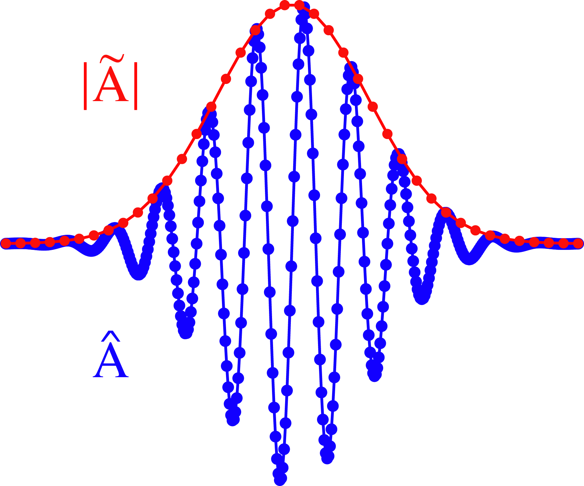

Laser envelope model
--------------------

In many physical situations, the spatial and temporal scales of interest (e.g. the plasma wavelength :math:`\lambda_p`) are much larger than the scales related to the laser central wavelength :math:`\lambda_0`.
In these cases, if the laser pulse is much longer than :math:`\lambda_0`, the computation time can be substantially reduced: one may need to sample only the laser envelope  instead of :math:`\lambda_0`, as depicted in the following figure.

  Blue: laser vector potential component :math:`\hat{A}` along the polarization direction. Red: the module of its complex envelope :math:`|\tilde{A}|`. Both the lines display a suitable number of points for a proper sampling. In this case, the envelope is sampled by a number of points smaller by a factor ten. 
   

The description of the physical system in terms of the complex envelope of the laser vector potential, neglecting its fast oscillations, is the essence of the envelope approximation. We remark that all the equations involved in the envelope model do not take into account the laser polarization. This is a main limit of the envelope approximation, as well as the impossibility to model phenomena at the scale of :math:`\lambda_0`.

In the following, the equations of the envelope model are presented, following mainly [Cowan2011]_, [Terzani]_. Their numerical solution is briefly described as well.

----

The envelope approximation
^^^^^^^^^^^^^^^^^^^^^^^^^^^^^^

The use of envelope models to describe a laser pulse is well known in PIC codes [Mora1997]_, [Quesnel1998]_, [Gordon2000]_, [Huang2006]_, [Cowan2011]_, [Benedetti2012]_. The basic blocks of a PIC code using an envelope description for the laser are an envelope equation, to describe the evolution of the laser, and equations of motion for the macroparticles, to take into account their interactions with the laser. 
The effect of the plasma on laser propagation is taken into account in the envelope equation through the plasma susceptibility, as described in the following section.
The various PIC codes using an envelope model for the laser solve different versions of the envelope equation, depending mostly on which terms are retained and which ones are neglected, or the set of coordinates used to derive the envelope equation. Also the numerical schemes used to solve the envelope equation and the equations of motion of the particles vary accordingly.
In :program:`Smilei`, the version of the envelope model written in laboratory frame coordinates, first demonstrated in the PIC code :program:`ALaDyn` [Benedetti2008]_, [ALaDynZenodo]_, [Terzani]_ is implemented, including the same numerical scheme to solve the lab frame coordinates envelope equation.

The basic assumption of the model is the description of the laser pulse vector potential in the complex polarization direction :math:`\hat{A}(\mathbf{x},t)` as a slowly varying envelope :math:`\tilde{A}(\mathbf{x},t)` modulated by fast oscillations at wavelength :math:`\lambda_0`, moving at the speed of light :math:`c`:

.. math::
  :label: envelope

  \hat{A}(\mathbf{x},t)=\textrm{Re}\left[\tilde{A}(\mathbf{x},t)e^{ik_0(x-ct)}\right],

where :math:`k_0=2\pi/\lambda_0`. In the language of signal processing, :math:`\tilde{A}` is the complex envelope of :math:`\hat{A}`. In other words, the spectral content of :math:`\tilde{A}` is given by the positive frequency components of :math:`\hat{A}` around :math:`k_0`, but centered around the origin of the frequency :math:`k` axis. As the laser is the source term of the phenomena of interest, in general any physical quantity :math:`A` will be therefore given by the summation of a slowly varying part :math:`\bar{A}` and a fast oscillating part :math:`\hat{A}` with the same form of Eq. :eq:`envelope`:

.. math::

  A=\bar{A} + \hat{A}

In the envelope model context, "slowly varying" means that the spatial and temporal variations of :math:`\bar{A}` and :math:`\tilde{A}` are small enough to be treated perturbatively with respect to the ratio :math:`\epsilon=\lambda_0/\lambda_p`, as described in detail in [Mora1997]_, [Quesnel1998]_, [Cowan2011]_. The laser envelope transverse size :math:`R` and longitudinal size :math:`L` are thus assumed to scale as :math:`R \approx L \approx \lambda_0 / \epsilon` [Mora1997]_, [Quesnel1998]_.
As described thoroughly in the same references, the coupling between the laser envelope and the plasma particles can be modeled through the addiction of a ponderomotive force term in the particles equations of motion. This term, not representing a real force, is a term rising from an averaging process in the perturbative treatment of the particles motion over the laser optical cycles. 

Modeling the laser through a complex envelope and its coupling with the plasma through the ponderomotive force will yield physically meaningful results only if the variation scales in space and time are greater than :math:`\lambda_0`, :math:`1/\omega_0`. Examples violating these hypotheses include, but are not limited to, tightly focused lasers, few optical cycles lasers, sharp gradients in the plasma density. 

From Eq. :eq:`envelope`, the laser electric field's complex envelope :math:`\tilde{E}` can be derived. In the context of the perturbative treatment, the laser scalar potential can be neglected [Cowan2011]_, yielding:

.. math::

  \hat{E} = -\partial_t \hat{A} = -\partial_t \Big\{\textrm{Re}\left[\tilde{A}(\mathbf{x},t)e^{ik_0(x-ct)}\right]\Big\} = \textrm{Re}\left[-\left(\partial_t-ik_0c\right)\tilde{A}(\mathbf{x},t)e^{ik_0(x-ct)}\right],

which can be expressed, following the definition in Eq. :eq:`envelope`, also as  

.. math::

  \hat{E} = \textrm{Re}\left[\tilde{E}(\mathbf{x},t)e^{ik_0(x-ct)}\right].
 

The laser electric field's complex envelope along the polarization direction :math:`\tilde{E}` can thus be defined:

.. math::

  \tilde{E} = -\left(\partial_t-ik_0c\right)\tilde{A}(\mathbf{x},t)

----

The envelope equation
^^^^^^^^^^^^^^^^^^^^^^^^^^^^^^^^^^^^^^^^^^^^

The evolution of the laser pulse is described by d'Alembert's equation, which in normalized units reads:

.. math::
  :label: dalembert

  \nabla^2 \hat{A}-\partial^2_t\hat{A}=-\hat{J},

where :math:`\hat{J}` is the fast oscillating part of the current density in the laser polarization direction. Through the assumption given by Eq. :eq:`envelope`, Eq. :eq:`dalembert` can be reduced to an envelope equation:

.. math::
  :label: envelope_equation

  \nabla^2 \tilde{A}+2i\left(\partial_x \tilde{A} + \partial_t \tilde{A}\right)-\partial^2_t\tilde{A}=\chi \tilde{A},

which describes the evolution of the laser pulse only in terms of the laser envelope :math:`\tilde{A}`. The function :math:`\chi` represents the plasma susceptibility, which is computed similarly to the charge density (see :doc:`algorithms`) as

.. math::
  :label: susceptibility

  \chi(\mathbf{x}) = \sum_s\,\frac{q^2_s}{m_s}\,\sum_p\,\frac{w_p}{\bar{\gamma}_p}\,S\big(\mathbf{x}-\mathbf{\bar{x}}_p\big)\,

where :math:`\bar{\gamma}_p` is the averaged Lorentz factor of the particle :math:`p`. This averaged quantity is computed from the averaged particle momentum :math:`\mathbf{\bar{u}}_p=\mathbf{\bar{p}}_p/m_s` and the envelope :math:`\tilde{A}`:

.. math::
  :label: gamma_ponderomotive

  \bar{\gamma}_p = \sqrt{1+\mathbf{\bar{u}}^2_p+\frac{|\tilde{A}(\mathbf{\bar{x}}_p)|^2}{2}}.

The term at the right hand side of Eq. :eq:`envelope`, where the plasma susceptibility :math:`\chi` appears, allows to describe phenomena where the plasma alters the propagation of the laser pulse, as relativistic self-focusing.

Note that if in Eq. :eq:`envelope` the temporal variation of the envelope :math:`\tilde{A}` is neglected, and :math:`\partial^2_x \tilde{A} \ll 2i\partial_x \tilde{A}` is assumed, the well-known paraxial wave equation is retrieved in vacuum (:math:`\chi=0`):

.. math::
  :label: paraxial_wave_equation

  \nabla_{\perp}^2 \tilde{A}+2i\partial_x \tilde{A}=0. 

In :program:`Smilei`, none of these assumptions are made and the full version of Eq. :eq:`envelope_equation` is solved.

----

The ponderomotive equations of motion
^^^^^^^^^^^^^^^^^^^^^^^^^^^^^^^^^^^^^^^^^^^^

The process of averaging over the time scale of a laser oscillation period yields a simple result for the particles equations of motion. 
The averaged position :math:`\mathbf{\bar{x}}_p` and momentum :math:`\mathbf{\bar{u}}_p` of the particle :math:`p` are related to the averaged electromagnetic fields :math:`\mathbf{\bar{E}}_p=\mathbf{\bar{E}}(\mathbf{\bar{x}}_p)`, :math:`\mathbf{\bar{B}}_p=\mathbf{\bar{B}}(\mathbf{\bar{x}}_p)` through the usual equations of motion, with the addition of a ponderomotive force term which models the interaction with the laser:

.. math::
  :label: ponderomotive_equations_of_motion
 
  \begin{eqnarray}
  \frac{d\mathbf{\bar{x}}_p}{dt} &=& \frac{\mathbf{\bar{u}_p}}{\bar{\gamma}_p}\,\\
  \frac{d\mathbf{\bar{u}}_p}{dt} &=& r_s \, \left( \mathbf{\bar{E}}_p + \frac{\mathbf{\bar{u}}_p}{\bar{\gamma}_p} \times \mathbf{\bar{B}}_p \right)-r^2_s\thinspace\frac{1}{4\bar{\gamma}_p}\nabla\left(|\tilde{A}_p|^2\right),
  \end{eqnarray}

where :math:`r_s = q_s/m_s` is the charge-over-mass ratio (for species :math:`s`). The presence of the ponderomotive force :math:`\mathbf{F}_{pond}=-r^2_s\thinspace\frac{1}{4\bar{\gamma}_p}\nabla\left(|\tilde{A}|^2\right)` and of the ponderomotive potential :math:`\Phi_{pond}=\frac{|\tilde{A}|^2}{2}` in the envelope and particle equations is the reason why the envelope model is also called ponderomotive guiding center model [Gordon2000]_. 

----

The averaged electromagnetic fields
^^^^^^^^^^^^^^^^^^^^^^^^^^^^^^^^^^^^^^^^^^^^

In the envelope model, Maxwell's equations remain unaltered, except for the fact that they describe the evolution of the averaged electromagnetic fields :math:`\mathbf{\bar{E}}(\mathbf{x},t)`, :math:`\mathbf{\bar{B}}(\mathbf{x},t)` in terms of the averaged charge density :math:`\bar{\rho}(\mathbf{x},t)` and averaged current density :math:`\mathbf{\bar{J}}(\mathbf{x},t)`:

.. math::
  :label: Maxwell_envelope

  \begin{eqnarray}
  \nabla \cdot \mathbf{\bar{B}} &=& 0 \,,\\
  \nabla \cdot \mathbf{\bar{E}} &=& \bar{\rho} \,,\\
  \nabla \times \mathbf{\bar{B}} &=& \mathbf{\bar{J}} + \partial_t \mathbf{\bar{E}} \,,\\
  \nabla \times \mathbf{\bar{E}} &=& -\partial_t \mathbf{\bar{B}} \,.
  \end{eqnarray}

Note that the averaged electromagnetic fields do not include the laser fields. Thus, also in the diagnostics of :program:`Smilei`, the fields will include only the averaged fields.

----

The ponderomotive PIC loop
^^^^^^^^^^^^^^^^^^^^^^^^^^^^^^^^^

Since Maxwell's equations :eq:`Maxwell_envelope` remain unaltered, their solution can employ the same techniques used in a standard PIC code. The main difficulty in the solution of the other equations, namely the envelope equation Eq. :eq:`envelope_equation` and the macroparticles equations of motion Eqs. :eq:`ponderomotive_equations_of_motion`, is that the source terms contain the unknown terms.
For example, in the envelope equations, the source term involves the unknown envelope :math:`\tilde{A}` itself and :math:`\chi`, which depends on the envelope. The equations of motion contain the term :math:`\bar{\gamma}`, which depends on the envelope :math:`\tilde{A}`.
The PIC loop described in :doc:`algorithms` is thus modified to self-consistently solve the envelope model equations. At each timestep, the code performs the following operations

#. interpolating the electromagnetic fields and the ponderomotive potential at the particle positions,
#. projecting the new plasma susceptibility on the grid,
#. computing the new particle velocities, 
#. computing the new envelope values on the grid, 
#. computing the new particle positions, 
#. projecting the new charge and current densities on the grid,
#. computing the new electromagnetic fields on the grid.

Note that the momentum advance and position advance are separated by the envelope equation solution in this modified PIC loop.
In this section, we describe these steps which advance the time from time-step :math:`(n)` to time-step :math:`(n+1)`.  

Field interpolation
"""""""""""""""""""
The electromagnetic fields and ponderomotive potential interpolation at the particle position at time-step :math:`(n)` follow the same technique described in :doc:`algorithms`:

.. math::

  \begin{eqnarray}
  \mathbf{\bar{E}}_p^{(n)} = V_c^{-1} \int d\mathbf{x}\, S\left(\mathbf{x}-\mathbf{\bar{x}}_p^{(n)}\right) \mathbf{\bar{E}}^{(n)}(\mathbf{x})\,,\\
  \mathbf{\bar{B}}_p^{(n)} = V_c^{-1} \int d\mathbf{x}\, S\left(\mathbf{x}-\mathbf{\bar{x}}_p^{(n)}\right) \mathbf{\bar{B}}^{(n)}(\mathbf{x})\,,\\
  \mathbf{\Phi}_p^{(n)} = V_c^{-1} \int d\mathbf{x}\, S\left(\mathbf{x}-\mathbf{\bar{x}}_p^{(n)}\right) \mathbf{\Phi}^{(n)}(\mathbf{x})\,,
  \end{eqnarray}

where we have used the time-centered magnetic fields
:math:`\mathbf{\bar{B}}^{(n)}=\tfrac{1}{2}[\mathbf{\bar{B}}^{(n+1/2) } + \mathbf{\bar{B}}^{(n-1/2)}]`,
and :math:`V_c` denotes the volume of a cell.

Susceptibility deposition
""""""""""""""""""""""""""""
The particle averaged positions :math:`\mathbf{\bar{x}}_p^{(n)}` and averaged momenta :math:`\mathbf{\bar{p}}_p^{(n)}` and the ponderomotive potential :math:`\mathbf{\Phi}_p^{(n)}` are used to compute the ponderomotive Lorentz factor :math:`\bar{\gamma}_p` :eq:`gamma_ponderomotive` and deposit the susceptibility on the grid through Eq. :eq:`susceptibility`.

Ponderomotive momentum push
""""""""""""""""""""""""""""
The momentum push is performed through a modified version of the well-known `Boris Pusher <https://archive.org/stream/DTIC_ADA023511#page/n7/mode/2up>`_, first implemented in :program:`ALaDyn` [ALaDynZenodo]_.
The plasma electric, magnetic and ponderomotive potential fields at the particle position :math:`\mathbf{\bar{E}}_p^{(n)}`, :math:`\mathbf{\bar{B}}_p^{(n)}`, :math:`\mathbf{\Phi}_p^{(n)}` are used to advance the momentum :math:`\mathbf{\bar{p}}_p^{(n-1/2)}` from time-step :math:`n−1/2` to time-step :math:`n + 1/2`, solving the momentum equation in Eqs. :eq:`ponderomotive_equations_of_motion`

Envelope equation solution
""""""""""""""""""""""""""""
Now that the averaged susceptibility is known at time-step :math:`n`, the envelope can be advanced solving the envelope equation :eq:`envelope_equation`. 
Central spatial and temporal finite differences are used to discretize the derivatives in the envelope equation and obtain an explicit solver scheme [ALaDynZenodo]_, [Terzani]_. The envelope :math:`A` at time-step :math:`n+1` can thus be computed from its value at timesteps :math:`n`, :math:`n-1` and the suceptibility :math:`\chi` at time-step :math:`n`. The value of the envelope at timestep :math:`n` is conserved for the next iteration of the time loop. 
A main advantage of this numerical scheme is its straightforward parallelization in 3D, due to the locality of the operations involved.

Ponderomotive position push
""""""""""""""""""""""""""""
The updated ponderomotive potential is interpolated at particle positions to obtain :math:`\mathbf{\Phi}_p^{(n+1)}`. 
Afterwards, the temporal interpolation :math:`\mathbf{\Phi}_p^{(n+1/2)}=\left(\mathbf{\Phi}_p^{(n)}+\mathbf{\Phi}_p^{(n+1)}\right)/2` is performed. 
The updated ponderomotive Lorentz factor :math:`\bar{\gamma}_p^{(n+1/2)}` can be computed and the averaged position of each particle can be advanced solving the last of Eqs. :eq:`ponderomotive_equations_of_motion`:

.. math::

  \mathbf{\bar{x}}_p^{n+1}=\mathbf{\bar{x}}_p^{n} + \Delta t \, \frac{\mathbf{\bar{p}}_p^{n+\tfrac{1}{2}}}{m_s\bar{\gamma}_p^{(n+1/2)}},

 
Current deposition
""""""""""""""""""
The averaged charge deposition (i.e. charge and current density projection onto the grid) is then
performed exactly as in the standard PIC loop for the non averaged quantities (see :doc:`algorithms`), using the charge-conserving algorithm
`proposed by Esirkepov <https://doi.org/10.1016/S0010-4655(00)00228-9>`_.

Maxwell solvers
"""""""""""""""
Now that the averaged currents are known at time-step :math:`n+\tfrac{1}{2}`, the averaged electromagnetic
fields can be advanced solving Maxwell's equations :eq:`Maxwell_envelope`. Their solution is identical to the one described in :doc:`algorithms` for the corresponding non-averaged quantities.

----

References
^^^^^^^^^^

.. [Mora1997] `P. Mora and T. M. Antonsen Jr, Physics of Plasmas 4, 217 (1997) <https://doi.org/10.1063/1.872134>`_

.. [Quesnel1998] `B. Quesnel and P. Mora, Physics Review E 58, 3719 (1998) <https://doi.org/10.1103/PhysRevE.58.3719>`_

.. [Gordon2000] `D. F. Gordon et al.,IEEE Transactions on Plasma Science 28, 4 (2000) <http://dx.doi.org/10.1109/27.893300>`_

.. [Huang2006] `C. Huang et al., Journal of Physics: Conference Series 46, 190 (2006) <http://stacks.iop.org/1742-6596/46/i=1/a=026>`_

.. [Cowan2011] `B. M. Cowan et al., Journal of Computational Physics 230, 61 (2011) <https://doi.org/10.1016/j.jcp.2010.09.009>`_

.. [Benedetti2012] `C. Benedetti et al., Proceedings of the 11th International Computational Accelerator Physics Conference (ICAP 2012) <http://jacow.org/ICAP2012/papers/thaai2.pdf>`_

.. [Benedetti2008] `C. Benedetti et al., IEEE Transactions on Plasma Science 36, 1790 (2008) <http://dx.doi.org/10.1109/TPS.2008.927143>`_

.. [ALaDynZenodo] `S. Sinigardi et al., ALaDyn v2017.1 zenodo (2017) <https://doi.org/10.5281/zenodo.1065413>`_

.. [Terzani] `D. Terzani and P. Londrillo, Computer Physics Communications 242, 49 (2019) <https://doi.org/10.1016/j.cpc.2019.04.007>`_ 

