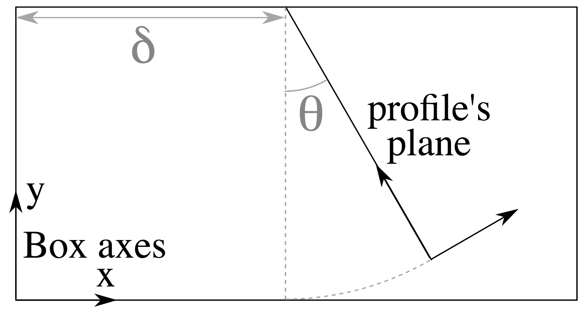

Laser propagation preprocessing
-----------------------------------

In Smilei, :ref:`Lasers` are provided as oscillating fields at the box boundaries.
For instance, at the ``xmin`` boundary of a 3D cartesian box, the user may define the
:math:`B_y(y,z,t)` and :math:`B_z(y,z,t)` profiles. But in some cases, the laser field
only known analytically at some arbitrary plane that does not coincide with the box
boundary. This appears typically in the case of tightly-focused beams that cannot be
described with a paraxial approximation.

At the beginning of the simulation (during the initialization), Smilei is able to perform
a laser *backwards* propagation from an arbitrary plane to the box boundary. The
calculated field is then injected from then boundary like a normal laser. From the user's
perspective, this simply requires the definition of the laser profile at some arbitrary
plane.

The general technique is taken from [Thiele2016]_ but it has been improved for parallel
computation in both 2D and 3D geometries. Further below, another improvement is presented:
the propagation towards a tilted plane.

----

Theoretical background
^^^^^^^^^^^^^^^^^^^^^^^^

The method employed for the propagation preprocessing is similar to the *angular spectrum
method*. We illustrate this method on an arbitrary scalar field :math:`A`, but it is
valid for all components of a field satisfying a wave equation:

  .. math::
  
    c^2 \Delta A(x,y,z,t) = \partial_t^2 A(x,y,z,t)

The 3D Fourier transform of this equation for the variables :math:`y`, :math:`z` and
:math:`t` gives:

  .. math::
  
    (\partial_x^2 + k_x^2) \hat A(x,k_y,k_z,\omega) = 0

where :math:`k_y`, :math:`k_z` and :math:`\omega` are the conjugate variables in the
frequency domain, and :math:`k_x(k_y,k_z,\omega) \equiv \sqrt{\omega^2/c^2-k_y^2-k_z^2}`.
This equation has general solutions proportional to :math:`\exp(-i k_x x)` for waves
propagating towards positive :math:`x`. This means that, if the profile is known at some
plane :math:`x=x_0+\delta`, the profile at :math:`x=x_0` is obtained after multiplying
:math:`\hat A` by :math:`\exp(i k_x \delta)`:

  .. math::
  
    \hat A(x_0,k_y,k_z,\omega) = \exp(i k_x \delta) \hat A(x_0+\delta,k_y,k_z,\omega)

To recover the field profile in real space, a 3D inverse Fourier transform would be
sufficient. However, storing all values of the :math:`(y,z,t)` profile would consume too
much time and disk space.
Instead, Smilei does only a 2D inverse Fourier transform on :math:`k_y` and
:math:`k_z`. This results in a :math:`\tilde A(y,z,\omega)` profile, where :math:`\omega` are
the temporal Fourier modes. Keeping only a few of these modes (the most intense ones)
ensures a reasonable disk space usage.

The full :math:`A(y,z,t)` profile is calculated during the actual PIC simulation, summing
over the different :math:`\omega`.

----

Numerical process
^^^^^^^^^^^^^^^^^^

Let us summarize how the calculation above is realized numerically. We suppose that the
grid is 3D cartesian with the number of cells :math:`(N_x, N_y, N_z)` in the three
directions, but the same process works in 2D. We write :math:`N_t` the total number of
timesteps.

**The points 1 to 7 are realized during initialization.**

.. rubric:: 1. The user profile :math:`B(y, z, t)` is sampled

..

  This profile corresponds to the magnetic field at the plane :math:`x=x_0+\delta`.
  Smilei calculates an array of size :math:`(N_y, N_z, N_t)` sampling
  this profile for all points of this plane, and all times of the simulation.

.. rubric:: 2. Smilei calculates the 3D Fourier transform along y, z and t

..

  Using the FFT capabilities of the *numpy* python package, a parallel Fourier transform
  is achieved, giving a transformed array of the same size :math:`(N_y, N_z, N_t)`.
  This array represents :math:`\hat B(k_y,k_z,\omega)`

.. rubric:: 3. Frequencies with the most intense values are selected

..

  Summing for all :math:`k_y` and :math:`k_z` provides a (temporal) spectrum of the wave.
  By default, the 100 frequencies giving the strongest values of this spectrum are kept,
  but this can be changed in the namelist (see :py:data:`keep_n_strongest_modes`).
  The resulting array is of size :math:`(N_y, N_z, 100)`.

.. rubric:: 4. The array is multiplied by the propagation term

..
  
  This term :math:`\exp(i k_x \delta)` depends on the coordinates of the array because
  :math:`k_x` is a function of :math:`k_y`, :math:`k_z` and :math:`\omega`.
  Note that the :math:`\delta` corresponds to the attribute :py:data:`offset`.

.. rubric:: 5. The inverse 2D Fourier transform is computed

..
  
  This provides an array representing :math:`\tilde B(y,z,\omega)`

.. rubric:: 6. The array is stored in an HDF5 file

..

  This file is named ``LaserOffset0.h5``, ``LaserOffset1.h5``, etc. if there are several
  lasers.

.. rubric:: 7. Each patch reads the part of the array that it owns

..

  This means that each patch of the PIC mesh will own a distinct portion of the overall
  array.

**The point 8 is realized at runtime, for each iteration.**

.. rubric:: 8. For each timestep, the laser profile is calculated

..

  The 100 selected modes are summed according to
  
  .. math::
  
    B(y,z,t) = f(y,z,t) \sum_\omega \left| \tilde B(y,z,\omega) \right| \sin\left(\omega t + \phi(y,z,\omega)\right)
    
  where :math:`\phi` is the complex argument of :math:`\tilde B` and :math:`f(y,z,t)` is
  an additional :py:data:`extra_envelope`, defined by the user.
  This envelope helps removing spurious repetitions of the laser pulse that can
  occur due to the limited number of frequencies that are kept.

----

Tilted plane
^^^^^^^^^^^^^

The method above describes a wave propagation between two parallel planes. In Smilei, a
technique inspired from [Matsushima2003]_ allows for the propagation from a title plane.

This rotation happens in the Fourier space: wave vectors :math:`k_x` and :math:`k_y` are
rotated around :math:`k_z` by an angle :math:`\theta`, according to

.. math::

  \begin{array}{rcl}
    k_x & = & k_x^\prime \cos\theta  - k_y^\prime \sin\theta \\
    k_y & = & k_x^\prime \sin\theta  + k_y^\prime \cos\theta \\
    k_z & = & k_z^\prime
  \end{array}

This transforms :math:`\hat A(x,k_y,k_z,\omega)` into
:math:`\hat A^\prime(x,k_y^\prime,k_z,\omega)`, thus the operation is merely a change of one
variable (:math:`k_y`).

Numerically, the process is not that straightforward because :math:`\hat A^\prime` is an
array in which the axis :math:`k_y^\prime` is linearly sampled, but the corresponding
values :math:`k_y` do not match this linear sampling. We developed an interpolation method
to obtain the transformed values at any point.

In the end, the prescribed laser profile lies in a plane located at a distance
:math:`\delta` and rotated around :math:`z` by an angle :math:`\theta`, according to the
following figure.

  
  The position of the plane where the laser profile is defined, with respect to the box.

----

References
^^^^^^^^^^

.. [Matsushima2003] `K. Matsushima et al., J. Opt. Soc. Am. A 20, 1755 (2003) <https://doi.org/10.1364/JOSAA.20.001755>`_ 

.. [Thiele2016] `I. Thiele et al., J. Comput. Phys. 321, 1110 (2016) <https://doi.org/10.1016/j.jcp.2016.06.004>`_

