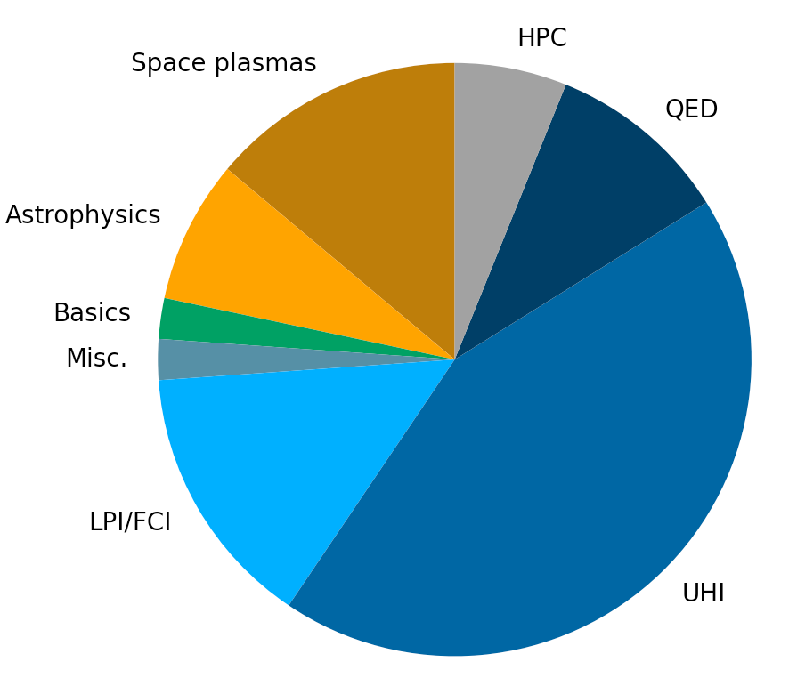

.. rst-class:: bigcitation

Publications
------------

.. rst-class:: emphlink

  Tip: :ref:`How should I cite Smilei in my publication? <HowToCite>`

.. rst-class:: emphlink

  Tip: :ref:`How can I add my publication to this list? <HowToListMyPaper>`

----

Reference article
^^^^^^^^^^^^^^^^^^^^^^^^^^^^^^

.. [Derouillat2018]

    J. Derouillat, A. Beck, F. Pérez, T. Vinci, M. Chiaramello, A. Grassi, M. Flé, G. Bouchard, I. Plotnikov, N. Aunai, J. Dargent, C. Riconda and M. Grech,
    `SMILEI: a collaborative, open-source, multi-purpose particle-in-cell code for plasma simulation`,
    `Comput. Phys. Commun. 222, 351-373 (2018) <https://doi.org/10.1016/j.cpc.2017.09.024>`_,
    `arXiv:1702.05128 <https://arxiv.org/abs/1702.05128>`_

----

Statement
^^^^^^^^^^^^^^^^^^^^^^^^^^^^^^

In what follows, we provide a list of papers using Smilei.
Only papers published in peer-reviewed journals are listed.

So far (November 2021), 90 papers have been published covering a broad range of topics, from laser-plasma interaction (LPI) 
[for inertial fusion (FCI), ultra-high intensity (UHI) applications, or the study of quantum electrodynamics effect (QED) processes in plasmas],
to the study of astrophysical and space plasmas. The figure below gives an *indicative* repartition of the papers per topic.

.. _fig_paper_topics:

----

Papers using Smilei
^^^^^^^^^^^^^^^^^^^^

.. READ THIS 
   There is now a utility to add new entries to this list.
   Use the python script doc/doi2publications.py to generate entries from a DOI number, and paste them here.

.. [Yao2021]

  W. Yao, A. Fazzini, S. N. Chen, K. Burdonov, P. Antici, J. Béard, S. Bolaños, A. Ciardi, R. Diab, E. D. Filippov, S. Kisyov, V. Lelasseux, M. Miceli, Q. Moreno, V. Nastasa, S. Orlando, S. Pikuz, D. C. Popescu, G. Revet, X. Ribeyre, E. d’Humières and J. Fuchs,
  `Laboratory evidence for proton energization by collisionless shock surfing`,
  `Nat. Phys. 17, 1177-1182 (2021) <http://dx.doi.org/10.1038/s41567-021-01325-w>`_

.. [Pérez2021]

  F. Pérez, F. Amiranoff, C. Briand, S. Depierreux, M. Grech, L. Lancia, P. Loiseau, J.-R. Marquès, C. Riconda and T. Vinci,
  `Numerical study of Langmuir wave coalescence in laser-plasma interaction`,
  `Physics of Plasmas 28, 043102 (2021) <http://dx.doi.org/10.1063/5.0037028>`_

.. [Gelfer2021]

  E G Gelfer, A M Fedotov and S Weber,
  `Radiation induced acceleration of ions in a laser irradiated transparent foil`,
  `New J. Phys. 23, 095002 (2021) <http://dx.doi.org/10.1088/1367-2630/ac1a97>`_
  `arXiv:1907.02621 <https://arxiv.org/abs/1907.02621>`_

.. [Siminos2021]

  E. Siminos, I. Thiele and C. Olofsson,
  `Laser Wakefield Driven Generation of Isolated Carrier-Envelope-Phase Tunable Intense Subcycle Pulses`,
  `Phys. Rev. Lett. 126, 044801 (2021) <http://dx.doi.org/10.1103/PhysRevLett.126.044801>`_
  `arXiv:1902.05014 <https://arxiv.org/abs/1902.05014>`_

.. [Budriga2020]

  O. Budriga, L. E. Ionel, D. Tatomirescu and K. A. Tanaka,
  `Enhancement of laser-focused intensity greater than 10 times through a re-entrant cone in the petawatt regime`,
  `Optics Letters 45, 3454 (2020) <https://doi.org/10.1364/OL.395316>`_

.. [Nghiem2020]

  P. A. P. Nghiem, R. Assmann, A. Beck et al., 
  `Toward a plasma-based accelerator at high beam energy with high beam charge and high beam quality`,
  `Phys. Rev. Accel. Beams 23, 031301 (2020) <https://doi.org/10.1103/PhysRevAccelBeams.23.031301>`_

.. [Pisarczyk2020]

  T. Pisarczyk, M. Kalal, S. Yu. Gus'kov et al.,
  `Hot electron retention in laser plasma created under terawatt subnanosecond irradiation of Cu targets`,
  `Plasma Phys. Control. Fusion 62, 115020 (2020) <https://doi.org/10.1088/1361-6587/abb74b>`_

.. [Pagano2020]

  I. Pagano, J. Brooks, A. Bernstein, R. Zgadzaj, J. Leddy, J. Cary and M. C. Downer,
  `Low Density Plasma Waveguides Driven by Ultrashort (30 fs) and Long (300 ps) Pulses for Laser Wakefield Acceleration`,
  `2018 IEEE Advanced Accelerator Concepts Workshop (AAC), 1 <https://doi.org/10.1109/AAC.2018.8659410>`_

.. [Ruyer2020]

  C. Ruyer, A. Debayle, P. Loiseau, M. Casanova and P. E. Masson-Laborde,
  `Kinetic analytical modeling of Gaussian pulse beam-bending including the transient regime`,
  `Physics of Plasmas 27, 102105 (2020) <https://doi.org/10.1063/5.0016214>`_

.. [Peng2020]

  H. Peng, C. Riconda, M. Grech, C.-T. Zhou and S. Weber,
  `Dynamical aspects of plasma gratings driven by a static ponderomotive potential`,
  `Plasma Phys. Control. Fusion 62, 115015 (2020) <https://doi.org/10.1088/1361-6587/abb3aa>`_

.. [Glek2020]

  P. B. Glek, A. A. Voronin, V. Ya. Panchenko and A. M. Zheltikov,
  `Relativistic electron bunches locked to attosecond optical field waveforms: an attosecond light–matter bound state`,
  `Laser Phys. Lett. 17 055401 (2020) <https://doi.org/10.1088/1612-202X/ab7827>`_

.. [Margarone2020]

  D. Margarone, A. Morace, J. Bonvalet et al.,
  `Generation of α-Particle Beams With a Multi-kJ, Peta-Watt Class Laser System`,
  `Front. Phys. 8, 343 (2020) <https://doi.org/10.3389/fphy.2020.00343>`_

.. [Sinha2020]

  U. Sinha and N. Kumar,
  `Pair-beam propagation in a magnetized plasma for modeling the polarized radiation emission from gamma-ray bursts in laboratory astrophysics experiments`,
  `Phys. Rev. E 101, 063204 (2020) <https://doi.org/10.1103/PhysRevE.101.063204>`_

.. [Mitrofanov2020]

  A. V. Mitrofanov, D. A. Sidorov-Biryukov, P. B. Glek, M. V. Rozhko, E. A. Stepanov, A. D. Shutov, S. V. Ryabchuk, A. A. Voronin, A. B. Fedotov, and A. M. Zheltikov,
  `Chirp-controlled high-harmonic and attosecond-pulse generation via coherent-wake plasma emission driven by mid-infrared laser pulses`,
  `Optics Letters 45, 750 (2020) <https://doi.org/10.1364/OL.45.000750>`_

.. [Spiers2020]

  B. T. Spiers, M. P. Hill, C. Brown, L. Ceurvorst, N. Ratan, A. F. Savin, P. Allan, E. Floyd, J. Fyrth, L. Hobbs, S. James, J. Luis, M. Ramsay, N. Sircombe, J. Skidmore, R. Aboushelbaya, M. W. Mayr, R. Paddock, R. H. W. Wang and P. A. Norreys,
  `Whole-beam self-focusing in fusion-relevant plasma`,
  `Phil. Trans. R. Soc. A379, 20200159 <https://doi.org/10.1098/rsta.2020.0159>`_

.. [Derouillat2020]

  J. Derouillat and A. Beck,
  `Single Domain Multiple Decompositions for Particle-in-Cell simulations`,
  `J. Phys.: Conf. Ser. 1596, 012052 (2020) <http://dx.doi.org/10.1088/1742-6596/1596/1/012052>`_
  `arXiv:1912.04064 <https://arxiv.org/abs/1912.04064>`_

.. [Zemzemi2020]

  I. Zemzemi, F. Massimo and A. Beck,
  `Azimuthal decomposition study of a realistic laser profile for efficient modeling of Laser WakeField Acceleration`,
  `J. Phys.: Conf. Ser. 1596, 012055 (2020) <https://doi.org/10.1088/1742-6596/1596/1/012054>`_

.. [Massimo2020b]

  F. Massimo, I. Zemzemi, A. Beck, J. Derouillat and A. Specka,
  `Efficient cylindrical envelope modeling for laser wakefield acceleration`,
  `J. Phys.: Conf. Ser. 1596, 012054 (2020) <http://dx.doi.org/10.1088/1742-6596/1596/1/012055>`_
  `arXiv:1912.04674 <https://arxiv.org/abs/1912.04674>`_

.. [Massimo2020a]

  F. Massimo, A. Beck, J. Derouillat, I. Zemzemi and A. Specka,
  `Numerical modeling of laser tunneling ionization in particle-in-cell codes with a laser envelope model`,
  `Phys. Rev. E 102, 033204 (2020) <http://dx.doi.org/10.1103/PhysRevE.102.033204>`_
  `arXiv:2006.04433 <https://arxiv.org/abs/2006.04433>`_

.. [Marcowith2020]

  Alexandre Marcowith, Gilles Ferrand, Mickael Grech, Zakaria Meliani, Illya Plotnikov and Rolf Walder,
  `Multi-scale simulations of particle acceleration in astrophysical systems`,
  `Living Rev Comput Astrophys 6, 1 (2020) <http://dx.doi.org/10.1007/s41115-020-0007-6>`_
  `arXiv:2002.09411 <https://arxiv.org/abs/2002.09411>`_

.. [Dargent2020]

  J. Dargent, N. Aunai, B. Lavraud, S. Toledo‐Redondo and F. Califano,
  `Simulation of Plasmaspheric Plume Impact on Dayside Magnetic Reconnection`,
  `Geophys. Res. Lett. 47, 2019GL086546 (2020) <http://dx.doi.org/10.1029/2019GL086546>`_
  `arXiv:2002.02243 <https://arxiv.org/abs/2002.02243>`_

.. [Sundström2020b]

  A. Sundström, L. Gremillet, E. Siminos and I. Pusztai,
  `Collisional effects on the electrostatic shock dynamics in thin-foil targets driven by an ultraintense short pulse laser`,
  `Plasma Phys. Control. Fusion 62, 085015 (2020) <https://doi.org/10.1088/1361-6587/ab9a62>`_

.. [Sundström2020a]

  A. Sundström, L. Gremillet, E. Siminos and I. Pusztai,
  `Fast collisional electron heating and relaxation in thin foils driven by a circularly polarized ultraintense short-pulse laser`,
  `J. Plasma Phys. 86, 755860201 (2020) <http://dx.doi.org/10.1017/S0022377820000264>`_
  `arXiv:1911.09562 <https://arxiv.org/abs/1911.09562>`_

.. [Gelfer2020]

  E. G. Gelfer, A. M. Fedotov, O. Klimo and S. Weber,
  `Absorption and opacity threshold for a thin foil in a strong circularly polarized laser field`,
  `Phys. Rev. E 101, 033204 (2020) <http://dx.doi.org/10.1103/PhysRevE.101.033204>`_
  `arXiv:1906.05902 <https://arxiv.org/abs/1906.05902>`_

.. [Ferri2020]

  J. Ferri, I. Thiele, E. Siminos, L. Gremillet, E. Smetanina, A. Dmitriev, G. Cantono, C.-G. Wahlström and T. Fülöp,
  `Enhancement of laser-driven ion acceleration in non-periodic nanostructured targets`,
  `J. Plasma Phys. 86, 905860101 (2020) <http://dx.doi.org/10.1017/S0022377819000898>`_
  `arXiv:1905.11131 <https://arxiv.org/abs/1905.11131>`_

.. [Marques2019]

  J.-R. Marquès, L. Lancia, T. Gangolf, M. Blecher, S. Bolaños, J. Fuchs, O. Willi, F. Amiranoff, R. L. Berger, M. Chiaramello, S. Weber, and C. Riconda,
  `Joule-Level High-Efficiency Energy Transfer to Subpicosecond Laser Pulses by a Plasma-Based Amplifier`,
  `Phys. Rev. X 9, 021008 (2019) <https://doi.org/10.1103/PhysRevX.9.021008>`_

.. [Plotnikov2019]
  I. Plotnikov and L. Sironi,
  `The synchrotron maser emission from relativistic shocks in Fast Radio Bursts: 1D PIC simulations of cold pair plasmas`,
  `Monthly Notices of the Royal Astronomical Society 485, 3816 (2019) <https://doi.org/10.1093/mnras/stz640>`_

.. [Dargent2019b]

  J. Dargent, N. Aunai, B. Lavraud, S. Toledo-Redondo and F. Califano,
  `Signatures of Cold Ions in a Kinetic Simulation of the Reconnecting Magnetopause`,
  `Journal of Geophysical Research: Space Physics, 124, 2497 (2019) <https://doi.org/10.1029/2018JA026343>`_

.. [Dargent2019a]

  J. Dargent, F. Lavorenti, F. Califano, P. Henri, F. Pucci and S. S. Cerri,
  `Interplay between Kelvin–Helmholtz and lower-hybrid drift instabilities`, 
  `Journal of Plasma Physics 85, 805850601 <https://doi.org/10.1017/S0022377819000758>`_

.. [Geng2019]

  X. S. Geng, L. L. Ji, B. F. Shen et al.,
  `Quantum reflection above the classical radiation-reaction barrier in the quantum electro-dynamics regime`,
  `Commun. Phys. 2, 66 (2019) <https://doi.org/10.1038/s42005-019-0164-2>`_  

.. [Sinha2019]

  U. Sinha, C. H. Keitel, and N. Kumar,
  `Polarized Light from the Transportation of a Matter-Antimatter Beam in a Plasma`,
  `Phys. Rev. Lett. 122, 204801 (2019) <https://doi.org/10.1103/PhysRevLett.122.204801>`_

.. [Malko2019]

  S. Malko, X. Vaisseau, F. Perez, D. Batani, A. Curcio, M. Ehret, J. Honrubia, K. Jakubowska, A. Morace, J. J. Santos and L. Volpe, 
  `Enhanced relativistic-electron beam collimation using two consecutive laser pulses`, 
  `Sci Rep 9, 14061 (2019) <https://doi.org/10.1038/s41598-019-50401-y>`_

.. [Peng2019]

  H. Peng, C. Riconda, M. Grech, J.-Q. Su and S. Weber,
  `Nonlinear dynamics of laser-generated ion-plasma gratings: A unified description`,
  `Phys. Rev. E 100, 061201 (2019) <http://dx.doi.org/10.1103/PhysRevE.100.061201>`_
  `arXiv:1911.03440 <https://arxiv.org/abs/1911.03440>`_

.. [Fang2019]

  Jun Fang, Chun-Yan Lu, Jing-Wen Yan and Huan Yu,
  `Early acceleration of electrons and protons at the nonrelativistic quasiparallel shocks with different obliquity angles`,
  `Res. Astron. Astrophys. 19, 182 (2019) <http://dx.doi.org/10.1088/1674-4527/19/12/182>`_
  `arXiv:1908.08170 <https://arxiv.org/abs/1908.08170>`_

.. [Yoon2019b]

  Young Dae Yoon and Paul M. Bellan,
  `Kinetic Verification of the Stochastic Ion Heating Mechanism in Collisionless Magnetic Reconnection`,
  `ApJ 887, L29 (2019) <http://dx.doi.org/10.3847/2041-8213/ab5b0a>`_

.. [Yoon2019a]

  Young Dae Yoon and Paul M. Bellan,
  `The electron canonical battery effect in magnetic reconnection: Completion of the electron canonical vorticity framework`,
  `Physics of Plasmas 26, 100702 (2019) <http://dx.doi.org/10.1063/1.5122225>`_

.. [Massimo2019]

  F Massimo, A Beck, J Derouillat, M Grech, M Lobet, F Pérez, I Zemzemi and A Specka,
  `Efficient start-to-end 3D envelope modeling for two-stage laser wakefield acceleration experiments`,
  `Plasma Phys. Control. Fusion 61, 124001 (2019) <http://dx.doi.org/10.1088/1361-6587/ab49cf>`_
  `arXiv:1912.04127 <https://arxiv.org/abs/1912.04127>`_

.. [Beck2019]

  A. Beck, J. Derouillat, M. Lobet, A. Farjallah, F. Massimo, I. Zemzemi, F. Perez, T. Vinci and M. Grech,
  `Adaptive SIMD optimizations in particle-in-cell codes with fine-grain particle sorting`,
  `Computer Physics Communications 244, 246-263 (2019) <http://dx.doi.org/10.1016/j.cpc.2019.05.001>`_
  `arXiv:1810.03949 <https://arxiv.org/abs/1810.03949>`_

.. [Pérez2019]

  F. Pérez and M. Grech,
  `Oblique-incidence, arbitrary-profile wave injection for electromagnetic simulations`,
  `Phys. Rev. E 99, 033307 (2019) <http://dx.doi.org/10.1103/PhysRevE.99.033307>`_
  `arXiv:1809.04435 <https://arxiv.org/abs/1809.04435>`_

.. [Thiele2019]

  I. Thiele, E. Siminos and T. Fülöp,
  `Electron Beam Driven Generation of Frequency-Tunable Isolated Relativistic Subcycle Pulses`,
  `Phys. Rev. Lett. 122, 104803 (2019) <http://dx.doi.org/10.1103/PhysRevLett.122.104803>`_
  `arXiv:1806.04976 <https://arxiv.org/abs/1806.04976>`_

.. [Massimo2018]

  F. Massimo, A. Beck, A. Specka, I. Zemzemi, J. Derouillat, M. Grech and F. Pérez,
  `Efficient Modeling of Laser Wakefield Acceleration Through the PIC Code Smilei in CILEX Project`,
  `Proc. 13th International Computational Accelerator Physics Conference (ICAP'18), Key West, FL, USA, 20-24 October 2018 <https://doi.org/10.18429/JACoW-ICAP2018-MOPAG02>`_

.. [ToledoRedondo2018]

  S. Toledo-Redondo, J. Dargent, N. Aunai, B. Lavraud, M. André, W. Li, B. Giles, P.-A. Lindvist, R. E. Ergun, C. T. Russel and J. L. Burch,
  `Perpendicular Current Reduction Caused by Cold Ions of Ionospheric Origin in Magnetic Reconnection at the Magnetopause: Particle-in-Cell Simulations and Spacecraft Observations`,
  `Geophys. Res. Lett. 45, 10,033 (2018)  <https://doi.org/10.1029/2018GL079051>`_

.. [Gelfer2018]

  E. Gelfer, N. Elkina and A. Fedotov,
  `Unexpected impact of radiation friction: enhancing production of longitudinal plasma waves`,
  `Sci. Rep. 8, 6478 (2018) <https://doi.org/10.1038/s41598-018-24930-x>`_

.. [Niel2018b]

  F Niel, C Riconda, F Amiranoff, M Lobet, J Derouillat, F Pérez, T Vinci and M Grech,
  `From quantum to classical modeling of radiation reaction: a focus on the radiation spectrum`,
  `Plasma Phys. Control. Fusion 60, 094002 (2018) <http://dx.doi.org/10.1088/1361-6587/aace22>`_
  `arXiv:1802.02927 <https://arxiv.org/abs/1802.02927>`_

.. [Plotnikov2018]

  Illya Plotnikov, Anna Grassi and Mickael Grech,
  `Perpendicular relativistic shocks in magnetized pair plasma`,
  `Monthly Notices of the Royal Astronomical Society 477, 5238-5260 (2018) <http://dx.doi.org/10.1093/mnras/sty979>`_
  `arXiv:1712.02883 <https://arxiv.org/abs/1712.02883>`_

.. [Niel2018a]

  F. Niel, C. Riconda, F. Amiranoff, R. Duclous and M. Grech,
  `From quantum to classical modeling of radiation reaction: A focus on stochasticity effects`,
  `Phys. Rev. E 97, 043209 (2018) <http://dx.doi.org/10.1103/PhysRevE.97.043209>`_
  `arXiv:1707.02618 <https://arxiv.org/abs/1707.02618>`_

.. [Grassi2017b]

  A. Grassi, M. Grech, F. Amiranoff, A. Macchi and C. Riconda,
  `Radiation-pressure-driven ion Weibel instability and collisionless shocks`,
  `Phys. Rev. E 96, 033204 (2017) <http://dx.doi.org/10.1103/PhysRevE.96.033204>`_
  `arXiv:1705.05402 <https://arxiv.org/abs/1705.05402>`_

.. [Fedeli2017]

  L Fedeli, A Formenti, L Cialfi, A Sgattoni, G Cantono and M Passoni,
  `Structured targets for advanced laser-driven sources`,
  `Plasma Phys. Control. Fusion 60, 014013 (2017) <http://dx.doi.org/10.1088/1361-6587/aa8a54>`_

.. [Golovanov2017]

  A. A. Golovanov, I. Yu. Kostyukov, J. Thomas and A. Pukhov,
  `Analytic model for electromagnetic fields in the bubble regime of plasma wakefield in non-uniform plasmas`,
  `Physics of Plasmas 24, 103104 (2017) <http://dx.doi.org/10.1063/1.4996856>`_

.. [Dargent2017]

  J. Dargent, N. Aunai, B. Lavraud, S. Toledo-Redondo, M. A. Shay, P. A. Cassak and K. Malakit,
  `Kinetic simulation of asymmetric magnetic reconnection with cold ions`,
  `J. Geophys. Res. Space Physics 122, 5290-5306 (2017) <http://dx.doi.org/10.1002/2016JA023831>`_

.. [Grassi2017a]

  A. Grassi, M. Grech, F. Amiranoff, F. Pegoraro, A. Macchi and C. Riconda,
  `Electron Weibel instability in relativistic counterstreaming plasmas with flow-aligned external magnetic fields`,
  `Phys. Rev. E 95, 023203 (2017) <http://dx.doi.org/10.1103/PhysRevE.95.023203>`_

.. [Dargent2016]

  J. Dargent, N. Aunai, G. Belmont, N. Dorville, B. Lavraud and M. Hesse,
  `Full particle-in-cell simulations of kinetic equilibria and the role of the initial current sheet on steady asymmetric magnetic reconnection`,
  `J. Plasma Phys. 82, 905820305 (2016) <http://dx.doi.org/10.1017/S002237781600057X>`_

.. [Chiaramello2016]

  M. Chiaramello, C. Riconda, F. Amiranoff, J. Fuchs, M. Grech, L. Lancia, J.-R. Marquès, T. Vinci and S. Weber,
  `Optimization of interaction conditions for efficient short laser pulse amplification by stimulated Brillouin scattering in the strongly coupled regime`,
  `Physics of Plasmas 23, 072103 (2016) <http://dx.doi.org/10.1063/1.4955322>`_

.. [Beck2016]

  A. Beck, J.T. Frederiksen and J. Dérouillat,
  `Load management strategy for Particle-In-Cell simulations in high energy particle acceleration`,
  `Nucl. Inst. Meth. in Phys. Res. A 829, 418-421 (2016) <http://dx.doi.org/10.1016/j.nima.2016.03.112>`_

.. [Lancia2016]

  L. Lancia, A. Giribono, L. Vassura, M. Chiaramello, C. Riconda, S. Weber, A. Castan, A. Chatelain, A. Frank, T. Gangolf, M. N. Quinn, J. Fuchs and J.-R. Marquès,
  `Signatures of the Self-Similar Regime of Strongly Coupled Stimulated Brillouin Scattering for Efficient Short Laser Pulse Amplification`,
  `Phys. Rev. Lett. 116, 075001 (2016) <http://dx.doi.org/10.1103/PhysRevLett.116.075001>`_
