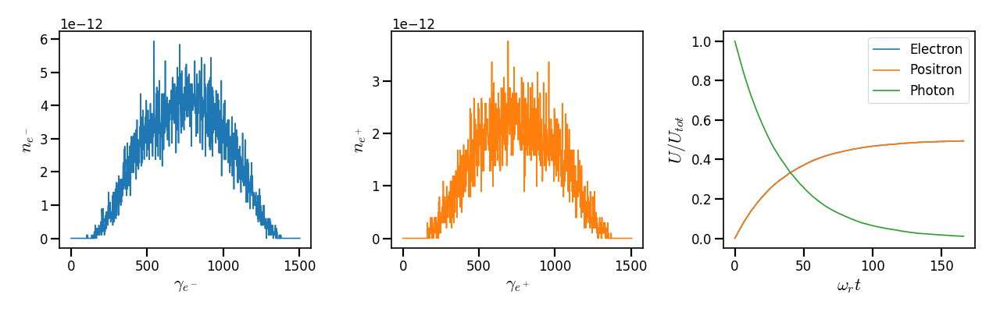
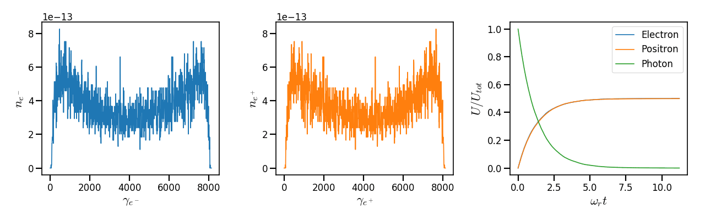
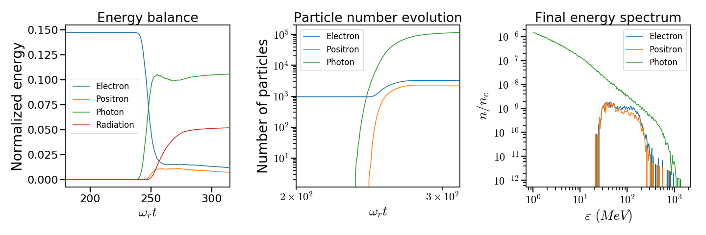

.. _multiphotonBreitWheelerPage:

Multiphoton Breit-Wheeler pair creation
--------------------------------------------------------------------------------

The multiphoton Breit-Wheeler (:math:`\gamma + n\omega \rightarrow e^- + e^+`),
also referred to as
the nonlinear Breit-Wheeler, corresponds to the decay of a
high-energy photon into a pair of electron-positron
when interacting with a strong electromagnetic field.

In the vacuum, the electromagnetic field becomes nonlinear from the Schwinger
electric field :math:`E_s = 1.3 \times 10^{18}\ \mathrm{V/m}` corresponding
to an intensity of :math:`10^{29}\ \mathrm{Wcm^{-2}}` for
:math:`\lambda = 1\ \mu m`. In such a field, spontaneous apparitions of electron-positron pairs from
the nonlinear vacuum are possible. If this field is not reachable in the laboratory
frame, it will be very close in the boosted frame of highly-accelerated electrons. At
:math:`10^{24}\ \mathrm{Wcm^{-2}}`, a Lorentz factor of :math:`\gamma \sim 10^5`
is required to reach the Schwinger limit.
This is the reason why quantum electrodynamics effects and in particular strong-
field pair generation is accessible with the extreme-intensity lasers (multipetawatt lasers).

As for electrons or positrons, the strength of QED effects depends
on the photon quantum parameter:

.. math::
  :label: photonQuantumParameter

  \chi_\gamma = \frac{\gamma_\gamma}{E_s} \sqrt{ \left( \mathbf{E}_\perp
  + \mathbf{c} \times \mathbf{B} \right)^2 }

where
:math:`\gamma_\gamma = \varepsilon_\gamma / m_e c^2` is the photon normalized energy,
:math:`m_e` the electron mass,
:math:`c` the speed of light in vacuum,
:math:`\mathbf{E}_\perp` is the electric field orthogonal to
the propagation direction of the photon,
:math:`\mathbf{B}` the magnetic field.

--------------------------------------------------------------------------------

Physical model
^^^^^^^^^^^^^^^^^^^^^^^^^^^^^^^^^^^^^^^^^^^^^^^^^^^^^^^^^^^^^^^^^^^^^^^^^^^^^^^^

The energy distribution of the production rate of pairs by a hard photon
is given by the Ritus formulae

.. math::
  :label: BWEnergyDistribution

  \frac{d^2N_{BW}}{d \chi_{\pm} dt} = \frac{\alpha_f m_e^2 c^4}{\pi \sqrt{3} \hbar \varepsilon_\gamma \chi_\gamma}
  \int_{x}^{+\infty}{\sqrt{s} K_{1/3} \left( \frac{2}{3} s^{3/2} \right) ds - \left( 2 - \chi_\gamma x^{3/2} \right) K_{2/3} \left( \frac{2}{3} x^{3/2} \right) }

where :math:`x = \left( \chi_\gamma / (\chi_{-} \chi_{+}) \right)^{2/3}`.
The parameters :math:`\chi_{-}` and :math:`\chi_{+}` are the respective Lorentz
invariant of the electron and the positron after pair creation.
Furthermore, one has :math:`\chi_- = \chi_\gamma - \chi_+` meaning that :math:`\chi_-`
and :math:`\chi_+` can be interchanged.

The total production rate of pairs can be written

.. math::
  :label: BWproductionRate

  \frac{dN_{BW}}{dt} = \frac{\alpha_f m_e^2 c^4}{ \hbar \varepsilon_\gamma} \chi_\gamma T \left( \chi_\gamma \right)

where

.. math::
  :label: BWTfunction

  T \left( \chi_\gamma \right) = \frac{1}{\pi \sqrt{3} \chi_\gamma^2 }
  \int_{0}^{+\infty}{\int_{x}^{+\infty}{\sqrt{s} K_{1/3} \left( \frac{2}{3} s^{3/2}
  \right) ds - \left( 2 - \chi_\gamma x^{3/2} \right) K_{2/3} \left( \frac{2}{3} x^{3/2} \right) }} d\chi_-

A photon of energy :math:`\varepsilon_\gamma` traveling in a constant electric field :math:`E` has a Lorentz
parameter equal to :math:`\chi_\gamma = \varepsilon_\gamma E / (E_s m_e c^2)`.

We consider the case where photon interact in a constant uniform electric field.
For a field of amplitude :math:`E = 500 m_e \omega c / e`, the energy
distribution and the production rate of pair creation as a function of :math:`\chi_\gamma` are
plotted in :numref:`synchrotron_pairs_dNdt`. It shows that the total production
rate of electron-positron pairs rises rapidly to reach a peak around
:math:`\chi_\gamma = 10` with almost a pair generated per femtosecond.
Under :math:`\chi_\gamma = 0.1`, the production rate is very weak with
less than a pair after 100 picoseconds of interaction.
Above :math:`\chi_\gamma = 10`, the production decreases slowly with
:math:`\chi_\gamma`.

The right subplot in :numref:`synchrotron_pairs_dNdt` gives the probability
for a photon to decay into a pair as a function of the energy given to the electron
(using approximation :math:`\chi_\gamma / \chi_- = \gamma_\gamma / \gamma_-`)
for a field of amplitude :math:`E = 500 m_e \omega c / e`.
It can also be seen as the pair creation energy distribution.
The distribution is symmetric with respect to :math:`\chi_- / \chi_\gamma = 1/2`.
Below :math:`\chi_\gamma = 10`, The maximum probability corresponds to
equal electron-positron energies :math:`\chi_- = \chi_+ = \chi_\gamma / 2`.
Above this threshold, the energy dispersion increases with :math:`\chi_\gamma`.

.. _synchrotron_pairs_dNdt:

.. figure:: _static/synchrotron_pairs_dNdt.png
  :width: 18cm

  (left) - Normalized total pair production distribution given by Eq. :eq:`BWproductionRate`.
  (right) - Normalized pair creation :math:`\chi` distribution given by Eq. :eq:`BWEnergyDistribution`.

--------------------------------------------------------------------------------

.. _BWStochasticSchemeSection:

Stochastic scheme
^^^^^^^^^^^^^^^^^^^^^^^^^^^^^^^^^^^^^^^^^^^^^^^^^^^^^^^^^^^^^^^^^^^^^^^^^^^^^^^^

The Multiphoton Breit-Wheeler is treated with a Monte-Carlo process similar
to the nonlinear inverse Compton Scattering
(see :ref:`the radiation reaction page <radiationReactionPage>`).
It is close to what has been done in
[Duclous2011]_, [Lobet2013]_, [Lobet2015]_.

The first preliminary step consists
on introducing the notion of macro-photon. Macro-photons are simply the equivalent of
macro-particles (see :ref:`the macro-particle section <QuasiParticlesSection>`)
extended to photons.
There are defined by a charge and a mass equal to 0. The momentum is substituted
by the photon momentum :math:`\mathbf{p}_\gamma = \hbar \mathbf{k}` where
:math:`\mathbf{k}` is the wave vector.
The momentum contains the photon energy so that
:math:`\mathbf{p}_\gamma = \gamma_\gamma m_e \mathbf{c}`.
The definition of the photon Lorentz factor is therefore also slightly different
than particles.

1. An incremental optical depth :math:`\tau`, initially set to 0, is assigned to the macro-photon.
Decay into pairs occurs when it reaches the final optical depth :math:`\tau_f`
sampled from :math:`\tau_f = -\log{(\xi)}` where :math:`\xi` is a random number in :math:`\left]0,1\right]`.

2. The optical depth :math:`\tau` evolves according to the photon quantum parameter
following:

.. math::
  :label: mBW_MCDtauDt

  \frac{d\tau}{dt} = \frac{dN_{BW}}{dt}\left( \chi_\gamma \right)

that is also the production rate of pairs
(integration of Eq. :eq:`BWEnergyDistribution`).

3. The emitted electron's quantum parameter :math:`\chi_-` is computed by
inverting the cumulative distribution function:

.. math::
  :label: mBW_CumulativeDistr

  P(\chi_-,\chi_\gamma) = \frac{\displaystyle{\int_0^{\chi_-}{
  \frac{d^2N_{BW}}{d \chi dt} d\chi}}}{\displaystyle{\int_0^{\chi_\gamma}{\frac{d^2N_{BW}}{d \chi dt} d\chi}}}

The inversion of  :math:`P(\chi_-,\chi_\gamma)=\xi'` is done after drawing
a second random number
:math:`\xi' \in \left[ 0,1\right]` to find :math:`\chi_-`.
The positron quantum parameter is :math:`\chi_+ = \chi_\gamma - \chi_-`.

4. The energy of the emitted electron is then computed:
:math:`\varepsilon_- = mc^2 \gamma_- = mc^2 \left[ 1 + \left(\gamma_\gamma - 2\right) \chi_- / \chi_\gamma \right]`.
If :math:`\gamma_\gamma < 2`, the pair creation is not possible since the photon
energy is below the rest mass of the particles.

5. The photon momentum is then updated.
Propagation direction is the same as for the photon. Pairs are created at the
same position as for the photon. The weight is conserved. It is possible to
create more than a macro-electron or a macro-positron in order to improve
the phenomenon statistics. In this case, the weight of each macro-particle is
the photon weight divided by the number of emissions.

--------------------------------------------------------------------------------

Implementation
^^^^^^^^^^^^^^^^^^^^^^^^^^^^^^^^^^^^^^^^^^^^^^^^^^^^^^^^^^^^^^^^^^^^^^^^^^^^^^^^

C++ classes for the multiphoton Breit-Wheeler process are located
in the directory ``src/MultiphotonBreitWheeler``.
In :program:`Smilei`, the multiphoton Breit-Wheeler process is not incorporated
in the photon pusher in order to preserve vector performance of the latter one.

Description of the files:

* Class ``MultiphotonBreitWheelerTables``: this class contains the methods to generate the tables,
  to output them, to read them and to broadcast them among MPI tasks.
  It also contains methods to get values from the tables for the Monte-Carlo process.
* Class ``MultiphotonBreitWheeler``: this class contains the methods to
  perform the Breit-Wheeler Monte-Carlo process described in :ref:`the previous section <BWStochasticSchemeSection>`).
* Class ``MultiphotonBreitWheelerFactory``: this class is supposed to
  manage the different Breit-Wheeler algorithms.
  For the moment, only one model is implemented.

Formula :eq:`BWTfunction` and :eq:`mBW_CumulativeDistr` are tabulated
at the beginning of the simulation because of the cost of their computation
for each photon.
The parameters such as the table ranges and discretization can be
given in the :ref:`MultiphotonBreitWheeler <MultiphotonBreitWheeler>` namelist section.
Once generated, the table can be written on the disk and reloaded for a next run.
Small tables coded in hdf5 are provided in the repository in the folder
databases with the name: `multiphoton_Breit_Wheeler_tables.h5`.

If the multiphoton Breit-Wheeler is activated for a photon species, the factory
will initialize the instance ``Multiphoton_Breit_Wheeler_process`` of
the class ``MultiphotonBreitWheeler``
declared in the corresponding ``species`` (see ``species.cpp``).

The multiphoton Breit-Wheeler Monte-Carlo process is performed in the method ``dynamics`` of ``species``.
It is called after the particle field interpolation (field gathering),
after ionization and radiation reaction and before the particle pusher.
At this stage, the new particles are stored in a temporary buffer called ``new_pair``.
This is an array of two instances of ``Particles``.
It is declared in ``Multiphoton_Breit_Wheeler_process``.
Particles are imported in the main species particle arrays
(``particles`` object in ``species``) only after the current deposition
and before the boundary conditions using the method ``importParticles``
of the class ``Particles``.

--------------------------------------------------------------------------------

Benchmarks
^^^^^^^^^^^^^^^^^^^^^^^^^^^^^^^^^^^^^^^^^^^^^^^^^^^^^^^^^^^^^^^^^^^^^^^^^^^^^^^^

Synchrotron, 2D
""""""""""""""""""""""""""""""""""""""""""""""""""""""""""""""""""""""""""""""""

In this configuration, a mono-energetic bunch of photons is initialized
in a constant uniform strong magnetic field.
The photons decay into pairs via the multiphoton Breit-Wheeler progressively.
In this particular case, the generated electrons and positrons do not radiate
in order to capture the emission energy spectrum.
Two cases are simulated with different
initial quantum parameters:

* Case 1: :math:`\chi_{\gamma,0} = 1`, :math:`B = 270`, :math:`\gamma_{\gamma,0} = 1500`
* Case 2: :math:`\chi_{\gamma,0} = 20`, :math:`B = 1000`, :math:`\gamma_{\gamma,0} = 8125`

The results of the first case are shown in
:numref:`synchrotron_pairs_energy_spectra_chi1`. The two first figures
represent respectively the electron (left) and the positron energy (center) spectrum at the end
of the simulation when all photons have been converted into pairs.
The last one on the right is the time evolution of the photon (green), electron (blue),
positron (orange) and total (black) kinetic energy.
The quantum parameter of all photons is initially equal to
:math:`\chi_{\gamma,0} = 1`. According to :numref:`synchrotron_pairs_dNdt`,
we are located in an area of the energy distribution where electrons and
positrons are more likely to be created with almost the same energy
(:math:`\chi_{+} = \chi_{-} =\chi_{\gamma,0} /2`).
This is confirmed in :numref:`synchrotron_pairs_energy_spectra_chi1`.
Electron and positron energy spectra are well similar, symmetric and centered
at half the initial photon energy equal to :math:`\gamma = 750`.
The energy balance (right figure) shows that positron and electron kinetic energies
have the same behaviors and converge to half the initial photon energy
at the end of the simulation.
The total energy is well constant and conserved in time.

.. _synchrotron_pairs_energy_spectra_chi1:

  (left) - Electron energy spectrum at the end of the run.
  (middle) - Positron energy spectrum at the end of the run.
  (right) - Time evolution of the photon (green), electron (blue), positron
  (orange) and total (black) normalized energy :math:`U / U_{tot}`.

The results of the second case are shown in
:numref:`synchrotron_pairs_energy_spectra_chi20` as for the first case.
Here, the quantum parameter of all photons is initially equal to
:math:`\chi_{\gamma,0} = 20`. This means that contrary to the previous case,
the probability to generate electrons and positrons of similar energy
is not the most significant.
As in :numref:`synchrotron_pairs_dNdt`, the energy spectra exhibit two maximums.
This maximums are located approximately at 10% and 90% of the initial photon
energy of :math:`\gamma_{\gamma,0} = 8125`.
Electron and positron spectra are nonetheless similar and symmetric in respect
to half the initial photon energy.
Again, the energy balance (right figure) shows that positron and electron kinetic energies
have the same behaviors and converge to half the initial photon energy
at the end of the simulation.
The total energy is well constant and conserved in time.

.. _synchrotron_pairs_energy_spectra_chi20:

  (left) - Electron energy spectrum at the end of the run.
  (middle) - Positron energy spectrum at the end of the run.
  (right) - Time evolution of the photon (green), electron (blue)
  and positron (orange)
  normalized energy :math:`U / U_{tot}`.

The benchmark ``tst2d_10_multiphoton_Breit_Wheeler`` is very close to
the second case presented here.

Counter-propagating plane wave, 1D
""""""""""""""""""""""""""""""""""""""""""""""""""""""""""""""""""""""""""""""""

In this test case, a bunch of electrons is initialized at the right side
of the domain with an initial energy of 4 GeV. The bunch is made to collide head-on
with a laser plane wave injected from the left side of the domain.
The laser has a maximal intensity of :math:`10^{23}\ \mathrm{Wcm^{-2}}`.
It is circularly polarized and has a temporal Gaussian profile with a
FWHM (full width at half maximum) of 10 periods
(approximately corresponding to 33 fs).
A wavelength of :math:`1\ \mathrm{\mu m}` is considered.

This configuration is one of the most efficient to trigger QED effects
since it maximizes the particle and photon quantum parameters.

By interacting with the laser pulse, the high-energy electron will first
radiate high-energy gamma photons that will be generated as macro-photons by the code
via the nonlinear Compton scattering.
These photons are generated in the same direction of the electrons with an energy up
to almost the electron kinetic energy.
Then, the macro-photons interact in turn with the laser field and can decay
into electron-positron pairs via the multiphoton Breit-Wheeler process.

The first plot on left of :numref:`counter_pair_smilei` shows the energy
balance of the simulation.
The second plot on the center of :numref:`counter_pair_smilei` shows the
time evolution of the number of macro-electrons, macro-positrons and macro-photons.
The electron bunch energy rapidly drops
after entering the laser field around :math:`t = 240 \omega_r^{-1}`.
At the same time, many macro-photons are generated by the particle number evolution
as shown in :numref:`counter_pair_smilei`. The photon energy therefore rapidly rises
as the electron energy decreases.

.. _counter_pair_smilei:

  (left) - Energy balance of the simulation. In the legend, **Photon** represents the macro-photon
  energy and **Radiation** represents the radiated energy excluding the macro-photons.
  (center) - Time evolution of the number of macro-electrons (blue),
  macro-positrons (orange) and macro-photons (green) in the simulation.
  (right) - Final energy spectrum of the electrons (blue), positrons (orange),
  and photons (green).

The multiphoton Breit-Wheeler generation of electron-positron starts latter
when emitted macro-photons enters the high-intensity region of the laser.
This is revealed by the yield of macro-positron.
When electrons and positrons have lost sufficient energy, they can not produce
macro-photons anymore and radiated energy is therefore added directly
in the energy balance.
This is shown by the red curve of the energy balance of :numref:`counter_pair_smilei`.
The radiated energy rises after the main phase of the macro-photon generation after
:math:`t = 250 \omega_r^{-1}`. The radiated energy contains the energy from
the continuous radiation reaction model and from the discontinuous Monte-Carlo
if the energy of the emitted photon is below :math:`\gamma = 2`.
Under this threshold, the photon can not decay into electron-positron pair.
It is therefore useless and costly to generated a macro-photon.

The final electron, positron and photon energy spectra are shown in
the right plot of :numref:`counter_pair_smilei`. At the end of the simulation,
the photon spectrum is a broad decreasing profile ranging from 1 MeV to 1 GeV.
This is the consequence of two main facts:

* The highest is the photon energy, more important is the probability to decay into pairs.
* As electron and positron lose energy, they continue to radiate smaller ans smaller photon energy.

Electron and positron spectra are very similar ranging from 20 MeV
to mainly 200 MeV.
Few particles have an energy above this threshold up to 1 GeV.

This corresponds to the benchmark ``benchmark/tst1d_10_pair_electron_laser_collision.py``.
