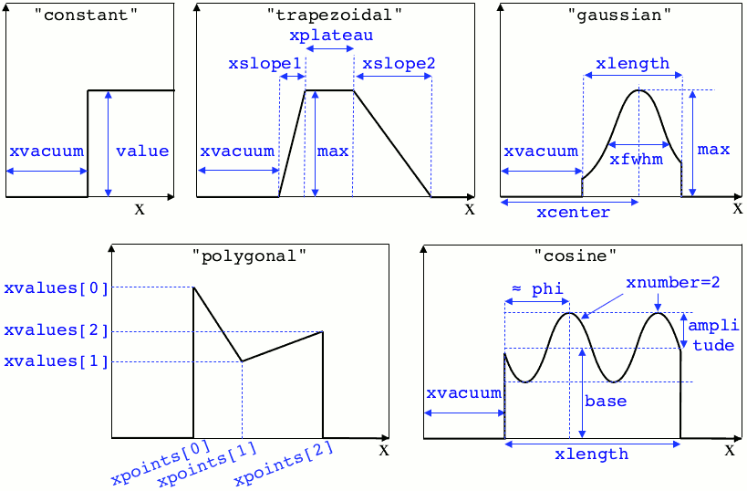
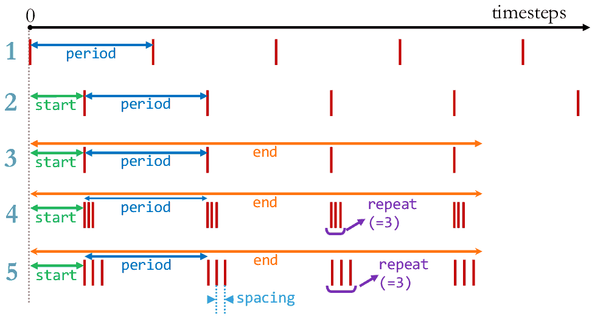

Write a namelist
----------------

Before you run :program:`Smilei`, you need a *namelist* (an input file). The namelist
is written in the *python* language. It is thus recommended to know the basics of *python*.

We suggest you copy one existing namelist from the folder *benchmarks*.
All namelists have the extension ``.py``.

----

General rules
^^^^^^^^^^^^^

* :program:`Smilei` requires a few *blocks* to be defined, such as::

    Main(
        # ...
        timestep = 0.01,         # defines the timestep value
        grid_length = [10., 20.], # defines the 2D box dimensions
        # ...
    )

  Outside blocks, you can calculate anything you require.
  Inside a block, you must only define variables for :program:`Smilei`.

* The *python* syntax requires special indentation of each line.
  You begin with no indentation, but you have to **add four spaces at the
  beginning of lines inside a group**, and so on.
  For instance::

    if a == 0:
        timestep = 0.1
        if b == 1:
            timestep = 0.2
    else:
        timestep = 0.3

* You will need to use `lists <https://docs.python.org/2/tutorial/introduction.html#lists>`_,
  which are series of things in *python*,
  defined between brackets ``[]`` and separated by commas.
  For example, ``mean_velocity = [0., 1.1, 3.]``.

* You are free to import any installed *python* package into the namelist.
  For instance, you may obtain :math:`\pi` using ``from math import pi``.

* All quantities are normalized to arbitrary values: see :doc:`units`.

----

Python workflow
^^^^^^^^^^^^^^^

*Python* is started at the beginning of the simulation (one *python* interpreter
for each MPI process). The following steps are executed:

#. A few variables from :program:`Smilei` are passed to *python* so that they are
   available to the user:

   * The rank of the current MPI process as :py:data:`smilei_mpi_rank`.
   * The total number of MPI processes as :py:data:`smilei_mpi_size`.
   * The maximum random integer as :py:data:`smilei_rand_max`.

#. The namelist(s) is executed.

#. *Python* runs :py:data:`preprocess()` if the user has defined it.
   This is a good place to calculate things that are not needed for
   post-processing with :program:`happi`.

#. The simulation is initialized (including field and particle arrays).

#. *Python* runs :py:data:`cleanup()` if the user has defined it.
   This is a good place to delete unused heavy variables.

#. *Python* checks whether the *python* interpreter is needed during the simulation
   (e.g. the user has defined a temporal :ref:`profile <profiles>` which requires *python*
   to calculate it every timestep). Otherwise, *python* is stopped.

All these instructions are summarized in a file ``smilei.py``,
so that the user can directly run ``python -i smilei.py`` for post-processing purposes.

----

Main variables
^^^^^^^^^^^^^^

The block ``Main`` is **mandatory** and has the following syntax::

  Main(
      geometry = "1Dcartesian",
      interpolation_order = 2,
      grid_length  = [16. ],
      cell_length = [0.01],
      simulation_time    = 15.,
      timestep    = 0.005,
      number_of_patches = [64],
      clrw = 5,
      maxwell_solver = 'Yee',
      EM_boundary_conditions = [
          ["silver-muller", "silver-muller"],
  #        ["silver-muller", "silver-muller"],
  #        ["silver-muller", "silver-muller"],
      ],
      time_fields_frozen = 0.,
      reference_angular_frequency_SI = 0.,
      print_every = 100,
      random_seed = 0,
  )

.. py:data:: geometry

  The geometry of the simulation:

  * ``"1Dcartesian"``
  * ``"2Dcartesian"``
  * ``"3Dcartesian"``
  * ``"AMcylindrical"``: cylindrical geometry with azimuthal Fourier decomposition. See :doc:`algorithms`.

  In the following documentation, all references to dimensions or coordinates
  depend on the ``geometry``.
  1D, 2D and 3D stand for 1-dimensional, 2-dimensional and 3-dimensional cartesian
  geometries, respectively. All coordinates are ordered as :math:`(x)`, :math:`(x,y)` or :math:`(x,y,z)`.
  In the ``"AMcylindrical"`` case, all grid coordinates are 2-dimensional
  :math:`(x,r)`, while particle coordinates (in :ref:`Species`)
  are expressed in the 3-dimensional Cartesian frame :math:`(x,y,z)`.

  .. warning::

    The ``"AMcylindrical"`` geometry is currently proposed in alpha version.
    It has not been thoroughly tested and only Fields diagnostics are available.
    Boundary conditions must be set to ``"remove"`` for particles,
    ``"silver-muller"`` for longitudinal EM boundaries and
    ``"buneman"`` for transverse EM boundaries.
    Vectorization, checkpoints, load balancing, ionization, collisions and
    order-4 interpolation are not supported yet.

.. py:data:: interpolation_order

  :default: ``2``

  Interpolation order, defines particle shape function:

  * ``2``  : 3 points stencil, supported in all configurations.
  * ``4``  : 5 points stencil, not supported in vectorized 2D geometry.

.. py:data:: grid_length
             number_of_cells

  A list of numbers: size of the simulation box for each dimension of the simulation.
   * Either ``grid_length``, the simulation length in each direction in units of :math:`L_r`,
   * or ``number_of_cells``, the number of cells in each direction.

.. py:data:: cell_length

  A list of floats: sizes of one cell in each direction in units of :math:`L_r`.

.. py:data:: simulation_time
             number_of_timesteps

  Duration of the simulation.
    * Either ``simulation_time``, the simulation duration in units of :math:`T_r`,
    * or ``number_of_timesteps``, the total number of timesteps.

.. py:data:: timestep
             timestep_over_CFL

  Duration of one timestep.
    * Either ``timestep``, in units of :math:`T_r`,
    * or ``timestep_over_CFL``, in units of the *Courant–Friedrichs–Lewy* (CFL) time.

.. py:data:: number_of_patches

  A list of integers: the number of patches in each direction.
  Each integer must be a power of 2, and the total number of patches must be
  greater or equal than the number of MPI processes.
  It is also strongly advised to have more patches than the total number of openMP threads.
  See :doc:`parallelization`.

.. py:data:: patch_arrangement

  :default: ``"hilbertian"``

  Determines the ordering of patches and the way they are separated into the
  various MPI processes. Options are:

  * ``"hilbertian"``: following the Hilbert curve (see :ref:`this explanation<LoadBalancingExplanation>`).
  * ``"linearized_XY"`` in 2D or ``"linearized_XYZ"`` in 3D: following the
    row-major (C-style) ordering.
  * ``"linearized_YX"`` in 2D or ``"linearized_ZYX"`` in 3D: following the
    column-major (fortran-style) ordering. This prevents the usage of
    :ref:`Fields diagnostics<DiagFields>` (see :doc:`parallelization`).

.. py:data:: clrw

  :default: set to minimize the memory footprint of the particles pusher, especially interpolation and projection processes

  For advanced users. Integer specifying the cluster width along X direction in number of cells.
  The "cluster" is a sub-patch structure in which particles are sorted for cache improvement.
  ``clrw`` must divide the number of cells in one patch (in dimension X).
  The finest sorting is achieved with ``clrw=1`` and no sorting with ``clrw`` equal to the full size of a patch along dimension X.
  The cluster size in dimension Y and Z is always the full extent of the patch.

.. py:data:: maxwell_solver

  :default: 'Yee'

  The solver for Maxwell's equations. Only ``"Yee"`` is available for all geometries at the moment. ``"Cowan"``, ``"Grassi"`` and ``"Lehe"`` are available for ``2DCartesian`` and ``"Lehe"`` is available for ``3DCartesian``. The Lehe solver is described in `this paper <https://journals.aps.org/prab/abstract/10.1103/PhysRevSTAB.16.021301>`_

.. py:data:: solve_poisson

   :default: True

   Decides if Poisson correction must be applied or not initially.

.. py:data:: poisson_max_iteration

  :default: 50000

  Maximum number of iteration for the Poisson solver.

.. py:data:: poisson_max_error

  :default: 1e-14

  Maximum error for the Poisson solver.

.. py:data:: solve_relativistic_poisson

   :default: False

   Decides if relativistic Poisson problem must be solved for at least one species.
   See :doc:`relativistic_fields_initialization` for more details.

.. py:data:: relativistic_poisson_max_iteration

  :default: 50000

  Maximum number of iteration for the Poisson solver.

.. py:data:: relativistic_poisson_max_error

  :default: 1e-22

  Maximum error for the Poisson solver.

.. py:data:: EM_boundary_conditions

  :type: list of lists of strings
  :default: ``[["periodic"]]``

  The boundary conditions for the electromagnetic fields. Each boundary may have one of
  the following conditions: ``"periodic"``, ``"silver-muller"``, or ``"reflective"``.

  | **Syntax 1:** ``[[bc_all]]``, identical for all boundaries.
  | **Syntax 2:** ``[[bc_X], [bc_Y], ...]``, different depending on x, y or z.
  | **Syntax 3:** ``[[bc_Xmin, bc_Xmax], ...]``,  different on each boundary.

  ``"silver-muller"`` is an open boundary condition. The incident wave vector :math:`k_{inc}` on each face is defined by ``"EM_boundary_conditions_k"``.
  When using ``"silver-muller"`` as an injecting boundary, make sure :math:`k_{inc}` is aligned with the wave you are injecting.
  When using ``"silver-muller"`` as an absorbing boundary, the optimal wave absorption on a given face will be along :math:`k_{abs}` the specular reflection of :math:`k_{inc}` on the considered face.

.. py:data:: EM_boundary_conditions_k

  :type: list of lists of floats
  :default: ``[[1.,0.],[-1.,0.],[0.,1.],[0.,-1.]]`` in 2D
  :default: ``[[1.,0.,0.],[-1.,0.,0.],[0.,1.,0.],[0.,-1.,0.],[0.,0.,1.],[0.,0.,-1.]]`` in 3D

  The incident unit wave vector `k` for each face (sequentially Xmin, Xmax, Ymin, Ymax, Zmin, Zmax) is
  defined by its coordinates in the `xyz` frame.
  The number of coordinates is equal to the dimension of the simulation. The number of given vectors must be equal to 1 or to the number of faces which is twice the dimension of the simulation. In cylindrical geometry, `k` coordinates are given in the `xr` frame and only the Rmax face is affected.

  | **Syntax 1:** ``[[1,0,0]]``, identical for all boundaries.
  | **Syntax 2:** ``[[1,0,0],[-1,0,0], ...]``,  different on each boundary.

.. py:data:: time_fields_frozen

  :default: 0.

  Time, at the beginning of the simulation, during which fields are frozen.

.. _reference_angular_frequency_SI:

.. py:data:: reference_angular_frequency_SI

  The value of the reference angular frequency :math:`\omega_r` in SI units,
  **only needed when collisions, ionization, radiation losses
  or multiphoton Breit-Wheeler pair creation are requested**.
  This frequency is related to the normalization length according to :math:`L_r\omega_r = c`
  (see :doc:`units`).

.. py:data:: print_every

  Number of timesteps between each info output on screen. By default, 10 outputs per
  simulation.

.. py:data:: print_expected_disk_usage

  :default: `True`

  If `False`, the calculation of the expected disk usage, that is usually printed in the
  standard output, is skipped. This might be useful in rare cases where this calculation
  is costly.

.. py:data:: random_seed

  :default: the machine clock

  The value of the random seed. To create a per-processor random seed, you may use
  the variable  :py:data:`smilei_mpi_rank`.

.. py:data:: number_of_AM

  :default: 2

  The number of azimuthal modes used for the Fourier decomposition in ``"AMcylindrical"`` geometry.

.. py:data:: number_of_AM_relativistic_field_initialization

  :default: 1

  The number of azimuthal modes used for the relativistic field initialization in ``"AMcylindrical"`` geometry.
  Note that this number must be lower or equal to the number of modes of the simulation. 

----

Load Balancing
^^^^^^^^^^^^^^

Load balancing (explained :ref:`here <LoadBalancingExplanation>`) consists in exchanging
patches (domains of the simulation box) between MPI processes to reduce the
computational load imbalance.
The block ``LoadBalancing`` is optional. If you do not define it, load balancing will
occur every 150 iterations.

.. code-block:: python

  LoadBalancing(
      initial_balance = True,
      every = 150,
      cell_load = 1.,
      frozen_particle_load = 0.1
  )

.. py:data:: initial_balance

  :default: True

  Decides if the load must be balanced at initialization. If not, the same amount of
  patches will be attributed to each MPI rank.

.. py:data:: every

  :default: 150

  Number of timesteps between each load balancing **or** a :ref:`time selection <TimeSelections>`.
  The value ``0`` suppresses all load balancing.

.. py:data:: cell_load

  :default: 1.

  Computational load of a single grid cell considered by the dynamic load balancing algorithm.
  This load is normalized to the load of a single particle.

.. py:data:: frozen_particle_load

  :default: 0.1

  Computational load of a single frozen particle considered by the dynamic load balancing algorithm.
  This load is normalized to the load of a single particle.

----

.. _Vectorization:

Vectorization
^^^^^^^^^^^^^^^^^^^^^

The block ``Vectorization`` is optional.
It controls the SIMD operations that can enhance the performance of some computations.
The technique is detailed in Ref. [Beck]_ and summarized in :doc:`this doc <vectorization>`.
It requires :ref:`additional compilation options<vectorization_flags>` to be actived.

.. code-block:: python

  Vectorization(
      mode = "adaptive",
      reconfigure_every = 20,
      initial_mode = "on"
  )

.. py:data:: mode

  :default: ``"off"``

  * ``"off"``: non-vectorized operators are used.
    Recommended when the number of particles per cell stays below 10.
  * ``"on"``: vectorized operators are used.
    Recommended when the number of particles per cell stays above 10.
    Particles are sorted per cell.
  * ``"adaptive"``: the best operators (scalar or vectorized)
    are determined and configured dynamically and locally
    (per patch and per species).
    Particles are sorted per cell.

  In the ``"adaptive"`` mode, :py:data:`clrw` is set to the maximum.

.. py:data:: reconfigure_every

  :default: 20

  The number of timesteps between each dynamic reconfiguration of
  the vectorized operators, when using the  ``"adaptive"`` vectorization mode.
  It may be set to a :ref:`time selection <TimeSelections>` as well.

.. py:data:: initial_mode

  :default: ``off``

  Default state when the ``"adaptive"`` mode is activated
  and no particle is present in the patch.

----

.. _movingWindow:

Moving window
^^^^^^^^^^^^^

The simulated box can move relative to the initial plasma position. This "moving window"
basically consists in removing periodically some plasma from the ``x_min`` border and
adding new plasma after the ``x_max`` border, thus changing the physical domain that the
simulation represents but keeping the same box size. This is particularly useful to
*follow* plasma moving at high speed.

The block ``MovingWindow`` is optional. The window does not move it you do not define it.

.. code-block:: python

  MovingWindow(
      time_start = 0.,
      velocity_x = 1.,
  )

.. py:data:: time_start

  :default: 0.

  The time at which the window starts moving.

.. py:data:: velocity_x

  :default: 0.

  The velocity of the moving window in the `x` direction.

.. note::

  The :ref:`particle binning diagnostics <DiagParticleBinning>` accept an "axis" called ``moving_x``
  corresponding to the `x` coordinate corrected by the moving window's current movement.

----

.. _CurrentFilter:

Current filtering
^^^^^^^^^^^^^^^^^

The present version of :program:`Smilei` provides a :ref:`multi-pass binomial filter <multipassBinomialFilter>` on the current densities,
which parameters are controlled in the following block::

  CurrentFilter(
      model = "binomial",
      passes = 0,
  )

.. py:data:: model

  :default: ``"binomial"``

  The model for current filtering. Presently, only ``"binomial"`` current filtering is available.

.. py:data:: passes

  :default: ``0``

  The number of passes in the filter at each timestep.

----

.. _FieldFilter:

Field filtering
^^^^^^^^^^^^^^^^^

The present version of :program:`Smilei` provides a method for field filtering
(at the moment, only the :ref:`Friedman electric field time-filter <EfieldFilter>` is available)
which parameters are controlled in the following block::

  FieldFilter(
      model = "Friedman",
      theta = 0.,
  )

.. py:data:: model

  :default: ``"Friedman"``

  The model for field filtering. Presently, only ``"Friedman"`` field filtering is available.

.. py:data:: theta

  :default: ``0.``

  The :math:`\theta` parameter (between 0 and 1) of Friedman's method.

----

.. _Species:

Species
^^^^^^^

Each species has to be defined in a ``Species`` block::

  Species(
      name      = "electrons1",
      position_initialization = "random",
      momentum_initialization = "maxwell-juettner",
      particles_per_cell = 100,
      mass = 1.,
      atomic_number = None,
      #maximum_charge_state = None,
      number_density = 10.,
      # charge_density = None,
      charge = -1.,
      mean_velocity = [0.],
      temperature = [1e-10],
      boundary_conditions = [
          ["reflective", "reflective"],
      #    ["periodic", "periodic"],
      #    ["periodic", "periodic"],
      ],
      # thermal_boundary_temperature = None,
      # thermal_boundary_velocity = None,
      time_frozen = 0.0,
      # ionization_model = "none",
      # ionization_electrons = None,
      # ionization_rate = None,
      is_test = False,
      # ponderomotive_dynamics = False,
      c_part_max = 1.0,
      pusher = "boris",

      # Radiation reaction, for particles only:
      radiation_model = "none",
      radiation_photon_species = "photon",
      radiation_photon_sampling = 1,
      radiation_photon_gamma_threshold = 2,

      # Relativistic field initialization:
      relativistic_field_initialization = "False",

      # For photon species only:
      multiphoton_Breit_Wheeler = ["electron","positron"],
      multiphoton_Breit_Wheeler_sampling = [1,1]
  )

.. py:data:: name

  The name you want to give to this species.

.. py:data:: position_initialization

   The method for initialization of particle positions. Options are:

   * ``"regular"`` for regularly spaced
   * ``"random"`` for randomly distributed
   * ``"centered"`` for centered in each cell
   * The :py:data:`name` of another species from which the positions are copied.
     This option requires (1) that the *target* species' positions are initialized
     using one of the three other options above and (2) that the number of particles
     of both species are identical in each cell.
   * A *numpy* array defining all the positions of the species' particles.
     In this case you must also provide the weight of each particle (see :ref:`Weights`).
     The array shape must be `(Ndim+1, Npart)` where `Ndim` is the number of particle dimensions (of the particles),
     and `Npart` is the total number of particles. Positions components `x`, `y`, `z` are
     given along the first `Ndim` columns and the weights are given in the last column of the array.
     This initialization is incompatible with :py:data:`number_density`, :py:data:`charge_density`
     and :py:data:`particles_per_cell`. Particles initialized outside of the initial simulation domain
     will not be created. This initalization is disregarded when running a `restart`.

.. py:data:: momentum_initialization

  The method for initialization of particle momenta. Options are:

  * ``"maxwell-juettner"`` for a relativistic maxwellian (see :doc:`how it is done<maxwell-juttner>`)
  * ``"rectangular"`` for a rectangular distribution
  * ``"cold"`` for zero temperature
  * A *numpy* array defining all the momenta of the species' particles (requires that
    :py:data:`position_initialization` also be an array with the same number of particles).
    The array shape must be `(3, Npart)` where `Npart` is the total number of particles. Momentum components `px`, `py`, `pz`
    are given in successive columns.This initialization is incompatible with
    :py:data:`temperature` and :py:data:`mean_velocity`.

  The first 2 distributions depend on the parameter :py:data:`temperature` explained below.

.. py:data:: particles_per_cell

  :type: float or *python* function (see section :ref:`profiles`)

  The number of particles per cell.

.. py:data:: mass

  The mass of particles, in units of the electron mass :math:`m_e`.

.. py:data:: atomic_number

  :default: 0

  The atomic number of the particles, required only for ionization.
  It must be lower than 101.

.. py:data:: maximum_charge_state

  :default: 0

  The maximum charge state of a species for which the ionization model is ``"from_rate"``.

.. py:data:: number_density
             charge_density

  :type: float or *python* function (see section :ref:`profiles`)

  The absolute value of the number density or charge density (choose one only)
  of the particle distribution, in units of the reference density :math:`N_r` (see :doc:`units`).

.. py:data:: charge

  :type: float or *python* function (see section :ref:`profiles`)

  The particle charge, in units of the elementary charge :math:`e`.

.. py:data:: mean_velocity

  :type: a list of 3 floats or *python* functions (see section :ref:`profiles`)

  The initial drift velocity of the particles, in units of the speed of light :math:`c`.

  **WARNING**: For massless particles, this is actually the momentum in units of :math:`m_e c`.

.. py:data:: temperature

  :type: a list of 3 floats or *python* functions (see section :ref:`profiles`)

  The initial temperature of the particles, in units of :math:`m_ec^2`.

.. py:data:: boundary_conditions

  :type: a list of lists of strings
  :default: ``[["periodic"]]``

  The boundary conditions for the particles of this species.
  Each boundary may have one of the following conditions:
  ``"periodic"``, ``"reflective"``, ``"remove"`` (particles are deleted),
  ``"stop"`` (particle momenta are set to 0), and ``"thermalize"``.
  For photon species (``mass=0``), the last two options are not available.

  | **Syntax 1:** ``[[bc_all]]``, identical for all boundaries.
  | **Syntax 2:** ``[[bc_X], [bc_Y], ...]``, different depending on x, y or z.
  | **Syntax 3:** ``[[bc_Xmin, bc_Xmax], ...]``,  different on each boundary.

.. py:data:: thermal_boundary_temperature

  :default: None

  A list of floats representing the temperature of the thermal boundaries (those set to
  ``"thermalize"`` in  :py:data:`boundary_conditions`) for each spatial coordinate.
  Currently, only the first coordinate (x) is taken into account.

.. py:data:: thermal_boundary_velocity

  :default: []

  A list of floats representing the components of the drift velocity of
  the thermal boundaries (those set to ``"thermalize"`` in :py:data:`boundary_conditions`).

.. py:data:: time_frozen

  :default: 0.

  The time during which the particles are "frozen", in units of :math:`T_r`.
  Frozen particles do not move and therefore do not deposit any current either.
  They are computationally much cheaper than non-frozen particles and oblivious to any EM-fields
  in the simulation.

.. py:data:: ionization_model

  :default: ``"none"``

  The model for ionization:

  * ``"tunnel"`` for :ref:`field ionization <field_ionization>` (requires species with an :py:data:`atomic_number`)
  * ``"from_rate"``, relying on a :ref:`user-defined ionization rate <rate_ionization>` (requires species with a :py:data:`maximum_charge_state`).

.. py:data:: ionization_rate

  A python function giving the user-defined ionisation rate as a function of various particle attributes.
  To use this option, the `numpy package <http://www.numpy.org/>`_ must be available in your python installation.
  The function must have one argument, that you may call, for instance, ``particles``.
  This object has several attributes ``x``, ``y``, ``z``, ``px``, ``py``, ``pz``, ``charge``, ``weight`` and ``id``.
  Each of these attributes are provided as **numpy** arrays where each cell corresponds to one particle.

  The following example defines, for a species with maximum charge state of 2,
  an ionization rate that depends on the initial particle charge
  and linear in the x coordinate:

  .. code-block:: python

    from numpy import exp, zeros_like

    def my_rate(particles):
        rate = zeros_like(particles.x)
        charge_0 = (particles.charge==0)
        charge_1 = (particles.charge==1)
        rate[charge_0] = r0 * particles.x[charge_0]
        rate[charge_1] = r1 * particles.x[charge_1]
        return rate

    Species( ..., ionization_rate = my_rate )

.. py:data:: ionization_electrons

  The name of the electron species that :py:data:`ionization_model` uses when creating new electrons.

.. py:data:: is_test

  :default: ``False``

  Flag for test particles. If ``True``, this species will contain only test particles
  which do not participate in the charge and currents.

.. py:data:: ponderomotive_dynamics

  :default: ``False``

  Flag for particles interacting with an envelope model for the laser, if present.
  If ``True``, this species will project its susceptibility and be influenced by the laser envelope field.
  See :doc:`laser_envelope` for details on the dynamics of particles in presence of a laser envelope field.
.. note:: Ionization, Radiation and Multiphoton Breit-Wheeler pair creation are not yet implemented for species interacting with an envelope model for the laser.

.. py:data:: c_part_max

  :red:`to do`

.. py:data:: pusher

  :default: ``"boris"``

  Type of pusher to be used for this species. Options are:

  * ``"boris"``: The relativistic Boris pusher
  * ``"borisnr"``: The non-relativistic Boris pusher
  * ``"vay"``: The relativistic pusher of J. L. Vay
  * ``"higueracary"``: The relativistic pusher of A. V. Higuera and J. R. Cary
  * ``"norm"``:  For photon species only (rectilinear propagation)
  * ``"ponderomotive_boris"``: modified relativistic Boris pusher for species whose flag ``"ponderomotive_dynamics"`` is ``True``. Valid only if the species has non-zero mass

.. py:data:: radiation_model

  :default: ``"none"``

  The **radiation reaction** model used for this species (see :doc:`radiation_loss`).

  * ``"none"``: no radiation
  * ``"Landau-Lifshitz"`` (or ``ll``): Landau-Lifshitz model approximated for high energies
  * ``"corrected-Landau-Lifshitz"`` (or ``cll``): with quantum correction
  * ``""Niel"``: a `stochastic radiation model <https://arxiv.org/abs/1707.02618>`_ based on the work of Niel `et al.`.
  * ``"Monte-Carlo"`` (or ``mc``): Monte-Carlo radiation model. This model can be configured to generate macro-photons with :py:data:`radiation_photon_species`.

  This parameter cannot be assigned to photons (mass = 0).

  Radiation is emitted only with the ``"Monte-Carlo"`` model when
  :py:data:`radiation_photon_species` is defined.

.. py:data:: radiation_photon_species

  The :py:data:`name` of the photon species in which the Monte-Carlo :py:data:`radiation_model`
  will generate macro-photons. If unset (or ``None``), no macro-photon will be created.
  The *target* photon species must be have its mass set to 0, and appear *after* the
  particle species in the namelist.

  This parameter cannot be assigned to photons (mass = 0).

.. py:data:: radiation_photon_sampling

  :default: ``1``

  The number of macro-photons generated per emission event, when the macro-photon creation
  is activated (see :py:data:`radiation_photon_species`). The total macro-photon weight
  is still conserved.

  A large number may rapidly slow down the performances and lead to memory saturation.

  This parameter cannot be assigned to photons (mass = 0).

.. py:data:: radiation_photon_gamma_threshold

  :default: ``2``

  The threshold on the photon energy for the macro-photon emission when using the
  radiation reaction Monte-Carlo process.
  Under this threshold, the macro-photon from the radiation reaction Monte-Carlo
  process is not created but still taken into account in the energy balance.
  The default value corresponds to twice the electron rest mass energy that
  is the required energy to decay into electron-positron pairs.

  This parameter cannot be assigned to photons (mass = 0).

.. py:data:: relativistic_field_initialization

  :default: ``False``

  Flag for relativistic particles. If ``True``, the electromagnetic fields of this species will added to the electromagnetic fields already present in the simulation.
  This operation will be performed when time equals :py:data:`time_frozen`. See :doc:`relativistic_fields_initialization` for details on the computation of the electromagentic fields of a relativistic species.
  To have physically meaningful results, we recommend to place a species which requires this method of field initialization far from other species, otherwise the latter could experience instantly turned-on unphysical forces by the relativistic species' fields.

.. py:data:: multiphoton_Breit_Wheeler

  :default: ``[None,None]``

  An list of the :py:data:`name` of two species: electrons and positrons created through
  the :doc:`multiphoton_Breit_Wheeler`.
  By default, the process is not activated.

  This parameter can **only** be assigned to photons species (mass = 0).

.. py:data:: multiphoton_Breit_Wheeler_sampling

  :default: ``[1,1]``

  A list of two integers: the number of electrons and positrons generated per photon decay
  in the :doc:`multiphoton_Breit_Wheeler`. The total macro-particle weight is still
  conserved.

  Large numbers may rapidly slow down the performances and lead to memory saturation.

  This parameter can **only** be assigned to photons species (mass = 0).

----

.. _Lasers:

Lasers
^^^^^^

A laser consists in applying oscillating boundary conditions for the magnetic
field on one of the box sides. The only boundary condition that supports lasers
is ``"silver-muller"`` (see :py:data:`EM_boundary_conditions`).
There are several syntaxes to introduce a laser in :program:`Smilei`:

.. rubric:: 1. Defining a generic wave

..

  .. code-block:: python

    Laser(
        box_side = "xmin",
        space_time_profile = [ By_profile, Bz_profile ]
    )

  .. py:data:: box_side

    :default: ``"xmin"``

    Side of the box from which the laser originates: at the moment, only ``"xmin"`` and
    ``"xmax"`` are supported.

  .. py:data:: space_time_profile

    :type: A list of two *python* functions

    The full wave expression at the chosen box side. It is a list of **two** *python*
    functions taking several arguments depending on the simulation dimension:
    :math:`(t)` for a 1-D simulation, :math:`(y,t)` for a 2-D simulation (etc.)
    The two functions represent :math:`B_y` and :math:`B_z`, respectively.

.. rubric:: 2. Defining the wave envelopes

..

  .. code-block:: python

    Laser(
        box_side       = "xmin",
        omega          = 1.,
        chirp_profile  = tconstant(),
        time_envelope  = tgaussian(),
        space_envelope = [ By_profile  , Bz_profile   ],
        phase          = [ PhiY_profile, PhiZ_profile ],
        delay_phase    = [ 0., 0. ]
    )

  This implements a wave of the form:

  .. math::

    B_y(\mathbf{x}, t) = S_y(\mathbf{x})\; T\left(t-t_{0y}\right)
    \;\sin\left( \omega(t) t - \phi_y(\mathbf{x}) \right)

    B_z(\mathbf{x}, t) = S_z(\mathbf{x})\; T\left(t-t_{0z}\right)
    \;\sin\left( \omega(t) t - \phi_z(\mathbf{x}) \right)

  where :math:`T` is the temporal envelope, :math:`S_y` and :math:`S_z` are the
  spatial envelopes, :math:`\omega` is the time-varying frequency,
  :math:`\phi_y` and :math:`\phi_z` are the phases, and we defined the delays
  :math:`t_{0y} = (\phi_y(\mathbf{x})-\varphi_y)/\omega(t)` and
  :math:`t_{0z} = (\phi_z(\mathbf{x})-\varphi_z)/\omega(t)`.

  .. py:data:: omega

    :default: 1.

    The laser angular frequency.

  .. py:data:: chirp_profile

    :type: a *python* function or a :ref:`time profile <profiles>`
    :default: ``tconstant()``

    The variation of the laser frequency over time, such that
    :math:`\omega(t)=\mathtt{omega}\times\mathtt{chirp\_profile}(t)`.

  .. warning::

    This definition of the chirp profile is not standard.
    Indeed, :math:`\omega(t)` as defined here **is not** the instantaneous frequency, :math:`\omega_{\rm inst}(t)`,
    which is obtained from the time derivative of the phase :math:`\omega(t) t`.

    Should one define the chirp as :math:`C(t) = \omega_{\rm inst}(t)/\omega` (with :math:`\omega` defined by the input
    parameter :math:`\mathtt{omega}`), the user can easily obtain the corresponding chirp profile as defined in
    :program:`Smilei` as:

    .. math::

        \mathtt{chirp\_profile}(t) = \frac{1}{t} \int_0^t dt' C(t')\,.

    Let us give as an example the case of a *linear chirp*, with the instantaneous frequency
    :math:`\omega_{\rm inst}(t) = \omega [1+\alpha\,\omega(t-t_0)]`.
    :math:`C(t) = 1+\alpha\,\omega(t-t_0)`. The corresponding input chirp profile reads:

    .. math::

        \mathtt{chirp\_profile}(t) = 1 - \alpha\, \omega t_0 + \frac{\alpha}{2} \omega t

    Similarly, for a *geometric (exponential) chirp* such that :math:`\omega_{\rm inst}(t) = \omega\, \alpha^{\omega t}`,
    :math:`C(t) = \alpha^{\omega t}`, and the corresponding input chirp profile reads:

    .. math::

        \mathtt{chirp\_profile}(t) = \frac{\alpha^{\omega t} - 1}{\omega t \, \ln \alpha}\,.

  .. py:data:: time_envelope

    :type: a *python* function or a :ref:`time profile <profiles>`
    :default:  ``tconstant()``

    The temporal envelope of the laser.

  .. py:data:: space_envelope

    :type: a list of two *python* functions or two :ref:`spatial profiles <profiles>`
    :default: ``[ 1., 0. ]``

    The two spatial envelopes :math:`S_y` and :math:`S_z`.

  .. py:data:: phase

    :type: a list of two *python* functions or two :ref:`spatial profiles <profiles>`
    :default: ``[ 0., 0. ]``

    The two spatially-varying phases :math:`\phi_y` and :math:`\phi_z`.

  .. py:data:: delay_phase

    :type: a list of two floats
    :default: ``[ 0., 0. ]``

    An extra phase for the time envelopes of :math:`B_y` and :math:`B_z`. Useful in the
    case of elliptical polarization where the two temporal profiles might have a slight
    delay due to the mismatched :py:data:`phase`.

.. rubric:: 3. Defining a 1D planar wave

..

  For one-dimensional simulations, you may use the simplified laser creator::

    LaserPlanar1D(
        box_side         = "xmin",
        a0               = 1.,
        omega            = 1.,
        polarization_phi = 0.,
        ellipticity      = 0.,
        time_envelope    = tconstant()
    )

  .. py:data:: a0

    :default: 1.

    The normalized vector potential

  .. py:data:: polarization_phi

    :default: 0.

    The angle of the polarization ellipse major axis relative to the X-Y plane, in radians.

  .. py:data:: ellipticity

    :default: 0.

    The polarization ellipticity: 0 for linear and :math:`\pm 1` for circular.

.. rubric:: 4. Defining a 2D gaussian wave

..

  For two-dimensional simulations, you may use the simplified laser creator::

    LaserGaussian2D(
        box_side         = "xmin",
        a0               = 1.,
        omega            = 1.,
        focus            = [50., 40.],
        waist            = 3.,
        incidence_angle  = 0.,
        polarization_phi = 0.,
        ellipticity      = 0.,
        time_envelope    = tconstant()
    )

  .. py:data:: focus

    :type: A list of two floats ``[X, Y]``

    The ``X`` and ``Y`` positions of the laser focus.

  .. py:data:: waist

    The waist value. Transverse coordinate at which the field is at 1/e of its maximum value.

  .. py:data:: incidence_angle

    :default: 0.

    The angle of the laser beam relative to the X axis, in radians.

  .. py:data:: time_envelope

     Time envelope of the field (not intensity).

.. rubric:: 5. Defining a gaussian wave with Azimuthal Fourier decomposition

..

  For simulations with ``"AMcylindrical"`` geometry, you may use the simplified laser creator::

    LaserGaussianAM(
        box_side         = "xmin",
        a0               = 1.,
        omega            = 1.,
        focus            = [50., 40., 40.],
        waist            = 3.,
        incidence_angle  = [0., 0.1],
        polarization_phi = 0.,
        ellipticity      = 0.,
        time_envelope    = tconstant()
    )

  This is almost the same as ``LaserGaussian2D``, with the ``focus`` parameter having
  now 3 elements (focus position in 3D), and the ``incidence_angle`` being a list of
  two angles, corresponding to rotations around `y` and `z`, respectively.

.. rubric:: 6. Defining a 3D gaussian wave

..

  For three-dimensional simulations, you may use the simplified laser creator::

    LaserGaussian3D(
        box_side         = "xmin",
        a0               = 1.,
        omega            = 1.,
        focus            = [50., 40., 40.],
        waist            = 3.,
        incidence_angle  = [0., 0.1],
        polarization_phi = 0.,
        ellipticity      = 0.,
        time_envelope    = tconstant()
    )

  This is almost the same as ``LaserGaussian2D``, with the ``focus`` parameter having
  now 3 elements (focus position in 3D), and the ``incidence_angle`` being a list of
  two angles, corresponding to rotations around `y` and `z`, respectively.

.. rubric:: 7. Defining a generic wave at some distance from the boundary

..

  In some cases, the laser field is not known at the box boundary, but rather at some
  plane inside the box. Smilei can pre-calculate the corresponding wave at the boundary
  using the *angular spectrum method*. This technique is only available in 2D and 3D
  cartesian geometries and requires the python packages *numpy*.
  A :doc:`detailed explanation <laser_offset>` of the method is available.
  The laser is introduced using::

    LaserOffset(
        box_side               = "xmin",
        space_time_profile     = [ By_profile, Bz_profile ],
        offset                 = 10.,
        extra_envelope          = tconstant(),
        keep_n_strongest_modes = 100,
        angle = 10./180.*3.14159
    )

  .. py:data:: space_time_profile

    :type: A list of two *python* functions

    The magnetic field profiles at some arbitrary plane, as a function of space and time.
    The arguments of these profiles are ``(y,t)`` in 2D and ``(y,z,t)`` in 3D.

  .. py:data:: offset

     The distance from the box boundary to the plane where :py:data:`space_time_profile`
     is defined.

  .. py:data:: extra_envelope

    :type: a *python* function or a :ref:`python profile <profiles>`
    :default:  ``lambda *z: 1.``, which means a profile of value 1 everywhere

    An extra envelope applied at the boundary, on top of the :py:data:`space_time_profile`.
    This envelope takes two arguments (`y`, `t`) in 2D, and three arguments (`y`, `z`, `t`)
    in 3D.
    As the wave propagation technique stores a limited Fourier transform (in the time
    domain) of the wave, some periodicity can be obtained in the actual laser.
    One may thus observe that the laser pulse is repeated several times.
    The envelope can be used to remove these spurious repetitions.

  .. py:data:: keep_n_strongest_modes

    :default: 100

    The number of temporal Fourier modes that are kept during the pre-processing.
    See :doc:`this page <laser_offset>` for more details.

  .. py:data:: angle

    :default: 0.

    Angle between the boundary and the profile's plane, the rotation being around :math:`z`.
    See :doc:`this page <laser_offset>` for more details.

----

.. _laser_envelope:

Laser envelope model
^^^^^^^^^^^^^^^^^^^^^^

In the geometries ``"1Dcartesian"``, ``"2Dcartesian"``, ``"3Dcartesian"`` it is possible to model a laser pulse propagating in the ``x`` direction through an envelope model (see :doc:`laser_envelope` for the advantages and limits of this approximation).
The fast oscillations of the laser are neglected and all the physical quantities of the simulation, including the electromagnetic fields and their source terms, as well as the particles positions and momenta, are meant as an average over one or more optical cycles.
Effects involving characteristic lengths comparable to the laser central wavelength (i.e. sharp plasma density profiles) cannot be modeled with this option.

For the moment the only way to specify a laser pulse through this model in :program:`Smilei` is through a gaussian beam (cylindrically symmetric for the geometries ``"2Dcartesian"``, ``"3Dcartesian"``). Currently only one laser pulse can be specified through the envelope model in a simulation, thus multi-pulse set-ups cannot be defined.
Contrarily to a standard Laser initialized throught the Silver-Müller boundary conditions, the laser envelope will be entirely initialized inside the simulation box at the start of the simulation.

Following is the laser envelope creator in 1D ::

    LaserEnvelopePlanar1D(
        a0              = 1.,
        time_envelope   = tgaussian(center=150., fwhm=40.),
        envelope_solver = 'explicit',
        Envelope_boundary_conditions = [ ["reflective"] ],
    )

Following is the laser envelope creator in 2D ::

    LaserEnvelopeGaussian2D(
        a0              = 1.,
        focus           = [150., 40.],
        waist           = 30.,
        time_envelope   = tgaussian(center=150., fwhm=40.),
        envelope_solver = 'explicit',
        Envelope_boundary_conditions = [ ["reflective"] ],
    )

Following is the laser envelope creator in 3D ::

    LaserEnvelopeGaussian3D(
        a0              = 1.,
        focus           = [150., 40., 40.],
        waist           = 30.,
        time_envelope   = tgaussian(center=150., fwhm=40.),
        envelope_solver = 'explicit',
        Envelope_boundary_conditions = [ ["reflective"] ],
    )

The arguments appearing ``LaserEnvelopePlanar1D``, ``LaserEnvelopeGaussian2D`` and ``LaserEnvelopeGaussian3D`` have the same meaning they would have in a normal ``LaserPlanar1D``, ``LaserGaussian2D`` and ``LaserGaussian3D``, with some differences:

.. py:data:: waist

   Please note that a waist size comparable to the laser wavelength does not satisfy the assumptions of the envelope model.
   
.. py:data:: time_envelope

   Since the envelope will be entirely initialized in the simulation box already at the start of the simulation, the time envelope will be applied in the ``x`` direction instead of time. It is recommended to initialize the laser envelope in vacuum, separated from the plasma, to avoid unphysical results.
   Temporal envelopes with variation scales near to the laser wavelength do not satisfy the assumptions of the envelope model (see :doc:`laser_envelope`), yielding inaccurate results.

.. py:data:: envelope_solver

  :default: ``explicit``

  For the moment the only available solver for the laser envelope equation is an explicit solver with centered finite differences in space and time.

.. py:data:: Envelope_boundary_conditions

  :type: list of lists of strings
  :default: ``[["reflective"]]``

  For the moment, only reflective boundary conditions are implemented in the resolution of the envelope equation.

It is important to remember that the profile defined through the blocks ``LaserEnvelopePlanar1D``, ``LaserEnvelopeGaussian2D``, ``LaserEnvelopeGaussian3D`` correspond to the complex envelope of the laser vector potential component :math:`\tilde{A}` in the polarization direction.
The calculation of the correspondent complex envelope for the laser electric field component in that direction is described in :doc:`laser_envelope`.
Note that only order 2 interpolation and projection are supported in presence of the envelope model for the laser.

----

.. _ExternalField:

External fields
^^^^^^^^^^^^^^^

An external field can be applied using an ``ExternalField`` block::

  ExternalField(
      field = "Ex",
      profile = constant(0.01, xvacuum=0.1)
  )

.. py:data:: field

  Field name: ``"Ex"``, ``"Ey"``, ``"Ez"``, ``"Bx"``, ``"By"`` or ``"Bz"``.

.. py:data:: profile

  :type: float or *python* function (see section :ref:`profiles`)

  The initial spatial profile of the applied field.
  Refer to :doc:`units` to understand the units of this field.

----

.. _antennas:

Antennas
^^^^^^^^

An antenna is an extra current applied during the whole simulation.
It is applied using an ``Antenna`` block::

  Antenna(
      field = "Jz",
      space_profile = gaussian(0.01),
      time_profile = tcosine(base=0., duration=1., freq=0.1)
  )

.. py:data:: field

  The name of the current: ``"Jx"``, ``"Jy"`` or ``"Jz"``.

.. py:data:: space_profile

  :type: float or *python* function (see section :ref:`profiles`)

  The initial spatial profile of the applied antenna.
  Refer to :doc:`units` to understand the units of this current.

.. py:data:: time_profile

  :type: float or *python* function (see section :ref:`profiles`)

  The temporal profile of the applied antenna. It multiplies ``space_profile``.

----

.. _profiles:

Profiles
^^^^^^^^

Several quantities require the input of a profile: particle charge, particle density,
external fields, etc. Depending on the case, they can be *spatial* or *temporal*
profiles.

.. rubric:: 1. Constant profiles

* ``Species( ... , charge = -3., ... )`` defines a species with charge :math:`Z^\star=3`.

* ``Species( ... , number_density = 10., ... )`` defines a species with density :math:`10\,N_r`.
  You can choose ``number_density`` or ``charge_density``

* ``Species( ... , mean_velocity = [0.05, 0., 0.], ... )`` defines a species
  with drift velocity :math:`v_x = 0.05\,c` over the whole box.

* ``Species(..., momentum_initialization="maxwell-juettner", temperature=[1e-5], ...)`` defines
  a species with a Maxwell-Jüttner distribution of temperature :math:`T = 10^{-5}\,m_ec^2` over the whole box.
  Note that the temperature may be anisotropic: ``temperature=[1e-5, 2e-5, 2e-5]``.

* ``Species( ... , particles_per_cell = 10., ... )`` defines a species with 10 particles per cell.

* ``ExternalField( field="Bx", profile=0.1 )`` defines a constant external field :math:`B_x = 0.1 B_r`.

.. rubric:: 2. *Python* profiles

..

  Any *python* function can be a profile. Examples::

    def f(x):
        if x<1.: return 0.
        else: return 1.

  .. code-block:: python

    import math
    def f(x,y):    # two variables for 2D simulation
        twoPI = 2.* math.pi
        return math.cos(  twoPI * x/3.2 )

  .. code-block:: python

    f = lambda x: x**2 - 1.

  Once the function is created, you have to include it in the block you want,
  for example::

    Species( ... , charge = f, ... )

    Species( ... , mean_velocity = [f, 0, 0], ... )

.. note:: It is possible, for higher performances, to create functions with
  arguments *(x, y, etc.)* that are actually *numpy* arrays. If the function returns
  a *numpy* array of the same size, it will automatically be considered as a profile
  acting on arrays instead of single floats. Currently, this feature is only available
  on Species' profiles.

.. rubric:: 3. Pre-defined *spatial* profiles

..

  .. py:function:: constant(value, xvacuum=0., yvacuum=0.)

    :param value: the magnitude
    :param xvacuum: vacuum region before the start of the profile.

  .. py:function:: trapezoidal(max, \
            xvacuum=0., xplateau=None, xslope1=0., xslope2=0., \
            yvacuum=0., yplateau=None, yslope1=0., yslope2=0. )

    :param max: maximum value
    :param xvacuum: empty length before the ramp up
    :param xplateau: length of the plateau (default is :py:data:`grid_length` :math:`-` ``xvacuum``)
    :param xslope1: length of the ramp up
    :param xslope2: length of the ramp down

  .. py:function:: gaussian(max, \
     xvacuum=0., xlength=None, xfwhm=None, xcenter=None, xorder=2, \
     yvacuum=0., ylength=None, yfwhm=None, ycenter=None, yorder=2 )

    :param max: maximum value
    :param xvacuum: empty length before starting the profile
    :param xlength:  length of the profile (default is :py:data:`grid_length` :math:`-` ``xvacuum``)
    :param xfwhm: gaussian FWHM (default is ``xlength/3.``)
    :param xcenter: gaussian center position (default is in the middle of ``xlength``)
    :param xorder: order of the gaussian.
    :note: If ``yorder`` equals 0, then the profile is constant over :math:`y`.

  .. py:function:: polygonal( xpoints=[], xvalues=[] )

    :param xpoints: list of the positions of the points
    :param xvalues: list of the values of the profile at each point

  .. py:function:: cosine( base, amplitude=1., \
           xvacuum=0., xlength=None, xphi=0., xnumber=1 )

    :param base: offset of the profile value
    :param amplitude: amplitude of the cosine
    :param xvacuum: empty length before starting the profile
    :param xlength: length of the profile (default is :py:data:`grid_length` :math:`-` ``xvacuum``)
    :param xphi: phase offset
    :param xnumber: number of periods within ``xlength``

  .. py:function:: polynomial( x0=0., y0=0., z0=0., order0=[], order1=[], ... )

    :param x0,y0: The reference position(s)
    :param order0: Coefficient for the 0th order
    :param order1: Coefficient for the 1st order (2 coefficients in 2D)
    :param order2: Coefficient for the 2nd order (3 coefficients in 2D)
    :param etc:

    Creates a polynomial of the form

    .. math::

      \begin{eqnarray}
      &\sum_i a_i(x-x_0)^i & \quad\mathrm{in\, 1D}\\
      &\sum_i \sum_j a_{ij}(x-x0)^{i-j}(y-y0)^j & \quad\mathrm{in\, 2D}\\
      &\sum_i \sum_j \sum_k a_{ijk}(x-x0)^{i-j-k}(y-y0)^j(z-z0)^k & \quad\mathrm{in\, 3D}
      \end{eqnarray}

    Each ``orderi`` is a coefficient (or list of coefficents) associated to the order ``i``.
    In 1D, there is only one coefficient per order. In 2D, each ``orderi`` is a list
    of ``i+1`` coefficients. For instance, the second order has three coefficients
    associated to :math:`x^2`, :math:`xy` and :math:`y^2`, respectively.
    In 3D, each ``orderi`` is a list of ``(i+1)*(i+2)/2`` coefficients. For instance,
    the second order has 6 coefficients associated to :math:`x^2`, :math:`xy`, :math:`xz`,
    :math:`y^2`, :math:`yz` and :math:`z^2`, respectively.

  **Examples**::

    Species( ... , density = gaussian(10., xfwhm=0.3, xcenter=0.8), ... )

    ExternalField( ..., profile = constant(2.2), ... )

.. rubric:: 4. Pre-defined *temporal* profiles

..

  .. py:function:: tconstant(start=0.)

    :param start: starting time

  .. py:function:: ttrapezoidal(start=0., plateau=None, slope1=0., slope2=0.)

    :param start: starting time
    :param plateau: duration of the plateau (default is :py:data:`simulation_time` :math:`-` ``start``)
    :param slope1: duration of the ramp up
    :param slope2: duration of the ramp down

  .. py:function:: tgaussian(start=0., duration=None, fwhm=None, center=None, order=2)

    :param start: starting time
    :param duration: duration of the profile (default is :py:data:`simulation_time` :math:`-` ``start``)
    :param fwhm: gaussian FWHM (default is ``duration/3.``)
    :param center: gaussian center time (default is in the middle of ``duration``)
    :param order: order of the gaussian

  .. py:function:: tpolygonal( points=[], values=[] )

    :param points: list of times
    :param values: list of the values at each time

  .. py:function:: tcosine( base=0., amplitude=1., start=0., duration=None, phi=0., freq=1. )

    :param base: offset of the profile value
    :param amplitude: amplitude of the cosine
    :param start: starting time
    :param duration: duration of the profile (default is :py:data:`simulation_time` :math:`-` ``start``)
    :param phi: phase offset
    :param freq: frequency

  .. py:function:: tpolynomial( t0=0., order0=[], order1=[], ... )

    :param t0: The reference position
    :param order0: Coefficient for the 0th order
    :param order1: Coefficient for the 1st order
    :param order2: Coefficient for the 2nd order
    :param etc:

    Creates a polynomial of the form :math:`\sum_i a_i(t-t_0)^i`.

  .. py:function:: tsin2plateau( start=0., fwhm=0., plateau=None, slope1=fwhm, slope2=slope1 )

    :param start: Profile is 0 before start
    :param fwhm:  Full width half maximum of the profile
    :param plateau: Length of the plateau
    :param slope1: Duration of the ramp up of the profil
    :param slope2: Duration of the ramp down of the profil

    Creates a sin squared profil with a plateau in the middle if needed. If slope1 and 2 are used, fwhm is overwritten.

  **Example**::

    Antenna( ... , time_profile = tcosine(freq=0.01), ... )

.. rubric:: Illustrations of the pre-defined spatial and temporal profiles

.. image:: _static/pythonprofiles_t.png

----

Walls
^^^^^

A wall can be introduced using a ``PartWall`` block in order to
reflect, stop, thermalize or kill particles which reach it::

  PartWall(
      kind = "reflective",
      x = 20.
  )

.. py:data:: kind

  The kind of wall: ``"reflective"``, ``"stop"``, ``"thermalize"`` or ``"remove"``.

.. py:data:: x
             y
             z

  Position of the wall in the desired direction. Use only one of ``x``, ``y`` or ``z``.

----

.. _Collisions:

Collisions
^^^^^^^^^^

:doc:`collisions` are specified by one or several ``Collisions`` blocks::

  Collisions(
      species1 = ["electrons1",  "electrons2"],
      species2 = ["ions1"],
      coulomb_log = 5.,
      debug_every = 1000,
      ionizing = False,
  )

.. py:data:: species1
             species2

  Lists of species' :py:data:`name`.

  The collisions will occur between all species under the group ``species1``
  and all species under the group ``species2``. For example, to collide all
  electrons with ions::

    species1 = ["electrons1", "electrons2"], species2 = ["ions"]

  .. warning::

    This does not make ``electrons1`` collide with ``electrons2``.

  The two groups of species have to be *completely different* OR *exactly equal*.
  In other words, if ``species1`` is not equal to ``species2``,
  then they cannot have any common species.
  If the two groups are exactly equal, we call this situation **intra-collisions**.

  .. note::

    If both lists ``species1`` and ``species2`` contain only one species,
    the algorithm is potentially faster than the situation with several
    species in one or the other list. This is especially true if the
    machine accepts SIMD vectorization.

.. py:data:: coulomb_log

  :default: 0.

  The Coulomb logarithm.

  * If :math:`= 0`, the Coulomb logarithm is automatically computed for each collision.
  * If :math:`> 0`, the Coulomb logarithm is equal to this value.

.. py:data:: debug_every

  :default: 0

  Number of timesteps between each output of information about collisions.
  If 0, there will be no outputs.

.. _CollisionalIonization:

.. py:data:: ionizing

  :default: False

  :ref:`Collisional ionization <CollIonization>` is set when this parameter is not ``False``.
  It can either be set to the name of a pre-existing electron species (where the ionized
  electrons are created), or to ``True`` (the first electron species in :py:data:`species1`
  or :py:data:`species2` is then chosen for ionized electrons).
  
  One of the species groups must be all electrons (:py:data:`mass` = 1), and the other
  one all ions of the same :py:data:`atomic_number`.
  
  

--------------------------------------------------------------------------------

.. _RadiationReaction:

Radiation reaction
^^^^^^^^^^^^^^^^^^^^^^^^^^^^^^^^^^^^^^^^^^^^^^^^^^^^^^^^^^^^^^^^^^^^^^^^^^^^^^^^

The block ``RadiationReaction()`` enables to tune the radiation loss properties
(see :doc:`radiation_loss`).
Many parameters are used for the generation of the cross-section tables
for the Monte-Carlo emission process.
If the tables already exist in the simulation directory, then they will be read
and no new table will be generated by :program:`Smilei`.
Otherwise, :program:`Smilei` can compute and output these
tables.

::

  RadiationReaction(

     # Parameters to generate the table h used by Niel et al.
     h_chipa_min = 1E-3,
     h_chipa_max = 1E1,
     h_dim = 128,
     h_computation_method = "table",

     # Parameter to generate the table integfochi used by the Monte-Carlo model
     integfochi_chipa_min = 1e-4,
     integfochi_chipa_max = 1e1,
     integfochi_dim = 128,

     # Parameter to generate the table xip used by the Monte-Carlo model
     xip_chipa_min = 1e-4,
     xip_chipa_max = 1e1,
     xip_power = 4,
     xip_threshold = 1e-3,
     chipa_xip_dim = 128,
     chiph_xip_dim = 128,

     # Radiation parameters
     minimum_chi_continuous = 1e-3,
     minimum_chi_discontinuous = 1e-2,
     table_path = "../databases/"
  )

.. py:data:: h_chipa_min

  :default: 1e-3

  Minimum value of the quantum parameter :math:`\chi` for the table *h* of Niel `et al`.

.. py:data:: h_chipa_max

  :default: 1e1

  Maximum value of the quantum parameter :math:`\chi` for the table *h* of Niel `et al`.

.. py:data:: h_dim

  :default: 128

  Dimension of the table *h* of Niel `et al`.

.. py:data:: h_computation_method

  :default: "table"

  Method to compute the value of the table *h* of Niel `et al` during the emission process.
  The possible values are:

  * "table": the *h* function is tabulated. The table is computed at initialization or read from an external file.
  * "fit5": A polynomial fit of order 5 is used. No table is required.
    The maximal relative error to the reference data is of maximum of 0.02.
    The fit is valid for quantum parameters :math:`\chi` between 1e-3 and 10.
  * "fit10":  A polynomial fit of order 10 is used. No table is required.
    The precision if better than the fit of order 5 with a maximal relative error of 0.0002.
    The fit is valid for quantum parameters :math:`\chi` between 1e-3 and 10.
  * "ridgers": The fit of Ridgers given in Ridgers et al., ArXiv 1708.04511 (2017)

  The use of tabulated values is best for accuracy but not for performance.
  Table access prevent total vectorization.
  Fits are vectorizable.

.. py:data:: integfochi_chipa_min

  :default: 1e-3

  Minimum value of the quantum parameter c for the table containing
  the integration of :math:`F/\chi`.

.. py:data:: integfochi_chipa_max

  :default: 1e1

  Maximum value of the quantum parameter :math:`\chi` for the table containing
  the integration of :math:`F/\chi`.

.. py:data:: integfochi_dim

  :default: 128

  Discretization of the table containing
  the integration of :math:`F/\chi`.

.. py:data:: xip_chipa_min

  :default: 1e-3

  Minimum particle quantum parameter for the computation of the *chimin*
  and *xip* tables.

.. py:data:: xip_chipa_max

  :default: 1e1

  Maximum particle quantum parameter for the computation of the *chimin*
  and *xip* tables.

.. py:data:: xip_power

  :default: 4

  Maximum decrease in order of magnitude for the search for the minimum value
  of the photon quantum parameter. It is advised to keep this value by default.

.. py:data:: xip_threshold

  :default: 1e-3

  Minimum value of *xip* to compute the minimum value of the photon
  quantum parameter. It is advised to keep this value by default.

.. py:data:: xip_chipa_dim

  :default: 128

  Discretization of the *chimin* and *xip* tables in the *particle_chi* direction.

.. py:data:: xip_chiph_dim

  :default: 128

  Discretization of the *xip* tables in the *photon_chi* direction.

.. py:data:: output_format

  :default: ``"hdf5"``

  Output format of the tables: ``"hdf5"``, ``"binary"`` or ``"ascii"``.

.. py:data:: minimum_chi_continuous

  :default: 1e-3

  Threshold on the particle quantum parameter *particle_chi*. When a particle has a
  quantum parameter below this threshold, radiation reaction is not taken
  into account.

.. py:data:: minimum_chi_discontinuous

  :default: 1e-2

  Threshold on the particle quantum parameter *particle_chi* between the continuous
  and the discontinuous radiation model.

.. py:data:: table_path

  :default: ``"./"``

  Path to the external tables for the radiation losses.
  Default tables are located in ``databases``.

--------------------------------------------------------------------------------

.. _MultiphotonBreitWheeler:

Multiphoton Breit-Wheeler
^^^^^^^^^^^^^^^^^^^^^^^^^^^^^^^^^^^^^^^^^^^^^^^^^^^^^^^^^^^^^^^^^^^^^^^^^^^^^^^^

The block ``MultiphotonBreitWheeler`` enables to tune parameters of the
multiphoton Breit-Wheeler process and particularly the table generation.

There are two tables used for the multiphoton Breit-Wheeler refers to as the
*T* table and the *xip* table.

::

  MultiphotonBreitWheeler(

    # Table output format, can be "ascii", "binary", "hdf5"
    output_format = "hdf5",

    # Path the tables
    table_path = "../databases/"

    # Table T parameters
    T_chiph_min = 1e-2
    T_chiph_max = 1e1
    T_dim = 128

    # Table xip parameters
    xip_chiph_min = 1e-2
    xip_chiph_max = 1e1
    xip_power = 4
    xip_threshold = 1e-3
    xip_chipa_dim = 128
    xip_chiph_dim = 128

  )

.. py:data:: table_path

  :default: ``"./"``

  Path to the external tables for the multiphoton Breit-Wheeler.
  Default tables are located in ``databases``.

.. py:data:: output_format

  :default: ``"hdf5"``

  Output format of the tables:
    * ``"hdf5"``: ``multiphoton_Breit_Wheeler_tables.h5``
    * ``"binary"``: ``tab_T.bin`` and ``tab_mBW_xip.bin``
    * ``"ascii"``: ``tab_T.dat`` and ``tab_mBW_xip.dat``

.. py:data:: T_chiph_min

  :default: 1e-2

  Minimum value of the photon quantum parameter :math:`\chi_\gamma` for the table *T*.

.. py:data:: T_chiph_max

  :default: 1e1

  Maximum value of the photon quantum parameter :math:`\chi_\gamma` for the table *T*.

.. py:data:: T_dim

  :default: 128

  Dimension of the table *T*.

.. py:data:: xip_chiph_min

  :default: 1e-2

  Minimum photon quantum parameter for the computation of the *chimin*
  and *xip* tables.

.. py:data:: xip_chiph_max

  :default: 1e1

  Maximum photon quantum parameter for the computation of the *chimin*
  and *xip* tables.

.. py:data:: xip_power

  :default: 4

  Maximum decrease in order of magnitude for the search for the minimum value
  of the photon quantum parameter. It is advised to keep this value by default.

.. py:data:: xip_threshold

  :default: 1e-3

  Minimum value of *xip* to compute the minimum value of the photon
  quantum parameter. It is advised to keep this value by default.

.. py:data:: xip_chiph_dim

  :default: 128

  Discretization of the *chimin* and *xip* tables in the *photon_chi* direction.

.. py:data:: xip_chipa_dim

  :default: 128

  Discretization of the *xip* tables in the *particle_chi* direction.

--------------------------------------------------------------------------------

.. _DiagScalar:

*Scalar* diagnostics
^^^^^^^^^^^^^^^^^^^^^

:program:`Smilei` can collect various scalar data, such as total particle energy, total field energy, etc.
This is done by including the block ``DiagScalar``::

  DiagScalar(
      every = 10 ,
      vars = ["Utot", "Ukin", "Uelm"],
      precision = 10
  )

.. py:data:: every

  Number of timesteps between each output **or** a :ref:`time selection <TimeSelections>`.

.. py:data:: vars

  :default: ``[]``

  | List of scalars that will be actually output. Note that most scalars are computed anyways.
  | Omit this argument to include all scalars.

.. py:data:: precision

  :default: 10

  Number of digits of the outputs.

The full list of available scalars is given in the table below.

.. warning::

  As some of these quantities are integrated in space and/or time, their
  units are unusual, and depend on the simulation dimension.
  All details :ref:`here<integrated_quantities>`.

.. rst-class:: nowrap

+----------------+---------------------------------------------------------------------------+
| **Space-integrated energy densities**                                                      |
+----------------+---------------------------------------------------------------------------+
| | Utot         | | Total                                                                   |
| | Ukin         | | Total kinetic (in the particles)                                        |
| | Uelm         | | Total electromagnetic (in the fields)                                   |
| | Uexp         | | Expected (Initial :math:`-` lost :math:`+` gained)                      |
| | Ubal         | | Balance (Utot :math:`-` Uexp)                                           |
| | Ubal_norm    | | Normalized balance (Ubal :math:`/` Utot)                                |
| | Uelm_Ex      | | Ex field contribution (:math:`\int E_x^2 dV /2`)                        |
| |              | |  ... same for fields Ey, Ez, Bx_m, By_m and Bz_m                        |
| | Urad         | | Total radiated                                                          |
+----------------+---------------------------------------------------------------------------+
| **Space- & time-integrated Energies lost/gained at boundaries**                            |
+----------------+---------------------------------------------------------------------------+
| | Ukin_bnd     | | Kinetic contribution exchanged at the boundaries during the timestep    |
| | Uelm_bnd     | | EM contribution exchanged at boundaries during the timestep             |
| |              | |                                                                         |
| | PoyXminInst  | | Poynting contribution through xmin boundary during the timestep         |
| | PoyXmin      | | Time-accumulated Poynting contribution through xmin boundary            |
| |              | |  ... same for other boundaries                                          |
+----------------+---------------------------------------------------------------------------+
| **Particle information**                                                                   |
+----------------+---------------------------------------------------------------------------+
| | Zavg_abc     | | Average charge of species "abc" (equals `nan` if no particle)           |
| | Dens_abc     | |  ... its integrated density                                             |
| | Ukin_abc     | |  ... its integrated kinetic energy density                              |
| | Urad_abc     | |  ... its integrated radiated energy density                             |
| | Ntot_abc     | |  ... and number of macro-particles                                      |
+----------------+---------------------------------------------------------------------------+
| **Fields information**                                                                     |
+----------------+---------------------------------------------------------------------------+
| | ExMin        | | Minimum of :math:`E_x`                                                  |
| | ExMinCell    | |  ... and its location (cell index)                                      |
| | ExMax        | | Maximum of :math:`E_x`                                                  |
| | ExMaxCell    | |  ... and its location (cell index)                                      |
| |              | | ... same for fields Ey Ez Bx_m By_m Bz_m Jx Jy Jz Rho                   |
+----------------+---------------------------------------------------------------------------+

Checkout the :doc:`post-processing <post-processing>` documentation as well.

----

.. _DiagFields:

*Fields* diagnostics
^^^^^^^^^^^^^^^^^^^^

:program:`Smilei` can collect various field data (electromagnetic fields, currents and density)
taken at the location of the PIC grid, both as instantaneous values and averaged values.
This is done by including a block ``DiagFields``::

  DiagFields(
      every = 10,
      time_average = 2,
      fields = ["Ex", "Ey", "Ez"],
      #subgrid = None
  )

.. py:data:: every

  Number of timesteps between each output **or** a :ref:`time selection <TimeSelections>`.

.. py:data:: flush_every

  :default: 1

  Number of timesteps **or** a :ref:`time selection <TimeSelections>`.

  When `flush_every` coincides with `every`, the output
  file is actually written ("flushed" from the buffer). Flushing
  too often can *dramatically* slow down the simulation.

.. py:data:: time_average

  :default: ``1`` *(no averaging)*

  The number of timesteps for time-averaging.

.. py:data:: fields

  :default: ``[]`` *(all fields are written)*

  List of the field names that are saved. By default, they all are.
  The full list of fields that are saved by this diagnostic:

  .. rst-class:: nowrap

  +----------------+-------------------------------------------------------+
  | | Bx           | |                                                     |
  | | By           | | Components of the magnetic field                    |
  | | Bz           | |                                                     |
  +----------------+-------------------------------------------------------+
  | | Bx_m         | |                                                     |
  | | By_m         | | Components of the magnetic field (time-centered)    |
  | | Bz_m         | |                                                     |
  +----------------+-------------------------------------------------------+
  | | Ex           | |                                                     |
  | | Ey           | | Components of the electric field                    |
  | | Ez           | |                                                     |
  +----------------+-------------------------------------------------------+
  | | Jx           | |                                                     |
  | | Jy           | | Components of the total current                     |
  | | Jz           | |                                                     |
  +----------------+-------------------------------------------------------+
  | | Jx_abc       | |                                                     |
  | | Jy_abc       | | Components of the current due to species "abc"      |
  | | Jz_abc       | |                                                     |
  +----------------+-------------------------------------------------------+
  | | Rho          | |  Total density                                      |
  | | Rho_abc      | |  Density of species "abc"                           |
  +----------------+-------------------------------------------------------+

  In ``AMcylindrical`` geometry, the ``x``, ``y`` and ``z``
  indices are replaced by ``l`` (longitudinal), ``r`` (radial) and ``t`` (theta). In addition,
  the angular Fourier modes are denoted by the suffix ``_mode_i`` where ``i``
  is the mode number. In summary, the list of fields reads as follows.

  .. rst-class:: nowrap

  +------------------------------+-----------------------------------------+
  | | Bl_mode_0, Bl_mode_1, etc. | |                                       |
  | | Br_mode_0, Br_mode_1, etc. | | Components of the magnetic field      |
  | | Bt_mode_0, Bt_mode_1, etc. | |                                       |
  +------------------------------+-----------------------------------------+
  | | El_mode_0, El_mode_1, etc. | |                                       |
  | | Er_mode_0, Er_mode_1, etc. | | Components of the electric field      |
  | | Et_mode_0, Et_mode_1, etc. | |                                       |
  +------------------------------+-----------------------------------------+
  |  The same notation works for Jl, Jr, Jt, and Rho                       |
  +------------------------------+-----------------------------------------+

  In the case of an envelope model for the laser (see :doc:`laser_envelope`),
  the following fields are also available:

  .. rst-class:: nowrap

  +----------------+-------------------------------------------------------+
  | |              | | Module of laser vector potential's complex envelope |
  | | Env_A_abs    | | :math:`\tilde{A}` (component along the polarization |
  | |              | | direction)                                          |
  +----------------+-------------------------------------------------------+
  | | Env_Chi      | | Total  susceptibility :math:`\chi`                  |
  +----------------+-------------------------------------------------------+
  | |              | | Module of laser electric field's complex envelope   |
  | | Env_E_abs    | | :math:`\tilde{E}` (component along the polarization |
  | |              | | direction)                                          |
  +----------------+-------------------------------------------------------+

.. py:data:: subgrid

  :default: ``None`` *(the whole grid is used)*

  A list of slices indicating a portion of the simulation grid to be written by this
  diagnostic. This list must have as many elements as the simulation dimension.
  For example, in a 3D simulation, the list has 3 elements. Each element can be:

  * ``None``, to select the whole grid along that dimension
  * an integer, to select only the corresponding cell index along that dimension
  * a *python* `slice object <https://docs.python.org/3/library/functions.html#slice>`_
    to select regularly-spaced cell indices along that dimension.

  This can be easily implemented using the
  `numpy.s_ expression <https://docs.scipy.org/doc/numpy/reference/generated/numpy.s_.html>`_.
  For instance, in a 3D simulation, the following subgrid selects only every other element
  in each dimension::

    from numpy import s_
    DiagFields( #...
    	subgrid = s_[::2, ::2, ::2]
    )

  while this one selects cell indices included in a contiguous parallelepiped::

    	subgrid = s_[100:300, 300:500, 300:600]

----

.. _DiagProbe:

*Probe* diagnostics
^^^^^^^^^^^^^^^^^^^

The fields from the previous section are taken at the PIC grid locations,
but it is also possible to obtain the fields at arbitrary locations.
These are called *probes*.

A probe interpolates the fields at either one point (0-D),
several points arranged in a line (1-D),
or several points arranged in a 2-D or 3-D grid.

To add one probe diagnostic, include the block ``DiagProbe``::

  DiagProbe(
      every    = 10,
      origin   = [1., 1.],
      corners  = [
          [1.,10.],
          [10.,1.],
      ]
      number   = [100, 100],
      fields   = ["Ex", "Ey", "Ez"]
  )

.. py:data:: every

  Number of timesteps between each output **or** a :ref:`time selection <TimeSelections>`.

.. py:data:: flush_every

  :default: 1

  Number of timesteps **or** a :ref:`time selection <TimeSelections>`.

  When `flush_every` coincides with `every`, the output
  file is actually written ("flushed" from the buffer). Flushing
  too often can *dramatically* slow down the simulation.

.. py:data:: origin

  :type: A list of floats, of length equal to the simulation dimensionality.

  The coordinates of the origin of the probe grid

.. py:data:: corners
             vectors

  :type: A list of lists of floats.

  Defines the corners of the probe grid.
  Each corner is a list of coordinates (as many as the simulation dimensions).

  When using ``corners``, the absolute coordinates of each corner must be specified.
  When using ``vectors``, the coordinates relative to :py:data:`origin` must be specified.

.. py:data:: number

  :type: A list of integers, one for each dimension of the probe.

  The number of points in each probe axis. Must not be defined for a 0-D probe.

.. py:data:: fields

  :default: ``[]``, which means ``["Ex", "Ey", "Ez", "Bx", "By", "Bz", "Jx", "Jy", "Jz", "Rho"]``

  A list of fields among ``"Ex"``, ``"Ey"``, ``"Ez"``,
  ``"Bx"``, ``"By"``, ``"Bz"``, ``"Jx"``, ``"Jy"``, ``"Jz"`` and ``"Rho"``.
  Only listed fields will be saved although they are all calculated.

  The contributions of each species to the currents and the density are also available,
  although they are not included by default. They may be added to the list as
  ``"Jx_abc"``, ``"Jy_abc"``, ``"Jz_abc"`` or ``"Rho_abc"``, where ``abc`` is the
  species name.

  In the case of an envelope model for the laser (see :doc:`laser_envelope`),
  the following fields are also available: ``"Env_A_abs"``, ``"Env_Chi"``, ``"Env_E_abs"``.

  Note that when running a simulation in cylindrical geometry, contrary to the Field diagnostic, Probes are defined as in a
  3D Cartesian geometry and return Cartesian fields.

**Examples of probe diagnostics**

* 0-D probe in 1-D simulation
  ::

    DiagProbe(
        every = 1,
        origin = [1.2]
    )

* 1-D probe in 1-D simulation
  ::

    DiagProbe(
        every = 1,
        origin  = [1.2],
        corners = [[5.6]],
        number  = [100]
    )

* 1-D probe in 2-D simulation
  ::

    DiagProbe(
        every = 1,
        origin  = [1.2, 4.],
        corners = [[5.6, 4.]],
        number  = [100]
    )

* 2-D probe in 2-D simulation
  ::

    DiagProbe(
        every = 1,
        origin   = [0., 0.],
        corners  = [ [10.,0.], [0.,10.] ],
        number   = [100, 100]
    )

----

.. _DiagParticleBinning:

*ParticleBinning* diagnostics
^^^^^^^^^^^^^^^^^^^^^^^^^^^^^

A *particle binning diagnostic* collects data from the macro-particles and processes them during runtime.
It does not provide information on individual particles: instead, it produces
**averaged quantities** like the particle density, currents, etc.

The data is discretized inside a "grid" chosen by the user. This grid may be of any dimension.

Examples:

* 1-dimensional grid along the position :math:`x` (gives density variation along :math:`x`)
* 2-dimensional grid along positions :math:`x` and :math:`y` (gives density map)
* 1-dimensional grid along the velocity :math:`v_x` (gives the velocity distribution)
* 2-dimensional grid along position :math:`x` and momentum :math:`p_x` (gives the phase-space)
* 1-dimensional grid along the kinetic energy :math:`E_\mathrm{kin}` (gives the energy distribution)
* 3-dimensional grid along :math:`x`, :math:`y` and :math:`E_\mathrm{kin}` (gives the density map for several energies)
* 1-dimensional grid along the charge :math:`Z^\star` (gives the charge distribution)
* 0-dimensional grid (simply gives the total integrated particle density)

Each dimension of the grid is called "axis".

You can add a particle binning diagnostic by including a block ``DiagParticleBinning()`` in the namelist,
for instance::

  DiagParticleBinning(
      deposited_quantity = "weight",
      every = 5,
      time_average = 1,
      species = ["electrons1", "electrons2"],
      axes = [
          ["x", 0., 10, 100],
          ["ekin", 0.1, 100, 1000, "logscale", "edge_inclusive"]
      ]
  )

.. py:data:: deposited_quantity

  The type of data that is summed in each cell of the grid.
  Consider reading :ref:`this <Weights>` to understand the meaning of the ``weight``.

  * ``"weight"`` results in a number density.
  * ``"weight_charge"`` results in a charge density.
  * ``"weight_charge_vx"`` results in the :math:`j_x` current density (same with :math:`y` and :math:`z`).
  * ``"weight_p"`` results in the momentum density (same with :math:`p_x`, :math:`p_y` and :math:`p_z`).
  * ``"weight_ekin"`` results in the energy density.
  * ``"weight_vx_px"`` results in the ``xx`` pressure (same with yy, zz, xy, yz and xz).
  * ``"weight_chi"`` results in the quantum parameter density (only for species with radiation losses).
  * with a user-defined python function, an arbitrary quantity can be calculated (the *numpy*
    module is necessary). This function should take one argument, for instance
    ``particles``, which contains the attributes ``x``, ``y``, ``z``, ``px``, ``py``,
    ``pz``, ``charge``, ``weight`` and ``id``. Each of these attributes is a *numpy* array
    containing the data of all particles in one patch. The function must return a *numpy*
    array of the same shape, containing the desired deposition of each particle. For example,
    defining the following function::

      def stuff(particles):
          return particles.weight * particles.px

    passed as ``deposited_quantity=stuff``, the diagnostic will sum the weights
    :math:`\times\; p_x`.

    You may also pass directly an implicit (*lambda*) function using::

      deposited_quantity = lambda p: p.weight * p.px

.. py:data:: every

  The number of time-steps between each output, **or** a :ref:`time selection <TimeSelections>`.

.. py:data:: flush_every

  :default: 1

  Number of timesteps **or** a :ref:`time selection <TimeSelections>`.

  When `flush_every` coincides with `every`, the output
  file is actually written ("flushed" from the buffer). Flushing
  too often can *dramatically* slow down the simulation.

.. py:data:: time_average

  :default: 1

  The number of time-steps during which the data is averaged before output.

.. py:data:: species

  A list of one or several species' :py:data:`name`.
  All these species are combined into the same diagnostic.

.. py:data:: axes

  A list of "axes" that define the grid.
  There may be as many axes as wanted (there may be zero axes).

  Syntax of one axis: ``[type, min, max, nsteps, "logscale", "edge_inclusive"]``

  * ``type`` is one of:

    * ``"x"``, ``"y"``, ``"z"``: spatial coordinates (``"moving_x"`` with a :ref:`moving window<movingWindow>`)
    * ``"px"``, ``"py"``, ``"pz"``, ``"p"``: momenta
    * ``"vx"``, ``"vy"``, ``"vz"``, ``"v"``: velocities
    * ``"gamma"``, ``"ekin"``: energies
    * ``"chi"``: quantum parameter
    * ``"charge"``: the particles' electric charge
    * or a *python function* with the same syntax as the ``deposited_quantity``.
      Namely, this function must accept one argument only, for instance ``particles``,
      which holds the attributes ``x``, ``y``, ``z``, ``px``, ``py``, ``pz``, ``charge``,
      ``weight`` and ``id``. Each of these attributes is a *numpy* array containing the
      data of all particles in one patch. The function must return a *numpy* array of
      the same shape, containing the desired quantity of each particle that will decide
      its location in the histogram binning.

  * The axis is discretized for ``type`` from ``min`` to ``max`` in ``nsteps`` bins.
  * The optional keyword ``logscale`` sets the axis scale to logarithmic instead of linear.
  * The optional keyword ``edge_inclusive`` includes the particles outside the range
    [``min``, ``max``] into the extrema bins.

**Examples of particle binning diagnostics**

* Variation of the density of species ``electron1``
  from :math:`x=0` to 1, every 5 time-steps, without time-averaging
  ::

    DiagParticleBinning(
    	deposited_quantity = "weight",
    	every = 5,
    	time_average = 1,
    	species = ["electron1"],
    	axes = [ ["x",    0.,    1.,    30] ]
    )

* Density map from :math:`x=0` to 1, :math:`y=0` to 1
  ::

    DiagParticleBinning(
    	deposited_quantity = "weight",
    	every = 5,
    	time_average = 1,
    	species = ["electron1"],
    	axes = [ ["x",    0.,    1.,    30],
    	         ["y",    0.,    1.,    30] ]
    )

* Velocity distribution from :math:`v_x = -0.1` to :math:`0.1`
  ::

    DiagParticleBinning(
    	deposited_quantity = "weight",
    	every = 5,
    	time_average = 1,
    	species = ["electron1"],
    	axes = [ ["vx",   -0.1,    0.1,    100] ]
    )

* Phase space from :math:`x=0` to 1 and from :math:`px=-1` to 1
  ::

    DiagParticleBinning(
    	deposited_quantity = "weight",
    	every = 5,
    	time_average = 1,
    	species = ["electron1"],
    	axes = [ ["x",    0.,    1.,    30],
    	         ["px",   -1.,   1.,    100] ]
    )

* Energy distribution from 0.01 to 1 MeV in logarithmic scale.
  Note that the input units are :math:`m_ec^2 \sim 0.5` MeV
  ::

    DiagParticleBinning(
    	deposited_quantity = "weight",
    	every = 5,
    	time_average = 1,
    	species = ["electron1"],
    	axes = [ ["ekin",    0.02,    2.,   100, "logscale"] ]
    )

* :math:`x`-:math:`y` density maps for three bands of energy: :math:`[0,1]`, :math:`[1,2]`, :math:`[2,\infty]`.
  Note the use of ``edge_inclusive`` to reach energies up to :math:`\infty`
  ::

    DiagParticleBinning(
    	deposited_quantity = "weight",
    	every = 5,
    	time_average = 1,
    	species = ["electron1"],
    	axes = [ ["x",    0.,    1.,    30],
    	         ["y",    0.,    1.,    30],
    	         ["ekin", 0.,    6.,    3,  "edge_inclusive"] ]
    )

* Charge distribution from :math:`Z^\star =0` to 10
  ::

    DiagParticleBinning(
    	deposited_quantity = "weight",
    	every = 5,
    	time_average = 1,
    	species = ["electron1"],
    	axes = [ ["charge",    -0.5,   10.5,   11] ]
    )

----

.. _DiagScreen:

*Screen* diagnostics
^^^^^^^^^^^^^^^^^^^^

A *screen* collects data from the macro-particles when they cross a surface.
It processes this data similarly to the :ref:`particle binning diagnostics <DiagParticleBinning>`
as it makes a histogram of the macro-particle properties. The only difference is
that the histogram is made only by the particles that cross the surface.

You can add a screen by including a block ``DiagScreen()`` in the namelist,
for instance::

  DiagScreen(
      shape = "plane",
      point = [5., 10.],
      vector = [1., 0.],
      direction = "canceling",
      deposited_quantity = "weight",
      species = ["electron"],
      axes = [["a", -10.*l0, 10.*l0, 40],
              ["px", 0., 3., 30]],
      every = 10
  )

.. py:data:: shape

   The shape of the screen surface: ``"plane"`` or ``"sphere"``.

.. py:data:: point

   :type: A list of floats ``[X]`` in 1D,  ``[X,Y]`` in 2D,  ``[X,Y,Z]`` in 3D

   The coordinates of a point that defines the screen surface:
   a point of the ``"plane"`` or the center of the ``"sphere"``.

.. py:data:: vector

   :type: A list of floats ``[X]`` in 1D,  ``[X,Y]`` in 2D,  ``[X,Y,Z]`` in 3D

   The coordinates of a vector that defines the screen surface:
   the normal to the ``"plane"`` or a radius of the ``"sphere"``.

.. py:data:: direction

   :default: ``"both"``

   Determines how particles are counted depending on which side of the screen they come from.

   * ``"both"`` to account for both sides.
   * ``"forward"`` for only the ones in the direction of the ``vector``.
   * ``"backward"`` for only the ones in the opposite direction.
   * ``"canceling"`` to count negatively the ones in the opposite direction.

.. py:data:: deposited_quantity

   Identical to the ``deposited_quantity`` of :ref:`particle binning diagnostics <DiagParticleBinning>`.

.. py:data:: every

  The number of time-steps between each output, **or** a :ref:`time selection <TimeSelections>`.

.. py:data:: flush_every

  :default: 1

  Number of timesteps **or** a :ref:`time selection <TimeSelections>`.

  When `flush_every` coincides with `every`, the output
  file is actually written ("flushed" from the buffer). Flushing
  too often can *dramatically* slow down the simulation.

.. py:data:: species

  A list of one or several species' :py:data:`name`.
  All these species are combined into the same diagnostic.

.. py:data:: axes

  A list of "axes" that define the grid of the histogram.
  It is identical to that of :ref:`particle binning diagnostics <DiagParticleBinning>`, with the
  addition of four types of axes:

  * If ``shape="plane"``, then ``"a"`` and ``"b"`` are the axes perpendicular to the ``vector``.
  * If ``shape="sphere"``, then ``"theta"`` and ``"phi"`` are the angles with respect to the ``vector``.

----

.. _DiagTrackParticles:

*TrackParticles* diagnostics
^^^^^^^^^^^^^^^^^^^^^^^^^^^^

A *particle tracking diagnostic* records the macro-particle positions and momenta at various timesteps.
Typically, this is used for plotting trajectories.

You can add a tracking diagnostic by including a block ``DiagTrackParticles()`` in the namelist,
for instance::

  DiagTrackParticles(
      species = "electron",
      every = 10,
  #    flush_every = 100,
  #    filter = my_filter,
  #    attributes = ["x", "px", "py", "Ex", "Ey", "Bz"]
  )

.. py:data:: species

  The :py:data:`name` of the species to be tracked.

.. py:data:: every

  :default: 0

  Number of timesteps between each output of particles trajectories, **or** a :ref:`time selection <TimeSelections>`.
  If non-zero, the particles positions will be tracked and written in a file named ``TrackParticlesDisordered_abc.h5``
  (where ``abc`` is the species' :py:data:`name`).

.. py:data:: flush_every

  :default: 1

  Number of timesteps **or** a :ref:`time selection <TimeSelections>`.

  When ``flush_every`` coincides with ``every``, the output
  file for tracked particles is actually written ("flushed" from the buffer). Flushing
  too often can *dramatically* slow down the simulation.

.. py:data:: filter

  A python function giving some condition on which particles are tracked.
  If none provided, all particles are tracked.
  To use this option, the `numpy package <http://www.numpy.org/>`_ must
  be available in your python installation.

  The function must have one argument, that you may call, for instance, ``particles``.
  This object has several attributes ``x``, ``y``, ``z``, ``px``, ``py``, ``pz``, ``charge``,
  ``weight`` and ``id``. Each of these attributes
  are provided as **numpy** arrays where each cell corresponds to one particle.
  The function must return a boolean **numpy** array of the same shape, containing ``True``
  for particles that should be tracked, and ``False`` otherwise.

  The following example selects all the particles that verify :math:`-1<p_x<1`
  or :math:`p_z>3`::

    def my_filter(particles):
        return (particles.px>-1.)*(particles.px<1.) + (particles.pz>3.)

.. Note:: The ``id`` attribute contains the :doc:`particles identification number<ids>`.
  This number is set to 0 at the beginning of the simulation. **Only after particles have
  passed the filter**, they acquire a positive ``id``.

.. Note:: For advanced filtration, Smilei provides the quantity ``Main.iteration``,
  accessible within the ``filter`` function. Its value is always equal to the current
  iteration number of the PIC loop. The current time of the simulation is thus
  ``Main.iteration * Main.timestep``.

.. py:data:: attributes

  :default: ``["x","y","z","px","py","pz"]``

  A list of strings indicating the particle attributes to be written in the output.
  The attributes may be the particles' spatial coordinates (``"x"``, ``"y"``, ``"z"``),
  their momenta (``"px"``, ``"py"``, ``"pz"``), their electrical charge (``"q"``),
  their statistical weight (``"weight"``), their quantum parameter
  (``"chi"``, only for species with radiation losses) or the fields interpolated
  at their  positions (``"Ex"``, ``"Ey"``, ``"Ez"``, ``"Bx"``, ``"By"``, ``"Bz"``).

----

.. _DiagPerformances:

*Performances* diagnostics
^^^^^^^^^^^^^^^^^^^^^^^^^^^^

The *performances* diagnostic records information on the computational load and timers
for each MPI process  or for each patch in the simulation.

Only one block ``DiagPerformances()`` may be added in the namelist, for instance::

  DiagPerformances(
      every = 100,
  #    flush_every = 100,
  #    patch_information = True,
  )

.. py:data:: every

  :default: 0

  Number of timesteps between each output, **or** a :ref:`time selection <TimeSelections>`.

.. py:data:: flush_every

  :default: 1

  Number of timesteps **or** a :ref:`time selection <TimeSelections>`.

  When ``flush_every`` coincides with ``every``, the output file is actually written
  ("flushed" from the buffer). Flushing too often might *dramatically* slow down the simulation.

.. py:data:: patch_information

  :default: False

  If `True`, some information is calculated at the patch level (see :py:meth:`Performances`)
  but this may impact the code performances.

----

.. _TimeSelections:

Time selections
^^^^^^^^^^^^^^^

Several components (mainly diagnostics) may require a selection of timesteps to
be chosen by the user. When one of these timesteps is reached, the diagnostics will
output data. A time selection is given through the parameter ``every`` and is a list
of several numbers.

You may chose between five different syntaxes::

  every = [               period                    ] # Syntax 1
  every = [       start,  period                    ] # Syntax 2
  every = [ start,  end,  period                    ] # Syntax 3
  every = [ start,  end,  period,  repeat           ] # Syntax 4
  every = [ start,  end,  period,  repeat,  spacing ] # Syntax 5

where

* ``start`` is the first timestep of the selection (defaults to 0);

* ``end`` is the last timestep of the selection (defaults to ∞);

* ``period`` is the separation between outputs (defaults to 1);

* ``repeat`` indicates how many outputs to do at each period (defaults to 1);

* ``spacing`` is the separation between each repeat (defaults to 1).

For more clarity, this graph illustrates the five syntaxes for time selections:

..

.. admonition:: Tips

  * The syntax ``every = period`` is also accepted.
  * Any value set to ``0`` will be replaced by the default value.
  * Special case: ``every=0`` means no output.
  * The numbers may be non-integers (apart from ``repeat``). The closest timesteps are chosen.

----

.. _Checkpoints:

Checkpoints
^^^^^^^^^^^

The simulation state can be saved (*dumped*) at given times (*checkpoints*)
in order to be later *restarted* at that point.

A few things are important to know when you need dumps and restarts.

* Do not restart the simulation in the same directory as the previous one. Files will be
  overwritten, and errors may occur. Create a new directory for your restarted simulation.
* Manage your memory: each MPI process dumps one file, and the total can be significant.
* The file written by a particular MPI process has the format
  ``dump-XXXXX-YYYYYYYYYY.h5`` where ``XXXXX`` is the *dump number* that can be chosen
  using :py:data:`restart_number` and ``YYYYYYYYYY`` is the MPI process number.

::

  Checkpoints(
      restart_dir = "dump1",
      dump_step = 10000,
      dump_minutes = 240.,
      dump_deflate = 0,
      exit_after_dump = True,
      keep_n_dumps = 2,
  )

.. py:data:: restart_dir

  :default: None

  The directory of a previous simulation from which :program:`Smilei` should restart.
  If not defined, it does not restart from a previous simulation.

  **WARNING:** this path must either absolute or be relative to the current directory.

.. py:data:: restart_number

  :default: None

  The number of the dump (from the previous run in :py:data:`restart_dir`)
  that should be used for the restart.
  Note that the dump number is reset to 0 for each new run. In a given run, the first dump has
  number 0, the second dump number 1, etc.

.. py:data:: dump_step

  :default: 0

  The number of timesteps between each dump of the full simulation.
  If ``0``, no dump is done.

.. py:data:: dump_minutes

  :default: 0.

  The number of minutes between each dump of the full simulation (combines with
  :py:data:`dump_step`).
  If ``0.``, no dump is done.

.. py:data:: dump_deflate

  :red:`to do`

.. py:data:: exit_after_dump

  :default: ``True``

  If ``True``, the code stops after the first dump.

.. py:data:: keep_n_dumps

  :default: 2

  This tells :program:`Smilei` to keep the last ``n`` dumps for a later restart.
  The default value, 2, saves one extra dump in case of a crash during the file dump.

.. py:data:: file_grouping

  :default: None

  The maximum number of checkpoint files that can be stored in one directory.
  Subdirectories are created to accomodate for all files.
  This is useful on filesystem with a limited number of files per directory.

----

Variables defined by Smilei
^^^^^^^^^^^^^^^^^^^^^^^^^^^

:program:`Smilei` passes the following variables to the python interpreter for use in the
namelist. They should not be re-defined by the user!

.. py:data:: smilei_mpi_rank

  The MPI rank of the current process.

.. py:data:: smilei_mpi_size

  The total number of MPI processes.

.. py:data:: smilei_rand_max

  The largest random integer.

As an example of their use, this script randomizes both python's
and :program:`Smilei`'s random seeds.
::

    import random, math
    # reshuffle python random generator
    random.seed(random.random()*smilei_mpi_rank)
    # get 32bit pseudo random integer to be passed to smilei
    random_seed = random.randint(0,smilei_rand_max)
