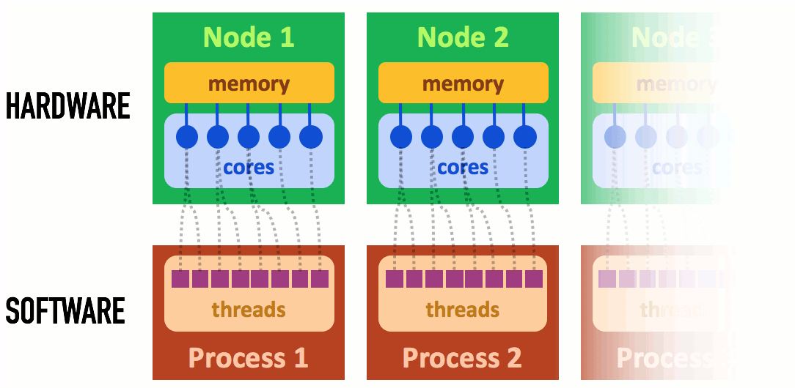
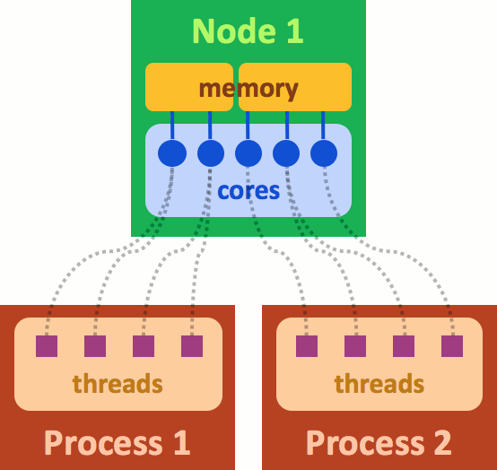
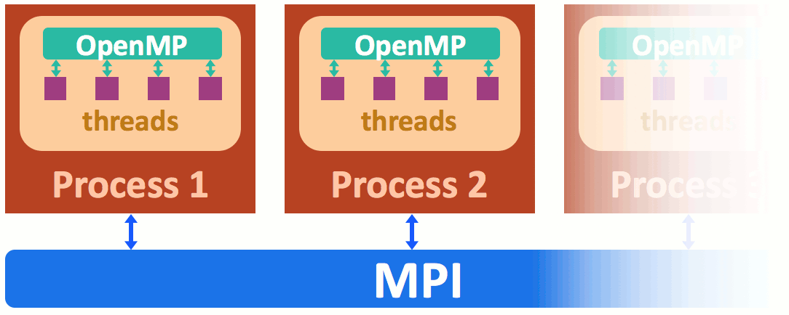
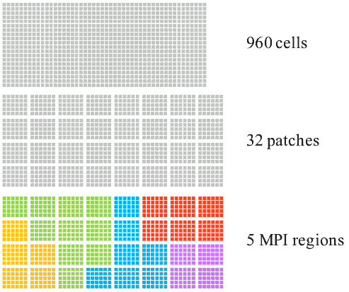
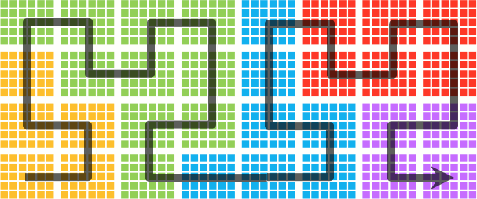

Parallelization basics
----------------------

For high performances, :program:`Smilei` uses parallel computing,
and it is important to understand the basics of this technology. Parallel simply
means that many processors can run the simulation at the same time, but there is
much more than that.

----

Nodes, cores, processes and threads
^^^^^^^^^^^^^^^^^^^^^^^^^^^^^^^^^^^

.. warning::
  
  The terminology of *nodes, cores, processes and threads* is not universal.
  Depending on the computer, software (etc.), they can have various meanings.
  Typical examples: *socket* instead of *node*; *cpu* instead of *core*;
  *task* instead of *process*.

Supercomputers have complex architectures, mainly due to their processors
capability to **work together on the same memory space**. More precisely,
the smallest computing units, called *cores*,
are grouped in *nodes*. All the cores in one node share the same memory space.
In other terms, the cores of the same node can operate on the same data, at the
same time; no need for sending the data back and forth.
This hardware architecture is summarized in :numref:`NodesCoresThreads`.

.. _NodesCoresThreads:

  
  Simplified super-computer architecture.

This same figure shows how the software is structured.
A *thread* is essentially the sequence of instructions from the program.
It is executed by one core, and a given core can operate only one thread at a time
(if two threads are associated with one core, they are handled one after the other).
A *process* refers to a group of threads which are assigned to a single (shared)
memory space: one process will not handle the memory of another process. The
*process* provides the communication between its threads so that they can work
on their memory space without conflicts.

The association between the software *threads* and the hardware *cores* can be more
complicated. :numref:`NodeWith2Processes` shows an example where two processes share the
same node. In this case, we illustrate the memory of this node as split in two parts because
the two processes cannot access to the same memory.

.. _NodeWith2Processes:

  
  An example where two processes share the same node.

Note that many computer architectures have a different meaning for *nodes*.
Indeed, their *nodes* have a memory space that is already split into several
*sockets*. In this situation, one process is associated with one socket.

----

Managing processes and threads
^^^^^^^^^^^^^^^^^^^^^^^^^^^^^^

Although two processes do not share their memory, they must sometimes synchronize their
advance in the execution of the program, or communicate data between each other.
For instance, to calculate the total energy in the simulation, they must communicate
their contribution to the others and compute the sum.
In :program:`Smilei`, these tasks are accomplished by the Message Passing Interface (MPI) protocol.

At the thread level, the communications do not work in the same manner because threads
already share their data. However, they need synchronization and management to decide
which core handles which thread. In :program:`Smilei`, this is accomplished by the *OpenMP* protocol.

An illustration of the roles of MPI and OpenMP is provided in :numref:`MPIandOpenMP`

.. _MPIandOpenMP:

  
  MPI handles process-to-process communications, while OpenMP manages threads in a given process.

----

Decomposition of the box
^^^^^^^^^^^^^^^^^^^^^^^^

Traditionally, PIC codes would
split the spatial grid into :math:`N` domains, where :math:`N` is the number
of cores. Each core would manage its own domain on a separate memory space,
and information is communicated between cores using the MPI protocol.
:program:`Smilei` proposes a different approach:
it also decomposes the spatial grid in several domains,
but one core is not exclusively associated to one domain.

Let us explain this difference in details.
:numref:`PatchDecomposition` gives an example of a grid containing 960 cells.
It is decomposed in :math:`4\times8 = 32` domains, called **patches**.
Each patch has :math:`5\times6` cells.
These patches size is actually reasonable for :program:`Smilei`, whereas
traditional PIC codes would have much larger domains.

The issue is now to decide where these patches will be stored in the memory,
and to choose which cores should handle which patches.
Recall that all the cores handled by one process share the same memory:
we will refer to this memory as an *MPI region*.
This means that one process manages one exclusive MPI region.
:numref:`PatchDecomposition` shows an example with the 32 patches split in 5 regions
recognized by their different colors.
Note that these regions are formed by contiguous patches (the regions are connex), but not necessarily rectangular.

.. _PatchDecomposition:

  
  Decomposition of a grid in *patches* and *MPI regions*.

Each MPI region is handled by all the threads of the process. For example, if there are
4 threads in the process that handles the region colored in green, this means the
4 threads will handle 10 patches. The 4 threads will work in parallel, patch by patch,
until all patches are done.

The great advantage of this scheme is that, inside one MPI region, the threads do not
need to wait for their colleagues to go to the next patch; they can continue working on
the available patches, thus avoiding long waiting times.
This is a form of **local dynamic load balancing**.

----

.. _LoadBalancingExplanation:

Load balancing between MPI regions
^^^^^^^^^^^^^^^^^^^^^^^^^^^^^^^^^^

As we just explained, threads treat patches asynchronously, thus balancing their computational loads.
Indeed, some patches may have more particles than others and therefore represent a heavier load.
In the meantime, other threads can take care of several lighter patches.
Unfortunately, it may not be sufficient.
When one MPI region holds more total load than the others, it will take a long
time to compute, while the other processes have already finished and wait for this one.
This can cause large delays.

:program:`Smilei` has an algorithm able to reduce this imbalance by exchanging patches
from one MPI region to another. A process that has too much load will give patches to
other processes in order to reduce the size of its MPI region. This algorithm is based
on an ordering of the patches by a *Hilbert curve*, as drawn in
:numref:`PatchDecompositionHilbert`. One MPI region contains only patches that contiguously
follow this curve. If this "portion" of the curve has too much load, it will send
some patches to the portions ahead or after, along the same curve. By repeating this
operation every now and then, we ensure that all regions manage an equitable computational load.

.. _PatchDecompositionHilbert:

  
  The shape of the Hilbert curve which determines the patch order.

----

Practical setup
^^^^^^^^^^^^^^^

The user must choose the number of processes and threads (see :doc:`run`).
Furthermore, they must define how the box is split into patches
(see :py:data:`number_of_patches`). Here are a few rules and recommendations
to help deciding this splitting.

* In each direction :math:`x`, :math:`y`, :math:`z`,
  the **number of patches must be a power of 2**.
  
* The minimum patch size depends on the order of the :py:data:`interpolation_order`.
  For the default order 2, the minimum size is 6 cells in each direction.
  
* **Have reasonably small patches**.
  Small patches are beneficial to efficient load balancing and cache use,
  but they increase the synchronization costs.
  The optimal patch size depends strongly on the type of simulation.
  Use small patches (down to 6x6x6 cells) if your simulation has small regions with many particles.
  Use larger patches (typically 100x100 or 25x25x25 cells) otherwise.

* For high performances, each process should own more patches than threads.
  And even many more if possible. This means that **the total number of patches
  should be larger than the total number of threads**, at the very least.

* **Have only as many MPI processes as sockets** in order to optimize the memory distribution.
  Less MPI processes is not possible because they cannot be split among separate memory spaces.
  More MPI processes is not recommended because they are not as efficient as OpenMP threads.

* **Have as many threads per process as cores per socket**.
  If you have less threads than cores, you will not be using all your cores.
  Use more threads than cores only if your architecture supports it well.
  
* Use dynamic scheduling for the OpenMP protocol, by setting the environment variable::
    
    export OMP_SCHEDULE=dynamic
    
  This affects only the particles treatment, which will be assigned to threads dynamically
  (fields are always assigned statically).

* **Take these recommendations with a pinch of salt**. Do your own tests and send us feedback!

----

Rectangular MPI regions
^^^^^^^^^^^^^^^^^^^^^^^^

Depending on the plasma shape, the MPI regions shapes which follow the hilbert
curve (as described above) may not be efficient in all cases.
In Smilei, it is possible to use a classical grouping of patches in rectangles
or cubes.

In the namelist::

    Main(
        ...
        patch_arrangement = "linearized_XY",  # 2D
        patch_arrangement = "linearized_XYZ", # 3D
        ...
    )

Those linearized decompositions are oriented to contiguously store patches
along the innermost direction (**Z**, then **Y**, then **X**).
The storage order can be modified through following options ::

    Main(
        ...
        patch_arrangement = "linearized_YX",  # 2D
        patch_arrangement = "linearized_ZYX", # 3D
        ...
    )

These options has several consequences:

* No more restrictions on the number of patches per direction.
* Load balancing is not available.
* To use the :ref:`DiagFields`, the number of patches per process must allow
  a rectangular tessellation of the simulation box. For instance:
  
  * 8 x 8 patches on 4 MPI process : **ok**, each process own 2 x 8 patches slice.
  * 6 x 8 patches on 4 MPI process : **not ok**, each process owns 12 patches which overlap 2 tiles.
