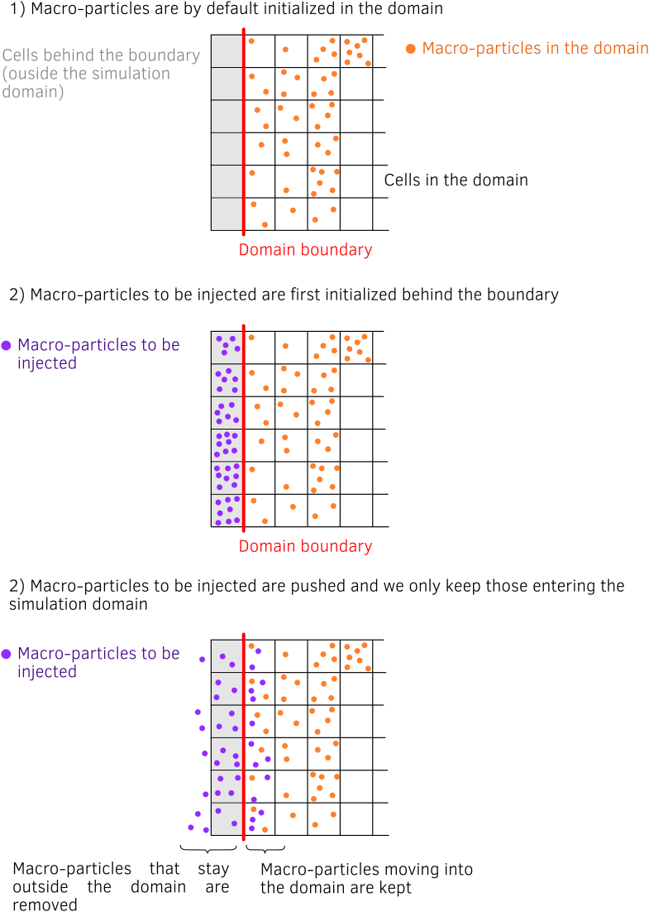

Particle Injector
================================================================================

Particle injectors provide a continuous flow of fresh
macro-particles from the boundaries into the simulation domain.

----

The method implemented in Smilei
^^^^^^^^^^^^^^^^^^^^^^^^^^^^^^^^^^^^^^^^^^^^^^^^^^^^^^^^^^^^^^^^^^^^^^^^^^^^^^^^

In the PIC loop structure, the particle injection occurs
after current projection on the grid, particle sorting and synchronizations.
Injected macro-particles therefore do not contribute to the current and fields
of the current iteration but they are taken into account in the diagnostics.

.. _fig_particle_injector:

----

Recommendation
^^^^^^^^^^^^^^^^^^^^^^^^^^^^^^^^^^^^^^^^^^^^^^^^^^^^^^^^^^^^^^^^^^^^^^^^^^^^^^^^

* Although a single species may be injected, we recommend to inject both
  positively and negatively charged species at the same time to ensure
  a neutral plasma. To strengthen neutrality, species may be created at
  the same positions.

----

Implementation
^^^^^^^^^^^^^^^^^^^^^^^^^^^^^^^^^^^^^^^^^^^^^^^^^^^^^^^^^^^^^^^^^^^^^^^^^^^^^^^^

The particle injector algorithm is coded in the file
``Patch/VectorPatch.cpp`` in the function ``injectParticlesFromBoundaries``.

The class ``ParticleInjector`` manages the injector's parameters and properties,
while new macro-particles are initialized using the class ``ParticleCreator``.
