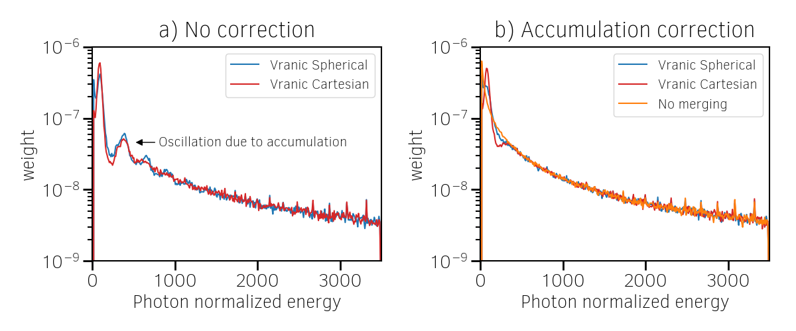
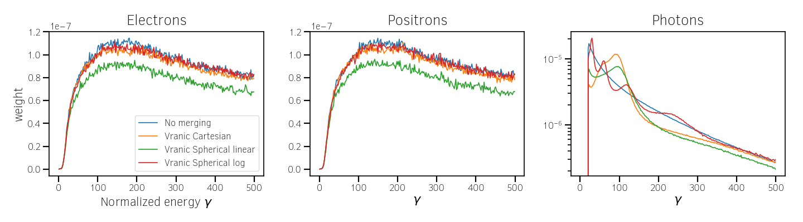
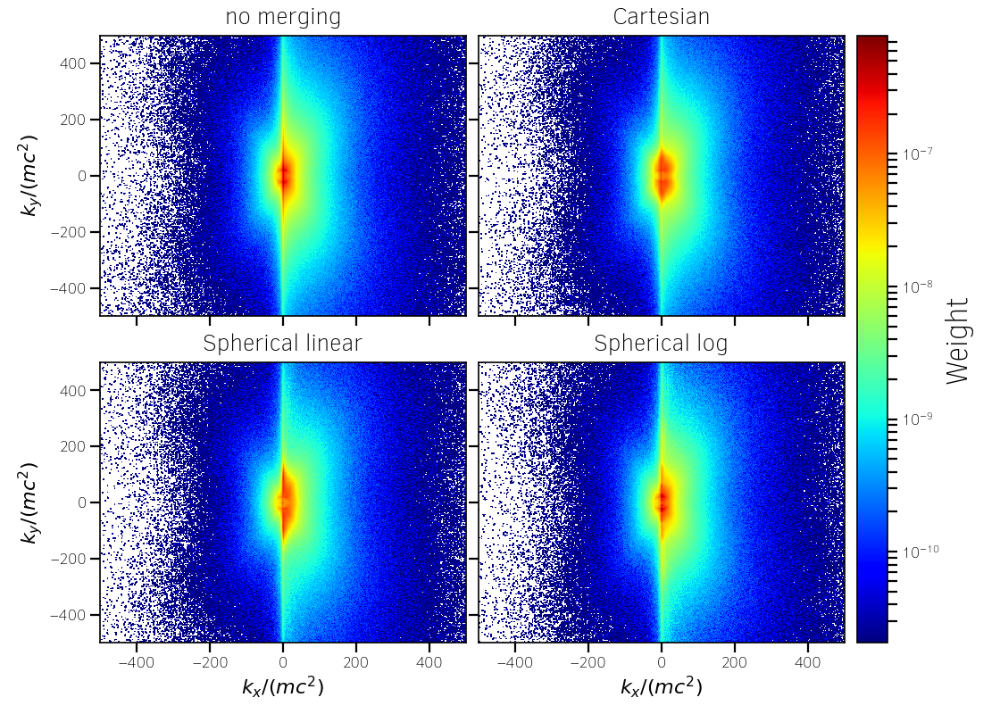
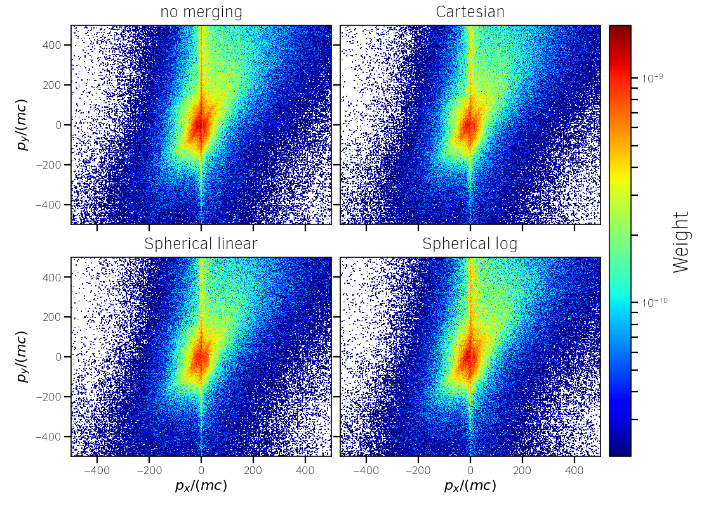

Particle Merging
================================================================================

:red:`BETA: be careful when using this module and read carrefully the documentation.`

The ability to merge macro-marticles can speed-up the code efficiency
and reduce the memory footprint in some specific simulation senarii:

* When macro-particles accumulate in a fraction of the simulation domain
  hence strongly worsening the load imbalance (ex: Weibel collison shocks,
  laser wakefield electron acceleration).
* When macro-particles are generated in a large quantity due to some
  additonal physical mechanisms (ionization, macro-photon emission, QED pair production...)
* When macro-particles travel in large quantities outside interesting physical regions.

Available implemented methods:

* M. Vranic merging method (`M. Vranic et al., CPC, 191 65-73 (2015) <https://doi.org/10.1016/j.cpc.2015.01.020>`_)

--------------------------------------------------------------------------------

.. _ref_vranic_method:

The merging method of M. Vranic
--------------------------------------------------------------------------------

.. _ref_understand_vranic_method:

1. Understand the method
^^^^^^^^^^^^^^^^^^^^^^^^^^^^^^^^^^^^^^^^^^^^^^^^^^^^^^^^^^^^^^^^^^^^^^^^^^^^^^^^

The method of M. Vranic basically consists on 3 main steps and is schematically described (in 2D) in Fig. :numref:`fig_vranic_particle_merging`:

1. To Decompose macro-particles in position space into groups so that they share close location. In :program:`Smilei`, macro-particles are sorted by field cells. In the article of M. Vranic *et al.*, the decomposition can be larger than just a cell.

2. Then, to subdivide the macro-particles into sub-groups in the momentum space so that they share close kinteic properties.

3. To merge macro-particles located in the same groups in 2 new macro-particles to respect the charge, energy and momentum conserving laws.

.. _fig_vranic_particle_merging:

.. figure:: _static/vranic_particle_merging.png
  :width: 100%

  Basic description of the Vranic merging method in 2D geometry. In 3D, the idea is strictly the same.

This method has several advantages. It is relatively easy to understand and to implement.
It has a relatively low computational costs and is efficient without
impacting significantly the physical resuls.

.. warning::

  This suppose that the parameters are adequatly tuned.
  Otherwise, the macro-particle merging can affect the final simulation results.

1.1 Momentum cell decomposition
""""""""""""""""""""""""""""""""""""""""""""""""""""""""""""""""""""""""""""""""

Let us defined some notations first. Momentum norm is called :math:`p` and momentum components
:math:`p_{\alpha}` with :math:`\alpha` equal to x, y or z for each particle.
The number of cells in the direction :math:`\alpha` for the discretization is :math:`N_{\alpha}`.
The discretization step in the direction :math:`\alpha` is called :math:`\Delta_{\alpha}`.

In a position merge cell, step 2 starts by the computation of the minimum :math:`p_{\alpha,min}` and maximum :math:`p_{\alpha,max}` momentum boundaries (also given in :numref:`fig_vranic_particle_merging`).
The boundaries define the momentum space that is then discretized.
The momentum space is divided into momentum cells (of size :math:`\Delta_{\alpha}`) following the discretization (:math:`N_{\alpha}`) given by the user.

In :program:`Smilei`, we use both a spherical discretization geometry for the momentum
discretization and  a Cartesian one as it is the case in :numref:`fig_vranic_particle_merging`.
The momentum space decomposition is basically the same except that the boundaries now concern
the directions :math:`p`, :math:`\theta` and :math:`\phi` in 3D as shown in :numref:`fig_vranic_momentum_discretization`.

.. _fig_vranic_momentum_discretization:

.. figure:: _static/vranic_momentum_discretization.png
  :width: 100%

  2D Cartesian and spherical momentum discretization.

The spherical components are related to the Cartesian momentum components by:

.. math::
  :label: spherical_discretization

  p = \sqrt{ p_x^2 + p_y^2 + p_z^2 }\ ;
  \theta = \arctan{ \left( p_y / p_x \right)}\ ;
  \phi = \arcsin{\left( pz / p \right)}

This corresponds to :numref:`fig_spherical_coordinates`.

.. _fig_spherical_coordinates:

.. figure:: _static/spherical_coordinates.png
  :width: 50%

  Spherical coordinates used for the momentum cell discretization.

Since macro-particle momentum components are defined in the Cartesian geometry
by default, considering a spherical discretization induces small additional computation.
However, it makes the merging process more accurate.
Indeed, in the Cartesian discretization, the maximum angle between the momentum
directions of two macro-particle located in the same momentum cell
(i.e. :math:`\theta` and :math:`\phi`) depends on the momentum cell.
For instance, two macro-particles can make an angle up to :math:`\pi / 2` in the cell
adjacent to the origin :math:`p_x = p_y = p_z = 0` whatever the discretization.
In general, this angle diminishes with the distance to the origin.
This issue is therefore negligible for high-energy particles but not
anymore for cold ones.
The spherical geometry ensures that the merging accuracy depends
on the discretization and is similar for all momentum cells.
The overhead induced by the change of geometry is a small fraction of the entire process.

1.2 Merging algorithm for mass macro-particles
""""""""""""""""""""""""""""""""""""""""""""""""""""""""""""""""""""""""""""""""

Step 3 starts after the momentum space discretization.
For each momentum cell with more than 4 macro-particles,
the algorithm enables to merge them into 2.
Let us call :math:`\mathrm{M}` the macro-particles in a given momentum cell,
:math:`k` is an index to list each macro-particles of :math:`\mathrm{M}`.
The macro-particle weight is called :math:`w`, the energy :math:`\varepsilon`,
the momentum :math:`\mathbf{p}`.
We start by computing total quantities for the weight :math:`w_t`,
the energy :math:`\varepsilon_t`,
the momentum :math:`\mathbf{p}_t`:

.. math::
  :label: total_quantities

  w_t = \sum_{k \in \mathrm{M}}{w_k}\ ;
  \varepsilon_t = \sum_{k \in \mathrm{M}}{w_k \varepsilon_k}\ ;
  \mathbf{p}_t = \sum_{k \in \mathrm{M}}{w_k \mathbf{p}_k}\ ;

In spherical geometry, the total angles can also be defined:

.. math::
  :label: total_angles

  \theta_t = \sum_{k \in \mathrm{M}}{w_k \theta_k}\ ;
  \phi_t = \sum_{k \in \mathrm{M}}{w_k \phi_k}

To merge all the macro-particles into just one does not allow to locally
conserve weight, energy and momentum. Vranic *et al.* proposes to merge to 2 macro-particles:

.. math::
  :label: merged_particle_relation

  w_t = w_a + w_b \\
  \mathbf{p}_t = w_a \mathbf{p}_a + w_b \mathbf{p}_b \\
  \varepsilon_t = w_a \varepsilon_a + w_b \varepsilon_b

The following energy-momentum relation has to be satisfied for macro-particles a and b:

.. math::
  :label: energy_momentum_relation

  \varepsilon^2 = p^2 + 1

To simplify the problem, Vranic *et al* assume that merged macro-particles
have the same weight :math:`w_a = w_b = w_t / 2`
and same energy :math:`\varepsilon_a = \varepsilon_b = \varepsilon_t / w_t`.

.. _fig_vranic_planar_merging:

.. figure:: _static/vranic_planar_merging.png
  :width: 100%

  View of the plane made by vector :math:`\mathbf{d}` and :math:`\mathbf{p_t}`.
  The corresponding Cartesian frame is given by :math:`(\mathbf{e_1}, \mathbf{e_2}, \mathbf{e_3})`.

As illustrated in :numref:`fig_vranic_planar_merging`, it follows that:

.. math::
  :label: new_momentum_relation

  \mathbf{p}_a +  \mathbf{p}_b = \frac{2 \mathbf{p}_t}{w_t} \\
  \mathbf{p}_{a,\perp} = - \mathbf{p}_{b,\perp} \\
  \mathbf{p}_{a,\parallel} = \mathbf{p}_{b,\parallel} = \mathbf{p_t} / w_t

We all :math:`\omega` the angle betweeb :math:`\mathbf{p_a}` and :math:`\mathbf{p_t}`
so that:

.. math::
  :label: angle_omega

  \cos{\omega} = \frac{\mathbf{p_t}}{w_t \mathbf{p_a}}

We define :math:`\mathbf{d}` the cell direction or location vector.
It represents the location (or the direction in spherical coordinates) of the momentum cell where the macro-particles are located
as shown in :numref:`fig_momentum_cell_vector`.

.. _fig_momentum_cell_vector:

.. figure:: _static/vranic_momentum_cell_vector.png
  :width: 100%

  Momentum cell vector in Cartesian and spherical geometries.

The plane :math:`(\mathbf{e_1},\mathbf{e_2})` is the plane made by the vector :math:`\mathbf{p_t}` and :math:`\mathbf{d}`.
We decide that it contains :math:`\mathbf{p_a}` and :math:`\mathbf{p_b}` so that we have only one possible solution.

Now, it is just necessary to determine :math:`\mathbf{e_1}` and :math:`\mathbf{e_2}` in the momentum frame used by the PIC code.
They are given by the following formula:

.. math::
  :label: planar_coordinates_e1

  \mathbf{e_1} = \mathbf{p_t} / p_t

.. math::
  :label: planar_coordinates_e3

  \mathbf{e_3} & = &  \frac{ \mathbf{d} \times \mathbf{e_1} }{d} \\
               & = & \frac{ 1 }{d.p_t}
   \begin{array}{|l}
      p_{t,z} \cdot d_y - p_{t,y} \cdot d_z \\
      p_{t,x} \cdot d_z - p_{t,z} \cdot d_x \\
      p_{t,y} \cdot d_x - p_{t,x} \cdot d_y
   \end{array}

.. math::
  :label: planar_coordinates_e2

  \mathbf{e_2} & = & \mathbf{e_1} \times \mathbf{e_3} \\
               & = & \frac{1}{p_t^2 . d}
   \begin{array}{|l}
      p_{t,y}^2 .d_x - p_{t,x}(d_y.p_{t,y} + d_z.p_{t,z}) + p_{t,z}^2.d_x \\
      p_{t,z}^2 .d_y - p_{t,y}(d_z.p_{t,z} + d_x.p_{t,x}) + p_{t,x}^2.d_y \\
      p_{t,x}^2 .d_z - p_{t,z}(d_x.p_{t,x} + d_y.p_{t,y}) + p_{t,y}^2.d_z
   \end{array}

Finally, the new macro-particle momentum are:

.. math::
  :label: new_macroparticle_momentum

  \mathbf{p_a} = p_a \left( \cos{\left( \omega \right)} \mathbf{e_1} +  \sin{\left(\omega\right)} \mathbf{e_2} \right) \\
  \mathbf{p_b} = p_b \left( \cos{\left( \omega \right)} \mathbf{e_1} -  \sin{\left(\omega\right)} \mathbf{e_2} \right)

The method is summarized grpahically in :numref:`fig_3d_schematic`.
It has been drawn using Python with Matplotlib.
The Python script in available `here <_static/vranic_geometry.py>`_.

.. _fig_3d_schematic:

.. figure:: _static/vranic_3d_schematics.png
  :width: 100%

  3d view of the different vectors involved in the merging method.

The new macro-particle positions are assigned at the position of one of
the merged macro-particles. We have tested to assign them randomly
or to the first macro-particles of the merged list and we did
not observe any difference.

This algorithm does not work when the total momentum :math:`\mathbf{p}_t` of the macro-particles to be merged
is in the direction of :math:`\mathbf{d}`.
In this case :math:`|| \mathbf{e_3} || = 0` and it is not
possible to determine the system :math:`(\mathbf{e}_1, \mathbf{e}_2, \mathbf{e}_3)`.
In this specific case, the merging is not processed.

1.3 Merging algorithm for macro-photons
""""""""""""""""""""""""""""""""""""""""""""""""""""""""""""""""""""""""""""""""

Macro-photons can be merged with the same algorithm.
The only difference is that the momentum norm is equal to the energy :math:`\varepsilon = p`.

When the total momentum :math:`\mathbf{p}_t` is in the direction of :math:`\mathbf{d}`, macro-photons can be merged into a single one contrary to the mass macro-particles since :math:`\varepsilon_t = || \mathbf{p}_t ||`.
This specific situation is implemented in the code.

.. _vranic_implementation:

2. Implementation
^^^^^^^^^^^^^^^^^^^^^^^^^^^^^^^^^^^^^^^^^^^^^^^^^^^^^^^^^^^^^^^^^^^^^^^^^^^^^^^^

The Vranic merging method is implemented with the Cartesian
and the Spherical momentum discretization in the source directory ``Merging``.
It is considered as a particle operator and the merging algorithm is managed with a factory (``MergingFactory.h``) as any operator with multiple implementations.
The Cartesian implementation is done in the class ``MergingVranicCartesian`` and the Sphericla one in ``MergingVranicSpherical``.

For both methods, the implemented algorithm is very similar.

    For each cells (in the real space):

    1. Initialization of the momentum cell discretization
    2. Computation of the cell direction vectors (:math:`\mathbf{d}`): this step depends on the discretization and can be efficiently vectorized.
    3. Comutation of the momentum cell indexes for each macro-particle. Efficiently Vectorizable.
    4. Computation of the number of particles per momentum cells.  Not vectorizable because of random memory accesses.
    5. Computation of the cell index of each momentum cell in the sorted array of particles (only the particle indexes are sorted). Not vectorizable.
    6. Sorting of the macro-particles per momentum cells, the cell index previously computed determine where starts each momentum cell. Not vectorizable.

    Then, for each momentum cell:

    1. Division of the macro-particles of the momentum cell in small packs according to the user parameters
    2. Merge of the packs using the previously described Vranic algorithm. Partly vectorized.
    3. Creation of the merged macro-particles at the position of the previous ones
    4. Tag of the macro-particles to be removed

    Then, once the merging finished for a given patch:

    1. Compression of the macro-particle list (remove hole let by removed and tagged particles). By cleaning the particle vector at the end, we limit the computational impact of this step.

2.1 Cartesian momentum Cell discretization
""""""""""""""""""""""""""""""""""""""""""""""""""""""""""""""""""""""""""""""""

How to discretize the momentum space is in fact one of the most important point.
The user gives :math:`N_x`, :math:`N_y` and :math:`N_z` via the namelist.
The momentum space boundary corresponds to :math:`p_{\alpha,min}` and :math:`p_{\alpha,max}` with :math:`\alpha` equal to x, y or z.
For this discretization, we force the origin (:math:`p_x = p_y = p_z = 0`) to not be contained in a cell so that there is not in the same cell particles with positive and negative momenta.
The user-defined discretiztion can be slightly adjusted for algorithmic reasons.

    For each momentum component :math:`p_\alpha` with :math:`\alpha` equal to x, y or z:
        If :math:`p_{\alpha,min}` is very close to :math:`p_{\alpha,max}`:
            If :math:`p_{\alpha,min}` and :math:`p_{\alpha,max}` have the same sign:
                Only one cell is used for this component.
                The unique momentum cell is centered around the average particle momentum.
            If :math:`p_{\alpha,min}` and :math:`p_{\alpha,max}` have opposite sign:
                Two cells are used, one for the negative and one for the positive values.
                The discretization is therefore centered in 0.
        Else:
            If :math:`N_\alpha = 1`:
                The unique cell has the size of :math:`p_{\alpha,max} - p_{\alpha,min}`.
            Else if :math:`p_{\alpha,min}` and :math:`p_{\alpha,max}` have the same sign:
                The discretization is classically computed using :math:`N_\alpha`.
            Else if :math:`p_{\alpha,min}` and :math:`p_{\alpha,max}` have opposite sign:
                The discretization is adjusted so that :math:`p_{\alpha} = 0` is at the boundary between 2 consecutive cells. We do it by shifting the discretization and adding an extra cell. At the end, there is an additonal cell than requested (:math:`N_\alpha` = :math:`N_\alpha` + 1).
                

2.2 Spherical momentum Cell discretization
""""""""""""""""""""""""""""""""""""""""""""""""""""""""""""""""""""""""""""""""

The user gives :math:`N_r`, :math:`N_\theta` and :math:`N_\phi` via the namelist.
The momentum space boundary corresponds to :math:`p_{r,min}`, :math:`p_{r,max}`, :math:`\theta_{min}`, :math:`\theta_{max}`, :math:`\phi_{min}` and :math:`\phi_{max}`.

    For each momentum component :math:`p_r`, :math:`\theta` and :math:`\phi`:
        If the the minimum boundary is too close to the maximum boundary:
            Only one cell is used for this component.
        Else:
            If :math:`N_\alpha = 1` (here :math:`\alpha` is :math:`p_r`, :math:`\theta` or :math:`\phi`):
                The unique cell has the size of :math:`(\alpha_{max} - \alpha_{min}) \times 1.01` (the multiplication by 1.01 enables to include :math:`\alpha_{max}`).
            Else:
                The discretization is classically computed using :math:`N_\alpha`.
                :math:`\Delta_\alpha = 1.01 \times (\alpha_{max} - \alpha_{min}) / N_\alpha` (the multiplication by 1.01 enables to include :math:`\alpha_{max}`).
                
                
2.3 Solid angle correction
""""""""""""""""""""""""""""""""""""""""""""""""""""""""""""""""""""""""""""""""

With the classical spherical discretization, the solid angle that represents the surface crossed by the macro-particles having the same momentum cell direction depends on this direction as shown in :numref:`fig_spherical_discretization` a). In our discretization, the solid angle is larger near :math:`\phi = 0` (equator) and smaller near :math:`\phi = \pi / 2` (poles). Therefore, momentum cells near the equator will potentially have more particles than cells near poles and will undergo more particle merging processes.

.. _fig_spherical_discretization:

.. figure:: _static/spherical_discretization.png
  :width: 100%

  Classical spherical discretization (a) and the spherical discretization with solid angle correction (b). This figure has been generated with the following `Python script <_static/scripts/vranic_spherical_discretization.py>`_.

To compensate this phenomenon, the discretization (number of cells) in :math:`\theta`, :math:`N_\theta`, is made to depend on :math:`\phi` so that the solid angle is approximatly constant. For this aim, a reference solid angle :math:`\Omega_{ref}` has to be set . It corresponds to the solid angle at the smallest  :math:`|\phi|` value with the :math:`\theta` discretization given by the user in the namelist. For larger :math:`|\phi|` values, the :math:`\theta` discretization :math:`N_\theta` varies to satisfy :math:`\Omega = \sin{(\phi)}\Delta \theta \Delta \phi = \Omega_{ref}`. Since we keep :math:`\phi` constant, it is equivalent to determine a :math:`\theta_{ref}`. An example of such a discretization is shown in :numref:`fig_spherical_discretization` b).

.. _vranic_accululation_effect:

2.4 Accumulation effect
""""""""""""""""""""""""""""""""""""""""""""""""""""""""""""""""""""""""""""""""

When several macro-particles are merged, the contribution of each of them to the final ones depends on their weights.
In other words, newly-created macro-particles will be more determined from the merged ones with high weight values than smaller macro-particles. Due to the merging process some particles can become super-heavy and dominates other macro-particles so that they will continue to grow with few change in their kinetic properties. This can be a problem if the momentum cells are large and the momentum distribution is broad. Heavy macro-particles continuously absorb their neighbors and damage the momentum distribution.

To illustrate this phenomenon, let us consider the magnetic shower benchmark in 3D. This benchmark is the equivalent of the synchrotron one applied to pair production. The domain is filled with a plasma of electron-positron. electron and positron macro-particles all initialized with the same Lorentz factor :math:`\gamma = 8125` and same direction. The macro-particles evolve in a constant homogeneous and uniform magnetic field of amplitude :math:`B = 1000 e/(m\omega)` orthogonal to the propagation direction of the particles. The initial electron and positron quantum parameters are therefore both equal to :math:`\chi = 20`. The input script of this simulation is available `here <_static/magnetic_shower_3d_vranic_merging.py>`_.

Oscillations at low energy in the photon energy distribution can be seen in :numref:`fig_magnetic_shower_photon_energy_distribution` a) due to the accumulation effects.

.. _fig_magnetic_shower_photon_energy_distribution:

  Photon energy distribution for the 3d magnetic shower benchmark at the end of the simulation without (a) and with accumulation correction (b) for both the Spherical and Cartesian momentum discretization.

.. _fig_magnetic_shower_photon_pxpy_distribution:

  Photon px-py momentum distribution for the 3d magnetic shower benchmark at the end of the simulation for different configuration: a) wihtout merging, b) Cartesian discretization without correction, c) Spherical discretization without correction, d) Cartesian discretization with correction and e) Spherical discretization with correction.

**Warning:** the accumulation correction is not working with the logarithmic discretization.

.. _vranic_log_scale:

2.5 Logarithmic scale
""""""""""""""""""""""""""""""""""""""""""""""""""""""""""""""""""""""""""""""""

Only for the **spherical discretization**, we have implemented the possibility to have a logarithmic discretization for the momentum norm :math:`p`.
Due to the logarithmic computation, this option is slightly slower than the linear discretization.
Nonetheless, it can be useful when the distribution is very broad with several orders of magnitude between low-energy
and high-energy particles.
The logarithmic or linear discretization scale can be chosen via the parameter `merge_discretization_scale` in the namelist.

On the magnetic shower case presented in section :ref:`vranic_accululation_effect`, the logarithmic discretization
gives very good results and perfectly fit the distribution without merging as presented in :numref:`magnetic_shower_gamma_distribution_log`.

.. _magnetic_shower_gamma_distribution_log:

.. figure:: _static/figures/magnetic_shower_gamma_distribution_log.png
  :width: 100%

  Photon px-py momentum distribution for the 3d magnetic shower benchmark
  at the end of the simulation wihtout merging and with the spherical method in the logarithmic scale.

**Warning:** the logarithmic discretization is subject to accumulutation oscilations
but is not working with the current accumulation correction.

.. _vranic_namelist:

3. Namelist
^^^^^^^^^^^^^^^^^^^^^^^^^^^^^^^^^^^^^^^^^^^^^^^^^^^^^^^^^^^^^^^^^^^^^^^^^^^^^^^^

Please refer to :ref:`that doc <Particle_merging>` for an explanation of how to configure the merging in the namelist file.

.. _vranic_simulation results:

4. Simulation results
^^^^^^^^^^^^^^^^^^^^^^^^^^^^^^^^^^^^^^^^^^^^^^^^^^^^^^^^^^^^^^^^^^^^^^^^^^^^^^^^

4.1 3D QED cascade
""""""""""""""""""""""""""""""""""""""""""""""""""""""""""""""""""""""""""""""""

In this section, the particle merging is tested with a simulation scenario of QED pair cascading.
Cascade means here that QED mechanisms, i.e. creation fo electron-positron pairs, are self-sustained.
As for the magnetic shower, a seed of electrons or positrons in a strong electromagnetic field generates high-energy photons that in turns decay into electron-positron pairs.
The difference is that the seed particles and the newly-created ones can gain again some energy from the fields and participate to the generation of pairs.
The production of electron-positron pairs can therefore be maintained as long as there is a source of energy.
In such a scenario, we can expect an exponential growth of particules with the creation of an electron-positron plasma.
In this scenario, a bunch of electrons and positrons (the seed) is initally irradiated by two counter-propagating lasers (strong field and source of energy) as shown in :numref:`fig_qed_pair_cascade`.

.. _fig_qed_pair_cascade:

.. figure:: _static/figures/qed_pair_cascade.png
  :width: 100%

  Example of QED pair cascade configuration with two counter-propagating lasers.

We use two counter-propagating circularly polarized plane waves.
When they collide, the two waves form a steady plane wave of very strong amplitude able to trigger strong QED effetcs.
The seed is a group of electrons and positrons located at the middle of the domain in the plane :math:`x = (0.5 L_x + \Delta_x )` where :math:`L_x` is the domain size in the :math:`x` direction.
The macro-positrons are located at the same location that the macro-electrons to be neutral.
Since we have plane waves, the transverse boundary conditions are periodic.
The longitudinal boundary conditions are absorbing for both the fields and the particles.
This very academic scenario is complicated to simulate because the particles can only escape the domain via the longitudinal boundaries.
Furthermore, the lasers have inifinite duration.
They simply start with a short ramp of :math:`\lambda / 4`.

Some simulation parameters are given in the following table and the Smilei namelist is avalaible `here <_static/scripts/qed_pair_cascade.py>`_.

.. _table_qed_cascade_parameters:

+-------------------------------------------------------------+-----------------------------------------------------+
| Parameters                                                  | Values                                              |
+=============================================================+=====================================================+
| Laser Wavelength (:math:`\lambda`)                          | :math:`10^{-6}\ \mu \mathrm{m}`                     |
+-------------------------------------------------------------+-----------------------------------------------------+
| Domain size :math:`L_x \times L_y \times L_z`               | :math:`4 \lambda \times 2 \lambda \times 2 \lambda` |
+-------------------------------------------------------------+-----------------------------------------------------+
| Laser normalized intensity (:math:`a_0`)                    | 1000                                                |
+-------------------------------------------------------------+-----------------------------------------------------+
| Space discretization :math:`\Delta_x, \Delta_y`             | :math:`\lambda / 48`                                |
+-------------------------------------------------------------+-----------------------------------------------------+
| Time step :math:`\Delta_t`                                  | :math:`0.95 \times` CFL                             |
+-------------------------------------------------------------+-----------------------------------------------------+
| Simulation duration                                         | :math:`2 L_x / c`                                   |
+-------------------------------------------------------------+-----------------------------------------------------+
| Allocation time                                             | 1000 seconds                                        |
+-------------------------------------------------------------+-----------------------------------------------------+
| Patch size                                                  | :math:`8 \times 8 \times 8` cells                   |
+-------------------------------------------------------------+-----------------------------------------------------+
| Vectorization                                               | on                                                  |
+-------------------------------------------------------------+-----------------------------------------------------+
| Merging period                                              | every iterations                                    |
+-------------------------------------------------------------+-----------------------------------------------------+
| Minimal number of particle per momentum cell for merging    | 4                                                   |
+-------------------------------------------------------------+-----------------------------------------------------+

We decide to have an agressive merging process performed at every timesteps with a relatively restricted momentum-space discretization.
The merging is applied on all species.
Prior to 3D, we have performed the same simulation case in lower dimensions 1D and 2D.
The merging process can be performed with a finer momentum-space dicretization and every longer period in these dimensions (1D and 2D) because the number of macro-particles per mometum cells is higher.
In 3D, the number of particles per momentum cells can be too small to have a frequent merging with a fine momentum-space dicretization.
The cases are run during a maximum of 1000 seconds.

This case is simulated identically with different merging configuration:

* No merging
* Merging with the Cartesian discretization
* Merging with the Spherical linear discretization
* Merging with the Spherical logarithmic discretization

The comparision of the scalar diagnostics if presented in :numref:`fig_qed_cascade_scalar`.

.. _fig_qed_cascade_scalar:

.. figure:: _static/figures/QED_cascade_scalar.png
  :width: 100%

  Study and comparison of the scalar diagnostics for all merging configuration: no merging, mergign with the logarithmic and linear spherical discretization and the cartesian discretization. The scalar diagnostics shown here are the number of macroparticles (first row), the normalized kinetic energy (second row) and the weight (third row).
  Each column respectively concerns a different species: the photons, the electrons and the protons.

.. _fig_qed_cascade_photon_gamma_spectrum:

  Electron, energy spectrum at simulation time :math:`t = 39.5 \omega^{-1}`
  for the different merging configuration: no merging, mergign with the logarithmic and linear spherical discretization and the cartesian discretization.

.. _fig_qed_cascade_photon_pxpy_spectrum:

  :math:`p_x-p_y` photon momentum distribution at simulation time :math:`t = 39.5 \omega^{-1}`
  for the different merging configuration: no merging, mergign with the logarithmic and linear spherical discretization and the cartesian discretization.

.. _fig_qed_cascade_electron_pxpy_spectrum:

  :math:`p_x-p_y` electron momentum distribution at simulation time :math:`t = 39.5 \omega^{-1}`
  for the different merging configuration: no merging, mergign with the logarithmic and linear spherical discretization and the cartesian discretization.

.. _fig_qed_cascade_iteration_time:

.. figure:: _static/figures/QED_cascade_iteration_time.png
  :width: 100%

  Evolution of the average computation time per iteration for each merging method: no merging, mergign with the logarithmic and linear spherical discretization and the cartesian discretization.

.. _video_qed_cascade:

.. raw:: html

  <video style="display:block; margin: 0 auto; width: 100%;" controls src="http://www.maisondelasimulation.fr/projects/Smilei/uploads/videos/qed_cascade.mp4" width="100%">
  </video>

--------------------------------------------------------------------------------

References
^^^^^^^^^^

.. [Vranic2005] `M. Vranic et al., CPC, 191 65-73 (2015) <https://doi.org/10.1016/j.cpc.2015.01.020>`_
