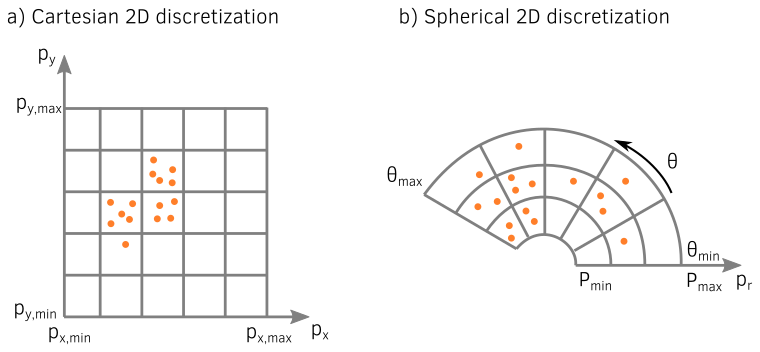
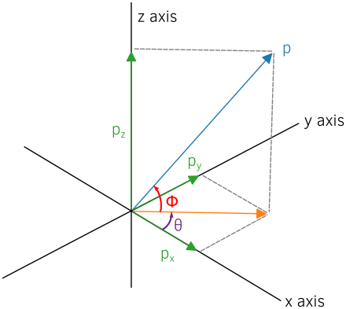
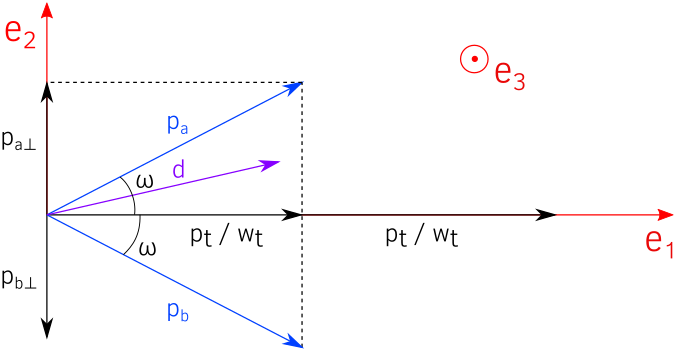
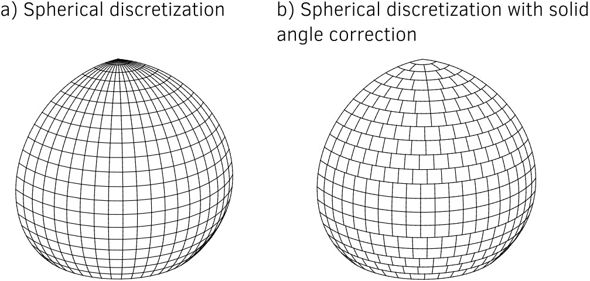
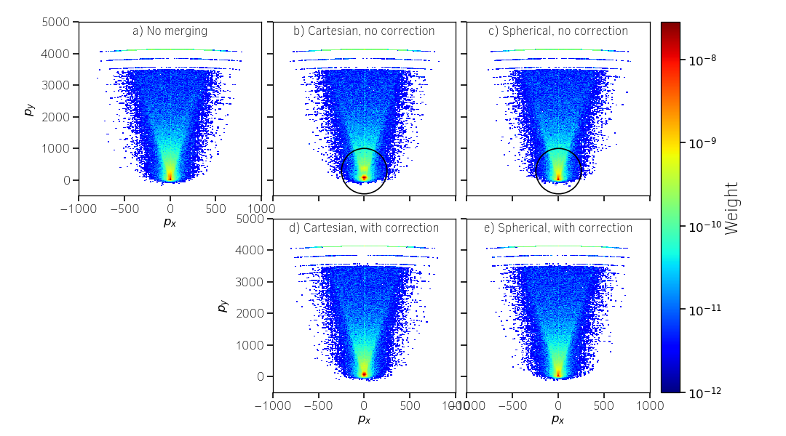
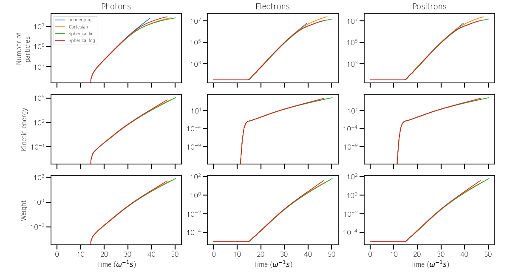
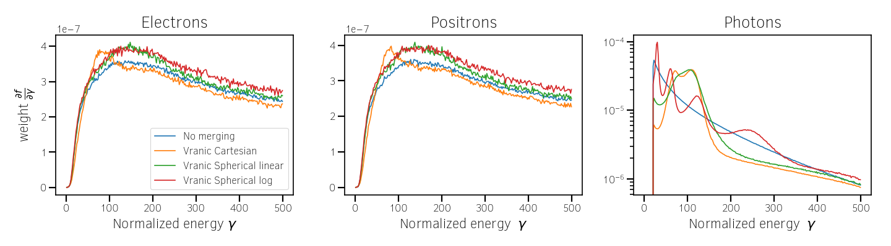
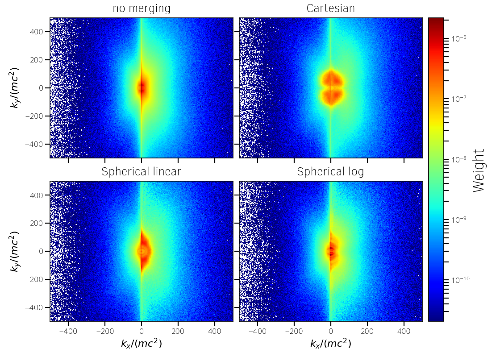
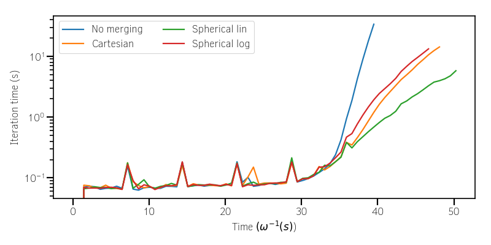

.. rst-class:: experimental

Particle Merging
================================================================================

  :red:`Be careful when using this module and read
  carefully the documentation.`
  
  :red:`Note that the nomenclature might change`

The ability to merge macro-particles can speed-up the code efficiency
and reduce the memory footprint in some specific simulation scenarii:

* When macro-particles accumulate in a fraction of the simulation domain
  hence strongly worsening the load imbalance (ex: Weibel collision shocks,
  laser wakefield electron acceleration).
* When macro-particles are generated in a large quantity due to some
  additional physical mechanisms (ionization, macro-photon emission,
  QED pair production...)
* When macro-particles travel in large quantities outside interesting
  physical regions.

Smilei's merging method is inspired from that of M. Vranic
[Vranic2005]_ with some additions.

Please refer to :ref:`that doc <Particle_merging>` for
the definitions in the namelist file.

.. _ref_understand_vranic_method:

----

Understand the method
^^^^^^^^^^^^^^^^^^^^^^^^^^^^^^^^^^^^^^^^^^^^^^^^^^^^^^^^^^^^^^^^^^^^^^^^^^^^^^^^

The method of M. Vranic, illustrated (in 2D) in
Fig. :numref:`fig_vranic_particle_merging`, consists in 3 main steps:

1. Decompose macro-particles into groups according to their location so that
   they have nearby positions.
   In :program:`Smilei`, macro-particles are sorted by field cells,
   even though, in Vranic *et al.*, the decomposition can be larger
   than just one cell.

2. Subdivide groups into sub-groups in momentum space so that macro-particles
   share close kinetic properties.

3. Merge macro-particles located in the same sub-group into 2 new
   macro-particles, while conserving charge, energy and momentum.

.. _fig_vranic_particle_merging:

.. figure:: _static/vranic_particle_merging.png
  :width: 100%

  Basic description of M. Vranic merging method in 2D geometry.

This method has several advantages:

* it is relatively easy to understand and implement,
* it has a relatively low computational cost,
* it is efficient without impacting significantly the physical results.

.. warning::

  This assumes that the parameters are adequately tuned.
  Otherwise, the macro-particle merging can affect the final simulation results.

1. Momentum sub-groups
""""""""""""""""""""""""""""""""""""""""""""""""""""""""""""""""""""""""""""""""

The momentum (:math:`\mathbf p`) space may be decomposed either in
cartesian (:math:`p_x`, :math:`p_y`, :math:`p_z`)
or spherical (:math:`p`, :math:`\theta`, :math:`\phi`) coordinates.

In each cell, for each coordinate :math:`\alpha`:

* we compute the overall limits in momentum space.
* This space is divided in :math:`N_{\alpha}` sub-groups (as prescribed by the
  user) of length :math:`\Delta_{\alpha}`.

.. _fig_vranic_momentum_discretization:

  Cartesian and spherical momentum discretizations, in 2D.

The spherical components are related to the Cartesian momentum components by:

.. math::
  :label: spherical_discretization

  p = \sqrt{ p_x^2 + p_y^2 + p_z^2 }\\
  \theta = \arctan{ \left( p_y / p_x \right)}\\
  \phi = \arcsin{\left( p_z / p \right)}

.. _fig_spherical_coordinates:

  Spherical coordinates used for the momentum cell discretization.

Since macro-particle momentum components are defined in Cartesian geometry
by default, the spherical discretization induces small additional computation.
However, it makes the merging process more accurate.
Indeed, in the Cartesian discretization, the maximum angle between the momentum
directions of two macro-particles located in the same sub-group
depends on the sub-group.
For instance, in the cell adjacent to the origin :math:`p_x = p_y = p_z = 0`,
this angle equal up to :math:`\pi / 2` whatever the discretization.
The spherical geometry ensures that the merging accuracy depends
on the discretization and is similar for all momentum cells.
The overhead induced by the change of geometry is
a small fraction of the entire process.

2. Merging algorithm for massive macro-particles
""""""""""""""""""""""""""""""""""""""""""""""""""""""""""""""""""""""""""""""""

In step 3, for each sub-group containing more than 4 macro-particles,
the algorithm merges them into 2 macro-particles.
Let us denote by :math:`k` the macro-particles in a given sub-group
:math:`\mathrm{M}`, their weights by :math:`w_k`, their energies
by :math:`\varepsilon_k` and their momenta by :math:`\mathbf{p}_k`.
We start by computing total quantities:

.. math::
  :label: total_quantities

  w_t = \sum_{k \in \mathrm{M}}{w_k}\\
  \varepsilon_t = \sum_{k \in \mathrm{M}}{w_k \varepsilon_k}\\
  \mathbf{p}_t = \sum_{k \in \mathrm{M}}{w_k \mathbf{p}_k}\\

In spherical geometry, the total angles are also defined:

.. math::
  :label: total_angles

  \theta_t = \sum_{k \in \mathrm{M}}{w_k \theta_k}\\
  \phi_t = \sum_{k \in \mathrm{M}}{w_k \phi_k}

Merging all the macro-particles into one cannot always conserve weight,
energy and momentum. Vranic *et al.* propose to merge into 2 macro-particles:

.. math::
  :label: merged_particle_relation

  w_t = w_a + w_b \\
  \mathbf{p}_t = w_a \mathbf{p}_a + w_b \mathbf{p}_b \\
  \varepsilon_t = w_a \varepsilon_a + w_b \varepsilon_b

The following energy-momentum relation has to be satisfied
for both macro-particles a and b:

.. math::
  :label: energy_momentum_relation

  \varepsilon^2 = p^2 + 1

To simplify the problem, Vranic *et al* assume that merged macro-particles
have the same weight :math:`w_a = w_b = w_t / 2`
and same energy :math:`\varepsilon_a = \varepsilon_b = \varepsilon_t / w_t`.

.. _fig_vranic_planar_merging:

  View of the plane made by vector :math:`\mathbf{d}` and :math:`\mathbf{p_t}`.
  The corresponding Cartesian frame is given by :math:`(\mathbf{e_1}, \mathbf{e_2}, \mathbf{e_3})`.

As illustrated in :numref:`fig_vranic_planar_merging`, it follows that:

.. math::
  :label: new_momentum_relation

  \mathbf{p}_a +  \mathbf{p}_b = \frac{2 \mathbf{p}_t}{w_t} \\
  \mathbf{p}_{a,\perp} = - \mathbf{p}_{b,\perp} \\
  \mathbf{p}_{a,\parallel} = \mathbf{p}_{b,\parallel} = \mathbf{p_t} / w_t

We denote by :math:`\omega` the angle between
:math:`\mathbf{p_a}` and :math:`\mathbf{p_t}` so that:

.. math::
  :label: angle_omega

  \cos{\omega} = \frac{\mathbf{p_t}}{w_t \mathbf{p_a}}

We denote by :math:`\mathbf{d}` the coordinate vector of the sub-group
where the macro-particles are located.

.. _fig_momentum_cell_vector:

.. figure:: _static/vranic_momentum_cell_vector.png
  :width: 100%

  Sub-group coordinate vector in Cartesian and spherical geometries.

The plane :math:`(\mathbf{e_1},\mathbf{e_2})` is the plane made by
the vectors :math:`\mathbf{p_t}` and :math:`\mathbf{d}`.
We choose that it contains :math:`\mathbf{p_a}` and :math:`\mathbf{p_b}`
so that we have only one possible solution.

The vectors :math:`\mathbf{e_1}` and :math:`\mathbf{e_2}` are given by the
following formula in the PIC code's momentum frame:

.. math::
  :label: planar_coordinates_e1

  \mathbf{e_1} = \mathbf{p_t} / p_t

.. math::
  :label: planar_coordinates_e3

  \mathbf{e_3} = \frac{ \mathbf{d} \times \mathbf{e_1} }{d}
.. math::
  :label: planar_coordinates_e2

  \mathbf{e_2} = \mathbf{e_1} \times \mathbf{e_3}

Finally, the new macro-particle momentums are:

.. math::
  :label: new_macroparticle_momentum

  \mathbf{p_a} = p_a \left( \cos{\left( \omega \right)} \mathbf{e_1} +  \sin{\left(\omega\right)} \mathbf{e_2} \right) \\
  \mathbf{p_b} = p_b \left( \cos{\left( \omega \right)} \mathbf{e_1} -  \sin{\left(\omega\right)} \mathbf{e_2} \right)

.. _fig_3d_schematic:

.. figure:: _static/vranic_3d_schematics.png
  :width: 100%

  3D view of the different vectors involved in the merging method.
  Generated by `this python script <_static/vranic_geometry.py>`_.

The new macro-particle positions are assigned the position of one of
the merged macro-particles.
We have tested to assign them randomly
or to the first macro-particles of the merged list and we did
not observe any difference.

This algorithm does not work when the total momentum :math:`\mathbf{p}_t`
of the macro-particles to be merged is in the direction of :math:`\mathbf{d}`.
In this case :math:`|| \mathbf{e_3} || = 0` and the system cannot be solved.
In this specific case, the merging is not performed.

3. Merging algorithm for macro-photons
""""""""""""""""""""""""""""""""""""""""""""""""""""""""""""""""""""""""""""""""

Macro-photons can be merged with the same algorithm, the only difference
being that the momentum norm is equal to the energy :math:`\varepsilon = p`.

When the total momentum :math:`\mathbf{p}_t` is in the direction
of :math:`\mathbf{d}`, macro-photons can be merged into a single one,
contrary to the massive macro-particles case,
since :math:`\varepsilon_t = || \mathbf{p}_t ||`.
This specific situation is implemented in the code.

.. _vranic_implementation:

----

Implementation details
^^^^^^^^^^^^^^^^^^^^^^^^^^^^^^^^^^^^^^^^^^^^^^^^^^^^^^^^^^^^^^^^^^^^^^^^^^^^^^^^

The Vranic merging method is implemented with both Cartesian
and the spherical discretizations in the directory ``src/Merging``.
It is considered as a particle operator and the merging algorithm is
managed with a factory (``MergingFactory.h``) as
any operator with multiple implementations.
The Cartesian implementation is done in the class ``MergingVranicCartesian``
and the spherical one in ``MergingVranicSpherical``.

For both methods, the implemented algorithm is very similar.

    For each cell:

    1. Initialization of the sub-group discretization
    2. Computation of the direction vectors (:math:`\mathbf{d}`):
       this step depends on the discretization and
       can be efficiently vectorized.
    3. Computation of the sub-group indexes for each macro-particle.
       Efficiently Vectorizable.
    4. Computation of the number of particles per sub-group.
       Not vectorizable because of random memory accesses.
    5. Computation of the index of each sub-group in the
       sorted array of particles (only the particle indexes are sorted).
       Not vectorizable.
    6. Sorting of the macro-particles per sub-groups, the index
       previously computed determines where
       each sub-group starts. Not vectorizable.

    Then, for each sub-group:

    1. Division of the macro-particles of the sub-groupinto
       packets (size depends on the user parameters `merge_min_packet_size`
       and `merge_max_packet_size`)
    2. Merge of the packs using the previously described Vranic algorithm.
       Partly vectorized.
    3. Creation of the merged macro-particles at the position
       of the previous ones
    4. Tag of the macro-particles to be removed

    Then, once the merging finished for a given patch:

    1. Compression of the macro-particle list (remove hole in arrays let
       by removed and tagged particles).
       By cleaning the particle vector at the end, we limit the computational
       impact of this step.

1. Cartesian sub-group discretization
""""""""""""""""""""""""""""""""""""""""""""""""""""""""""""""""""""""""""""""""

How to discretize momentum space is in fact one of the most important points.
The user provides :math:`N_x`, :math:`N_y` and :math:`N_z` via the namelist,
but it may be slightly adjusted for algorithmic reasons:

* If the momentum space is very narrow in one direction, only one
  sub-group may be used.
* We force the origin (:math:`p = 0`) to delimit two sub-groups
  so that a sub-group cannot contain two opposite momenta.
  This may require an extra sub-group to fit the whole momentum space.

2. Spherical sub-group discretization
""""""""""""""""""""""""""""""""""""""""""""""""""""""""""""""""""""""""""""""""

The user provides :math:`N_p`, :math:`N_\theta` and :math:`N_\phi`
via the namelist, but adjustments may occur:

* If the momentum space is very narrow in one direction, only one
  sub-group may be used.
* The :math:`\Delta_{\alpha}` are modified by a factor 1.01 to
  include the maximum boundary.

3. Solid-angle correction in 3D
""""""""""""""""""""""""""""""""""""""""""""""""""""""""""""""""""""""""""""""""

A rudimentary spherical discretization does not ensure that all sub-groups
span similar solid-angles, as they becomes arbitrarily small at the poles.

.. _fig_spherical_discretization:

  Rudimentary spherical discretization (a) and the spherical discretization
  with solid angle correction (b). This figure was generated with the
  following `Python script <_static/scripts/vranic_spherical_discretization.py>`_.

To obtain a solid angle approximately constant, the discretization in
:math:`\theta` is adjusted depending on the value of :math:`\phi`.
Denoting by :math:`\Omega_{0}` the solid angle at the smallest :math:`|\phi|`,
the sub-groups length  :math:`\Delta_\theta` along :math:`\theta` varies to
satisfy :math:`\Omega = \sin{(\phi)}\Delta \theta \Delta \phi = \Omega_{0}`.

.. _vranic_accumulation_effect:

4. Accumulation effect
""""""""""""""""""""""""""""""""""""""""""""""""""""""""""""""""""""""""""""""""

In one merging event, the strongest contribution comes from weightiest
macro-particles, which mostly come from a previous merging event instead
of the smaller macro-particles.
Some macro-particles may thus become uncontrollably heavy and dominate
others with little changes in their kinetic properties.
This effect may be particularly strong with large sub-groups and broad
momentum distributions, which are not well conserved.

To illustrate this phenomenon, let us consider a 3D magnetic shower benchmark:
the domain is filled with an electron-positron plasma with all macro-particles
initialized using the same Lorentz factor :math:`\gamma = 8125`
in the same direction.
They propagate orthogonally to a constant and uniform magnetic field of
amplitude :math:`B = 1000 e/(m\omega)`, corresponding to a quantum parameter
of :math:`\chi = 20` for both electrons and positrons.
The input script of this simulation is available
`here <_static/magnetic_shower_3d_vranic_merging.py>`_.

This accumulation effect creates peaks in the photon energy distribution
as shown in :numref:`fig_magnetic_shower_photon_energy_distribution` a).

..

  Need to explain the correction.

.. _fig_magnetic_shower_photon_energy_distribution:

.. figure:: _static/figures/magnetic_shower_photon_energy_distribution.png
  :width: 100%

  Photon energy distribution at the end of the simulation.
  
.. _fig_magnetic_shower_photon_pxpy_distribution:

  Photon px-py momentum distribution at the end of the simulation.

**Warning:** the accumulation correction is not working with the logarithmic discretization.

.. _vranic_log_scale:

5. Logarithmic scale
""""""""""""""""""""""""""""""""""""""""""""""""""""""""""""""""""""""""""""""""

For the **spherical discretization** only, the momentum norm :math:`p`
discretization may be chosen logarithmically scaled.
Due to the logarithm computation, this option is slightly slower than the
linear version.
Nonetheless, it can handle more appropriately broad momentum distributions.

On the magnetic shower case presented in the previous section,
the logarithmic discretization reproduces nicely
the distribution obtained without merging.

.. _magnetic_shower_gamma_distribution_log:

.. figure:: _static/figures/magnetic_shower_gamma_distribution_log.png
  :width: 100%

  Photon energy distribution for the 3D magnetic shower benchmark
  at the end of the simulation.

**Warning:** the logarithmic discretization is subject to accumulation
oscillations but is not compatible with the accumulation correction.

----

.. _vranic_simulation results:

Simulation results
^^^^^^^^^^^^^^^^^^^^^^^^^^^^^^^^^^^^^^^^^^^^^^^^^^^^^^^^^^^^^^^^^^^^^^^^^^^^^^^^

1. 3D QED cascade
""""""""""""""""""""""""""""""""""""""""""""""""""""""""""""""""""""""""""""""""

In this section, the particle merging is tested with a 3D scenario
of electron-positron pair cascading.
Like the magnetic shower, a seed of electrons or positrons in a strong
electromagnetic field generates high-energy photons that, in turn, decay
into electron-positron pairs.
The difference is that the seed particles and the newly created ones may
gain some energy from the fields and participate to the generation of pairs.
The production of electron-positron pairs can therefore be maintained
(the `cascade`) as long as there is a source of energy.
In such a scenario, we can expect an exponential growth of the number of
particles leading to the creation of an electron-positron plasma.

A plasma of electrons and positrons (the seed) is initially irradiated
by two counter-propagating lasers (strong field and source of energy),
chosen as circularly-polarized plane waves.

.. _fig_qed_pair_cascade:

.. figure:: _static/figures/qed_pair_cascade.png
  :width: 100%

  QED pair cascade configuration with two counter-propagating lasers.

When they collide, the two waves form a steady plane wave of very strong
amplitude able to trigger strong QED effects.
Detailed simulation parameters are available
`in this namelist <_static/scripts/qed_pair_cascade.py>`_.

An aggressive merging process is performed at every timestep
with a relatively sparse momentum-space discretization.
Note that, in 1D and 2D, it could use smaller sub-groups and
be performed more often as there would be more particles per cell.
The merging is applied on all species.
All cases are run during a maximum of 1000 seconds.

As presented in :numref:`fig_qed_cascade_scalar`, the merging process
starts when the number of macro-particles is high enough:
:math:`\sim 10^5` macro-photons.
Between 10% and 20% more iterations are achieved, compared to the no
merging case.

Each merging method does not exactly gives the same kinetic
energy and weight evolution. As we will see, the merging processes modify
the momentum distribution and influence the physical processes.

.. _fig_qed_cascade_scalar:

  Effect of various merging configurations on the
  number of macro-particles, their total weight, and their total
  kinetic energy.

We now compare energy spectra at time :math:`t = 39 \omega^{-1}`
(nearly when the no merging case saturates)
in :numref:`fig_qed_cascade_photon_gamma_spectrum`.
All merging methods significantly affect the energy distributions,
and oscillations are most visible in the photon distribution
due to the accumulation effect.

.. _fig_qed_cascade_photon_gamma_spectrum:

  Effect of various merging configurations on energy spectra.

:numref:`fig_qed_cascade_photon_pxpy_spectrum` shows the
:math:`k_x-k_y` momentum distribution of the photons.
It clearly shows that, with their level of discretization,
none of the merging processes can adequately reproduce the
reference distribution.

.. _fig_qed_cascade_photon_pxpy_spectrum:

  :math:`k_x-k_y` photon momentum distributions at simulation
  time :math:`t = 39.5 \omega^{-1}`
  for the various merging configurations.

:numref:`fig_qed_cascade_electron_pxpy_spectrum` shows the
:math:`p_x-p_y` momentum distribution of the electrons.

.. _fig_qed_cascade_electron_pxpy_spectrum:

.. figure:: _static/figures/QED_cascade_electron_px_py_distribution.png
  :width: 100%

  :math:`p_x-p_y` electron momentum distributions at simulation
  time :math:`t = 39.5 \omega^{-1}`
  for the various merging configurations.

To compare the merging methods in term of performance,
:numref:`fig_qed_cascade_iteration_time` shows the CPU time necessary
to compute a numerical timestep as a function of time.
The linear spherical discretization is the fastest method because
the solid angle correction reduces the number of sub-groups.
The logarithmic spherical discretization has the same advantage
but it is slowed down by the computation of logarithms, and, in the end,
similar to the original cartesian method described in [Vranic2005]_.

.. _fig_qed_cascade_iteration_time:

  Computation time per iteration as a function of time.

The following video illustrates the simulation benchmark
in the case of a logarithmic spherical discretization.
Specifically, it shows the time evolution of the electron, the positron
and the photon densities in the plane *x-y*, integrating over *z*.
It shows and exponential growth of photons and massive particles
happening first in the *y-z* plane near the center of the domain
then expanding longitudinally.

.. _video_qed_cascade:

.. raw:: html

  <video style="display:block; margin: 0 auto; width: 100%;" controls
  src="http://mdls-internet.extra.cea.fr/projects/Smilei/uploads/videos/qed_cascade.mp4"
  width="100%">
  </video>

--------------------------------------------------------------------------------

References
^^^^^^^^^^

.. [Vranic2005] `M. Vranic et al., CPC, 191 65-73 (2015) <https://doi.org/10.1016/j.cpc.2015.01.020>`_
