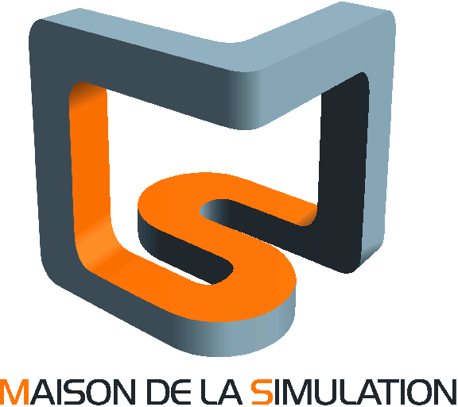
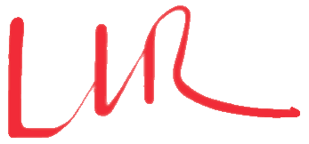
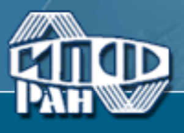
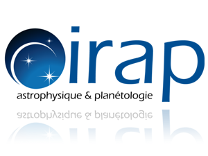
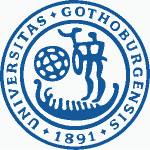
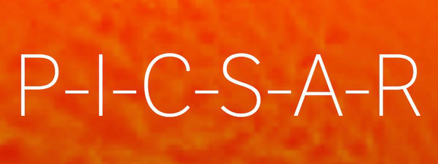
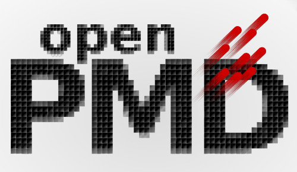

Partners
--------

.. |lpp| image:: _static/labs/lpp.png
  :width: 6em
  :align: middle

.. |intel| image:: _static/labs/intel.png
  :width: 6em
  :align: middle

.. |IRAMIS| image:: _static/labs/iramis.png
  :width: 6em
  :align: middle

.. rst-class:: noborder

+------------+---------------------------------------------------------------------------------------------------------+
| |mdls|     |                                                                                                         |
|            |   `Maison de la Simulation <http://www.maisondelasimulation.fr/>`_ (MdlS), USR 3441                     |
|            |                                                                                                         |
+            +---------------------------------------------------------------------------------------------------------+
|            |   * `Julien Dérouillat <julien.derouillat@cea.fr>`_                                                     |
|            |   * `Haithem Kallala <haithem.kallala@cea.fr>`_                                                         |
|            |   * `Mathieu Lobet <mathieu.lobet@cea.fr>`_                                                             |
|            |                                                                                                         |
+------------+---------------------------------------------------------------------------------------------------------+

.. rst-class:: noborder

+------------+-------------------------------------------------------------------------------------------------------------+
| |luli|     |                                                                                                             |
|            |   `Laboratoire pour l'Utilisation des Lasers Intenses <http://www.luli.polytechnique.fr>`_ (LULI), UMR 7605 |
|            |                                                                                                             |
+            +-------------------------------------------------------------------------------------------------------------+
|            |   * `Mickael Grech <mickael.grech@polytechnique.edu>`_                                                      |
|            |   * `Tommaso Vinci <tommaso.vinci@polytechnique.edu>`_                                                      |
|            |   * `Marco Chiaramello <marco.chiaramello@polytechnique.edu>`_                                              |
|            |   * `Anna Grassi <anna.grassi@polytechnique.edu>`_                                                          |
|            |   * `Frédéric Pérez <frederic.perez@polytechnique.edu>`_                                                    |
|            |   * `Caterina Riconda <caterina.riconda@upmc.fr>`_                                                          |
|            |                                                                                                             |
+------------+-------------------------------------------------------------------------------------------------------------+

.. rst-class:: noborder

+------------+---------------------------------------------------------------------------------------------------------+
| |llr|      |                                                                                                         |
|            |   `Laboratoire Leprince-Ringuet <http://polywww.in2p3.fr>`_ (LLR), UMR 7638                             |
+            +---------------------------------------------------------------------------------------------------------+
|            |                                                                                                         |
|            |   * `Arnaud Beck <beck@llr.in2p3.fr>`_                                                                  |
|            |   * `Imen Zemzemi <zemzemi@llr.in2p3.fr>`_                                                              |
|            |   * `Francesco Massimo <massimo@llr.in2p3.fr>`_                                                         |
+------------+---------------------------------------------------------------------------------------------------------+

.. rst-class:: noborder

+------------+----------------------------------------------------------------------------------------------------------------------+
| |idris|    |                                                                                                                      |
|            |   `Institut du developpement et des ressources en informatique scientifique <http://www.idris.fr>`_ (IDRIS), UPS 851 |
+            +----------------------------------------------------------------------------------------------------------------------+
|            |                                                                                                                      |
|            |   * `Marie Flé <marie.fle@idris.fr>`_                                                                                |
+------------+----------------------------------------------------------------------------------------------------------------------+

.. rst-class:: noborder

+------------+------------------------------------------------------------------------------------------------------------------+
| |lpp|      |                                                                                                                  |
|            |   `Laboratoire de Physique des Plasmas <http://www.lpp.fr>`_ (LPP), UMR 7648                                     |
+            +------------------------------------------------------------------------------------------------------------------+
|            |                                                                                                                  |
|            |   * `Nicolas Aunai <nicolas.aunai@lpp.polytechnique.fr>`_                                                        |
|            |   * `Jérémy Dargent <jeremy.dargent@lpp.polytechnique.fr>`_                                                      |
|            |                                                                                                                  |
+------------+------------------------------------------------------------------------------------------------------------------+

.. rst-class:: noborder

+------------+------------------------------------------------------------------------------------------------------------------+
| |IRAMIS|   |                                                                                                                  |
|            |   `Institut Rayonnement Matière de Saclay  <http://iramis.cea.fr>`_ (Iramis)                                     |
+            +------------------------------------------------------------------------------------------------------------------+
|            |                                                                                                                  |
|            |   * `Guillaume Bouchard <guillaume.bouchard@cea.fr>`_                                                            |
|            |                                                                                                                  |
+------------+------------------------------------------------------------------------------------------------------------------+

.. rst-class:: noborder

+------------+------------------------------------------------------------------------------------------------------------------+
| |IRAP|     |                                                                                                                  |
|            |   `Institut de Recherche en Astrophysique et Planétologie  <http://www.irap.omp.eu>`_ (IRAP)                     |
+            +------------------------------------------------------------------------------------------------------------------+
|            |                                                                                                                  |
|            |   * `Illya Plotnikov <Illya.Plotnikov@irap.omp.eu>`_                                                             |
|            |                                                                                                                  |
+------------+------------------------------------------------------------------------------------------------------------------+

.. rst-class:: noborder

+------------+------------------------------------------------------------------------------------------------------------------+
| |intel|    |                                                                                                                  |
|            |   `Intel <https://www.intel.fr>`_                                                                                |
+            +------------------------------------------------------------------------------------------------------------------+
|            |                                                                                                                  |
|            |   * `Asma Farjallah <asma.farjallah@intel.com>`_                                                                 |
|            |                                                                                                                  |
+------------+------------------------------------------------------------------------------------------------------------------+

.. rst-class:: noborder

+------------+------------------------------------------------------------------------------------------------------------------+
| |IAPRAS|   |                                                                                                                  |
|            |   `Institute of Applied Physics, Russian Academy of Science <http://www.ipfran.ru/>`_                            |
+            +------------------------------------------------------------------------------------------------------------------+
|            |                                                                                                                  |
|            |   * `Anton Golovanov <agolovanov@appl.sci-nnov.ru>`_                                                             |
|            |                                                                                                                  |
+------------+------------------------------------------------------------------------------------------------------------------+

.. rst-class:: noborder

+------------+------------------------------------------------------------------------------------------------------------------+
| |GOTHB|    |                                                                                                                  |
|            |   `University of Gothenburg <https://www.gu.se/english>`_                                                        |
+            +------------------------------------------------------------------------------------------------------------------+
|            |                                                                                                                  |
|            |   * `Evangelos Siminos <evangelos.siminos@physics.gu.se>`_                                                       |
|            |   * `Illia Thiele (Chalmers University) <illia-thiele@web.de>`_                                                  |
|            |                                                                                                                  |
+------------+------------------------------------------------------------------------------------------------------------------+

----

Related projects
^^^^^^^^^^^^^^^^

.. rst-class:: noborder

+------------+-----------------------------------------------------------------------------+
| |picsar|   |                                                                             |
|            |  The `PICSAR <https://picsar.net/>`_ library for high-performance PIC       |
|            |  algorithms is currently being incorporated in Smilei.                      |
+------------+-----------------------------------------------------------------------------+

.. rst-class:: noborder

+------------+-----------------------------------------------------------------------------+
| |openpmd|  |                                                                             |
|            |  The `OpenPMD <https://openpmd.org/>`_ standard for formatting PIC data     |
|            |  is progressively adopted in Smilei.                                        |
+------------+-----------------------------------------------------------------------------+

----

Acknowledgments
^^^^^^^^^^^^^^^

Financial support from the *Laboratoires d'Excellence*:

.. |plasapar| image:: _static/labs/plasapar.png
  :width: 130px
  :align: middle

.. |P2IO| image:: _static/labs/p2io.png
  :width: 6em
  :align: middle

.. rst-class:: noborder

+------------+-----------------------------------------------------------------------------+
| |plasapar| | | `Plas@Par <http://www.plasapar.com>`_, providing grants for 2 PhD thesis. |
+------------+-----------------------------------------------------------------------------+

.. rst-class:: noborder

+------------+-----------------------------------------------------------------------------+
| |palm|     | | Smilei was initiated thanks to the SimPLE junior chair                    |
|            | | granted by the labex `PALM <http://www.labex-palm.fr>`_.                  |
+------------+-----------------------------------------------------------------------------+

.. rst-class:: noborder

+------------+-----------------------------------------------------------------------------+
| |P2IO|     | | Francesco Massimo's 2 years post-doc was funded by the                    |
|            | | labex `P2IO <http://www.labex-p2io.fr>`_.                                 |
+------------+-----------------------------------------------------------------------------+

