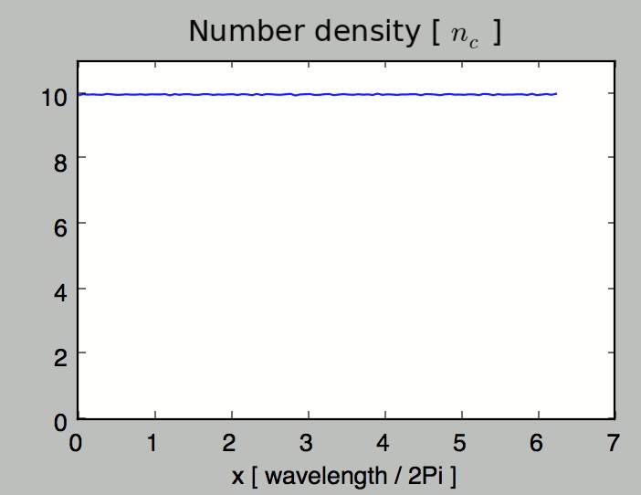
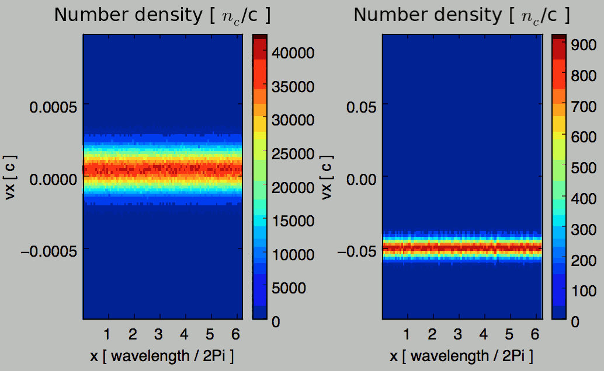

Post-process
------------

A python script *Diagnostics.py* is provided to view or extract data from all the diagnostics.
To use this script, you will need *python2.7* with some packages
(follow the :doc:`installation instructions <installation>`).

For an interactive mode, we recommend installing and running *ipython*::
  
  ipython -i scripts/Diagnostics.py

Otherwise, you can add the following command in your own script::
  
  execfile("scripts/Diagnostics.py")

----

Select a simulation
^^^^^^^^^^^^^^^^^^^

In a *python* command line (or script), invoke the following class to select
your :program:`Smilei` simulation.

.. py:class:: Smilei(results_path, show=True)

  * ``results_path``: Path to the directory where the results of the simulation are stored.
  
  * ``show``: ``True``/``False`` toggles whether the figures will actually plot on screen.

You can store this to a variable for later, for instance::

  S = Smilei("path/to/my/results")

----

Extract namelist information
^^^^^^^^^^^^^^^^^^^^^^^^^^^^

Once a simulation is selected as shown above, you can access the content of the namelist
using the variable ``namelist``::
  
  S = Smilei("path/to/my/results") # select a simulation
  print S.namelist.Main.timestep   # print the timestep
  print S.namelist.Main.geometry   # print the simulation dimensions

All the variables defined in the original file are copied into this variable.

Concerning components like :ref:`Species`, :ref:`ExtField` or :ref:`DiagProbe`, of which
several instances may exist, you can directly iterate over them::
  
  for species in S.namelist.Species:
      print "species "+species.species_type+" has mass "+str(species.mass)

You can also access to a specific component by referencing its number::
  
  F = S.namelist.ExtField[0]  # get the first external field
  print "An external field "+F.field+" was applied"

In the case of the species, you can also obtain a given species by its name (or 
``species_type``)::
  
  species = S.namelist.Species["electron1"]
  print "species "+species.species_type+" has mass "+str(species.mass)

----

Select a diagnostic
^^^^^^^^^^^^^^^^^^^

Once a simulation is selected, several methods are available to choose various diagnostics.

Checkout the namelist documentation to find out which diagnostics are included in Smilei:
:ref:`scalars <DiagScalar>`, :ref:`fields <DiagFields>`, :ref:`probes <DiagProbe>`
and :ref:`particles <DiagParticles>`.

.. py:method:: Smilei.Scalar(scalar=None, timesteps=None, units=[""], data_log=False, **kwargs)
  
  * ``scalar``: The name of the scalar.
     | If not given, then a list of available scalars is printed.
  * ``timesteps``: The requested timestep(s).
     | If omitted, all timesteps are used.
     | If one number  given, the nearest timestep available is used.
     | If two numbers given, all the timesteps in between are used.
  * ``units``: A unit specification (see :ref:`units`)
  * ``data_log``:
     | If ``True``, then :math:`\log_{10}` is applied to the output.
  * Other keyword arguments (``kwargs``) are available, the same as the function :py:func:`plot`.

  **Example**::
    
    S = Smilei("path/to/my/results")
    Diag = S.Scalar("Utot")

.. py:method:: Smilei.Field(field=None, timesteps=None, slice=None, units=[""], data_log=False, **kwargs)
  
  * ``timesteps``, ``units``, ``data_log``: same as before.
  * ``field``: The name of a field (``"Ex"``, ``"Ey"``, etc.)
     | If not given, then a list of available fields is printed.
     | The string can also be an operation between several fields, such as ``"Jx+Jy"``.
  * ``slice``: A selection of rows or columns. This parameter is used to reduce the number of dimensions of the array.
     | Syntax 1: ``slice = { axis : "all", ... }``
     | Syntax 2: ``slice = { axis : location, ... }``
     | Syntax 3: ``slice = { axis : [begin, end] , ... }``
     | ``axis`` must be ``"x"``, ``"y"`` or ``"z"``.
     | The chosen axes will be removed:
     | - With syntax 1, an average is performed over all the axis.
     | - With syntax 2, only the bin closest to ``location`` is kept.
     | - With syntax 3, an average is performed between ``begin`` and ``end``.
     | Example: ``slice = {"x":[4,5]}`` will average for :math:`x` within [4,5].
  * Other keyword arguments (``kwargs``) are available, the same as the function :py:func:`plot`.

  **Example**::
    
    S = Smilei("path/to/my/results")
    Diag = S.Field("Ex", slice = {"x":[4,5]})

.. py:method:: Smilei.Probe(probeNumber=None, field=None, timesteps=None, slice=None, units=[""], data_log=False, **kwargs)
  
  * ``timesteps``, ``units``, ``data_log``: same as before.
  * ``probeNumber``: number of the probe (the first one has number 0).
     | If not given, a list of available probes is printed.
  * ``field``: name of the field (``"Bx"``, ``"By"``, ``"Bz"``, ``"Ex"``, ``"Ey"``, ``"Ez"``, ``"Jx"``, ``"Jy"``, ``"Jz"`` or ``"Rho"``).
     | If not given, then a list of available fields is printed.
     | The string can also be an operation between several fields, such as ``"Jx+Jy"``.
  * ``slice`` is very similar to that of :py:meth:`Field`, but it can only accept two axes: ``"axis1"``, ``"axis2"``.
     | For instance, ``slice={"axis1":"all"}``. Note that ``"axis1"`` and ``"axis2"`` are not necessarily :math:`x` or :math:`y` because the probe mesh may be rotated.
  * Other keyword arguments (``kwargs``) are available, the same as the function :py:func:`plot`.

  **Example**::
    
    S = Smilei("path/to/my/results")
    Diag = S.Probe(0, "Ex")

.. py:method:: Smilei.ParticleDiagnostic(diagNumber=None, timesteps=None, slice=None, units=[""], data_log=False, **kwargs)
  
  * ``timesteps``, ``units``, ``data_log``: same as before.
  * ``diagNumber``: number of the particle diagnostic (the first one has number 0).
     | If not given, a list of available particle diagnostics is printed.
     | It can also be an operation between several particle diagnostics.
     | For example, ``"#0/#1"`` computes the division by diagnostics 0 and 1.
  * ``slice``: A selection of rows or columns. This parameter is used to reduce the number of dimensions of the array.
     | Syntax 1: ``slice = { axis : "all", ... }``
     | Syntax 2: ``slice = { axis : location, ... }``
     | Syntax 3: ``slice = { axis : [begin, end] , ... }``
     
     ``axis`` must be ``"x"``, ``"y"``, ``"z"``, ``"px"``, ``"py"``, ``"pz"``, ``"p"``, ``"gamma"``, ``"ekin"``, ``"vx"``, ``"vy"``, ``"vz"``, ``"v"`` or ``"charge"``.
     
     | The chosen axes will be removed:
     | - With syntax 1, a **sum** is performed over all the axis.
     | - With syntax 2, only the bin closest to ``location`` is kept.
     | - With syntax 3, a **sum** is performed between ``begin`` and ``end``.
     | Example: ``slice={"x":[4,5]``} will sum all the data for x within [4,5].
  * Other keyword arguments (``kwargs``) are available, the same as the function :py:func:`plot`.

  **Example**::
    
    S = Smilei("path/to/my/results")
    Diag = S.ParticleDiagnostic(1)

.. py:method:: Smilei.TrackParticles(species=None, select="", axes=[], timesteps=None, length=None, units=[""], skipAnimation=False, **kwargs)
  
  * ``timesteps``, ``units``: same as before.
  * ``species``: the name of a tracked-particle species.
     | If omitted, a list of available tracked-particle species is printed.
  * ``select``: Instructions for selecting particles among those available.
     | Syntax 1: ``select="any(times, condition)"``
     | Syntax 2: ``select="all(times, condition)"``
     | ``times`` is a selection of timesteps ``t``, for instance ``t>50``.
     | ``condition`` is a condition on particles properties  (``x``, ``y``, ``z``, ``px``, ``py``, ``pz``), for instance ``px>0``.
     | Syntax 1 selects particles satisfying ``condition`` for at least one of the ``times``.
     | Syntax 2 selects particles satisfying ``condition`` at all ``times``.
     | **Example:** ``select="all(t<40, px<0.1)"`` selects particles that kept :math:`p_x<0.1` until timestep 40.
     | **Example:** ``select="any(t>0, px>1.)"`` selects particles that reached :math:`p_x>1` at some point.
     | It is possible to make logical operations: ``+`` is *OR*; ``*`` is *AND*; ``-`` is *NOT*.
     | **Example:** ``select="any((t>30)*(t<60), px>1) + all(t>0, (x>1)*(x<2))"``
  * ``axes``: A list of axes for plotting the trajectories.
     | Each axis is ``"x"``, ``"y"``, ``"z"``, ``"px"``, ``"py"`` or ``"pz"``.
     | **Example:** ``axes = ["x"]`` corresponds to :math:`x` versus time. 
     | **Example:** ``axes = ["x","y"]`` correspond to 2-D trajectories. 
     | **Example:** ``axes = ["x","px"]`` correspond to phase-space trajectories.
  * ``length``: The length of each plotted trajectory, in number of timesteps.
  * ``skipAnimation``: when ``True``, the :py:func:`plot` will directly show the full trajectory.
  * Other keyword arguments (``kwargs``) are available, the same as the function :py:func:`plot`.

  **Example**::
    
    S = Smilei("path/to/my/results")
    Diag = S.TrackParticles("electrons", axes=["px","py"])

----

.. _units:

Specifying units
^^^^^^^^^^^^^^^^

By default, all the diagnostics data is in code units (see :doc:`units`).

To change the units, all the methods :py:meth:`Scalar`, :py:meth:`Field`, :py:meth:`Probe`,
:py:meth:`ParticleDiagnostic` and :py:meth:`TrackParticles` support a ``units`` argument.
It has three different syntaxes:

1. **A list**, for example ``units = ["um/ns", "feet", "W/cm^2"]``
   
   In this case, any quantity found to be of the same dimension as one of these units
   will be converted.

2. **A dictionary**, for example ``units = {"x":"um", "y":"um", "v":"Joule"}``
   
   In this case, we specify the units separately for axes ``x`` and ``y``, and for the
   data values ``v``.

3. **A** ``Units`` **object**, for example ``units = Units("um/ns", "feet", x="um")``
   
   This version combines the two previous ones.

.. warning::
  Changing units requires the `Pint module <https://pypi.python.org/pypi/Pint/>`_ .

----

Obtain the data as an array
^^^^^^^^^^^^^^^^^^^^^^^^^^^

.. py:method:: Smilei.Scalar.getData()
               Smilei.Field.getData()
               Smilei.Probe.getData()
               Smilei.ParticleDiagnostic.getData()
  
  Returns a list of the data arrays, for each timestep requested.

.. py:method:: Smilei.Scalar.get()
               Smilei.Field.get()
               Smilei.Probe.get()
               Smilei.ParticleDiagnostic.get()
  
  Similar to :py:meth:`getData`, but returns more things as a python dictionary:
  
  * ``get()["data"]`` is the same as ``getData()``.
  * ``get()["times"]`` is a list of the requested timesteps.
  * ``get()[myaxis]`` gives the locations of the axis bins. For instance ``get()["x"]``.

  **Example**::
    
    S = Smilei("path/to/my/results")
    Diag = S.ParticleDiagnostic(diagNumber=3, slice={"ekin":[1,10]})
    result = Diag.get()

..

  This will take the particle diagnostic #3 and sum for all energies between 1 and 10.
  The results are stored in the variable ``result``.
  The data can be accessed with ``result["data"]``.
  If one of the axes is ``"x"``, you can access the locations of the bins with ``result["x"]``. 

----

Plot the data
^^^^^^^^^^^^^

.. py:method:: Smilei.Scalar.plot(...)
               Smilei.Field.plot(...)
               Smilei.Probe.plot(...)
               Smilei.ParticleDiagnostic.plot(...)
               Smilei.TrackParticles.plot(...)
  
  All these methods have the same arguments described below.

.. py:function:: plot(figure=1, vmin=None, vmax=None, xmin=None, xmax=None, \
                      ymin=None, ymax=None, xfactor=None, yfactor=None, streakPlot=False, \
                      movie="", fps=10, dpi=100, saveAs=None)
  
  Displays the data. All arguments of this method can be supplied to :py:meth:`Scalar`,
  :py:meth:`Field`, :py:meth:`Probe`, :py:meth:`ParticleDiagnostic` or 
  :py:meth:`TrackParticles` as well.
  
  | If the data is 1D, it is plotted as a **curve**, and is animated for all requested timesteps.
  | If the data is 2D, it is plotted as a **map**, and is animated for all requested timesteps.
  | If the data is 0D, it is plotted as a **curve** as function of time.
  
  * ``figure``: The figure number that is passed to matplotlib.
  * ``vmin``, ``vmax``: data value limits.
  * ``xmin``, ``xmax``, ``ymin``, ``ymax``: axes limits.
  * ``xfactor``, ``yfactor``: factors to rescale axes.
  * ``streakPlot``: when ``True``, will not be an animation, but will
    have time on the vertical axis instead (only for 1D data).
  * ``movie``: name of a file to create a movie, such as ``"movie.avi"``
     | If ``movie=""`` no movie is created.
  * ``fps``: number of frames per second (only if movie requested).
  * ``dpi``: number of dots per inch (only if movie requested).
  * ``saveAs``: name of a directory where to save each frame as figures.
    You can even specify a filename such as ``mydir/prefix.png`` and it will automatically
    make successive files showing the timestep: ``mydir/prefix0.png``, ``mydir/prefix1.png``,
    etc.

  **Example**::
    
    S = Smilei("path/to/my/results")
    S.ParticleDiagnostic(1).plot(vmin=0, vmax=1e14)

..

  This takes the particle diagnostic #1 and plots the resulting array in figure 1 from 0 to 3e14.

----

Simultaneous plotting of multiple diagnostics
^^^^^^^^^^^^^^^^^^^^^^^^^^^^^^^^^^^^^^^^^^^^^

.. py:function:: multiPlot(diag1, diag2, ... , figure=1, shape=None, movie="", \
                           fps=15, dpi=200, saveAs=None, skipAnimation=False)
  
  * ``diag1``, ``diag2``, etc.
     | Diagnostics prepared by ``Scalar()``, ``Field()``, ``Probe()`` or ``ParticleDiagnostic()``
  * ``figure``: The figure number that is passed to matplotlib.
  * ``shape``: The arrangement of plots inside the figure.
     | For instance, ``[2, 1]`` makes two plots stacked vertically, and ``[1, 2]`` makes two plots stacked horizontally. If absent, stacks plots vertically.
  * ``movie`` : filename to create a movie.
  * ``fps`` : frames per second for the movie.
  * ``dpi`` : resolution of the movie.
  * ``saveAs``: name of a directory where to save each frame as figures.
    You can even specify a filename such as ``mydir/prefix.png`` and it will automatically
    make successive files showing the timestep: ``mydir/prefix0.png``, ``mydir/prefix1.png``, etc.
  * ``skipAnimation`` : True/False toggles going directly to the last frame.
  
  **Example**::
    
    S = Smilei("path/to/my/results")
    A = S.Probe(probeNumber=0, field="Ex")
    B = S.ParticleDiagnostic(diagNumber=1)
    multiPlot( A, B, figure=1 )

..

  This plots a probe and a particle diagnostic on the same figure, and makes an animation for all available timesteps.

----

Advanced plotting options
^^^^^^^^^^^^^^^^^^^^^^^^^
In addition to ``figure``, ``vmin``, ``vmax``, ``xmin``, ``xmax``, ``ymin`` and ``ymax``,
there are many more optional arguments. They are directly passed to the *matplotlib* package.

Options for the figure: ``figsize``, ``dpi``, ``facecolor``, ``edgecolor``

    Please refer to `matplotlib's figure options <http://matplotlib.org/api/pyplot_api.html#matplotlib.pyplot.figure>`_.

Options for the axes frame: ``aspect``, ``axis_bgcolor``, ``frame_on``, ``position``, ``title``, ``visible``,
``xlabel``, ``xscale``, ``xticklabels``, ``xticks``, ``ylabel``, ``yscale``, ``yticklabels``, ``yticks``, ``zorder``

    Please refer to `matplotlib's axes options <http://matplotlib.org/api/axes_api.html#matplotlib.axes.Axes.set>`_.

Options for the lines: ``color``, ``dashes``, ``drawstyle``, ``fillstyle``, ``label``, ``linestyle``, ``linewidth``,
``marker``, ``markeredgecolor``, ``markeredgewidth``, ``markerfacecolor``, ``markerfacecoloralt``,
``markersize``, ``markevery``, ``visible``, ``zorder``

    Please refer to `matplotlib's line options <http://matplotlib.org/api/pyplot_api.html#matplotlib.pyplot.plot>`_.

Options for the image: ``cmap``, ``aspect``, ``interpolation``

    Please refer to `matplotlib's image options <http://matplotlib.org/api/pyplot_api.html#matplotlib.pyplot.imshow>`_.

Options for the colorbar: ``cbaspect``, ``orientation``, ``fraction``, ``pad``, ``shrink``, ``anchor``, ``panchor``,
``extend``, ``extendfrac``, ``extendrect``, ``spacing``, ``ticks``, ``format``, ``drawedges``

    Please refer to `matplotlib's colorbar options <http://matplotlib.org/api/pyplot_api.html#matplotlib.pyplot.colorbar>`_.

Options for the tick labels: ``style_x``, ``scilimits_x``, ``useOffset_x``, ``style_y``, ``scilimits_y``, ``useOffset_y``

    Please refer to `matplotlib's tick options <http://matplotlib.org/api/axes_api.html#matplotlib.axes.Axes.ticklabel_format>`_.

**Example**:

  To choose a gray colormap of the image, use ``cmap="gray"``::
    
    S = Smilei("path/to/my/results")
    S.ParticleDiagnostic(0, figure=1, cmap="gray") .plot()

..

  Many colormaps are available from the *matplotlib* package. With ``cmap=""``, you will get a list of available colormaps.

----

Update the plotting options
^^^^^^^^^^^^^^^^^^^^^^^^^^^

Passing arguments to :py:meth:`plot` or :py:meth:`set` automatically 
updates the plotting options.

.. py:method:: Smilei.Scalar.set(*args)
               Smilei.Field.set(*args)
               Smilei.Probe.set(*args)
               Smilei.ParticleDiagnostic.set(*args)
  
  
  **Example**::
    
    S = Smilei("path/to/my/results")
    A = ParticleDiagnostic(diagNumber=0, figure=1, vmax=1)
    A.plot( figure=2 )
    A.set( vmax=2 )
    A.plot()

----

Tutorial
^^^^^^^^

Before you start this tutorial, :ref:`learn how to run Smilei <run>`.

.. rubric:: 1. Running the test case

In the ``benchmarks`` directory, we provide a test case ``tst1d_6_particle_diagnostic.py``.
This case is very simple: it consists of a one-dimensional uniform neutral
plasma composed by ions and electrons. The electrons all have a drift velocity of
:math:`0.05c`.

Run this case using :program:`smilei` and collect the results in a directory
of your choice. In this tutorial, we suppose that the results are in the directory
``tst1d_6_particle_diagnostic``.

An example of the commands you may use from a UNIX *shell* is::

  mkdir tst1d_6_particle_diagnostic
  cp benchmarks/tst1d_6_particle_diagnostic.py tst1d_6_particle_diagnostic
  cd tst1d_6_particle_diagnostic
  mpiexec -np 1 ../smilei tst1d_6_particle_diagnostic.py
  cd ..

.. rubric:: 2. Starting python and listing available diagnostics

From the same terminal, launch *python* using the command::

  python -i scripts/Diagnostics.py

You are now in the *python* prompt.
Obtain a list of available particle diagnostics using::

  >>> S = Smilei('tst1d_6_particle_diagnostic')
  >>> S.ParticleDiagnostic()
  Printing available particle diagnostics:
  ----------------------------------------
  Diag#0 - density of species # 1 
      Every 4 timesteps, averaging over 2 timesteps
      x from 0.0 to 6.28319 in 100 steps 
      vx from -0.1 to 0.1 in 100 steps 
  Diag#1 - density of species # 0 
      Every 4 timesteps, no time-averaging
      x from 0.0 to 6.28319 in 100 steps 
      vx from -0.001 to 0.001 in 100 steps 
  Diag#2 - density of species # 1 
      Every 10 timesteps, averaging over 5 timesteps
      ekin from 0.0001 to 0.1 in 100 steps  [ LOG SCALE ] 

Look at the diagnostic #0: it is the density of species #1 (here, electrons) with two
axes: the position :math:`x` and the velocity :math:`v_x`.
In other words, it is the phase-space of electrons.

.. rubric:: 3. Plot a diagnostic result at :math:`t=0`

To plot the phase-space in the initial conditions, use ::

  >>> S.ParticleDiagnostic(0, timesteps=0 ).plot()

A window appears (see :numref:`Tuto1`). We can see that the electrons have indeed
a drift velocity of :math:`0.05c`.

.. _Tuto1:

.. figure:: _static/ParticleDiagTutorial1.png
  :width: 7cm
  
  Phase-space of electrons at :math:`t=0`.

To obtain the equivalent plot for the ions, use the diagnostic #1 with the command::

  >>> S.ParticleDiagnostic(1, timesteps=0 ).plot()

This results in the plot in :numref:`Tuto2`. The ions have a zero average velocity.

.. _Tuto2:

.. figure:: _static/ParticleDiagTutorial2.png
  :width: 7cm
  
  Phase-space of ions at :math:`t=0`.

.. rubric:: 4. Plot sections ("slices") of the array

The diagnostic #0 that we plotted in :numref:`Tuto1` is the electron phase-space.
Let us say we want to sum over the data that is contained between :math:`x=3` and 4,
and plot the result as a function of :math:`v_x`.
This is achieved by the argument ``slice``::

  >>> S.ParticleDiagnostic(0, timesteps=0, slice={"x":[3,4]} ).plot()

The result is shown in :numref:`Tuto3`.
We can see that the peak is located at :math:`v_x=0.05c`, as we have already found before.

.. _Tuto3:

.. figure:: _static/ParticleDiagTutorial3.png
  :width: 7cm
  
  :math:`v_x` -distribution of electrons contained between :math:`x=3` and 4, at :math:`t=0`.

Now, let us do the slice on :math:`v_x` instead of :math:`x`::
  
  >>> S.ParticleDiagnostic(0, timesteps=0, slice={"vx":"all"}).plot(vmin=0, vmax=11)

By choosing ``"all"`` in the argument ``slice``, all the velocities :math:`v_x` are sliced.
In our case, as our diagnostic goes from :math:`v_x=-0.1` to :math:`0.11`, these limits are used.
Note that parameters ``vmin`` and ``vmax`` are used to have a nicer plot.
The result is shown in :numref:`Tuto4`. We obtain a constant density of :math:`10\,n_c`,
which is what was chosen in the input file.

.. _Tuto4:

  
  :math:`x` -distribution of electrons contained between :math:`v_x=-0.1` and :math:`0.1`, at :math:`t=0`.

.. rubric:: 5. Make animated plots

To have an animation of the electron phase-space with time, you have to remove
the ``timesteps`` argument::
  
  >>> S.ParticleDiagnostic( 0 ).plot()

You will see the electron velocity oscillate from :math:`0.05c` to :math:`-0.05c`.
This is due to the fact that we are simulating a plasma wave with infinite wavelength.

Note that all the available timesteps are animated. If you want to only animate
between timesteps 20 and 60, use::
  
  >>> S.ParticleDiagnostic( 0, timesteps=[20,60] ).plot()

.. rubric:: 6. Make multiple plots on the same figure

Use the following commands to have the animation with both electrons and ions
on the same figure::
  
  >>> A = S.ParticleDiagnostic( 0 )
  >>> B = S.ParticleDiagnostic( 1 )
  >>> multiPlot(A, B, shape=[1,2])

A snapshot of this double plot is given in :numref:`Tuto5`.

.. _Tuto5:

  
  Two plots on the same figure.

If the two plots are 1D, and are both of the same type, then they will
automatically be plotted on the same axes::
  
  >>> A = S.ParticleDiagnostic(0,slice={"x":"all"})
  >>> B = S.ParticleDiagnostic(1,slice={"x":"all"})
  >>> multiPlot(A, B)

This is shown in :numref:`Tuto6` where you can see the two curves in blue and green.

.. _Tuto6:

.. figure:: _static/ParticleDiagTutorial6.png
  :width: 6cm
  
  Two curves in the same axes.

.. rubric:: 7. Make a plot as a function of time

If you have sliced all the axes, then you obtain a 0-dimensional array (a scalar).
In this case, the plots are automatically done as a function of time
(they are not animated).
In our case, use::
  
  >>> A=S.ParticleDiagnostic(3, slice={"ekin":"all"})
  >>> B=S.ParticleDiagnostic(3, slice={"ekin":[0,0.001]})
  >>> multiPlot(A,B)

.. _Tuto7:

.. figure:: _static/ParticleDiagTutorial7.png
  :width: 6.5cm
  
  Blue: total density *vs* time. Green: density of slow electrons *vs* time.

The diagnostic that we employ here (#3) is the energy spectrum of electrons:
the axis is along ``ekin`` which is the kinetic energy.
In the first line of the code above, we are using a slice ``"ekin":"all"``.
Consequently, all the electrons, with all energies, will be summed, thus obtaining
a scalar value equal to the total plasma density. In the second line of code,
we are using ``"ekin":[0,0.001]``, which means that only the electrons below
0.511 keV are considered.

Both these quantities ``A`` and ``B`` are scalars, not arrays: they will be
plotted as a function of time. This is shown in :numref:`Tuto7` where you can see
``A`` in blue and ``B`` in green. ``A`` represents all the electrons, and indeed,
their density is constant. ``B`` represents only the slower electrons,
and their number varies in time because, as we have seen before,
all electrons oscillate and they do not have a constant energy.
This appears on the green curve as an oscillating density.

.. rubric:: 8. Make an operation between diagnostics

Let us consider again the diagnostic #0, which is the density of electrons as a
function of :math:`x` and :math:`v_x`. Diagnostic #2 is very similar to #0 as it has
the same axes :math:`x` and :math:`v_x`, but it has ``ouput="px_density"`` instead
of ``ouput="density"``. Consequently, if we divide #2 by #0, we will obtain the
average value :math:`\left<p_x\right>` as a function of :math:`x` and :math:`v_x`.
To do this operation, we need to indicate ``"#2/#0"`` instead of the diagnostic number::
  
  >>> S.ParticleDiagnostic("#2/#0").plot()

We obtain the plot of Figure :numref:`Tuto8`, which is actually not very helpful
because :math:`\left<p_x\right>` varies with :math:`v_x`.

.. _Tuto8:

.. figure:: _static/ParticleDiagTutorial8.png
  :width: 8cm
  
  :math:`\left<p_x\right>` as a function of :math:`x` and :math:`v_x`.

To have something nicer, let us slice all axes with::
  
  >>> S.ParticleDiagnostic("#2/#0", slice={"x":"all","vx":"all"}).plot()

We obtain :numref:`Tuto9` which nicely shows :math:`\left<p_x\right>` as a function of time.
This value oscillates, as we have seen previously.

.. _Tuto9:

.. figure:: _static/ParticleDiagTutorial9.png
  :width: 7.5cm
  
  :math:`\left<p_x\right>` as a function of time.

