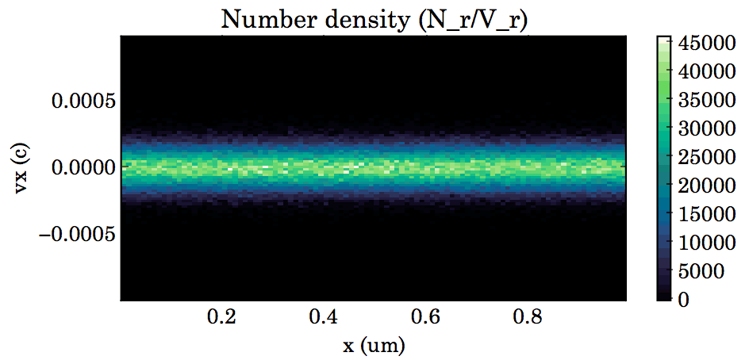
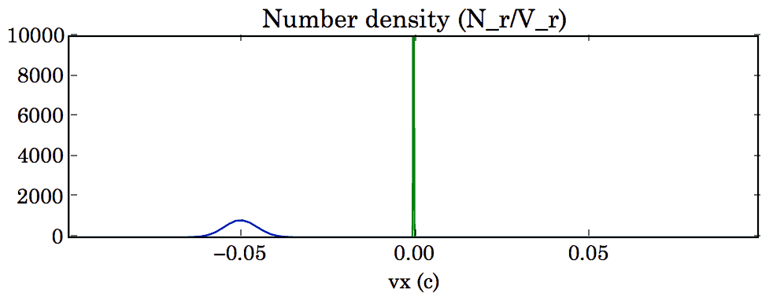
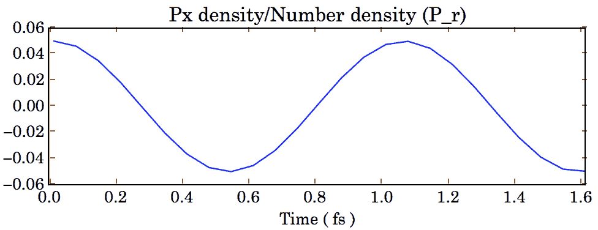

Post-process
------------

This page describes the usage of the python module ``Smilei`` for extracting, viewing
and post-processing simulation data. First, you need to :ref:`install this module <installModule>`.

----

Open a simulation
^^^^^^^^^^^^^^^^^^^

In a *python* command line (or script), invoke the following class to open
your :program:`Smilei` simulation. Note that several simulations can be opened at once, 
as long as they correspond to several :ref:`restarts <Checkpoints>` of the same simulation.

.. py:class:: Smilei(results_path=".", show=True, referenceAngularFrequency_SI=None, verbose=True)

  * ``results_path``: path or list of paths to the directory-ies
    where the results of the simulation-s are stored. It can also contain wildcards,
    such as ``*`` and ``?`` in order to include several simulations at once.
  
  * ``show``: if True, figures will actually plot on screen. If False, make sure that
    you have not loaded another simulation or the matplotlib package. You may need to 
    restart python.
  
  * ``referenceAngularFrequency_SI``: overrides the value of the simulation parameter
    :py:data:`referenceAngularFrequency_SI`, in order to re-scale units.
  
  * ``verbose``: if True, more information is displayed while post-processing.

**Example**::

  S = Smilei("path/to/my/results")

Once a simulation is opened, several methods are available to find information on the
namelist or open various diagnostics. Checkout the namelist documentation to find out
which diagnostics are included in Smilei: :ref:`scalars <DiagScalar>`,
:ref:`fields <DiagFields>`, :ref:`probes <DiagProbe>` and :ref:`particles <DiagParticles>`.

----

Extract namelist information
^^^^^^^^^^^^^^^^^^^^^^^^^^^^

Once a simulation is opened as shown above, you can access the content of the namelist
using the variable ``namelist``::
  
  S = Smilei("path/to/my/results") # Open a simulation
  print S.namelist.Main.timestep   # print the timestep
  print S.namelist.Main.geometry   # print the simulation dimensions

All the variables defined in the original namelist are copied into this variable.

Concerning components like :ref:`Species`, :ref:`ExtField` or :ref:`DiagProbe`, of which
several instances may exist, you can directly iterate over them::
  
  for species in S.namelist.Species:
      print "species "+species.species_type+" has mass "+str(species.mass)

You can also access to a specific component by referencing its number::
  
  F = S.namelist.ExtField[0]  # get the first external field
  print "An external field "+F.field+" was applied"

In the case of the species, you can also obtain a given species by its name (or 
``species_type``)::
  
  species = S.namelist.Species["electron1"]
  print "species "+species.species_type+" has mass "+str(species.mass)

----

Open a Scalar diagnostic
^^^^^^^^^^^^^^^^^^^^^^^^

.. py:method:: Smilei.Scalar(scalar=None, timesteps=None, units=[""], data_log=False, **kwargs)
  
  * ``scalar``: The name of the scalar.
     | If not given, then a list of available scalars is printed.
  * ``timesteps``: The requested timestep(s).
     | If omitted, all timesteps are used.
     | If one number  given, the nearest timestep available is used.
     | If two numbers given, all the timesteps in between are used.
  * ``units``: A unit specification (see :ref:`units`)
  * ``data_log``:
     | If ``True``, then :math:`\log_{10}` is applied to the output.
  * Other keyword arguments (``kwargs``) are available, the same as the function :py:func:`plot`.

**Example**::
  
  S = Smilei("path/to/my/results")
  Diag = S.Scalar("Utot")

----

Open a Field diagnostic
^^^^^^^^^^^^^^^^^^^^^^^

.. py:method:: Smilei.Field(diagNumber=None, field=None, timesteps=None, slice=None, units=[""], data_log=False, **kwargs)
  
  * ``timesteps``, ``units``, ``data_log``: same as before.
  * ``diagNumber``: The number of the fields diagnostic
     | If not given, then a list of available diagnostic numbers is printed.
  * ``field``: The name of a field (``"Ex"``, ``"Ey"``, etc.)
     | If not given, then a list of available fields is printed.
     | The string can also be an operation between several fields, such as ``"Jx+Jy"``.
  * ``slice``: A selection of rows or columns. This parameter is used to reduce the number of dimensions of the array.
     | Syntax 1: ``slice = { axis : "all", ... }``
     | Syntax 2: ``slice = { axis : location, ... }``
     | Syntax 3: ``slice = { axis : [begin, end] , ... }``
     | ``axis`` must be ``"x"``, ``"y"`` or ``"z"``.
     | The chosen axes will be removed:
     | - With syntax 1, an average is performed over all the axis.
     | - With syntax 2, only the bin closest to ``location`` is kept.
     | - With syntax 3, an average is performed between ``begin`` and ``end``.
     | Example: ``slice = {"x":[4,5]}`` will average for :math:`x` within [4,5].
  * ``stride``: step size for reading the grid. If the grid is too large, use a stride > 1
    to reduce the amount of data.
  * Other keyword arguments (``kwargs``) are available, the same as the function :py:func:`plot`.

**Example**::
  
  S = Smilei("path/to/my/results")
  Diag = S.Field(0, "Ex", slice = {"x":[4,5]})

----

Open a Probe diagnostic
^^^^^^^^^^^^^^^^^^^^^^^

.. py:method:: Smilei.Probe(probeNumber=None, field=None, timesteps=None, slice=None, units=[""], data_log=False, **kwargs)
  
  * ``timesteps``, ``units``, ``data_log``: same as before.
  * ``probeNumber``: number of the probe (the first one has number 0).
     | If not given, a list of available probes is printed.
  * ``field``: name of the field (``"Bx"``, ``"By"``, ``"Bz"``, ``"Ex"``, ``"Ey"``, ``"Ez"``, ``"Jx"``, ``"Jy"``, ``"Jz"`` or ``"Rho"``).
     | If not given, then a list of available fields is printed.
     | The string can also be an operation between several fields, such as ``"Jx+Jy"``.
  * ``slice`` is very similar to that of :py:meth:`Field`, but it can only accept two axes: ``"axis1"``, ``"axis2"``.
     | For instance, ``slice={"axis1":"all"}``. Note that ``"axis1"`` and ``"axis2"`` are not necessarily :math:`x` or :math:`y` because the probe mesh may be rotated.
  * Other keyword arguments (``kwargs``) are available, the same as the function :py:func:`plot`.

**Example**::
  
  S = Smilei("path/to/my/results")
  Diag = S.Probe(0, "Ex")

----

Open a Particle diagnostic
^^^^^^^^^^^^^^^^^^^^^^^^^^

.. py:method:: Smilei.ParticleDiagnostic(diagNumber=None, timesteps=None, slice=None, units=[""], data_log=False, stride=1, **kwargs)
  
  * ``timesteps``, ``units``, ``data_log``: same as before.
  * ``diagNumber``: number of the particle diagnostic (the first one has number 0).
     | If not given, a list of available particle diagnostics is printed.
     | It can also be an operation between several particle diagnostics.
     | For example, ``"#0/#1"`` computes the division by diagnostics 0 and 1.
  * ``slice``: a selection of rows or columns. This parameter is used to reduce the number of dimensions of the array.
     | Syntax 1: ``slice = { axis : "all", ... }``
     | Syntax 2: ``slice = { axis : location, ... }``
     | Syntax 3: ``slice = { axis : [begin, end] , ... }``
     
     ``axis`` must be ``"x"``, ``"y"``, ``"z"``, ``"px"``, ``"py"``, ``"pz"``, ``"p"``, ``"gamma"``, ``"ekin"``, ``"vx"``, ``"vy"``, ``"vz"``, ``"v"`` or ``"charge"``.
     
     | The chosen axes will be removed:
     | - With syntax 1, a **sum** is performed over all the axis.
     | - With syntax 2, only the bin closest to ``location`` is kept.
     | - With syntax 3, a **sum** is performed between ``begin`` and ``end``.
     | Example: ``slice={"x":[4,5]``} will sum all the data for x within [4,5].
  * ``stride``: step size for reading the grid. If the grid is too large, use a stride > 1
    to reduce the amount of data.
  * Other keyword arguments (``kwargs``) are available, the same as the function :py:func:`plot`.

**Example**::
  
  S = Smilei("path/to/my/results")
  Diag = S.ParticleDiagnostic(1)

----

Open a Screen diagnostic
^^^^^^^^^^^^^^^^^^^^^^^^^^

.. py:method:: Smilei.Screen(diagNumber=None, timesteps=None, slice=None, units=[""], data_log=False, stride=1, **kwargs)
  
  * ``timesteps``, ``units``, ``data_log``: same as before.
  * ``diagNumber``: number of the screen diagnostic (the first one has number 0).
     | If not given, a list of available screen diagnostics is printed.
     | It can also be an operation between several screen diagnostics.
     | For example, ``"#0/#1"`` computes the division by diagnostics 0 and 1.
  * ``slice``: identical to that of particle diagnostics.
  * ``stride``: identical to that of particle diagnostics.
  * Other keyword arguments (``kwargs``) are available, the same as the function :py:func:`plot`.

**Example**::
  
  S = Smilei("path/to/my/results")
  Diag = S.Screen(0)

----

Open a Track diagnostic
^^^^^^^^^^^^^^^^^^^^^^^

.. py:method:: Smilei.TrackParticles(species=None, select="", axes=[], timesteps=None, sort=True, length=None, units=[""], **kwargs)
  
  * ``timesteps``, ``units``: same as before.
  * ``species``: the name of a tracked-particle species.
     | If omitted, a list of available tracked-particle species is printed.
  * ``select``: Instructions for selecting particles among those available.
    A detailed explanation is provided below
  * ``axes``: A list of axes for plotting the trajectories.
     Each axis is ``"x"``, ``"y"``, ``"z"``, ``"px"``, ``"py"``, ``"pz"``, ``"q"`` (the charge) or ``"w"`` (the statistical weight).
     
     | **Example:** ``axes = ["x"]`` corresponds to :math:`x` versus time. 
     | **Example:** ``axes = ["x","y"]`` correspond to 2-D trajectories. 
     | **Example:** ``axes = ["x","px"]`` correspond to phase-space trajectories.
  * ``sort``: If ``False``, the particles are not sorted by ID. This can save significant
    time, but prevents plotting, exporting to VTK, and the ``select`` argument. Only
    ``getData()`` is available in this mode.
  * ``length``: The length of each plotted trajectory, in number of timesteps.
  * Other keyword arguments (``kwargs``) are available, the same as the function :py:func:`plot`.

**Example**::
  
  S = Smilei("path/to/my/results")
  Diag = S.TrackParticles("electrons", axes=["px","py"])

.. rubric:: Detailed explanation of the ``select`` parameter

| Say ``times`` is a condition on timesteps ``t``, for instance ``t>50``.
| Say ``condition`` is a condition on particles properties  (``x``, ``y``, ``z``, ``px``, ``py``, ``pz``), for instance ``px>0``.

* **Syntax 1:** ``select="any(times, condition)"``
   | Selects particles satisfying ``condition`` for at least one of the ``times``.
   | For example, ``select="any(t>0, px>1.)"`` selects those reaching :math:`p_x>1` at some point.

* **Syntax 2:** ``select="all(times, condition)"``
   | Selects particles satisfying ``condition`` at all ``times``.
   | For example, ``select="all(t<40, px<0.1)"`` selects those having :math:`p_x<0.1` until timestep 40.

* **Syntax 3:** ``select=[ID1, ID2, ...]``
   | Selects the provided particle IDs.

* It is possible to make logical operations: ``+`` is *OR*; ``*`` is *AND*; ``~`` is *NOT*.
   | For example, ``select="any((t>30)*(t<60), px>1) + all(t>0, (x>1)*(x<2))"``

----

.. _units:

Specifying units
^^^^^^^^^^^^^^^^

By default, all the diagnostics data is in code units (see :doc:`units`).

To change the units, all the methods :py:meth:`Scalar`, :py:meth:`Field`, :py:meth:`Probe`,
:py:meth:`ParticleDiagnostic` and :py:meth:`TrackParticles` support a ``units`` argument.
It has three different syntaxes:

1. **A list**, for example ``units = ["um/ns", "feet", "W/cm^2"]``
   
   In this case, any quantity found to be of the same dimension as one of these units
   will be converted.

2. **A dictionary**, for example ``units = {"x":"um", "y":"um", "v":"Joule"}``
   
   In this case, we specify the units separately for axes ``x`` and ``y``, and for the
   data values ``v``.

3. **A** ``Units`` **object**, for example ``units = Units("um/ns", "feet", x="um")``
   
   This version combines the two previous ones.

.. rubric:: Requirements for changing units

* The `Pint module <https://pypi.python.org/pypi/Pint/>`_.
* To obtain units in a non-normalized system (e.g. SI), the simulation must have the 
  parameter :py:data:`referenceAngularFrequency_SI` set to a finite value. 
  Otherwise, this parameter can be set during post-processing as an argument to the 
  :py:class:`Smilei` class.

----

Obtain the data
^^^^^^^^^^^^^^^

.. py:method:: Smilei.Scalar.getData(...)
               Smilei.Field.getData(...)
               Smilei.Probe.getData(...)
               Smilei.ParticleDiagnostic.getData(...)
               Smilei.Screen.getData(...)
               Smilei.TrackParticles.getData(...)

  Returns a list of the data arrays (one element for each timestep requested).
  In the case of ``TrackParticles``, this method returns a dictionary containing one
  entry for each axis, and if ``sort==True``, these entries are included inside an entry
  for each timestep.
  
  All these methods have the following syntax.

  .. py:function:: getData( timestep=None )
  
  where ``timestep``, if specified, is the only timestep number that is read and returned.
  
  **Example**::
  
      S = Smilei("path/to/results") # Open the simulation
      Diag = S.Field(0, "Ex")       # Open Ex in the first Field diag
      result = Diag.getData()       # Get list of Ex arrays (one for each time)

.. py:method:: Smilei.Scalar.get()
               Smilei.Field.get()
               Smilei.Probe.get()
               Smilei.ParticleDiagnostic.get()
               Smilei.Screen.get()
               Smilei.TrackParticles.get()
  
  Similar to :py:meth:`getData`, but returns a python dictionary containing various information:
  
  * ``get()["data"]`` is the same as ``getData()``.
  * ``get()["times"]`` is a list of the requested timesteps.
  * ``get()[myaxis]`` gives the locations of the axis bins. For instance ``get()["x"]``.
  
  Exception: ``TrackParticles`` has no difference between ``get()`` and ``getData()``.
  
  **Example**::
    
      S = Smilei("path/to/results")  # Open the simulation
      Diag = S.ParticleDiagnostic(3) # Open fourth particle diag
      result = Diag.get()            # Get the data
      result["data"] # This has the same value as Diag.getData()
      result["x"]    # This has the locations of the diag's bins along x
    

.. py:method:: Smilei.TrackParticles.iterParticles(timestep, chunksize=1)
  
  This method, specific to the tracked particles, provides a fast iterator on chunks of particles
  for a given timestep. The argument ``chunksize`` is the number of particles in each chunk.
  Note that the data is *not ordered* by particle ID, meaning that particles are not ordered
  the same way from one timestep to another.
  
  The returned quantity for each iteration is a python dictionary containing key/value
  pairs ``axis:array``, where ``axis`` is the name of the particle characteristic (``"x"``, 
  ``"px"``, etc.) and ``array`` contains the corresponding particle values.
  
  **Example**::
     
      S = Smilei("path/to/my/results")        # Open the simulation
      Diag = S.TrackParticles("my_particles") # Open the tracked particles
      npart = 0
      sum_px = 0.
      # Loop particles of timestep 100 by chunks of 10000
      for particle_chunk in Diag.iterParticles(100, chunksize=10000):
          npart  += particle_chunk["px"].size
          sum_px += particle_chunk["px"].sum()
      # Calculate the average px
      mean_px = sum_px / npart

----

Plot the data at one timestep
^^^^^^^^^^^^^^^^^^^^^^^^^^^^^

This is the first method to plot the data. It produces a static image of the data
at one given timestep.

.. py:method:: Smilei.Scalar.plot(...)
               Smilei.Field.plot(...)
               Smilei.Probe.plot(...)
               Smilei.ParticleDiagnostic.plot(...)
               Smilei.TrackParticles.plot(...)
               Smilei.Screen.plot(...)
  
  All these methods have the same arguments described below.

.. py:function:: plot(timestep=None, saveAs=None, axes=None, **kwargs)
  
  | If the data is 1D, it is plotted as a **curve**.
  | If the data is 2D, it is plotted as a **map**.
  | If the data is 0D, it is plotted as a **curve** as function of time.
  
  * ``timestep``: The iteration number at which to plot the data.
  * ``saveAs``: name of a directory where to save each frame as figures.
    You can even specify a filename such as ``mydir/prefix.png`` and it will automatically
    make successive files showing the timestep: ``mydir/prefix0.png``, ``mydir/prefix1.png``,
    etc.
  * ``axes``: Matplotlib's axes handle on which to plot. If None, make new axes.
  
  Other keyword-arguments (``kwargs``) include:
  
  * ``figure``: The figure number that is passed to matplotlib.
  * ``vmin``, ``vmax``: data value limits.
  * ``xmin``, ``xmax``, ``ymin``, ``ymax``: axes limits.
  * ``xfactor``, ``yfactor``: factors to rescale axes.
  * ``side``: ``"left"`` (by default) or ``"right"`` puts the y-axis on the left- or the right-hand-side.
  * ``transparent``: ``None`` (by default), ``"over"``, ``"under"`` or ``"both"`` makes the colormap transparent outside the requested boundary.
  * Many Matplotlib arguments listed in :ref:`advancedOptions`.
    
**Example**::
    
    S = Smilei("path/to/my/results")
    S.ParticleDiagnostic(1).plot(timestep=40, vmin=0, vmax=1e14)

----

Plot the data streaked over time
^^^^^^^^^^^^^^^^^^^^^^^^^^^^^^^^

This second type of plot works only for 1D data. All available timesteps
are streaked to produce a 2D image where the second axis is time.

.. py:method:: Smilei.Scalar.streak(...)
               Smilei.Field.streak(...)
               Smilei.Probe.streak(...)
               Smilei.ParticleDiagnostic.streak(...)
               Smilei.TrackParticles.streak(...)
               Smilei.Screen.streak(...)
  
  All these methods have the same arguments described below.

.. py:function:: streak(saveAs=None, axes=None, **kwargs)
  
  All arguments are identical to those of ``plot``, with the exception of ``timestep``.

**Example**::
    
    S = Smilei("path/to/my/results")
    S.ParticleDiagnostic(1).streak()

----

Animated plot
^^^^^^^^^^^^^

This third plotting method animates the data over time.

.. py:method:: Smilei.Scalar.animate(...)
               Smilei.Field.animate(...)
               Smilei.Probe.animate(...)
               Smilei.ParticleDiagnostic.animate(...)
               Smilei.TrackParticles.animate(...)
               Smilei.Screen.animate(...)
  
  All these methods have the same arguments described below.

.. py:function:: animate(movie="", fps=15, dpi=200, saveAs=None, axes=None)
  
  All arguments are identical to those of ``streak``, with the addition of:
  
  * ``movie``: name of a file to create a movie, such as ``"movie.avi"`` or  ``"movie.gif"``.
    If ``movie=""`` no movie is created.
  * ``fps``: number of frames per second (only if movie requested).
  * ``dpi``: number of dots per inch (only if movie requested).

**Example**::
    
    S = Smilei("path/to/my/results")
    S.ParticleDiagnostic(1).animate()

----

Simultaneous plotting of multiple diagnostics
^^^^^^^^^^^^^^^^^^^^^^^^^^^^^^^^^^^^^^^^^^^^^

.. py:function:: multiPlot(diag1, diag2, ... , **kwargs)
  
  Makes an animated figure containing several plots (one for each diagnostic).
  If all diagnostics are of similar type, they may be overlayed on only one plot.
  
  * ``diag1``, ``diag2``, etc.
     | Diagnostics prepared by ``Scalar()``, ``Field()``, ``Probe()``, etc.
  
  Keyword-arguments ``kwargs`` are:
  
  * ``figure``: The figure number that is passed to matplotlib (default is 1).
  * ``shape``: The arrangement of plots inside the figure. For instance, ``[2, 1]``
    makes two plots stacked vertically, and ``[1, 2]`` makes two plots stacked horizontally.
    If absent, stacks plots vertically.
  * ``movie`` : filename to create a movie.
  * ``fps`` : frames per second for the movie.
  * ``dpi`` : resolution of the movie.
  * ``saveAs``: name of a directory where to save each frame as figures.
    You can even specify a filename such as ``mydir/prefix.png`` and it will automatically
    make successive files showing the timestep: ``mydir/prefix0.png``, ``mydir/prefix1.png``, etc.
  * ``skipAnimation`` : if True, plots only the last frame.
  * ``timesteps``: same as the ``timesteps`` argument of the :py:func:`plot` method.
  
**Example**::
    
    S = Smilei("path/to/my/results")
    A = S.Probe(probeNumber=0, field="Ex")
    B = S.ParticleDiagnostic(diagNumber=1)
    multiPlot( A, B, figure=1 )

..

  This plots a probe and a particle diagnostic on the same figure, and makes an animation for all available timesteps.

----

.. _advancedOptions:

Advanced plotting options
^^^^^^^^^^^^^^^^^^^^^^^^^
In addition to ``figure``, ``vmin``, ``vmax``, ``xmin``, ``xmax``, ``ymin`` and ``ymax``,
there are many more optional arguments. They are directly passed to the *matplotlib* package.

Options for the figure: ``figsize``, ``dpi``, ``facecolor``, ``edgecolor``

    Please refer to `matplotlib's figure options <http://matplotlib.org/api/pyplot_api.html#matplotlib.pyplot.figure>`_.

Options for the axes frame: ``aspect``, ``axis_bgcolor``, ``frame_on``, ``position``, ``title``, ``visible``,
``xlabel``, ``xscale``, ``xticklabels``, ``xticks``, ``ylabel``, ``yscale``, ``yticklabels``, ``yticks``, ``zorder``

    Please refer to matplotlib's axes options: the same as functions starting with ``set_`` listed `here <http://matplotlib.org/api/axes_api.html>`_.

Options for the lines: ``color``, ``dashes``, ``drawstyle``, ``fillstyle``, ``label``, ``linestyle``, ``linewidth``,
``marker``, ``markeredgecolor``, ``markeredgewidth``, ``markerfacecolor``, ``markerfacecoloralt``,
``markersize``, ``markevery``, ``visible``, ``zorder``

    Please refer to `matplotlib's line options <http://matplotlib.org/api/pyplot_api.html#matplotlib.pyplot.plot>`_.

Options for the image: ``cmap``, ``aspect``, ``interpolation``

    Please refer to `matplotlib's image options <http://matplotlib.org/api/pyplot_api.html#matplotlib.pyplot.imshow>`_.

Options for the colorbar: ``cbaspect``, ``orientation``, ``fraction``, ``pad``, ``shrink``, ``anchor``, ``panchor``,
``extend``, ``extendfrac``, ``extendrect``, ``spacing``, ``ticks``, ``format``, ``drawedges``

    Please refer to `matplotlib's colorbar options <http://matplotlib.org/api/pyplot_api.html#matplotlib.pyplot.colorbar>`_.

Options for the tick labels: ``style_x``, ``scilimits_x``, ``useOffset_x``, ``style_y``, ``scilimits_y``, ``useOffset_y``

    Please refer to `matplotlib's tick label format <http://matplotlib.org/api/_as_gen/matplotlib.axes.Axes.ticklabel_format.html>`_.

**Example**:

  To choose a gray colormap of the image, use ``cmap="gray"``::
    
    S = Smilei("path/to/my/results")
    S.ParticleDiagnostic(0, figure=1, cmap="gray") .plot()

..

  Many colormaps are available from the *matplotlib* package. With ``cmap=""``, you will get a list of available colormaps.
  Smilei's default colormap should have the names: ``smilei``, ``smilei_r``, ``smileiD`` and ``smileiD_r``.

----

Update the plotting options
^^^^^^^^^^^^^^^^^^^^^^^^^^^

.. py:method:: Smilei.Scalar.set(*args)
               Smilei.Field.set(*args)
               Smilei.Probe.set(*args)
               Smilei.ParticleDiagnostic.set(*args)
               Smilei.Screen.set(*args)
  
  
  **Example**::
    
    S = Smilei("path/to/my/results")
    A = ParticleDiagnostic(diagNumber=0, figure=1, vmax=1)
    A.plot( figure=2 )
    A.set( vmax=2 )
    A.plot()

----

Tutorial
^^^^^^^^

Before you start this tutorial, :ref:`learn how to run Smilei <run>`.

.. rubric:: 1. Running the test case

In the ``benchmarks`` directory, we provide a test case ``tst1d_6_particle_diagnostic.py``.
This case is very simple: it consists of a one-dimensional uniform neutral
plasma composed by ions and electrons. The electrons all have a drift velocity of
:math:`0.05c`.

Run this case using :program:`smilei` and collect the results in a directory
of your choice. In this tutorial, we suppose that the results are in the directory
``benchmarks/tst1d_6_particle_diagnostic``. You may use the script ``smilei.sh``
to achieve that::

  ./smilei.sh benchmarks/tst1d_6_diagnostics.py

.. rubric:: 2. Starting python and getting some general information

From the same terminal, launch *python* using the command::

  python

You are now in the *python* prompt.
Open the simulation using::

  >>> from Smilei import *
  >>> S=Smilei("benchmarks/tst1d_6_diagnostics")
  Loaded simulation 'benchmarks/tst1d_6_diagnostics'
  
Print the list of available species using::

  >>> for species in S.namelist.Species: print species.species_type
  ... 
  ion1
  electron1

Print the list of available ``Scalar`` diagnostics::
  
  >>> S.Scalar()
  Diagnostic is invalid
  Printing available scalars:
  ---------------------------
  	Utot	Ubal	Ukin

Print the list of available ``Field`` diagnostics::

  >>> S.Field(0)
  Diagnostic is invalid
  Printing available fields:
  --------------------------
                 Ex               Ey               Ez
      Rho_electron1         Rho_ion1
  
Print the list of available ``ParticleDiagnostic``::

  >>> S.ParticleDiagnostic()
  Diagnostic is invalid
  Printing available particle diagnostics:
  ----------------------------------------
  Diag#0 - density of species # 1 
      Averaging over 2 timesteps
      x from 0.0 to 6.28319 in 100 steps 
      vx from -0.1 to 0.1 in 100 steps 
  Diag#1 - density of species # 0 
      x from 0.0 to 6.28319 in 100 steps 
      vx from -0.001 to 0.001 in 100 steps 
  Diag#2 - px_density of species # 1 
      Averaging over 2 timesteps
      x from 0.0 to 6.28319 in 100 steps 
      vx from -0.1 to 0.1 in 100 steps 
  Diag#3 - density of species # 1 
      ekin from 0.0001 to 0.1 in 100 steps  [ LOG SCALE ]  [ INCLUDING EDGES ] 

.. rubric:: 3. Plot a scalar as a function of time

Let us take the example of the scalar quantity ``Ukin``, the total kinetic energy.
It is plotted as a function of time using::

  >>> S.Scalar("Ukin").plot()

.. figure:: _static/Tutorial1.png
  :width: 10cm
  
  Kinetic energy as a function of time

A window appears showing an oscillation. This is due to the initial non-zero drift velocity
of the electron, causing a plasma wave.

If you have the ``Pint`` package installed, you may also choose units for the plot::

  >>> S.Scalar("Ukin", units=["fs","J"]).plot()

.. figure:: _static/Tutorial2.png
  :width: 10cm
  
  Kinetic energy as a function of time (displaying units)

.. rubric:: 4. Plot a particle diagnostic result at :math:`t=0`

The particle diagnostic #0, as printed above, contains the density of the species #1
(electrons) as a function of their position ``x`` and their velocity ``vx``. In other
words, it corresponds to the phase-space of the electrons. We can plot this phase-space
in the initial conditions, using::

  >>> S.ParticleDiagnostic(0, units=["um","c"]).plot(timestep=0)

.. figure:: _static/Tutorial3.png
  :width: 10cm
  
  Phase-space of electrons at :math:`t=0`.

A window appears. We can see that the electrons have indeed
a drift velocity of :math:`0.05c`.

To obtain the equivalent plot for the ions, use the particle diagnostic #1::

  >>> S.ParticleDiagnostic(1, units=["um","c"]).plot(timestep=0)

  
  Phase-space of ions at :math:`t=0`.

The ions clearly have a zero average velocity.

.. rubric:: 5. Plot a "slice" of the array

The diagnostic #0 that we plotted above is the electron phase-space.
Let us say we want to sum over the data that is contained between :math:`x=3` and 4,
and plot the result as a function of :math:`v_x`.
This is achieved by the argument ``slice``::

  >>> S.ParticleDiagnostic(0, slice={"x":[3,4]}, units=["c"]).plot(timestep=0)

.. figure:: _static/Tutorial5.png
  :width: 10cm
  
  :math:`v_x` -distribution of electrons contained between :math:`x=3` and 4, at :math:`t=0`.

We can see, again, that the peak is located at :math:`v_x=0.05c`.

Now, let us do the slice on :math:`v_x` instead of :math:`x`::
  
  >>> S.ParticleDiagnostic(0, slice={"vx":"all"}, units=["um"]).plot(timestep=0, vmin=0, vmax=11)

.. figure:: _static/Tutorial6.png
  :width: 10cm
  
  :math:`x` -distribution of electrons contained between :math:`v_x=-0.1` and :math:`0.1`, at :math:`t=0`.

By choosing ``"all"`` in the argument ``slice``, all the velocities :math:`v_x` are sliced.
Note the parameters ``vmin`` and ``vmax`` to have clearer plotting limits.
We obtain a constant density of :math:`10\,n_c`, which is consistent with input file.

.. rubric:: 6. Make animated plots

To have an animation of the electron phase-space with time, use::
  
  >>> S.ParticleDiagnostic(0, units=["um","c"]).animate()

You will see the electron velocity oscillate from :math:`0.05c` to :math:`-0.05c`.
As explained before, this oscillation corresponds to a plasma wave with infinite wavelength.

Note that all the available timesteps are animated. If you want to only animate
between timesteps 20 and 60, use::
  
  >>> S.ParticleDiagnostic( 0, units=["um","c"], timesteps=[20,60] ).animate()

.. rubric:: 7. Make multiple plots on the same figure

Use the following commands to have the animation with both electrons and ions
on the same figure::
  
  >>> A = S.ParticleDiagnostic( 0, units=["um","c"] )
  >>> B = S.ParticleDiagnostic( 1, units=["um","c"] )
  >>> multiPlot(A, B, shape=[1,2])

.. figure:: _static/Tutorial7.png
  :width: 12cm
  
  Two plots on the same figure.

If the two plots are 1D, and are both of the same type, then they will
automatically be plotted on the same axes. For instance, we can slice one axis, like
in the previous section::
  
  >>> A = S.ParticleDiagnostic(0, slice={"x":"all"}, units=["c"])
  >>> B = S.ParticleDiagnostic(1, slice={"x":"all"}, units=["c"], vmax=10000)
  >>> multiPlot(A, B)

  
  Two curves in the same axes.

.. rubric:: 8. Make an operation between diagnostics

Let us now consider the particle diagnostic #2, which is very similar to #0 as it has
the same axes :math:`x` and :math:`v_x`, but it has ``ouput="px_density"`` instead
of ``ouput="density"``. Consequently, if we divide #2 by #0, we will obtain the
average value :math:`\left<p_x\right>` as a function of :math:`x` and :math:`v_x`.
To do this operation, we need to indicate ``"#2/#0"`` instead of the diagnostic number::

  >>> S.ParticleDiagnostic("#2/#0", slice={"x":"all","vx":"all"}).plot()

  
  :math:`\left<p_x\right>` as a function of time.

Note that we `sliced` both axis to average the result over all particles.
It results in a plot of :math:`\left<p_x\right>` as a function of time.
This value oscillates, as we have seen previously.
