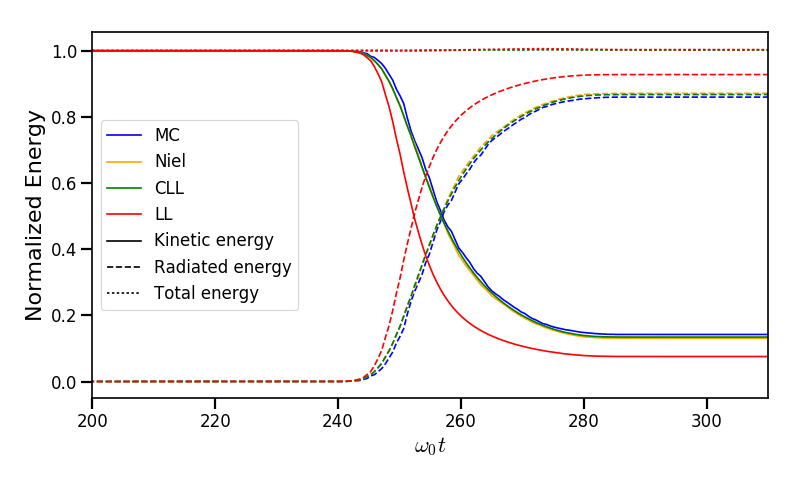
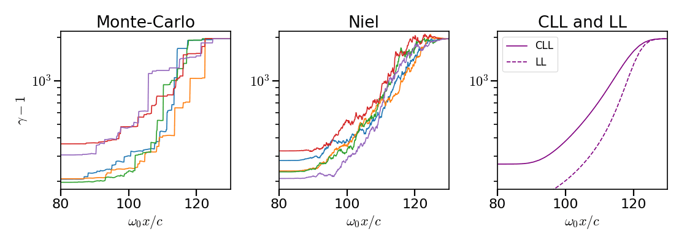
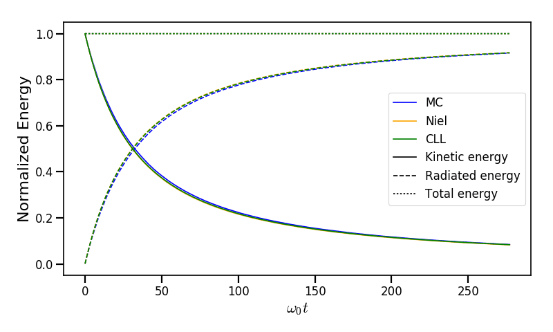
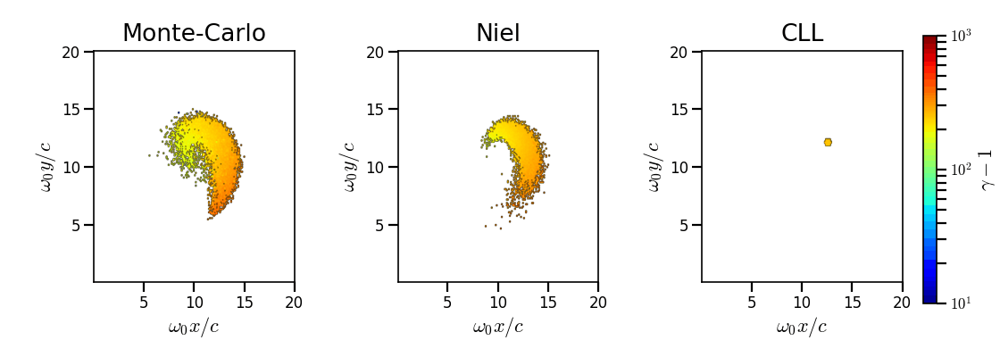
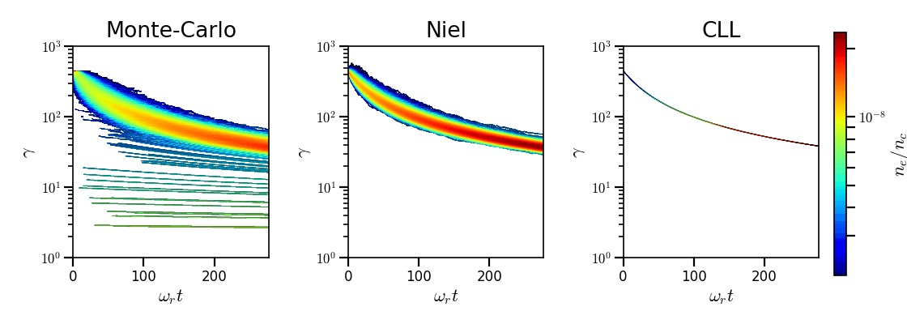
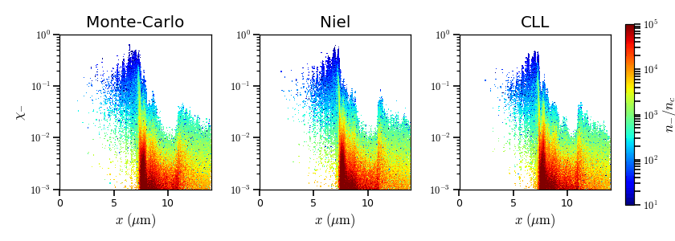
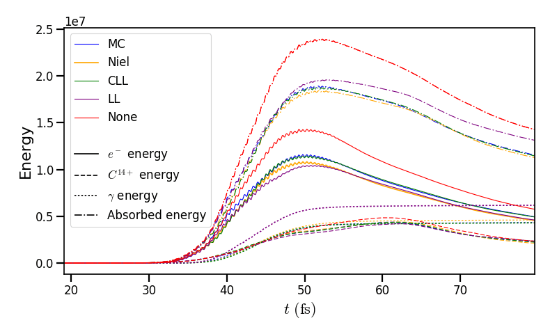

.. _radiationReactionPage:

Synchrotron-like radiation reaction
--------------------------------------------------------------------------------

High-energy particles traveling in a strong electromagnetic field lose energy by
radiation. Depending on the field strength and the particle energy, radiation
losses pertain to different regimes and occur smoothly or in brutal steps, with
diffusive and stochastic consequences.
Physicists usually refer to this phenomenon as *synchrotron-like radiation emission*
(in reference to the emission process occurring in synchrotron facilities
with a constant magnetic field)
or *nonlinear inverse Compton scattering* (in an arbitrary electromagnetic field).

In extremely intense laser fields, with intensities above
:math:`10^{21}\ \mathrm{Wcm^{-2}}`, high-energy radiation emission strongly influences
the dynamics of charged particles and the overall energy balance of laser-plasma
interaction.
In our regime of interaction, only light charge particles such as electrons
and positrons can radiate.

Different approaches have been implemented in :program:`Smilei` as summarized
in :numref:`radiationRegimes` to deal with different regimes of emission.
These regimes can be characterized via the quantum Lorentz invariant parameter
:math:`\chi` which is an indicator of how strong is the radiation emission
process.

.. math::
  :label: particleQuantumParameter

  \chi = \frac{\gamma}{E_s} \left| \left( \beta \cdot \mathbf{E}
  \right)^2 - \left( \mathbf{E} + \mathbf{v} \times \mathbf{B} \right)^2
  \right|^{1/2}

where :math:`E_s = m^2 c^3 / \hbar e \simeq 1.3 \times 10^{18}\ \mathrm{V/m}` is
the Schwinger field, :math:`e` is the electron charge,
:math:`m` is the electron mass, :math:`c` the speed of light in vacuum,
:math:`\hbar` the reduced Planck constant. :math:`\mathbf{E} = (E_x, E_y, E_z)`
and :math:`\mathbf{B} = (B_x, B_y, B_z)` are respectively the electric and
the magnetic fields. :math:`\gamma = \varepsilon / m c^2` is the particle
Lorentz factor (and the normalized particle energy). :math:`\beta = v/c` is
the normalized particle velocity. In :numref:`radiationRegimes`,
:math:`\varepsilon_\gamma = \gamma_\gamma mc^2` is the photon energy.

.. _radiationRegimes:

+-------------------------------------+--------------------------+------------------------------------------------+---------------------------+
| Regime                              | :math:`\chi` value       | Description                                    | Models                    |
+=====================================+==========================+================================================+===========================+
| Classical radiation emission        | :math:`\chi \sim 10^{-3}`| :math:`\varepsilon_\gamma  \ll \varepsilon`    | Landau-Lifshitz           |
|                                     |                          | , radiated energy overestimated for            |                           |
|                                     |                          | :math:`\chi > 10^{-2}`                         |                           |
+-------------------------------------+--------------------------+------------------------------------------------+---------------------------+
| Semi-classical radiation emission   | :math:`\chi \sim 10^{-2}`| :math:`\varepsilon_\gamma  \ll \varepsilon`    | Corrected Landau-Lifshitz |
|                                     |                          | , no stochastic effects                        |                           |
+-------------------------------------+--------------------------+------------------------------------------------+---------------------------+
| Weak quantum regime                 | :math:`\chi \sim 10^{-1}`| :math:`\varepsilon_\gamma  < \varepsilon`,     | Stochastic model of       |
|                                     |                          | :math:`\varepsilon_\gamma / mc^2  \gg 1`       | Niel `et al` / Monte-Carlo|
+-------------------------------------+--------------------------+------------------------------------------------+---------------------------+
| Quantum regime                      | :math:`\chi \sim 1`      | :math:`\varepsilon_\gamma \sim \varepsilon`    | Monte-Carlo               |
|                                     |                          |                                                |                           |
+-------------------------------------+--------------------------+------------------------------------------------+---------------------------+

When quantum electrodynamics (QED) effects are negligible (classical regime),
the radiation reaction can be treated as a
continuous friction force acting on the particles.
Several models have been published (e.g. LAD,
[Landau1947]_, Sokolov, Capdessus).
The ones used in :program:`Smilei` are
based on the Landau-Lifshitz model approximated for high Lorentz factors
(:math:`\gamma \gg 1`).

In the quantum regime, photons with energies of the order of the energies of
the emitting electron can be produced (:math:`\varepsilon_\gamma \sim \varepsilon_\pm`).
A continuous friction force can not be used anymore.
This is treated using a Monte-Carlo
description of discrete high-energy photon emissions
(see [Timokhin2010]_, [Elkina2011]_, [Duclous2011]_, and [Lobet2013]_).

In the intermediate regime (:math:`\chi \sim 1`), where the energy of the emitted photons remains
small with respect to that of the emitting electrons, but for which the
stochastic nature of photon emission cannot be neglected, the electron dynamics
is described by the addition of a stochastic term derived from a Fokker-Planck
expansion ([Niel2018]_).

Use :numref:`radiationRegimes` to choose properly
the most appropriate radiation reaction model
in :program:`Smilei` (see :ref:`the radiation configuration in Species <Species>`).

The next sections describe in more details the models implemented
in :program:`Smilei` to deal with the different regimes of emission.

--------------------------------------------------------------------------------

Continuous radiation models
^^^^^^^^^^^^^^^^^^^^^^^^^^^^^^^^^^^^^^^^^^^^^^^^^^^^^^^^^^^^^^^^^^^^^^^^^^^^^^^^

Approximated Landau-Lifshitz classical model
""""""""""""""""""""""""""""""""""""""""""""""""""""""""""""""""""""""""""""""""

The classical radiation friction force acting on an ultra-relativistic electron
has been derived by [Landau1947]_.
The equation of momentum evolution implemented in
PIC codes is composed of both the classical Lorentz force :math:`F_L`
and the radiation friction term :math:`F_{rad}` so that:

.. math::
  :label: momentumEq

  \frac{d\mathbf{p}}{dt} = \mathbf{F}_L + \mathbf{F}_{rad}

with

.. math::
  :label: LLFrictionForce

  \mathbf{F}_{rad} = -\frac{2}{3} e \tau_e \gamma \left( \frac{d\mathbf{E}}{dt} + \mathbf{u} \times \frac{\mathbf{B}}{dt} \right) \\
  + \frac{2}{3} \frac{e}{E_{cr}} \left[ \left( \mathbf{u} \cdot \mathbf{E} \right) \mathbf{E} - \mathbf{B} \times \left( \mathbf{E} + \mathbf{u} \times \mathbf{B} \right) \right] \\
  - \frac{2}{3}\frac{e}{E_{cr}} \gamma^2 \left[ \left( \mathbf{E} + \mathbf{u} \times \mathbf{B} \right)^2 - \left( \mathbf{u} \cdot \mathbf{E}\right)^2 \right] \mathbf{u}

where :math:`\mathbf{u} = \mathbf{p} / (\gamma m c)` is the velocity,
:math:`\mathbf{p}` the momentum,
:math:`\tau_e = r_e / c = e^2 / 4 \pi \varepsilon_0 m c^3`
the time for light to travel across the classical electron radius,
:math:`E_{cr} = E_s / \alpha` the critical field,
and :math:`\alpha` the fine structure constant.

For an ultra-relativistic electron (:math:`\gamma \gg 1`) some terms in
Eq. :eq:`LLFrictionForce` not explicited here can be neglected so that the
friction force reduces to a single term:

.. math::
  :label: LLFrictionForceApprox

  \mathbf{F}_{rad} = - P_{cl} \mathbf{u} / \left( \mathbf{u}^2 c \right)

where :math:`P_{cl} = \frac{2}{3} \frac{\alpha^2 mc^2}{\tau_e} \chi^2`.

The corresponding emitted power distribution as a function of the photon
frequency :math:`\omega` reads

.. math::
  :label: ClasRadPower

  \frac{dP}{d\omega} = \frac{9 \sqrt{3}}{8 \pi} \frac{P_{cl}}{ \omega_c}
  \frac{\omega}{\omega_c} \int_{\omega/\omega_c}^{+\infty}{dy K_{5/3}(y)}

with :math:`K_\nu(z)` the modified Bessel function of the second kind,
:math:`\omega_c = 3 \gamma \alpha \chi / (2 \tau_e)` the critical frequency for
synchrotron emission.
This classical approach requires the emitted photon energy
:math:`\varepsilon_\gamma = \hbar\omega` to be much smaller than that of
the emitting particle. This translates to :math:`\chi \ll 1` as given in the
introduction. Otherwise, the radiated power is know to strongly overestimate
the physical radiated energy when :math:`\chi` approaches 0.1.

Corrected classical model
""""""""""""""""""""""""""""""""""""""""""""""""""""""""""""""""""""""""""""""""

In the quantum emission regime, if the field is (i) slowly-varying
compared to the formation time of the radiated photon and (ii)
undercritical with respect to the Schwinger field, then the Lorentz-invariant production
rate of high-energy photons (via the multiphoton inverse Compton scattering)
can be written as:

.. math::
  :label: PhotonProdRate

  \frac{d^2N}{dt d\chi_\gamma} = \frac{1}{\pi \sqrt{3}} \frac{\alpha^2}{\tau_e \chi_\pm}
  \left[ \int_\nu^{+\infty}{K_{5/3(y)}dy} + \frac{2 \chi_\gamma \nu}{2} K_{2/3}(\nu) \right]

This equation can be also decomposed into:

.. math::
  :label: PhotonProdRate2

  \frac{d^2N}{dt d\chi} = \frac{2}{3} \frac{\alpha^2}{\tau_e} \frac{S(\chi_\pm , \chi)}{\chi}

where :math:`S(\chi_\pm , \chi)` is so called the synchrotron emissity function.

We therefore have:

.. math::
  :label: synchrotron_emissivity_function

  S(\chi_\pm , \chi) = \frac{\sqrt{3}}{2\pi} \frac{\chi_\gamma}{\chi}
  \left[ \int_\nu^{+\infty}{K_{5/3(y)}dy} + \frac{2 \chi_\gamma \nu}{2} K_{2/3}(\nu) \right]

Condition (i) is fulfilled when :math:`a_0 = e \| A^{\mu} \| / mc^2 \gg 1`, :math:`A^{\mu}`
being the four-potential laser amplitude.

conditions (ii) corresponds to :math:`\mathbf{B}^2 - \mathbf{E}^2 \ll E_s^2`
and  :math:`\mathbf{B}\cdot \mathbf{E} \ll 1`
(see [Ritus1985]_ for more details).

The emitted power distribution can be deduced from Eq. :eq:`PhotonProdRate` in
terms of the photon normalized energy. After integration, one obtains the
expression of the radiated power in the quantum regime:

.. math::
  :label: quantumRadPower

  P_{rad} = P_{cl} g(\chi)

with

.. math::
  :label: g

  g \left( \chi \right) = \frac{9 \sqrt{3} }{8 \pi} \int_0^{+\infty}{d\nu
  \left[  \frac{2\nu^2 }{\left( 2 + 3 \nu \chi \right) ^2}K_{5/3}(\nu) +
  \frac{4 \nu \left( 3 \nu \chi\right)^2 }{\left( 2 + 3 \nu \chi \right)^4}K_{2/3}(\nu) \right]}

The quantum instantaneous radiated power is nothing else than the classical one
multiplied by the correction :math:`g \left( \chi \right)`.

When :math:`\chi \ll 1`, this correction is close to 1 and the corrected
Friction force
is therefore similar to Eq. :eq:`LLFrictionForceApprox`.
The correction rapidly decreases otherwise when :math:`\chi > 10^{-2}`.

The correction does not take into account stochastic
effects when the photon energy approaches that of
the emitting electron. This is the subject of the next section.

--------------------------------------------------------------------------------

Stochastic schemes
^^^^^^^^^^^^^^^^^^^^^^^^^^^^^^^^^^^^^^^^^^^^^^^^^^^^^^^^^^^^^^^^^^^^^^^^^^^^^^^^

Fokker-Planck stochastic model
""""""""""""""""""""""""""""""""""""""""""""""""""""""""""""""""""""""""""""""""

The Fokker-Planck approach is an extension of the corrected Landau-Lifshitz
model with an operator that takes into account diffusive stochastic effects
([Niel2018]_):

.. math::
  :label: NielStochasticForce

  F_{rad} dt = \left[ -P_{cl} g \left( \chi \right) dt + mc^2
  \sqrt{R\left( \chi, \gamma \right)} dW \right]
  \mathbf{u} / \left( \mathbf{u}^2 c \right)

where :math:`dW` is a Wiener process of variance :math:`dt`,

.. math::
  :label: NielR

    R\left( \chi, \gamma \right) = \frac{2}{3} \frac{\alpha^2}{\tau_e} \gamma
    h \left( \chi \right)

and

.. math::
  :label: Nielh

    h \left( \chi \right) = \frac{9 \sqrt{3}}{4 \pi} \int_0^{+\infty}{d\nu
    \left[ \frac{2\chi^3 \nu^3}{\left( 2 + 3\nu\chi \right)^3} K_{5/3}(\nu)
    + \frac{54 \chi^5 \nu^4}{\left( 2 + 3 \nu \chi \right)^5} K_{2/3}(\nu) \right]}

Monte-Carlo quantum model
""""""""""""""""""""""""""""""""""""""""""""""""""""""""""""""""""""""""""""""""

The Monte-Carlo treatment of the emission is more complex process than
the previous ones and can be divided into several steps ([Duclous2011]_,
[Lobet2013]_, [Lobet2015]_):

1. An incremental optical depth :math:`\tau`, initially set to 0, is assigned to the particle.
   Emission occurs when it reaches the final optical depth :math:`\tau_f`
   sampled from :math:`\tau_f = -\log{\xi}` where :math:`\xi` is a random number in :math:`\left]0,1\right]`.

2. The optical depth :math:`\tau` evolves according to the field and particle
   energy variations following this integral:
   
   .. math::
     :label: MCDtauDt
   
       \frac{d\tau}{dt} = \int_0^{\chi_{\pm}}{ \frac{d^2N}{d\chi dt}  d\chi }
       = \frac{2}{3} \frac{\alpha^2}{\tau_e} \int_0^{\chi_{\pm}}{ \frac{S(\chi_\pm, \chi)}{\chi}  d\chi }
       = \frac{2}{3} \frac{\alpha^2}{\tau_e} K (\chi_\pm)
   
   that simply is the production rate of photons
   (integration of Eq. :eq:`PhotonProdRate`).
   Here, :math:`\chi_{\pm}` is the emitting electron (or positron) quantum parameter and
   :math:`\chi` the integration variable.

3. The emitted photon's quantum parameter :math:`\chi_{\gamma}` is computed by
   inverting the cumulative distribution function:
   
   .. math::
     :label: CumulativeDistr
   
       \xi = P(\chi_\pm,\chi_{\gamma}) = \frac{\displaystyle{\int_0^{\chi_\gamma}{S(\chi_\pm, \chi) / \chi
       d\chi}}}{\displaystyle{\int_0^{\chi_\pm}{S(\chi_\pm, \chi) / \chi d\chi}}}
   
   where :math:`S` is the so-called synchrotron emissivity function so that
   
   .. math::
     :label: MCF
   
       \frac{d^2 N}{dt d\chi} = \frac{2}{3} \frac{\alpha^2}{\tau_e} \frac{S (\chi_\pm, \chi)}{\chi}
   
   The inversion of  :math:`\xi = P(\chi_\pm,\chi_{\gamma})` is done after drawing
   a second random number
   :math:`\phi \in \left[ 0,1\right]` to find :math:`\chi_{\gamma}` by solving :
   
   .. math::
     :label: inverse_xi
   
     \xi^{-1} = P^{-1}(\chi_\pm, \chi_{\gamma}) = \phi

4. The energy of the emitted photon is then computed:
   :math:`\varepsilon_\gamma = mc^2 \gamma_\gamma =
   mc^2 \gamma_\pm \chi_\gamma / \chi_\pm`.

5. The particle momentum is then updated using momentum conservation
   considering forward emission (valid when :math:`\gamma_\pm \gg 1`).
   
   .. math::
     :label: momentumUpdate
   
       F_{rad} = - \frac{\varepsilon_\gamma}{c} \frac{\mathbf{p_\pm}}{\| \mathbf{p_\pm} \|}
   
   The radiated force is the recoil induced by the photon emission.
   Radiation reaction is therefore a discrete process.
   Note that momentum conservation does not exactly conserve energy.
   It can be shown that the error :math:`\epsilon` tends to 0 when the particle
   energy tends to infinity [Lobet2015]_ and that the error is low when
   :math:`\varepsilon_\pm \gg 1` and :math:`\varepsilon_\gamma \ll \varepsilon_\pm`.
   Between emission events, the electron dynamics is still governed by the
   Lorentz force.
   
   If the photon is emitted as a macro-photon, initial position is the same as
   for the emitting particle. The weight is also conserved.

--------------------------------------------------------------------------------

Implementation
^^^^^^^^^^^^^^^^^^^^^^^^^^^^^^^^^^^^^^^^^^^^^^^^^^^^^^^^^^^^^^^^^^^^^^^^^^^^^^^^

C++ classes for the radiation processes are located in the directory ``src/Radiation``.
In :program:`Smilei`, the radiative processes are not incorporated in the pusher in
order to preserve the vector performance of the pusher when using non-vectorizable
radiation models such as the Monte-Carlo process.

Description of the files:

* Class ``RadiationTable``: useful tools, parameters and the tables.
* Class ``Radiation``: the generic class from which will inherit specific
  classes for each model.
* Class ``RadiationFactory``: manages the choice of the radiation model among the following.
* Class ``RadiationLandauLifshitz``: classical Landau-Lifshitz radiation process.
* Class ``RadiationCorrLandauLifshitz``: corrected Landau-Lifshitz radiation process.
* Class ``RadiationNiel``: stochastic diffusive model of [Niel2018]_.
* Class ``RadiationMonteCarlo``: Monte-Carlo model.

As explained below, many functions have been tabulated because of
the cost of their computation for each particle. This table can be generated by
:program:`Smilei` at the initialization.
The parameters such as the ranges and the discretization can be
given in the :ref:`RadiationReaction <RadiationReaction>` namelist section.
Once generated, the table can be written on the disk and reloaded for a next run.
Small tables coded in hdf5 are provided in the repository in the folder
databases with the name: `radiation_tables.h5`.

Landau-Lifshitz-based models
""""""""""""""""""""""""""""""""""""""""""""""""""""""""""""""""""""""""""""""""

The classical Landau-Lifshitz model approximated for high-:math:`\gamma`
given by Eq. :eq:`LLFrictionForceApprox`
has been implemented in :program:`Smilei`
using a simple explicit scheme.
The model is accessible in the species configuration under the name
``Landau-Lifshitz`` or ``ll``.

For the corrected version, we use a fit of the function
:math:`g(\chi)` given by

.. math::
  :label: quantumCorrFit

  g \left( \chi_{\pm} \right) = \left[ 1 + 4.8 \left( 1 + \chi_{\pm} \right)
  \log \left( 1 + 1.7 \chi_{\pm} \right) + 2.44 \chi_{\pm}^2 \right]^{-2/3}

This fit enables to keep the vectorization of the particle loop.
The corrected model is accessible in the species configuration under the name
``corrected-Landau-Lifshitz`` or ``cll``.

Fokker-Planck stochastic model of Niel *et al*.
""""""""""""""""""""""""""""""""""""""""""""""""""""""""""""""""""""""""""""""""

Eq. :eq:`NielStochasticForce` is implemented in :program:`Smilei` using
a simple explicit scheme.

The direct computation of Eq. :eq:`Nielh` during the emission process is too expensive.
For performance issues,  :program:`Smilei` uses tabulated values or fit functions.

Concerning the tabulation, :program:`Smilei` first checks the presence of
an external table at the specified path.
If the latter does not exist at the specified path, the table is computed at initialization.
The new table is outputed on disk in the current simulation directory.
It is recommended to use existing external tables to save simulation time.
The computation of *h* during the simulation can slow down the initialization
and represents an important part of the total simulation.
The parameters such as the :math:`\chi` range and the discretization can be
given in :ref:`RadiationReaction <RadiationReaction>`.

Polynomial fits of this integral can be obtained in log-log
or log10-log10 domain. However, high accuracy requires high-order polynomials
(order 20 for an accuracy around :math:`10^{-10}` for instance).
In :program:`Smilei`, an order 5 (see Eq. :eq:`fit5`) and 10 polynomial fits are implemented.
They are valid for quantum parameters :math:`\chi` between :math:`10^{-3}` and 10.

.. math::
  :label: fit5

  h_{o5}(\chi) = \exp{ \left(1.399937206900322 \times 10^{-4}  \log(\chi)^5 \\
  + 3.123718241260330 \times 10^{-3}  \log{(\chi)}^4 \\
  + 1.096559086628964 \times 10^{-2}  \log(\chi)^3 \\
  -1.733977278199592 \times 10^{-1}  \log(\chi)^2 \\
  + 1.492675770100125  \log(\chi) \\
  -2.748991631516466 \right) }

An additional fit from [Ridgers2017]_ has been implemented and the formula
is given in Eq. :eq:`h_fit_ridgers`.

.. math::
  :label: h_fit_ridgers

  h_{Ridgers}(\chi) = \chi^3  \frac{165}{48 \sqrt{3}} \left(1. + (1. + 4.528 \chi) \log(1.+12.29 \chi) + 4.632 \chi^2 \right)^{-7/6}

The stochastic diffusive model is accessible in the species configuration
under the name ``Niel``.

Monte-Carlo quantum model
""""""""""""""""""""""""""""""""""""""""""""""""""""""""""""""""""""""""""""""""

The computation of Eq. :eq:`MCDtauDt` would be too expensive for every single
particles.
Instead, the integral of the function :math:`S(\chi_\pm, \chi) / \chi`
called :math:`K(\chi_\pm)` is tabulated.
The tabulation boundaries depend on the user.
They can be specified in the :program:`\Smilei` input file.

This table is referred to as ``integfochi_table`` and related parameters
start by ``integfochi`` in the code.

Similarly, Eq. :eq:`CumulativeDistr` is tabulated (named ``xip`` in the code).
The only difference is that a minimum photon quantum parameter
:math:`\chi_{\gamma,\min}` is computed before for the integration so that:

.. math::
  :label: chiMin

    \frac{\displaystyle{\int_{0}^{\chi_{\gamma,\min}}{S(\chi_\pm, \chi) / \chi
    d\chi}}}{\displaystyle{\int_0^{\chi_\pm}{S(\chi_\pm, \chi) / \chi d\chi}}} < \epsilon

This enables to find a lower bound to the :math:`\chi_\gamma` range
(discretization in the log domain) so that the
remaining part is negligible in term of radiated energy.
The parameter :math:`\epsilon` is called ``xip_threshold`` in
:ref:`RadiationReaction <RadiationReaction>`.

The tables can be generated by :program:`Smilei` at the initialization.
The parameters such as the :math:`\chi` range and the discretization can be
given in :ref:`RadiationReaction <RadiationReaction>`.

The Monte-Carlo model is accessible in the species configuration
under the name ``Monte-Carlo`` or ``mc``.

----

Benchmarks
^^^^^^^^^^^^^^^^^^^^^^^^^^^^^^^^^^^^^^^^^^^^^^^^^^^^^^^^^^^^^^^^^^^^^^^^^^^^^^^^

Counter-propagating plane wave, 1D
""""""""""""""""""""""""""""""""""""""""""""""""""""""""""""""""""""""""""""""""

In the benchmark ``benchmark/tst1d_9_rad_electron_laser_collision.py``,
a GeV electron bunch is initialized near the right
domain boundary and propagates towards the left boundary from which a plane
wave is injected. The laser has an amplitude of :math:`a_0 = 270`
corresponding to an intensity of :math:`10^{23}\ \mathrm{Wcm^{-2}}` at
:math:`\lambda = 1\ \mathrm{\mu m}`.
The laser has a Gaussian profile of full-with at half maxium of
:math:`20 \pi \omega_r^{-1}` (10 laser periods).
The maximal quantum parameter :math:`\chi`
value reached during the simulation is around 0.5.

.. _rad_counter_prop_scalar:

  Kinetic, radiated and total energy plotted respectively with solid, dashed and dotted lines for
  the :blue:`Monte-Carlo` (**MC**), :orange:`Niel` (**Niel**),
  :green:`corrected Landau-Lifshitz` (**CLL**) and the :red:`Landau-Lifshitz` (**LL**) models.

:numref:`rad_counter_prop_scalar` shows that the Monte-Carlo, the Niel and
the corrected Landau-Lifshitz models exhibit very similar
results in term of the total radiated and kinetic energy evolution with a final
radiation rate of 80% the initial kinetic energy. The relative error on the
total energy is small (:math:`\sim 3\times10^{-3}`).
As expected, the Landau-Lifshitz model overestimates the radiated energy
because the interaction happens mainly in the quantum regime.

.. _rad_counter_prop_track:

  Evolution of the normalized kinetic energy
  :math:`\gamma - 1` of some selected electrons as a function of their position.

:numref:`rad_counter_prop_track` shows that the Monte-Carlo and the Niel models
reproduce the stochastic nature of the trajectories as opposed to the
continuous approaches (corrected Landau-Lifshitz and Landau-Lifshitz).
In the latter, every particles initially located at the same position will
follow the same trajectories.
The stochastic nature of the emission for high :math:`\chi` values can
have consequences in term of final spatial and energy distributions.
Not shown here, the Niel stochastic model does not reproduce correctly the
moment of order 3 as explained in [Niel2018]_.

Synchrotron, 2D
""""""""""""""""""""""""""""""""""""""""""""""""""""""""""""""""""""""""""""""""

A bunch of electrons of initial momentum :math:`p_{-,0}`
evolves in a constant magnetic field :math:`B` orthogonal
to their initial propagation direction.
In such a configuration, the electron bunch is supposed to rotate endlessly
with the same radius :math:`R = p_{-,0} /e B` without radiation energy loss.
Here, the magnetic field is so strong that the electrons
radiate their energy as in a synchrotron facility.
In this setup, each electron quantum parameter depends on their Lorentz
factors :math:`\gamma_{-}` according to
:math:`\chi_{-} = \gamma_{-} B /m_e E_s`.
The quantum parameter is maximum at the beginning of the interaction.
The strongest radiation loss are therefore observed at the beginning too.
As energy decreases, radiation loss becomes less and less important so that
the emission regime progressively move from the quantum to the classical regime.

Similar simulation configuration can be found in the benchmarks.
It corresponds to two different input files in the benchmark folder:

* ``tst2d_8_synchrotron_chi1.py``: tests and compares the corrected
  Landau-Lifshitz and the Monte-Carlo model for an initial :math:`\chi = 1`.
* ``tst2d_9_synchrotron_chi0.1.py``: tests and compares the corrected
  Landau-Lifshitz and the Niel model for an initial :math:`\chi = 0.1`.

In this section, we focus on the case with initial quantum parameter
:math:`\chi = 0.1`.
The magnetic field amplitude is :math:`B = 90 m \omega_r / e`.
The initial electron Lorentz factor is
:math:`\gamma_{-,0} = \varepsilon_{-,0}/mc^2 =  450`.
Electrons are initialized with a Maxwell-Juttner distribution of temperature
:math:`0.1 m_e c^2`.

:numref:`synchrotron_scalar` shows the time evolution of the particle kinetic energy,
the radiated energy and the total energy. All radiation models provide
similar evolution of these integrated quantities. The relative error on the
total energy is between :math:`2 \times 10^{-9}` and :math:`3 \times 10^{-9}`.

.. _synchrotron_scalar:

  Kinetic, radiated and total energies plotted respectively with solid, dashed and dotted
  lines for various models.

The main difference between models can be understood by studying the
particle trajectories and phase spaces. For this purpose, the local kinetic energy spatial-distribution
at :math:`25 \omega_r^{-1}` is shown in
:numref:`synchrotron_x_y_gamma` for the different models.
With continuous radiation energy loss
(corrected Landau-Lifshitz case), each electron of the bunch rotates with a decreasing
radius but the bunch.
Each electron of similar initial energies have the same trajectories.
In the case of a cold bunch (null initial temperature),
the bunch would have kept its original shape.
The radiation with this model only acts as a cooling mechanism.
In the cases of the Niel and the Monte-Carlo radiation models,
stochastic effects come into play and lead the bunch to spread spatially.
Each individual electron of the bunch, even with similar initial energies,
have different trajectories depending on their emission history.
Stochastic effects are particularly strong at the beginning  with the highest
:math:`\chi` values when the radiation
recoil is the most important.

.. _synchrotron_x_y_gamma:

  Average normalized kinetic energy at time :math:`25 \omega_r^{-1}`
  for the simulations with the Monte-Carlo, the Niel
  and the corrected Landau-Lifshitz (**CLL**) models.

:numref:`synchrotron_t_gamma_ne` shows the time evolution of
the electron Lorentz factor distribution (normalized energy) for different
radiation models.
At the beginning, the distribution is extremely broad due to the Maxwell-Juttner parameters.
The average energy is well around :math:`\gamma_{-,0} = \varepsilon_{-,0}/mc^2 =  450`
with maximal energies above :math:`\gamma_{-} =  450`.

In the case of a initially-cold electron beam,
stochastic effects would have lead the bunch to spread energetically
with the Monte-Carlo and the Niel stochastic models at the beginning of the simulation.
This effect is hidden since electron energy is already highly spread at the
beginning of the interaction.
This effect is the strongest when the quantum parameter is high in the quantum regime.

In the Monte-Carlo case, some electrons have lost all their energy almost immediately
as shown by the lower part of the distribution below :math:`\gamma_{-} =  50`
after comparison with the Niel model.

Then, as the particles cool down, the interaction enters the semi-classical
regime where energy jumps are smaller.
In the classical regime, radiation loss acts oppositely to the quantum regime.
It reduces the spread in energy and space.
In the Landau-Lifshitz case, this effect starts at the beginning even
in the quantum regime due to the nature of the model.
For a initially-cold electron bunch, there would not have been
energy spread at the beginning of the simulation. All electron would have lost
their energy in a similar fashion (superimposed behavior).
This model can be seen as the average behavior of the stochastic ones of
electron groups having the same initial energy.

.. _synchrotron_t_gamma_ne:

  Time evolution of the electron energy distribution for the Monte-Carlo, the Niel
  and the corrected Landau-Lifshitz (**CLL**) models.

Thin foil, 2D
""""""""""""""""""""""""""""""""""""""""""""""""""""""""""""""""""""""""""""""""

This case is not in the list of available benchmarks but we decided to present
these results here as an example of simulation study.
An extremely intense plane wave in 2D interacts with a thin, fully-ionized carbon foil.
The foil is located 4 µm from the left border (:math:`x_{min}`).
It starts with 1 µm of linear pre-plasma density, followed by
3 µm of uniform plasma of density 492 times critical.
The target is irradiated by a gaussian plane wave of peak intensity
:math:`a_0 = 270` (corresponding to :math:`10^{23}\ \mathrm{Wcm^{-2}}`)
and of FWHM duration 50 fs.
The domain has a discretization of 64 cells per µm in
both directions x and y, with 64 particles per cell.
The same simulation has been performed with the different radiation models.

Electrons can be accelerated and injected in
the target along the density gradient through the combined action of
the transverse electric and the magnetic fields (*ponderomotive* effects).
In the relativistic regime and linear polarization,
this leads to the injection of bunches of hot electrons
every half laser period that contribute to heat the bulk.
When these electrons reach the rear surface, they start to expand in the vacuum,
and, being separated from the slow ion, create a longitudinal charge-separation field.
This field, along the surface normal, has two main effects:

* It acts as a reflecting barrier for electrons of moderate energy (refluxing electrons).
* It accelerates ions located at the surface (target normal sheath acceleration, TNSA).

At the front side, a charge separation cavity appears
between the electron layer pushed forward by the ponderomotive force and ions
left-behind that causes ions to be consequently accelerated. This
strong ion-acceleration mechanism
is known as the radiation pressure acceleration (RPA) or laser piston.

Under the action of an extremely intense laser pulse, electrons accelerated at
the target front radiate. It is confirmed in :numref:`thin_foil_x_chi_ne`
showing the distribution of the quantum parameter :math:`\chi` along the x axis
for the Monte-Carlo, the Niel and the corrected Landau-Lifshitz (**CLL**) radiation models.
The maximum values can be seen at the front where the electrons
interact with the laser. Radiation occurs in the quantum regime
:math:`\chi > 0.1`. Note that there is a second peak for :math:`\chi` at the
rear where electrons interact with the target normal sheath field.
The radiation reaction can affect electron energy absorption and therefore the ion
acceleration mechanisms.

.. _thin_foil_x_chi_ne:

  :math:`x - \chi` electron distribution at time 47 fs for the Monte-Carlo,
  the Niel and the corrected Landau-Lifshitz (**CLL**) model.

The time evolutions of the electron kinetic energy, the carbon ion
kinetic energy, the radiated energy and the total
absorbed energy are shown in :numref:`thin_foil_scalar`.
The :green:`corrected-Landau-Lifshitz`, the :orange:`Niel`
and the :blue:`Monte-Carlo` models present very
similar behaviors.
The absorbed electron energy is only slightly lower in the Niel model.
This difference depends on the random seeds and the
simulation parameters.
The radiated energy represents around 14% of the total laser energy.
The :purple:`classical Landau-Lifshitz` model overestimates the radiated energy;
the energy absorbed by electrons and ions is therefore slightly lower.
In all cases, radiation reaction strongly impacts the overall particle energy absorption
showing a difference close to 20% with the :red:`non-radiative` run.

.. _thin_foil_scalar:

  Time evolution of the electron kinetic energy (solid lines), the carbon ion
  kinetic energy (dashed line), the radiated energy (dotted line) and the total
  absorbed energy by particle and radiation (dotted-dashed lines), for various models.

The differences between electron :math:`p_x` distributions are shown
in :numref:`thin_foil_x_px_ne`. Without radiation reaction, electrons refluxing
at the target front can travel farther in vacuum (negative :math:`p_x`)
before being injected back to the target.
With radiation reaction, these electrons are rapidly slowed down
and newly accelerated by the ponderotive force.
Inside the target, accelerated bunches of hot electrons correspond to
the regular positive spikes in :math:`p_x` (oscillation at :math:`\lambda /2`).
The maximum electron energy is almost twice lower with radiation reaction.

.. _thin_foil_x_px_ne:

.. figure:: _static/thin_foil_x_px_ne.png
  :width: 18cm

  :math:`x - p_x` electron distribution at time 47 fs for the Monte-Carlo,
  the Niel, the corrected Landau-Lifshitz (**CLL**) model and
  without radiation loss (**none**).

--------------------------------------------------------------------------------

Performances
^^^^^^^^^^^^^^^^^^^^^^^^^^^^^^^^^^^^^^^^^^^^^^^^^^^^^^^^^^^^^^^^^^^^^^^^^^^^^^^^

The cost of the different models is summarized in :numref:`radiationTimes`.
Reported times are for the field projection, the particle pusher and
the radiation reaction together. Percentages correspond to the overhead induced by
the radiation module in comparison to the standard PIC pusher.

All presented numbers are not generalizable and are only indicated to give
an idea of the model costs. The creation of macro-photons is not enabled for
the Monte-Carlo radiation process.

.. _radiationTimes:

+-------------------------------------+------------+----------+--------------+----------+---------------------+
| Radiation model                     | None       | LL       | CLL          | Niel     | MC                  |
+=====================================+============+==========+==============+==========+=====================+
| Counter-propagating Plane Wave 1D   | 0.2s       | 0.23s    | 0.24s        | 0.26s    | 0.3s                |
| Haswell (Jureca)                    |            |          |              |          |                     |
+-------------------------------------+------------+----------+--------------+----------+---------------------+
| Synchrotron 2D Haswell (Jureca)     | 10s        | 11s      | 12s          | 14s      | 15s                 |
| :math:`\chi=0.05`,  :math:`B=100`   |            |          |              |          |                     |
+-------------------------------------+------------+----------+--------------+----------+---------------------+
| Synchrotron 2D Haswell (Jureca)     | 10s        | 11s      | 12s          | 14s      | 22s                 |
| :math:`\chi=0.5`,  :math:`B=100`    |            |          |              |          |                     |
+-------------------------------------+------------+----------+--------------+----------+---------------------+
| Synchrotron 2D KNL (Frioul)         | 21s        | 23s      | 23s          | 73s      | 47s                 |
| :math:`\chi=0.5`,  :math:`B=100`    |            |          |              |          |                     |
+-------------------------------------+------------+----------+--------------+----------+---------------------+
| Interaction with a carbon thin foil | 6.5s       | 6.5s     | 6.6s         | 6.8s     | 6.8s                |
| 2D Sandy Bridge (Poincare)          |            |          |              |          |                     |
+-------------------------------------+------------+----------+--------------+----------+---------------------+

..

    +-------------------------------------+------------+----------+--------------+---------------------+
    | Radiation model                     | None       | LL       | CLL          | MC                  |
    +=====================================+============+==========+==============+=====================+
    | Counter-propagating Plane Wave 1D   | 0.25s      | 0.3s     | 0.32s        | 0.63s               |
    +-------------------------------------+------------+----------+--------------+---------------------+
    | Synchrotron 2D Haswell              | 3.9s       | 4.2s     | 4.7s         | 5.6s                |
    | :math:`\chi=0.5`,  :math:`B=100`    |            |          |              |                     |
    +-------------------------------------+------------+----------+--------------+---------------------+
    | Synchrotron 2D KNL                  | 3s         | 3.2s     | 3.3s         | 10s                 |
    | :math:`\chi=0.5`,  :math:`B=100`    |            |          |              |                     |
    +-------------------------------------+------------+----------+--------------+---------------------+
    | Interaction with a carbon thin foil | 6.5s       | 6.5s     | 6.6s         | 6.8s                |
    | 2D                                  |            |          |              |                     |
    +-------------------------------------+------------+----------+--------------+---------------------+

Descriptions of the cases:

* **Counter-propagating Plane Wave 1D**: run on a single node of *Jureca* with 2 MPI ranks and 12 OpenMP
  threads per rank.

* **Synchrotron 2D**: The domain has a dimension of 496x496 cells with
  16 particles per cell and 8x8 patches.
  A 4th order B-spline shape factor is used for the projection.
  The first case has been run on a single Haswell node of *Jureca* with 2 MPI ranks and
  12 OpenMP threads per rank. the second one has been run on a single KNL node of *Frioul*
  configured in quadrant cache using 1 MPI rank and 64 OpenMP threads.
  On KNL, the ``KMP_AFFINITY`` is set to ``fine`` and ``scatter``.

..

    Only the Niel model provides better performance with a ``compact`` affinity.

* **Thin foil 2D**:
  The domain has a discretization of 64 cells per :math:`\mu\mathrm{m}` in
  both directions, with 64 particles per cell.
  The case is run on 16 nodes of *Poincare* with 2 MPI ranks and 8 OpenMP
  threads per rank.

The LL and CLL models are vectorized efficiently.
These radiation reaction models represent a small overhead
to the particle pusher.

The Niel model implementation is split into several loops to
be partially vectorized. The table lookup is the only phase that
can not be vectorized. Using a fit function enables to have a fully
vectorized process. The gain depends on the order of the fit.
The radiation process with the Niel model is dominated
by the normal distribution random draw.

The Monte-Carlo pusher is not vectorized because the Monte-Carlo loop has
not predictable end and contains many if-statements.
When using the Monte-Carlo radiation model, code performance is likely to be
more impacted running on SIMD architecture with large vector registers
such as Intel Xeon Phi processors. This can be seen in :numref:`radiationTimes`
in the synchrotron case run on KNL.

----

References
^^^^^^^^^^

.. [Duclous2011] `R. Duclous, J. G. Kirk, and A. R. Bell (2011), Plasma Physics and Controlled Fusion, 53 (1), 015009 <http://stacks.iop.org/0741-3335/53/i=1/a=015009>`_

.. [Elkina2011] `Elkina N. V., A. M. Fedotov, I. Y. Kostyukov, M. V. Legkov, N. B. Narozhny, E. N. Nerush, and H. Ruhl (2011), Physical Review Accelerators and Beam, 14, 054401 <https://journals.aps.org/prab/abstract/10.1103/PhysRevSTAB.14.054401>`_

.. [Landau1947] `L. D. Landau and E. M. Lifshitz, The classical theory of fields. Butterworth-Heinemann (1947) <https://archive.org/details/TheClassicalTheoryOfFields>`_

.. [Lobet2013] `Lobet et al., J. Phys.: Conf. Ser. 688, 012058 (2016) <http://iopscience.iop.org/article/10.1088/1742-6596/688/1/012058>`_

.. [Lobet2015] `M. Lobet, Effets radiatifs et d'électrodynamique quantique dans l'interaction laser-matière ultra-relativiste (2015) <http://www.theses.fr/2015BORD0361#>`_

.. [Ritus1985] `Ritus V. (1985), Journal of Soviet Laser Research, 6, 497, ISSN 0270-2010 <https://doi.org/10.1007/BF01120220>`_

.. [Timokhin2010] `Timokhin A. N. (2010), Monthly Notices of the Royal Astronomical Society, 408 (4), 2092, ISSN 1365-2966 <https://doi.org/10.1111/j.1365-2966.2010.17286.x>`_

.. [Ridgers2017] `Ridgers, C. P., Blackburn, T. G., Del Sorbo, D., Bradley, L. E., Slade-Lowther, C., Baird, C. D., ... & Thomas, A. G. R. (2017), Journal of Plasma Physics, 83(5) <https://doi.org/10.1017/S0022377817000642>`_
