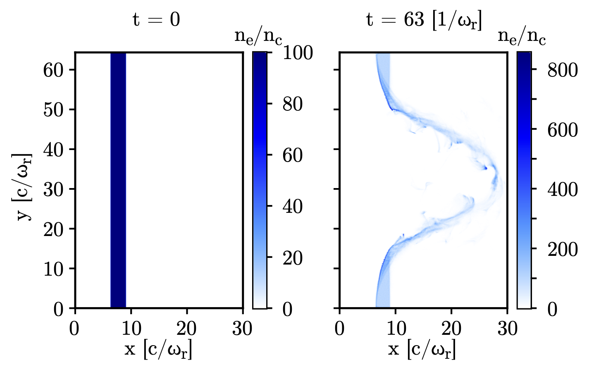

Task Parallelization
----------------------

For enhanced performances on CPUs with non-uniform plasma distributions, :program:`Smilei` exploits
efficiently task programming using OpenMP.

Task parallelization of macro-particle operations are published in [Massimo2022]_.

----

Motivation and introduction to the Task Parallelization
^^^^^^^^^^^^^^^^^^^^^^^^^^^^^^^^^^^^^^^^^^^^^^^^^^^^^^^^^^^^^^^

Plasma physics requires large scale Particle in Cell simulations, often with
spatially non-uniform macro-particle distributions. Since the computation time 
is generally dependent mostly on the time spent on macro-particle operations,
a non-uniform macro-particle distribution among the cpu cores creates 
load-imbalance.

This causes some cpu-cores, charged with less macro-particles, to idly wait for 
the cpu-cores treating more macro-particles.

This situation is not efficient, since using more cpu-cores becomes less useful
when only a few of them are performing most of the work. Thus it is essential 
to reduce the load imbalance to efficiently run a parallel PIC simulation.

In :program:`Smilei` the load imbalance at the MPI level is managed through the 
algorithm described in [Beck2019]_. In most physical set-ups, using small patches
and the environment variable ``export OMP_SCHEDULE=dynamic`` allows to manage 
the load balance also at the OpenMP level (see doc:`parallelization`).
This environment variable tells the OpenMP scheduler to dynamically assign the 
patches (and the involved macro-particle operations) to the available OpenMP 
threads. To be more specific, this choice is applied to the ``omp for`` constructs
assigning the patches to the OpenMP threads.

This strategy implies the following constraints on the scheduling of macro-particle
operations:
    * All the `Species` in one patch are treated by the same OpenMP thread;
    * All the PIC operators (Interpolation, Push, etc) applied to the 
      macro-particles of a given patch are treated by the same OpenMP thread.

These constraints can considerably slow down the simulation in some extreme 
situations, for example if:
    * the number of cpu cores is comparable to the number of patches
    * many `Species` are present, and they are not uniformly distributed in the 
      physical space.

In these cases, decoupling the treatment of the `Species` in the same patch and 
introducing a finer decomposition than the patch can considerably improve the 
scaling of simulations if these smaller entities containing macro-particles 
can be dynamically distributed among the available OpenMP threads.

In other words, exposing the parallelism at the finest level is essential 
to keep performances using a high number of computing units.
At the same time, some constructs cannot be easily parallelized with a dynamically
scheduled ``omp for`` (e.g. irregularly nested loops, recursion …). The solution
to this conundrum is the use of task programming. In particular, :program:`Smilei`
exploits the task parallelization available since OpenMP 4.5.

When this parallelization is activated, the patches are decomposed along the `x`
direction in smaller physical spaces called bins, whose width in cells is 
controlled by ``cluster_witdh`` in the ``Main`` block of a namelist.

The operations involved in each operator (Interpolation, Push, etc) applied 
to the macroparticles of each bin, `Species`, patch combinations, and their 
associated data are defined as tasks to perform. Different tasks may have 
logical dependencies, e.g. the same macro-particles must first be treated by the
Interpolator and only then by the Pusher, and so on. 

Afterwards, these tasks are dynamically assigned to the available OpenMP threads,
respecting the logical dependencies and preventing race conditions, as described
in [Massimo2022]_.

Performance Results
^^^^^^^^^^^^^^^^^^^^^

Some results from [Massimo2022]_ are shown in the following.

A 2D uniform thermal plasma case show that with uniform macro-particle 
distributions the task-parallelization in :program:`Smilei` does not have a 
performance advantage.

.. _uniform_plasma:

    Performances with and without task parallelization in a uniform plasma case.

However, a 2D radiation pressure acceleration is an example of non-uniform 
macro-particle distribution where the task parallelization yields and advantage.

.. _radiation_pressure_rho:

    Electron density divided by the critical density in a 2D radiation pressure 
    benchmark at 0 (left) and 1500 iterations (right). The non-uniformity of the 
    macro-particle distribution is present since the start of the simulation.

.. _radiation_pressure_perf:

    Performances with and without task parallelization in a 2D radiation 
    pressure acceleration case.

The scheduling of macro-particle operations without and with task parallelization
can be seen in the following figures.
Note how in the first Figure (without task parallelization), the end of the 
treatment of macro-particle operators (around 0.1 s) is determined by the 
OpenMP thread 0 of the MPI process 0. In the second Figure (with task parallelization),
the OpemMP thread 2 of MPI process 0 determines the end of the 
treatment of macro-particle operators (around 0.07 s). In this case, the finer 
decomposition given by the bins and the relaxation of the constraints involved
in the assignment of macro-particle operations to threads yields a shorter time
to the result.

.. _task_tracing_tasks_off:

.. figure:: _static/Radiation_pressure_develop_tracing.png
    :width: 50%
    :align: center

    Scheduling of macro-particle operations for the 2D radiation pressure benchmark, 
    4 MPI processes and 4 OpenMP threads, during iteration 1200,
    without task parallelization.

.. _task_tracing_tasks_on:

.. figure:: _static/Radiation_pressure_task_tracing.png
    :width: 50%
    :align: center

    Scheduling of macro-particle operations for the 2D radiation pressure benchmark, 
    4 MPI processes and 4 OpenMP threads, 4 bins per patch, during iteration 1200, 
    with task parallelization. The horizontal axis has been extended to the same 
    maximum value of the horizontal axis of the previous Figure to facilitate 
    the comparison.
