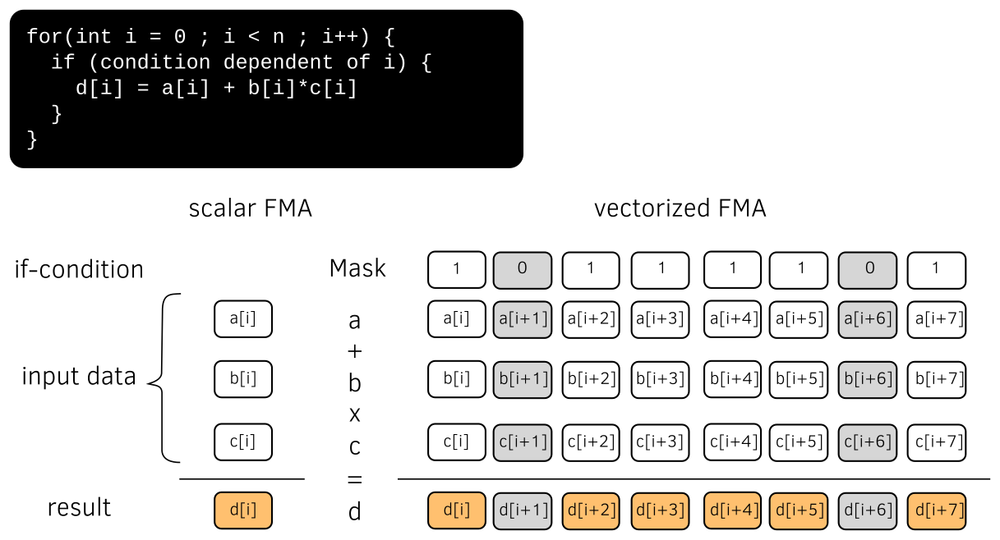

Vectorization
----------------------

For enhanced performances on most recent CPUs, :program:`Smilei` exploits
efficiently vectorization using refactored and optimized operators.

Vectorization optimizations are published in [Beck2019]_.

----

Notion of Single Instruction Multiple Data (SIMD) Vectorization
^^^^^^^^^^^^^^^^^^^^^^^^^^^^^^^^^^^^^^^^^^^^^^^^^^^^^^^^^^^^^^^

Single Instruction Multiple Data (SIMD) vectorization consists on performing on
a contiguous set of data, usually called vector, the same operation(s)
in a single instruction.
On modern Computational Processing Units (CPU), vector registers have a length 512 kb
that corresponds to 8 double precision floats (on Intel Skylake processors for
instance and future ARM architecture).
Each processing unit can perform a Fused Multiply Add instruction (FMA) that
combines an addition and a multiplication.
If-conditions can be handled using mask registers.
Modern SIMD vectorization is described in :numref:`simd_fig`.

.. _simd_fig:

    Single Instruction Multiple Data (SIMD) vectorization

On SIMD CPUs, an application has to use SIMD vectorization to reach the maximum
of the core computational peak performance. A scalar code without FMA
uses less than 7% of the core computational power.
This affirmation can nonetheless be mitigated on Intel Skylake processors that
adapt their frequency on the used vectorization instruction set.

----

SIMD vectorization of the particle operators
^^^^^^^^^^^^^^^^^^^^^^^^^^^^^^^^^^^^^^^^^^^^^^^^^^

Optimization efforts have been recently done to vectorize efficiently the
particle operators of :program:`Smilei`.

A new sorting method has been first implemented in order to then make
the particle operator vectorization easier.
This method, referred to as cycle sort, minimizes the number of data movements
by performing successive permutation.

The most expensive operators and most difficult to vectorize are the current projection
(deposition) and the field interpolation (gathering) steps where
there is an interpolation between the grids and the macro-particles.
These two steps have been vectorized taking advantage of the cycle sort.

It has been observed that vectorization is more efficient than using scalar
operators when the number of
particles per cell is sufficiently high.
The threshold is evaluated around 10 particles on recent Intel
architectures (Skylake, Knights Landing (KNL), Broadwell).
Vectorization efficiency increases with the number of particles per cell.
Around 256 particles per cell, a speed-up of x2 has been obtained on Intel Skylake
and a speed-up of x3 on Intel KNL using the AVX512 instruction set.
For few particles per cell, scalar implementations are still more efficient
and the ratio is significant.

----

Adaptive vectorization
^^^^^^^^^^^^^^^^^^^^^^^^

Adaptive vectorization consists on locally switch between the scalar and
vectorized operators during the simulation, choosing the most efficient one
in the region of interest.
The concept has been successfully implemented at the lower granularity of the code.
Every given number of time steps, for each
patch, and for each species, the most efficient operator is determined
from the number of particles per cell.

Adaptive vectorization has been validated on large-scale simulations with
different benchmarks.

One of the case was the simulation of Mildly-relativistic collisionless shock.
The effect of the adaptive vectorization mode is illustrated by :numref:`fig_weibel_3d_ne_vecto_it510`.
The electron density is shown in the volume rendering of the top.
The volume rendering at the bottom shows and patch computational state for the electron species.

.. _fig_weibel_3d_ne_vecto_it510:

.. figure:: _static/Weibel_3d_ne_vecto_it510.jpg
    :width: 90%
    :align: center
    :target: https://youtu.be/-ENUekyE_A4

    Mildly-relativistic collisionless shock: On the top, volume rendering of the normalized
    electron density :math:`n_e /n_c` (:math:`n_c` the critical density) at
    time :math:`t = 34 \omega^{-1}` (:math:`\omega` the laser frequency) after the beginning of the collision.
    On the bottom, patches in vectorized
    mode for the electron species at the same time.
    An animated version of these can be viewed by clicking on this image.

Thanks to the adaptive vectorization, high-density regions that contains many macro-particles per cell corresponds to the patches in vectorized mode.
Incoming plasma flows, with 8 particles per cell in average, are in scalar mode.
How the simulation configures dynamically in time the scalar and vectorized regions is demonstrated in the following video:

.. _video_weibel_3d_ne_vecto_it510:

.. raw:: html

  <video style="display:block; margin: 0 auto; width: 100%;" controls src="http://www.maisondelasimulation.fr/projects/Smilei/uploads/videos/weibel_interp.mp4" width="100%">
  </video>

On examined cases, this method allows for speed-ups from x1.3 to x2 regarding only
the macro-particle operators.

----

References
^^^^^^^^^^

.. [Beck2019] `A. Beck et al., ArXiV 1810.03949 (2019) <https://arxiv.org/abs/1810.03949>`_
